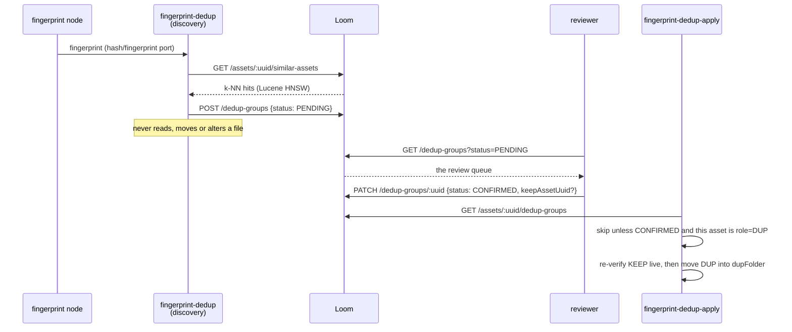

# Workflow: Deduplication — Discover, Review, Apply

> **Status**: 🟢 **Built end to end.** Both Cortex nodes, the schema, four permissions, six REST
> routes (paged), the DAO, the DTOs, both clients, the customer docs *and* the review screen are
> built and tested. A reviewer opens `/workflow` → Dedup, presses `Y`/`N`, and the decision is
> PATCHed; discovery no longer re-proposes a decided candidate set; apply re-verifies the KEEP's
> content before moving bytes.
> **Scope**: the human decision that sits between discovering near-duplicates and moving them.
> **Audience**: AI coding agents working on `loom-ui/src/features/workflow/` and
> `loom-ui/src/api/`.

Family index and shared anatomy: [WORKFLOWS.md](WORKFLOWS.md). Status legend: 🟢 built · 🟡 partly
built · 🔵 plan · 🔴 defect · ⚪ stub.

> ⚠️ **This file is the workflow half only.** The nodes, options, algorithm, safeguards, schema and
> node-level defects live in [../concept/NODE_DEDUP_PLAN.md](../concept/NODE_DEDUP_PLAN.md) and are
> **not** restated here. Read that file for anything below the REST line.

**Out of scope, and where it lives instead:**

| Not here | There |
|---|---|
| `fingerprint-dedup`, `fingerprint-dedup-apply`, `sha512-dedup` — options, algorithm, safeguards | [../concept/NODE_DEDUP_PLAN.md](../concept/NODE_DEDUP_PLAN.md) |
| The similarity index the discovery query runs against | [../concept/LUCENE_PLAN.md](../concept/LUCENE_PLAN.md) |
| The reference algorithm this was ported from | `xdb-clean/FPDEDUP_PROCESS.md` (sibling checkout) |
| Where the moved duplicate ends up, and moving in general | [WORKFLOW_TRASH.md](WORKFLOW_TRASH.md) |
| Dedup entities in the domain model | [../loom/DOMAIN.md](../loom/DOMAIN.md) |

---

## 0. Executive Summary

| Question | Short answer |
|---|---|
| **Is the propose/apply split real?** | 🟢 **Yes**, and it is the reference implementation for the whole workflow family. Discovery never touches a file; apply reads only `CONFIRMED` groups. |
| **Can a human make the decision?** | 🟢 **Yes.** `DeduplicationMode` loads `GET /dedup-groups?status=PENDING`, `Y`/`N` PATCH the group, and a failed PATCH reverts the chip and toasts. |
| **Is the API missing anything?** | No. Six routes, keyset paged, in `openapi.json`, mirrored in both clients. |
| **What stops a silent no-op?** | The decision is server state: the chip renders `group.status` from the response, never a local map. A write that fails visibly rolls back — `workflow-dedup-mocked.spec.ts` pins exactly that. |
| **Biggest remaining sharp edge** | ⚠️ `PATCH keepAssetUuid` does **not** rewrite `dedup_group_member.role`, so after a reassignment the pointer and the roles disagree. Readers must prefer `keepAssetUuid` (§10). |

---

## 1. The loop

**The asymmetry that defines this workflow**: discovery is cheap, idempotent and reversible; apply
moves bytes. The human sits exactly at that seam, and the `status` column is the only thing that
crosses it.

---

## 2. What the reviewer needs to decide well

A dedup decision is not "yes/no" — it is "yes, and *this* one is the keeper". The review record was
designed around that:

| Signal | Source | Shown as |
|---|---|---|
| **Which member is KEEP** | `dedup_group.keep_asset_uuid`, falling back to `role='KEEP'` | 🟢 Green-framed card on top; **Keep this one** per candidate PATCHes `keepAssetUuid` |
| **Size per member** | `dedup_group_member.size` — a discovery-time snapshot | 🟢 `formatSize()` on every card |
| **Completeness** | `dedup_group_member.zero_chunk_count` | 🟢 An "Incomplete" chip; an *absent* count counts as complete, not as truncated |
| **Similarity score** | `dedup_group.score` = the **minimum** member score | 🟢 Group header + per-member score |
| **Algorithm** | `dedup_group.algorithm` | 🟢 Group header |
| **A visual** | `GET /assets/:uuid/binary/data` via `AssetThumbnail` | 🟡 **Images only** — there is no thumbnail service and no poster frames, so a video member shows `MediaPlaceholder`. Deliberate: a placeholder is honest, a broken `` is not |

⚠️ The snapshots are **hints for the reviewer, not authority**. `fingerprint-dedup-apply` re-verifies
existence, completeness, size and folder against the live file before it moves anything.

---

## 3. REST surface (🟢 all built)

| Method & path | Purpose in the workflow | Permission |
|---|---|---|
| `GET /api/v1/dedup-groups?status=PENDING` | The review queue | `READ_DEDUP` |
| `GET /api/v1/dedup-groups/:uuid` | One group with its members | `READ_DEDUP` |
| `PATCH /api/v1/dedup-groups/:uuid` | **The decision**: `CONFIRMED`/`REJECTED`, optionally a new `keepAssetUuid` | `UPDATE_DEDUP` |
| `DELETE /api/v1/dedup-groups/:uuid` | Discard a proposal outright | `DELETE_DEDUP` |
| `POST /api/v1/dedup-groups` | Discovery writes here (server-side PENDING upsert) | `CREATE_DEDUP` |
| `GET /api/v1/assets/:uuid/dedup-groups` | What apply calls | `READ_DEDUP` |

🟢 `GET /dedup-groups` is **keyset paged** (`?limit=`/`?from=`, default 25) via
`DedupGroupDao.loadPage(status, fromId, pageSize)` — a bespoke DAO method, because this DAO is a
plain `Dao` and `AbstractJooqDao.getField(SortKey)` casts every sort column to `Field<UUID>` (so the
generic path throws on `created`). Ordering is `(created DESC, uuid DESC)`; the uuid tie-breaks a
burst written inside one millisecond. Without a `status` it is now **one** query with a global
ordering, not three concatenated lists.

🟢 `POST /dedup-groups` answers **201** for a new proposal and **200** with the existing decision when
the same candidate set was already CONFIRMED/REJECTED — see §5.1.

🟢 All four `DEDUP` permissions are `ui:yes`: in `PERMISSION_GROUPS` (`AdminArea.tsx`, group
`Deduplication`), described in `admin.roles.permission.*_DEDUP` in **both** locale files, and granted
in the demo roles (Editor gets `READ_DEDUP`+`UPDATE_DEDUP`, Viewer only `READ_DEDUP`).

---

## 4. The UI (🟢 built)

Three files: `loom-ui/src/api/dedup.ts` (the REST client), `loom-ui/src/features/workflow/dedupGroups.ts`
(the pure logic), and `DeduplicationMode` in `WorkflowView.tsx`. The `dedup-default` key profile
(`Y` confirm / `N` reject) is unchanged.

| Piece | Where | Note |
|---|---|---|
| `listDedupGroups(token, {status, limit, from})`, `loadDedupGroup`, `updateDedupGroup`, `deleteDedupGroup`, `listAssetDedupGroups` | `src/api/dedup.ts` | ⚠️ `updateDedupGroup` is the **only `method: "PATCH"` in the whole UI**. Uses `withPaging()` so `?status=` + `?limit=` share one `?` |
| `keepMember` / `dupMembers` / `isComplete` / `formatSize` / `replaceGroup` / `decideGroup` / `reassignKeep` | `src/features/workflow/dedupGroups.ts` | Extracted so vitest can cover it — loom-ui has no jsdom, so anything rendered has to be a mocked Playwright spec |
| Queue load, member-asset resolution, optimistic write + rollback | `WorkflowView.tsx` | `dedupGroups` / `dedupAssets` / `dedupBusy` state; `applyDedupDecision(optimistic, write, failureKey)` is the single rollback path all three actions share |
| KEEP card, candidate cards with size/completeness/score, **Keep this one**, decision chip, `EmptyState` | `DeduplicationMode` | Test ids: `dedup-group`, `dedup-keep`, `dedup-member-<uuid>`, `dedup-make-keep-<uuid>`, `dedup-confirm`, `dedup-reject`, `dedup-decision-chip`, `dedup-empty`, `workflow-mode-deduplication` |

**Three things that are easy to get wrong here:**

1. 🔴 **Decisions are keyed by group uuid, not queue index.** The old `Record<number, …>` broke the
   moment the queue was re-fetched. In fact there is no decision map at all any more — the chip
   renders `group.status`, so what you see is what the server returned.
2. ⚠️ **`status` is mandatory on every PATCH.** Reassigning the KEEP therefore repeats the group's
   *current* status (`reassignKeep`), or picking a file would silently confirm the group.
3. ⚠️ **A group carries only asset uuids.** Filenames, mime types and previews come from a
   `loadAsset` per member into a `dedupAssets` cache, refreshed when the current group changes.

The queue navigation still special-cases this mode: `maxIdx = dedupGroups.length - 1` rather than
`assets.length - 1`.

---

## 5. Correctness rules that hold the loop together

### 5.1 🟢 A decided candidate set is never re-proposed

`DedupGroupEndpointService.createDedupGroup` compares the incoming member set against
`dedupDao.listDecidedByAssets(memberUuids, algorithm)`; on an exact set match it writes **nothing**
and answers `200` with the decided group (`201` otherwise). `FingerprintDedupNode` reads the returned
`status` and reports `skipped`, so a re-run over an already-reviewed corpus does not pile up
misleading SUCCESS ledger rows.

⚠️ **The guard is on the candidate *set*, not on its assets.** "This asset appears in some decided
group" would suppress a genuinely new duplicate of an already-reviewed file. Roles are ignored in the
comparison: after a KEEP reassignment the same two files can come back with roles swapped, and that
is still the same decision.

### 5.2 🟢 Apply verifies the KEEP's content — and now only decides

🔴 **`fingerprint-dedup-apply` no longer moves anything.** It writes the item to a selective
`confirmed_dup` port (plus `keep_path`) and a downstream `move` node relocates it. All five
safeguards are unchanged and still run against the live filesystem before the port is written - only
their consequence changed, from "move the file" to "write the port". The destination, the conflict
policy and whether the original survives are now properties of the pipeline an author can see,
instead of a `dupFolder` only worker YAML could set.

⚠️ **One safeguard could not follow the move downstream.** "The keeper is not itself a trashed file"
asks a question about the KEEP, and the move node only ever sees the duplicate. It survives as
`keepExcludeFolder` on the apply node - default empty, i.e. off - which is also what a `dupFolder`
setting migrates to. Set it to the same folder the move node trashes into.

`keepPassesSafeguards` gained a fifth check: the KEEP's recorded SHA-512 must still match the file.
`hashOf()` goes through `LoomMediaImpl.getSHA512()`, which **trusts the stored xattr**
(`loom_sha512`, legacy `sha512sum`) and only digests when neither is present — so this is an
attribute read for anything a hash node has seen. Two deliberate non-failures: an asset with **no**
recorded hash passes (nothing to compare against), and a filesystem with no user-xattr support falls
back to a direct digest rather than blocking every move.

### 5.3 🟢 `HashDedupNode` no longer blocks

The size-mismatch branch used to call `System.in.read()`. It now logs both paths at `error` and
returns `skipped` — records that disagree are exactly when a move could destroy the only good copy.
`HashDedupNodeTest` pins it with a `@Timeout(10)`: the test fails by hanging if the blocking read
ever returns.

---

## 6. Progress Assessment

### Built (see [../concept/NODE_DEDUP_PLAN.md](../concept/NODE_DEDUP_PLAN.md) §9 for the full list)
- [x] `V2.61` review record (`dedup_status`, `dedup_group`, `dedup_group_member`), `V2.62` permissions
- [x] `DedupGroupDao` + jOOQ impl, delete-cascade tests green
- [x] Six REST routes, keyset paged, in `openapi.json`; `DedupGroupEndpointTest` (14), `DedupGroupDaoTest` (7)
- [x] Both Cortex nodes, three descriptors, four kind bindings
- [x] `loom-ui/src/api/dedup.ts` + `dedupGroups.ts`, wired `DeduplicationMode` with rollback (§4)
- [x] Reassign the KEEP; member size / completeness / score; `AssetThumbnail` previews
- [x] Four `ui:yes` permissions in `PERMISSION_GROUPS` + both locale files + demo roles
- [x] `dedup.test.ts` (12) · `dedupGroups.test.ts` (17) · `workflow-dedup-mocked.spec.ts` (6)
- [x] Demo data: one PENDING group over two demo videos (`seedDemoDedupGroup`)
- [x] Customer docs: `nodes/dedup/index.adoc` + `ui/index.adoc` §Reviewing Duplicates (closes X10 for this workflow)
- [x] 🟢 Discovery never re-proposes a decided candidate set (§5.1)
- [x] 🟢 Apply verifies the KEEP's content via the stored xattr (§5.2)
- [x] 🟢 `HashDedupNode` no longer blocks on `System.in.read()` (§5.3)
- [x] Apply-node tests (`FingerprintDedupApplyNodeTest`, 11) and `HashDedupNodeTest` (4)

### Open
- [ ] ⚠️ `PATCH keepAssetUuid` does not rewrite `dedup_group_member.role` — pointer and roles diverge (§10)
- [ ] Per-node E2E in `integration-test` (two near-identical videos → discover → confirm → apply → **move** → no-op)
- [ ] Progress/resumption so two reviewers can split a queue (shared defect X7)
- [ ] Discovery options (`algorithm`, `topK`, `scoreThreshold`, …) are still YAML-only, not descriptor parameters
- [ ] The UI loads one page of the queue and does not "load more" — fine for a review session, not for a 10k backlog

---

## 7. Test Setup

| Test | Covers | Command |
|---|---|---|
| `DedupGroupEndpointTest` (14) 🟢 | Create+load, PENDING idempotency, **decided sets are not re-proposed (200)**, **a different set still is (201)**, **keyset paging**, confirm/reject, list-by-asset, delete, invalid status, 404, 403 on every route, `READ_DEDUP` does not grant UPDATE, asset-delete cascade | `mvn -pl loom/core test -Dtest=DedupGroupEndpointTest` |
| `DedupGroupDaoTest` (7) 🟢 | Store/load, `listByStatus`, `listByAsset`, `findPendingByKeep`+`updateStatus`, **`listDecidedByAssets`**, invalid role, both delete-cascades | `mvn -pl loom/db/jooq test -Dtest=DedupGroupDaoTest` |
| `FingerprintDedupNodeTest` (3) 🟢 | KEEP/DUP split; larger-dup abort; **already-decided set → skipped, no ledger row** | `mvn -pl cortex/nodes/dedup/core -am test` |
| `FingerprintDedupApplyNodeTest` (12) 🟢 | Confirmed DUP is **emitted on `confirmed_dup`**; PENDING/REJECTED emit nothing; the KEEP never appears on the port; missing / incomplete / smaller / **content-changed** KEEP all block; no recorded hash still applies; `keepExcludeFolder` blocks; a look-alike folder name does not. ⚠️ **Every case also asserts nothing was moved** | same command |
| `HashDedupNodeTest` (4) 🟢 | Known file is **signalled on `duplicate`**, not moved; **size mismatch skips instead of blocking** (`@Timeout(10)` is the assertion); same-file no-op; unknown file skipped | same command |
| `dedup.test.ts` (12) 🟢 | Query-param shaping (`?status=`+`?limit=`+`?from=` on one `?`), uuid encoding, the PATCH method and body, DELETE with no body, error propagation | `./node_modules/.bin/vitest run src/api/dedup.test.ts` |
| `dedupGroups.test.ts` (17) 🟢 | `keepMember` precedence, `dupMembers`, completeness of an unmeasured file, size formatting, `replaceGroup`, and that `reassignKeep` repeats the current status | `./node_modules/.bin/vitest run src/features/workflow/` |
| `workflow-dedup-mocked.spec.ts` (6) 🟢 | Queue renders with sizes; `Y` PATCHes CONFIRMED; `N` PATCHes REJECTED; **a 500 reverts the chip and toasts**; make-keep sends `keepAssetUuid` with `status: PENDING`; empty queue shows `dedup-empty` | `./node_modules/.bin/playwright test e2e/workflow-dedup-mocked.spec.ts` |
| E2E 🔵 **to write** | Two near-identical demo videos → fingerprint → discovery produces PENDING → PATCH CONFIRMED → apply moves the DUP and writes a ledger row → re-running apply is a no-op | `./it.sh` |

⚠️ `npx` stalls here — use `./node_modules/.bin/`. 🔴 `./setup-pool.sh` before DAO/endpoint tests.
Grant test permissions via group+role, never a direct `user_permission` row. ⚠️ Cortex E2E runs
against the **packaged** shaded `cortex/cli` JAR and image — rebuild both after a Cortex change.

---

## 8. Configuration

| Variable | Default | Effect on this workflow |
|---|---|---|
| `LOOM_SIMILARITY_ENABLED` | off | 🔴 When false, `NoopSimilarityIndex` is bound and the similarity routes answer **503** — deliberately, so `fingerprint-dedup` fails loudly rather than producing an empty queue |
| `LOOM_SIMILARITY_INDEX_PATH` / `_ALGORITHM` / `_TOPK` / `_SCORE_THRESHOLD` | — | Shape the candidate set the reviewer sees |

Node options (`fingerprint-dedup`: `algorithm`, `scoreThreshold`, `topK`, `allowPartial`,
`abortOnLargerDup`; apply: `dupFolder`) are documented in
[../concept/NODE_DEDUP_PLAN.md](../concept/NODE_DEDUP_PLAN.md) §4. ⚠️ Only `enabled` and `dupFolder`
are descriptor parameters — the rest are YAML-only and unreachable from the pipeline editor.

---

## 9. Key Classes Reference

| Class / file | Package or path | Purpose |
|---|---|---|
| `DeduplicationMode` | `loom-ui/src/features/workflow/WorkflowView.tsx` | 🟢 The review screen |
| `applyDedupDecision` | same | The single optimistic-write-with-rollback path all three actions share |
| `dedup-default` key profile | same | `Y` confirm / `N` reject |
| `dedupGroups.ts` | `loom-ui/src/features/workflow/` | Pure logic: `keepMember`, `dupMembers`, `isComplete`, `formatSize`, `replaceGroup`, `decideGroup`, `reassignKeep` |
| `dedup.ts` | `loom-ui/src/api/` | The REST client; the UI's only `PATCH` |
| `DedupGroupEndpoint` / `DedupGroupEndpointService` | `io.metaloom.loom.rest.{endpoint,service}.impl` | The five routes, the PENDING upsert and the decided-set guard |
| `DedupGroupDao` / `DedupGroup` / `DedupGroupMember` | `io.metaloom.loom.db.model.dedup` | Review-record persistence |
| `DedupGroupMethods` | `io.metaloom.loom.client.common.method` | Java client, 6 methods |
| `FingerprintDedupNode` / `FingerprintDedupApplyNode` | `io.metaloom.cortex.node.dedup` | Propose / decide. Neither moves a file any more |
| `MoveNode` | `io.metaloom.cortex.node.relocate` | Acts on the decision. Wire `confirmed_dup → media` |
| `LuceneSimilarityIndex` | `io.metaloom.loom.similarity.lucene` | HNSW k-NN over 256-dim fingerprints |

---

## 10. Conventions and Gotchas

| Area | Gotcha |
|---|---|
| **Three lifecycles now** | 🔴 Discovery proposes, apply **decides**, `move` acts. Never let discovery write a review item it has not verified, never let apply act on `PENDING`/`REJECTED`, and never put the destination back on the apply node |
| **`dupFolder` is gone** | ⚠️ Removed outright. `CortexOptionsLoader` ignores unknown YAML keys, so a stale `dupFolder` keeps a worker booting and is **silently ignored** - duplicates simply stop being moved. Re-wire `confirmed_dup → move.media`. Release-note material |
| **Snapshots are hints** | ⚠️ `size` / `zero_chunk_count` are discovery-time values for the reviewer. Apply re-checks live — existence, completeness, size, folder **and content** |
| **A larger DUP aborts the whole group** | ⚠️ Not "drop that member". A duplicate bigger than the keep means the keep selection is wrong |
| **Idempotency is server-side** | ⚠️ Both halves live in `createDedupGroup`: the PENDING upsert *and* the decided-set guard. Do not add a client-side key |
| **🔴 `keepAssetUuid` and `role` diverge** | `updateStatus` writes only the pointer, so after a reassignment the members still carry the machine's original roles. **Always prefer `keepAssetUuid` when set** — `keepMember()` in `dedupGroups.ts` and `DedupGroup`'s javadoc both say so. Rewriting the roles server-side is the real fix and is still open |
| **The guard compares member sets, not assets** | ⚠️ §5.1 — "this asset is in a decided group" would suppress a genuinely new duplicate of an already-reviewed file |
| **A 200 from POST is not a discovery** | ⚠️ 201 = proposed, 200 = already decided, nothing written. A client that ignores the status reports phantom finds every run |
| **Always pass `status`** | ⚠️ The unfiltered list is now one ordered, paged query — but the review queue is `PENDING`, and asking for everything wastes a page on decided history |
| **PATCH needs a status** | ⚠️ There is no status-less "just move the keep". Reassigning repeats the current status or it decides the group by accident |
| **Optimistic decisions must roll back** | 🔴 A confirmed-looking row that was never PATCHed is the failure mode this workflow used to have. `applyDedupDecision` is the only write path; keep it that way |
| **Previews are images only** | ⚠️ There is no thumbnail service and no poster frames, so video members show `MediaPlaceholder`. Do not "fix" this with a bare `` |
| **`sha512-dedup` has no descriptor** | ⚠️ Runnable but not placeable from the palette. `hash-dedup` is a deliberate alias onto the same class |
| **Never `System.in.read()` in a node** | 🔴 It hung a headless worker forever. `HashDedupNodeTest`'s `@Timeout` exists to stop it coming back |

---

## 11. Where do I find …?

| Need | Look here |
|---|---|
| The nodes, options, algorithm and their defects | [../concept/NODE_DEDUP_PLAN.md](../concept/NODE_DEDUP_PLAN.md) |
| The review screen | `loom-ui/src/features/workflow/WorkflowView.tsx` (`DeduplicationMode`) |
| Its pure logic and its tests | `loom-ui/src/features/workflow/dedupGroups.ts` + `.test.ts` |
| The REST client | `loom-ui/src/api/dedup.ts` + `dedup.test.ts` |
| The keyset-paging template this DAO copied | `loom/db/jooq/.../dao/notification/NotificationDaoImpl.loadPageForRecipient` |
| Schema + permissions | `loom/db/flyway/.../V2.61__add_dedup_group.sql`, `V2.62__add_dedup_permission.sql` |
| REST implementation | `loom/services/rest/.../endpoint/impl/DedupGroupEndpoint.java` |
| The similarity query | [../concept/LUCENE_PLAN.md](../concept/LUCENE_PLAN.md) |
| Customer docs | `website/content/english/docs/nodes/dedup/index.adoc`; `website/content/english/docs/ui/index.adoc` §Reviewing Duplicates |
| Demo data | `DemoDatabaseInitializer.seedDemoDedupGroup` |
| Shared workflow defects | [WORKFLOWS.md](WORKFLOWS.md) §4 |
| Open tasks | [../tasks/WORKFLOW_TASKS.md](../tasks/WORKFLOW_TASKS.md) W3 |

---

_Git HEAD revision: `98a6dbe1`_
_Last updated: 2026-08-08 (apply became a gate: it re-verifies the keeper and writes `confirmed_dup`
rather than moving the file, and a downstream `move` node acts. `dupFolder` removed; the one safeguard
that could not move downstream survives as `keepExcludeFolder`. See
[WORKFLOW_TRASH.md](WORKFLOW_TRASH.md) §6a.)_
