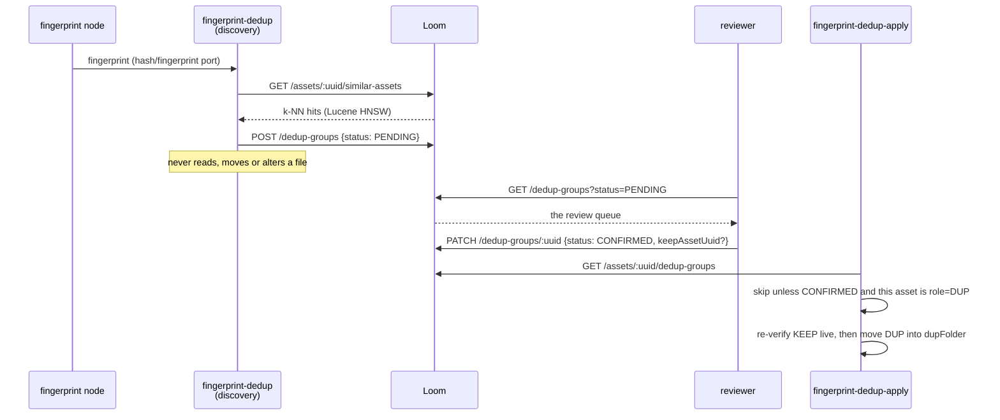

# Workflow: Deduplication — Discover, Review, Apply

> **Status**: 🟡 **Backend complete, human step missing.** Both Cortex nodes, the schema, four
> permissions, six REST routes, the DAO, the DTOs, the client and the customer docs are built and
> tested. 🔴 The review screen is a **mock that never calls the API**, so the only way to complete the
> loop today is `curl`.
> **Scope**: the human decision that sits between discovering near-duplicates and moving them.
> **Audience**: AI coding agents working on `loom-ui/src/features/workflow/` and
> `loom-ui/src/api/`.

Family index and shared anatomy: [WORKFLOWS.md](WORKFLOWS.md). Status legend: 🟢 built · 🟡 partly
built · 🔵 plan · 🔴 defect · ⚪ stub.

> ⚠️ **This file is the workflow half only.** The nodes, options, algorithm, safeguards, schema and
> node-level defects live in [../concept/NODE_DEDUP_PLAN.md](../concept/NODE_DEDUP_PLAN.md) and are
> **not** restated here. Read that file for anything below the REST line.

**Out of scope, and where it lives instead:**

| Not here | There |
|---|---|
| `fingerprint-dedup`, `fingerprint-dedup-apply`, `sha512-dedup` — options, algorithm, safeguards | [../concept/NODE_DEDUP_PLAN.md](../concept/NODE_DEDUP_PLAN.md) |
| The similarity index the discovery query runs against | [../concept/LUCENE_PLAN.md](../concept/LUCENE_PLAN.md) |
| The reference algorithm this was ported from | `xdb-clean/FPDEDUP_PROCESS.md` (sibling checkout) |
| Where the moved duplicate ends up, and moving in general | [WORKFLOW_TRASH.md](WORKFLOW_TRASH.md) |
| Dedup entities in the domain model | [../loom/DOMAIN.md](../loom/DOMAIN.md) |

---

## 0. Executive Summary

| Question | Short answer |
|---|---|
| **Is the propose/apply split real?** | 🟢 **Yes**, and it is the reference implementation for the whole workflow family. Discovery never touches a file; apply reads only `CONFIRMED` groups. |
| **Can a human make the decision?** | 🔴 **Not from the UI.** `DeduplicationMode` builds its groups with `buildDuplicateGroups(assets)`, which pairs adjacent assets, and stores decisions in a React `useState` that is never PATCHed. |
| **Is the API missing anything?** | Very little. Six routes exist. The gaps are pagination on the unfiltered list and thumbnails for the members. |
| **What is the risk of shipping the UI as-is?** | It looks like it works. A reviewer confirms twenty groups, nothing is written, and `fingerprint-dedup-apply` moves nothing — a silent no-op is worse than an error. |
| **Biggest correctness risk once wired?** | 🔴 Discovery re-proposes groups a human already rejected, so the queue refills on every run ([../concept/NODE_DEDUP_PLAN.md](../concept/NODE_DEDUP_PLAN.md) §3.2). Fix that before a reviewer meets the queue twice. |

---

## 1. The loop

**The asymmetry that defines this workflow**: discovery is cheap, idempotent and reversible; apply
moves bytes. The human sits exactly at that seam, and the `status` column is the only thing that
crosses it.

---

## 2. What the reviewer needs to decide well

A dedup decision is not "yes/no" — it is "yes, and *this* one is the keeper". The review record was
designed around that:

| Signal | Source | Why the reviewer needs it |
|---|---|---|
| **Which member is KEEP** | `dedup_group_member.role`, and `dedup_group.keep_asset_uuid` denormalised | The decision includes reassigning it. `PATCH` accepts `keepAssetUuid` |
| **Size per member** | `dedup_group_member.size` — a discovery-time snapshot | The usual reason to override the machine's choice |
| **Completeness** | `dedup_group_member.zero_chunk_count` | A truncated download can look like a fine duplicate |
| **Similarity score** | `dedup_group.score` = the **minimum** member score | How close a call this is |
| **Algorithm** | `dedup_group.algorithm` | Two algorithms can disagree about the same pair |
| **A visual** | 🔴 **nothing** | The one genuinely missing signal — see §4 |

⚠️ The snapshots are **hints for the reviewer, not authority**. `fingerprint-dedup-apply` re-verifies
existence, completeness, size and folder against the live file before it moves anything.

---

## 3. REST surface (🟢 all built)

| Method & path | Purpose in the workflow | Permission |
|---|---|---|
| `GET /api/v1/dedup-groups?status=PENDING` | The review queue | `READ_DEDUP` |
| `GET /api/v1/dedup-groups/:uuid` | One group with its members | `READ_DEDUP` |
| `PATCH /api/v1/dedup-groups/:uuid` | **The decision**: `CONFIRMED`/`REJECTED`, optionally a new `keepAssetUuid` | `UPDATE_DEDUP` |
| `DELETE /api/v1/dedup-groups/:uuid` | Discard a proposal outright | `DELETE_DEDUP` |
| `POST /api/v1/dedup-groups` | Discovery writes here (server-side PENDING upsert) | `CREATE_DEDUP` |
| `GET /api/v1/assets/:uuid/dedup-groups` | What apply calls | `READ_DEDUP` |

⚠️ `GET /dedup-groups` **without** `status` concatenates the three status lists with no combined
ordering and **no pagination**. The review UI must always pass `status=PENDING`, and the endpoint
should get real paging before a queue of any size meets it.

⚠️ All four `DEDUP` permissions are annotated `ui:no` in `Permission.java` — accurate today, and part
of the wiring work: they must be added to `PERMISSION_GROUPS` in
`loom-ui/src/features/admin/AdminArea.tsx` and granted in the demo roles, or a reviewer with a normal
role gets a 403 from a screen that offers them the button.

---

## 4. The UI work

`loom-ui/src/features/workflow/WorkflowView.tsx` — `DeduplicationMode` (`:277-349`) and the
`dedup-default` key profile (`:143-154`, `Y` confirm / `N` reject).

The **presentation is already right**: KEEP framed in green above, candidates below with a dashed
border that turns red on confirm, a decision chip, and a keyboard profile. Only the data and the write
path are fake.

| # | Change | File | Notes |
|---|---|---|---|
| 1 | 🔴 Create `loom-ui/src/api/dedup.ts` — `listDedupGroups(status)`, `loadDedupGroup(uuid)`, `updateDedupGroup(uuid, {status, keepAssetUuid})`, `deleteDedupGroup(uuid)` | new | Follow any of the 55 sibling modules in `loom-ui/src/api/` |
| 2 | 🔴 Delete `buildDuplicateGroups` (`:86-92`) and query `status=PENDING` | `WorkflowView.tsx` | It pairs adjacent assets — it is not a heuristic, it is a placeholder |
| 3 | 🔴 `handleConfirmDedup`/`handleRejectDedup` (`:853-854`) must `PATCH` and reflect the server response, not `setDedupDecisions` | `WorkflowView.tsx` | On failure, revert the chip — a confirmed-looking row that was not written is the worst outcome |
| 4 | Surface `size` and `zeroChunkCount` per member | `DeduplicationMode` | Already on `DedupGroupMemberModel`; they are why a reviewer can decide without opening the files |
| 5 | 🔴 **Choose a different KEEP** — a click target per member that PATCHes `keepAssetUuid` | `DeduplicationMode` | The decision the current UI cannot express at all |
| 6 | Show a thumbnail per member | `DeduplicationMode` | 🔴 Open question: the `thumbnail` node's artifacts are worker-local. Either serve the asset's stored binary through `GET /assets/:uuid/binary/data` or show filename + size only. Decide explicitly — do not leave a broken `` |
| 7 | Flip the four `ui:no` annotations and grant `READ_DEDUP`/`UPDATE_DEDUP` in the demo roles | `Permission.java`, `AdminArea.tsx`, `DemoDatabaseInitializer` | §3 |
| 8 | Mocked Playwright e2e | `loom-ui/e2e/workflow-dedup-mocked.spec.ts` | Component tests here are mocked Playwright, not RTL/jsdom |

The queue navigation already special-cases this mode: `maxIdx = duplicateGroups.length - 1` rather
than `assets.length - 1` (`:816`). Keep that when the source changes.

---

## 5. Ordering — what must land before the UI

1. 🔴 **Discovery must skip already-decided groups.** `FingerprintDedupNode` never asks whether this
   asset is already in a `CONFIRMED`/`REJECTED` group, and the server-side upsert only collapses
   repeated **PENDING** proposals. Wiring the UI first means the reviewer's first experience is a
   queue that refills with pairs they already rejected. Detail and fix:
   [../concept/NODE_DEDUP_PLAN.md](../concept/NODE_DEDUP_PLAN.md) §3.2.
2. Pagination on `GET /dedup-groups` (§3).
3. The thumbnail decision (§4.6) — it changes the layout.
4. Then the UI (§4).
5. Then, independently: apply must re-hash the KEEP before moving
   ([../concept/NODE_DEDUP_PLAN.md](../concept/NODE_DEDUP_PLAN.md) §3.3). This does not block the UI
   but does block trusting it in production.

---

## 6. Progress Assessment

### Built (see [../concept/NODE_DEDUP_PLAN.md](../concept/NODE_DEDUP_PLAN.md) §9 for the full list)
- [x] `V2.61` review record (`dedup_status`, `dedup_group`, `dedup_group_member`), `V2.62` permissions
- [x] `DedupGroupDao` + jOOQ impl, delete-cascade tests green
- [x] Six REST routes with server-side PENDING upsert; `DedupGroupEndpointTest` (11), `DedupGroupDaoTest` (6)
- [x] Both Cortex nodes, three descriptors, four kind bindings
- [x] Customer docs `website/content/english/docs/nodes/dedup/index.adoc`
- [x] The review screen's **layout** and key profile

### Open — the workflow
- [ ] 🔴 `loom-ui/src/api/dedup.ts` (§4.1)
- [ ] 🔴 Replace `buildDuplicateGroups` with a real `status=PENDING` query (§4.2)
- [ ] 🔴 PATCH on confirm/reject, with rollback on failure (§4.3)
- [ ] 🔴 Reassign the KEEP (§4.5)
- [ ] Member size / completeness in the card (§4.4)
- [ ] Thumbnail decision (§4.6)
- [ ] Flip four `ui:no` permissions, grant in demo roles (§4.7)
- [ ] Mocked Playwright e2e (§4.8)
- [ ] Paginated `GET /dedup-groups` (§3)
- [ ] Progress/resumption so two reviewers can split a queue (shared defect X7)

### Open — blocking correctness (owned by the node spec)
- [ ] 🔴 Discovery re-proposes decided groups (§5.1)
- [ ] 🔴 Apply does not re-hash the KEEP
- [ ] 🔴 `HashDedupNode` blocks on `System.in.read()` in a headless worker
- [ ] No apply-node tests, no per-node E2E, no demo data

---

## 7. Test Setup

| Test | Covers | Command |
|---|---|---|
| `DedupGroupEndpointTest` (11) 🟢 | Create+load, PENDING idempotency, confirm/reject, list-by-asset, delete, invalid status, 404, 403 on every route, `READ_DEDUP` does not grant UPDATE, asset-delete cascade | `mvn -pl loom/core test -Dtest=DedupGroupEndpointTest` |
| `DedupGroupDaoTest` (6) 🟢 | Store/load, `listByStatus`, `listByAsset`, `findPendingByKeep`+`updateStatus`, invalid role, both delete-cascades | `mvn -pl loom/db/jooq test -Dtest=DedupGroupDaoTest` |
| `FingerprintDedupNodeTest` (2) 🟢 | KEEP/DUP split; larger-dup abort | `mvn -pl cortex/nodes/dedup/core -am test` |
| `dedup.test.ts` 🔵 **to write** | The new API module: query-param shaping, PATCH body, error propagation | node-env vitest |
| `workflow-dedup-mocked.spec.ts` 🔵 **to write** | Route-mock `GET /dedup-groups?status=PENDING`, press `Y`, assert the PATCH body and the chip; press `N`, assert `REJECTED`; assert a failed PATCH reverts the chip | `./node_modules/.bin/playwright test` |
| E2E 🔵 **to write** | Two near-identical demo videos → fingerprint → discovery produces PENDING → PATCH CONFIRMED → apply moves the DUP and writes a ledger row → re-running apply is a no-op | `./it.sh` |

⚠️ `npx` stalls here — use `./node_modules/.bin/`. 🔴 `./setup-pool.sh` before DAO/endpoint tests.
Grant test permissions via group+role, never a direct `user_permission` row. ⚠️ Cortex E2E runs
against the **packaged** shaded `cortex/cli` JAR and image — rebuild both after a Cortex change.

---

## 8. Configuration

| Variable | Default | Effect on this workflow |
|---|---|---|
| `LOOM_SIMILARITY_ENABLED` | off | 🔴 When false, `NoopSimilarityIndex` is bound and the similarity routes answer **503** — deliberately, so `fingerprint-dedup` fails loudly rather than producing an empty queue |
| `LOOM_SIMILARITY_INDEX_PATH` / `_ALGORITHM` / `_TOPK` / `_SCORE_THRESHOLD` | — | Shape the candidate set the reviewer sees |

Node options (`fingerprint-dedup`: `algorithm`, `scoreThreshold`, `topK`, `allowPartial`,
`abortOnLargerDup`; apply: `dupFolder`) are documented in
[../concept/NODE_DEDUP_PLAN.md](../concept/NODE_DEDUP_PLAN.md) §4. ⚠️ Only `enabled` and `dupFolder`
are descriptor parameters — the rest are YAML-only and unreachable from the pipeline editor.

---

## 9. Key Classes Reference

| Class / file | Package or path | Purpose |
|---|---|---|
| `DeduplicationMode` | `loom-ui/src/features/workflow/WorkflowView.tsx:277` | 🔴 The mock review screen |
| `buildDuplicateGroups` | same, `:86` | 🔴 Pairs adjacent assets; delete it |
| `dedup-default` key profile | same, `:143` | `Y` confirm / `N` reject |
| `loom-ui/src/api/dedup.ts` | — | 🔵 Does not exist yet |
| `DedupGroupEndpoint` / `DedupGroupEndpointService` | `io.metaloom.loom.rest.{endpoint,service}.impl` | The five routes + the server-side upsert |
| `DedupGroupDao` / `DedupGroup` / `DedupGroupMember` | `io.metaloom.loom.db.model.dedup` | Review-record persistence |
| `DedupGroupMethods` | `io.metaloom.loom.client.common.method` | Java client, 6 methods |
| `FingerprintDedupNode` / `FingerprintDedupApplyNode` | `io.metaloom.cortex.node.dedup` | Propose / apply |
| `LuceneSimilarityIndex` | `io.metaloom.loom.similarity.lucene` | HNSW k-NN over 256-dim fingerprints |

---

## 10. Conventions and Gotchas

| Area | Gotcha |
|---|---|
| **Two lifecycles** | 🔴 Discovery writes review items; apply acts on decisions. Never let discovery move a file, never let apply act on `PENDING`/`REJECTED` |
| **Snapshots are hints** | ⚠️ `size` / `zero_chunk_count` are discovery-time values for the reviewer. Apply re-checks live |
| **A larger DUP aborts the whole group** | ⚠️ Not "drop that member". A duplicate bigger than the keep means the keep selection is wrong |
| **Idempotency is server-side** | ⚠️ In `DedupGroupEndpointService.createDedupGroup`, not in the node. Do not add a client-side key |
| **Decided groups get re-proposed** | 🔴 The queue refills with already-rejected pairs on every discovery run — fix before wiring the UI (§5.1) |
| **Unfiltered list has no paging** | ⚠️ `GET /dedup-groups` without `status` concatenates three lists. Always pass `status` |
| **`ui:no` permissions** | ⚠️ All four DEDUP permissions are API-only today; the ACL matrix must learn them or the screen 403s |
| **Optimistic decisions must roll back** | 🔴 A confirmed-looking row that was never PATCHed is the failure mode this workflow already has |
| **`sha512-dedup` has no descriptor** | ⚠️ Runnable but not placeable from the palette. `hash-dedup` is a deliberate alias onto the same class |

---

## 11. Where do I find …?

| Need | Look here |
|---|---|
| The nodes, options, algorithm and their defects | [../concept/NODE_DEDUP_PLAN.md](../concept/NODE_DEDUP_PLAN.md) |
| The mock to replace | `loom-ui/src/features/workflow/WorkflowView.tsx:277` |
| An API module to copy | any of `loom-ui/src/api/*.ts` (55 modules) |
| Schema + permissions | `loom/db/flyway/.../V2.61__add_dedup_group.sql`, `V2.62__add_dedup_permission.sql` |
| REST implementation | `loom/services/rest/.../endpoint/impl/DedupGroupEndpoint.java` |
| The similarity query | [../concept/LUCENE_PLAN.md](../concept/LUCENE_PLAN.md) |
| Customer docs | `website/content/english/docs/nodes/dedup/index.adoc` |
| Shared workflow defects | [WORKFLOWS.md](WORKFLOWS.md) §4 |
| Open tasks | [../tasks/WORKFLOW_TASKS.md](../tasks/WORKFLOW_TASKS.md) W3 |

---

_Git HEAD revision: `21e8a8cd`_
_Last updated: 2026-08-07 (new file — the workflow half; node detail stays in NODE_DEDUP_PLAN.md)_
