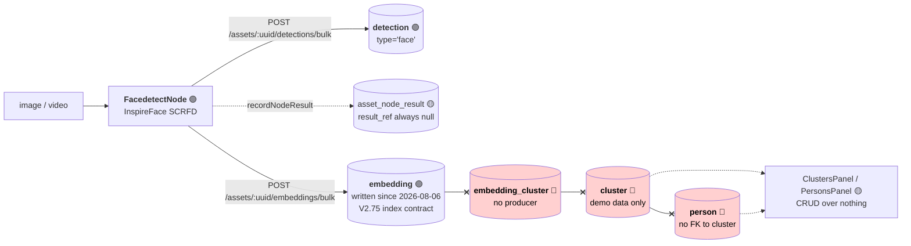
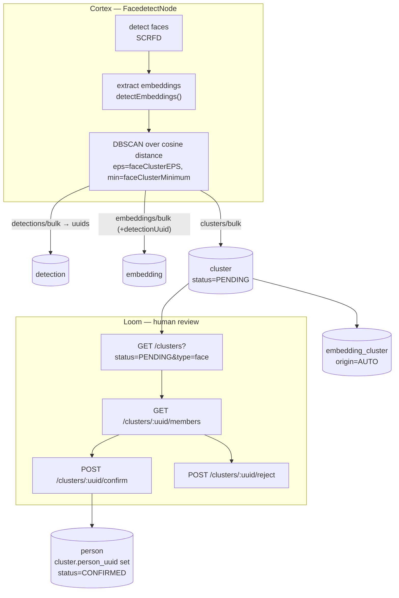

# Workflow: Face Clusters — Detect → Embed → Cluster → Confirm a Person

> **Status**: 🟢 **All four stages run.** Detection and embedding persist; since `V2.79` the node
> **clusters** the vectors per asset and writes `cluster` + `embedding_cluster` rows, and a human
> **confirms** a cluster into a `person` over REST. `faceClusterEPS` / `faceClusterMinimum` are read
> by the algorithm that consumes them, and face crops are served from this deployment.
> **Scope**: the end-to-end identity loop across Cortex, Loom, the database and the UI: from a face
> in a frame to a human-confirmed `person`.
> **Audience**: AI coding agents and humans working on
> [cortex/nodes/facedetect/](../../cortex/nodes/facedetect/), `loom/services/rest` and
> `loom-ui/src/features/faceDetection/`.

Family index and shared anatomy: [WORKFLOWS.md](WORKFLOWS.md). This is workflow 4 of 12, and the most
complex of the built-or-nearly-built ones.

**Out of scope, and where it lives instead:**

| Not here | There |
|---|---|
| Which face models exist, their licences, the InspireFace pack format, model accuracy | [FACEDETECTION_OVERVIEW.md](../features/nodes/facedetect/FACEDETECTION_OVERVIEW.md) |
| The node system, lifecycle, ports, registration, caching | [NODES.md](../features/nodes/NODES.md) |
| Typed ports and cardinality | [../features/nodes/NODE_DATA_TYPES.md](../features/nodes/NODE_DATA_TYPES.md) |
| Open UI work items for AI/ML entities (Embedding, Cluster, Detection, Person) | [TASK_UI_AI_ML.md](../loom/ui/TASK_UI_AI_ML.md) |
| Vector / ANN search strategy and the pgvector decision | [SEMANTIC_SEARCH.md](../features/search/SEMANTIC_SEARCH.md) |
| The human-confirms-a-machine-proposal precedent this file copies | [NODE_DEDUP.md](../features/nodes/dedup/NODE_DEDUP.md), and its workflow half [WORKFLOW_DEDUP.md](WORKFLOW_DEDUP.md) |
| Reviewing the **detections** rather than the clusters | [WORKFLOW_OBJECT_DETECT.md](WORKFLOW_OBJECT_DETECT.md) — same table, and the `review_status` enum proposed there is the one to reuse |
| Consent: whether a confirmed person agreed to publication | [WORKFLOW_RIGHTS_RELEASE.md](WORKFLOW_RIGHTS_RELEASE.md) §2.2 |
| Rules for adding a node at all | [NEW_NODE.md](../guidelines/NEW_NODE.md) |

> ⚠️ **Name collision.** [CLUSTERING.md](../concept/CLUSTERING.md) is about
> **multi-instance Loom deployment**, not face clustering. It has nothing to do with this file. If you
> opened it looking for face clusters, you want this one.

Status legend: 🟢 built · 🟡 partly built · 🔵 plan/concept · 🔴 defect or blocker · ⚪ stub.

---

## 0. Executive Summary

| Question | Short answer |
|---|---|
| **Does the detect → cluster → confirm loop work?** | **Yes.** All four stages run. |
| **Where does the clustering happen?** | Inside `FacedetectNode`, **scoped to one asset** — DBSCAN over cosine distance. It answers *"who is in this video"*, not *"who is this"* (§2.2). |
| **Is there clustering code?** | `cortex/nodes/facedetect/core/.../facedetect/cluster/` — `Vectors`, `Dbscan`, `FaceClusterer`. Pure Java, no pack or natives needed to test. |
| **Can a Cortex worker create a cluster?** | Yes, since `V2.79` made the audit columns nullable — the relaxation `V2.47` applied to every other producer table. |
| **Is `cluster` linked to `person`?** | Yes: `cluster.person_uuid`, `ON DELETE SET NULL`, set by `POST /clusters/:uuid/confirm`. |
| **What does the UI show?** | A review queue with real member crops served from this deployment, and confirm/reject that persists. |
| **What is still missing?** | Cross-asset identity. The same person in two videos is still two unrelated clusters (§2.2). |

---

## 1. Current State — the chain, honestly



### 1.1 What actually runs

`FacedetectNode.persist(...)`
([FacedetectNode.java](../../cortex/nodes/facedetect/core/src/main/java/io/metaloom/cortex/node/facedetect/FacedetectNode.java))
writes detection rows (and, since 2026-08-06, embeddings — §1.2):

```java
items.add(new DetectionCreateRequest()
    .setType("face")
    .setNodeKind(name())            // "facedetect"
    .setDetectionIndex(index++)
    .setFrameNumber(detection.frameIndex())
    .setBboxX((float) box.x()) ... .setConfidence(detection.confidence()));
client().bulkCreateAssetDetections(asset.getUuid(), new DetectionBulkCreateRequest().setDetections(items)).sync();
recordNodeResult(asset, ctx, ResultState.SUCCESS, null, null, resultRef("detection"));
```

Upsert key `(asset_uuid, node_kind, frame_number, detection_index)` (`V2.43`), so a re-run replaces
rather than appends.

### 1.2 Embeddings — built (2026-08-06)

✅ **Face embeddings are computed and persisted.** This section previously listed three reasons there
were none; all three are resolved, and the diagnosis was one step too generous — the vectors were not
"discarded", they were never computed. The node called only `detectFaces(image)`, which sets no
embedding.

| Was | Now |
|---|---|
| `FaceStorage.java` — an Avro sidecar, every line commented out | **Deleted.** Superseded by the `embedding` table; a per-asset file store was never the destination |
| `VideoFaceScanner.processFaces` gated on `hasEmbedding()`, which nothing could satisfy | Gate removed earlier; `scan(video, n, withEmbeddings)` now embeds the selected faces from the crops the scan already took |
| `DetectionModel` has no vector field | Still true, and correct — vectors travel on their own resource, `POST /assets/:uuid/embeddings/bulk`, keyed to the detection by `detection_uuid` |
| `detectEmbeddings`/`extractEmbeddings` exist with zero metaloom callers | `InspireFacedetector.detectFaces(img, withEmbeddings)` (new in video4j) produces boxes and vectors in **one filtered pass** |

🔴 **Do not pair `detectFaces(img)` with `detectEmbeddings(VideoFrame)` to get both.**
`detectEmbeddings` runs detection *unfiltered*, so its ordinals do not line up with the ones
`detectFaces` returns after the size and confidence gates. Zipping the two lists attaches each vector
to the wrong face — silently, and with entirely plausible output.

Persistence, storage and the pluggable index are specified in
[SEMANTIC_SEARCH.md](../features/search/SEMANTIC_SEARCH.md); `embedding` is the system of record and
the ANN index is a rebuildable cache behind the `VectorIndex` SPI, keyed by
`(type, model, dimensions)` so the recognition model can change without invalidating what is stored.

Operationally the face space appears at **`/admin/indices`** as its own row, named by the model that
produced it — with its backlog, its indexed-vs-recorded counts, and per-space reindex / delta sync /
drop. Per-space matters here: one Lucene directory holds the face vectors beside the search-text
ones, and until `VectorIndex.drop(space)` existed a face reindex would have emptied both. Retiring a
superseded recognition model is `DROP` on the old row.
See [../features/search/SEARCH_INDEX_ADMIN.md](../features/search/SEARCH_INDEX_ADMIN.md).

### 1.3 Clustering — built

| Thing | State |
|---|---|
| `faceClusterEPS` (0.6, a cosine **distance** radius) | 🟢 read by `FaceClusterer`; **per pipeline node** — see §9.1 |
| `faceClusterMinimum` (2) | 🟢 read by `Dbscan`; **counts the point itself**, so 2 means "needs one neighbour"; **per pipeline node** |
| DBSCAN implementation | `cluster/Dbscan.java` — dense O(N²) matrix, which is right for the few dozen faces an asset yields |
| `ClusterDao.link` | now `ON CONFLICT DO UPDATE`; it was a bare insert that threw on a re-run |
| Cluster-row producers | `FacedetectNode`, plus the CRUD endpoint and the demo initializer |
| ANN index over `embedding.vector` | still none — per-asset clustering needs none (§3.4) |

`OUT_FACE_COUNT` now emits the **subject** count, which is what its `@PortDoc` always claimed. A face
that carries no vector is counted as its own subject rather than dropped, so switching embeddings off
degrades the number's meaning instead of silently reporting zero.

> ⚠️ **Noise points become singleton clusters.** DBSCAN's own answer is to discard them, which would
> make a portrait — exactly one face, and therefore noise under `minPts = 2` — report nobody at all.
> `faceClusterMinimum` governs what gets *merged*, not whether an unmatched face is recorded.

### 1.4 How `cluster` and `person` meet

`V2.79` adds `cluster.person_uuid` → `person(uuid)` **`ON DELETE SET NULL`**, and
`POST /clusters/:uuid/confirm` is what sets it — creating the person when the reviewer names somebody
new, or linking an existing one. `SET NULL` rather than `CASCADE` because deleting a person must not
erase the record that a human looked at these faces and made a call.

Confirmation does **that and nothing else**. It does not choose the person's avatar: attributing a
face to somebody and deciding what they look like are separate decisions, and only the second one is
about appearance. A person's pictures are their own (§3.4).

---

## 2. Target Design



### 2.1 Stage by stage

| Stage | Where | Produces |
|---|---|---|
| **Detect** | `FacedetectNode` (unchanged) | `detection` rows, `type='face'` |
| **Embed** | `FacedetectNode`, calling `detectEmbeddings(...)` | `embedding` rows linked by `detection_uuid` |
| **Cluster** | `FacedetectNode`, **per asset** | `cluster` rows (`type='face'`, `status='PENDING'`) + `embedding_cluster` links |
| **Confirm** | Loom REST + UI | `cluster.person_uuid` set, `status='CONFIRMED'` |

### 2.2 Why clustering runs in the node, and what that costs

Clustering runs **inside `FacedetectNode`, scoped to one asset**. This is a deliberate phase-1 choice:

- It consumes the two options that already exist and are already exposed in the pipeline editor.
- It needs no cross-asset query, no ANN index, and no new service — a few dozen face vectors per
  asset is a trivially small DBSCAN.
- It makes `OUT_FACE_COUNT`'s documented meaning true for the first time: *distinct people in this
  video*, not *number of boxes*.

⚠️ **The cost, stated plainly: this groups faces within one asset only, never across the library.**
"Confirm this cluster is Anna" therefore means "confirm Anna appears in *this* video". The same person
in a second video produces a second, unrelated `PENDING` cluster with no memory of the first.

Cross-asset identity is **phase 2** and needs a library-wide pass plus a vector index
([SEMANTIC_SEARCH.md](../features/search/SEMANTIC_SEARCH.md)). The schema in §3 is designed so that
pass reuses the same tables: `cluster.asset_uuid` is **nullable** precisely so a library-wide cluster
can exist alongside per-asset ones, distinguished by `node_kind`, without a second destructive
migration.

### 2.3 Distance metric

Cosine distance over L2-normalised embeddings, per the industry-standard pipeline documented in
[FACEDETECTION_OVERVIEW.md](../features/nodes/facedetect/FACEDETECTION_OVERVIEW.md) §5.

> ⚠️ **There is no `cosineSimilarity()` helper to reuse.** An earlier draft of this file claimed
> `Face.cosineSimilarity` exists in `facedetect4j`; it does not — the string appears only inside
> javadoc prose (`SFaceEmbedder`, `ArcFaceAlign`). It must be written. It is three lines: on
> L2-normalised vectors cosine similarity is a plain dot product. Note also that **metaloom has no
> dependency on `facedetect4j`** — the node reaches InspireFace through `video4j`.

The `faceClusterEPS` default of `0.6` is a **cosine-distance** radius and is unvalidated against any
real corpus. InspireFace's own pack manifest recommends a *similarity* threshold of `0.48` for Pikachu
and `0.32` for Megatron — different packs, different geometry. Calibrate before trusting the default,
and record what it was calibrated against.

---

## 3. Schema — `V2.79__cluster_review_model.sql` (built)

> ℹ️ **The version drifted twice while this was being written.** The section first claimed `V2.75`,
> then `V2.78`; both were taken by other work before the migration landed — `V2.78` by
> `rating_reaction_type` on the very day this shipped. It is `V2.79`. **Take the next free version at
> the time you write it, sort numerically (`V2.9` < `V2.77`), and do not hard-code one here again.**

### 3.1 `cluster` — machine-writable since `V2.79`

Current DDL (`V2.12`) is a generic, human-authored entity:

```sql
CREATE TABLE "cluster" (
  "uuid" uuid DEFAULT uuid_generate_v4 (),
  "name" varchar NOT NULL,
  "meta" jsonb,
  "type" varchar NOT NULL,
  "created" timestamp NOT NULL DEFAULT (now()), "creator_uuid" uuid NOT NULL,
  "edited"  timestamp NOT NULL DEFAULT (now()), "editor_uuid"  uuid NOT NULL,
  PRIMARY KEY ("uuid")
);
CREATE UNIQUE INDEX ON "cluster" ("name");   -- globally unique across ALL types
```

What `V2.79` changed:

| # | Change | Why |
|---|---|---|
| 1 | `creator_uuid` / `editor_uuid` → **NULLABLE** | 🔴 A Cortex worker is not a user. `V2.47` did exactly this for `detection`, `embedding` and the comp tables and **skipped `cluster`**. Without it the node physically cannot insert a row. |
| 2 | Drop `UNIQUE (name)`; `name` → **NULLABLE**; add partial `UNIQUE (type, name) WHERE name IS NOT NULL` | 🔴 A global unique name forbids two people called "Anna Meyer" and collides across unrelated cluster types. Machine-proposed clusters have no meaningful name until a human confirms one. Recommended in [DB_SCHEMA_FEEDBACK.md](../features/DB_SCHEMA_FEEDBACK.md). |
| 3 | Add `node_kind`, `node_id`, `producer_version`, `run_uuid`, `task_uuid` | The component-contract provenance every other producer table carries (`V2.38`). Enables the standard invalidation sweep `WHERE node_kind = ? AND producer_version <> ?` — which is how a pack change (§2.3) retires stale clusters. |
| 4 | Add nullable `asset_uuid` → `asset(uuid) ON DELETE CASCADE` | Per-asset clusters now; **nullable** so a phase-2 library-wide cluster fits the same table. |
| 5 | Add `cluster_index` int + `UNIQUE (asset_uuid, node_kind, cluster_index)` | Idempotent re-runs. Without an upsert key, re-running the node appends a second full set — exactly the bug `V2.43` fixed for detections. |
| 6 | Add `status` (`PENDING`/`CONFIRMED`/`REJECTED`, default `PENDING`) + index | The review state. Mirrors `dedup_status`. |
| 7 | Add `person_uuid` → `person(uuid) **ON DELETE SET NULL**` | The missing link. `SET NULL` not `CASCADE`: deleting a person must not erase the review record — the same reasoning `V2.61` applies to `dedup_group.keep_asset_uuid`. |
| 8 | Add `score real` (cohesion) and optional `centroid real[]` | Lets the review queue rank by confidence and lets phase 2 match a new face against a cluster without rescanning members. |

Mirror the enum exactly as `V2.61` does, since a Postgres enum cannot be added and used in the same
transaction for `loom_permission` — that constraint applies to permission enums, not to a fresh type,
but keeping the shape identical avoids the question:

```sql
CREATE TYPE "cluster_status" AS ENUM ('PENDING', 'CONFIRMED', 'REJECTED');
```

⚠️ **Renamed since.** `V2.81` needed the same three values for `detection` and renamed this type to
`review_status` rather than creating a second, identical one — `ALTER TYPE ... RENAME` is catalog-only,
so `cluster.status` is unaffected. The generated enum is now `JooqReviewStatus`, and the constants live
in `io.metaloom.loom.db.model.review.ReviewStatus` (which `Cluster.STATUS_*` points at). See
[WORKFLOW_OBJECT_DETECT.md](WORKFLOW_OBJECT_DETECT.md) §2.1.

#### 3.1.1 `V2.88` — who decided, and when

`V2.79` recorded the verdict and its subject but not its **author**. `ClusterEndpointService` passed
the deciding user into the DAO, which had nowhere to put it but `editor_uuid` — and
`editor_uuid`/`edited` are the machine-nullable audit block (`V2.47`) that `FacedetectNode` rewrites
on **every** re-run. So the record of which human attributed a face to a named person survived until
the next pipeline pass and no longer. Face data is biometric (gotcha 12); that was the weakest audit
trail in the repository.

| Column | Type | Notes |
|---|---|---|
| `reviewed_at` | `timestamp` | When a human decided. `NULL` while nobody has. **Not `edited`.** |
| `reviewer_uuid` | `uuid` → `user(uuid)`, no `ON DELETE` | The user who decided. **Not `editor_uuid`.** |

Identical in shape and reasoning to what `V2.81` did for `detection`; no `ON DELETE` action, matching
`detection_reviewer_uuid_fkey` and `cluster_creator_uuid_fkey` — users are not deleted casually, and
losing the reviewer's identity would be worse than blocking the delete. No back-fill: every
`CONFIRMED` row at that point was set so by `V2.79`'s own `UPDATE` over the human-authored,
`NULL`-`asset_uuid` rows, and inventing a reviewer for them would be the same lie the columns exist to
prevent.

**The rule, extended.** `ClusterDaoImpl.upsertCluster` now preserves
`{status, person_uuid, reviewed_at, reviewer_uuid}` on conflict. `editor_uuid` is deliberately **not**
in that set — it is the producer's own provenance and moves with every run, which is precisely why the
reviewer needed columns of its own. `ClusterDaoTest#testNodeReRunDoesNotClobberTheReviewer` asserts
the pair: the editor moves, the reviewer does not.

Both fields are written inside `ClusterDaoImpl.confirm` and `.updateStatus` rather than at the service
layer, so a future bulk-review endpoint cannot record a verdict without its author.

> ⚠️ **`reviewedAt` is only reliable to the millisecond.** Confirming *with a `name`* runs a trailing
> whole-POJO `dao().update(cluster)`, and `AbstractJooqDao.update` maps the POJO's `Instant` through
> jOOQ's `LocalDateTime` conversion, which drops sub-millisecond digits — so the value in the confirm
> response can differ from the stored row in its last three digits. This is generic and long-standing
> (`created` and `edited` have always behaved this way), not specific to these columns. Compare
> truncated to millis; `ClusterEndpointTest#testConfirmRecordsTheReviewer` does, and says why.

> ⚠️ Task 1 of [../tasks/WORKFLOW_FACE_TASKS.md](../tasks/WORKFLOW_FACE_TASKS.md) — the
> `producer_version` gate — is **still open**, and when it lands the reset must null these two columns
> alongside `status` and `person_uuid`. Until then a pack change carries the verdict *and* its author
> forward onto a regrouping the reviewer never saw. That is Task 1's defect, not this one's, but the
> two columns are part of its blast radius.

### 3.2 `embedding_cluster` — now carries facts

It gained `confidence real`, `origin` (`CHECK (origin IN ('AUTO','MANUAL'))`) and `created`, so an
auto-assignment is distinguishable from a human correction. It also gained an index on
`cluster_uuid`: the primary key is `(embedding_uuid, cluster_uuid)`, so "the members of this cluster"
— the one query the review UI makes per card — had no usable index at all.

`V2.79` additionally gave **`tag_cluster.cluster_uuid`** `ON DELETE CASCADE`. `V2.51` fixed exactly
this on `embedding_cluster` and left `tag_cluster` alone, so a *tagged* cluster could never be deleted.
Harmless while nothing deleted clusters; the clusterer retires its own stale proposals, so it stopped
being harmless.

### 3.3 Face crops reuse `attachment`

`V2.79` adds the `FACE_CROP` attachment type, `attachment.detection_uuid` and a partial unique index
on `(detection_uuid, type, node_kind, variant)`. No new table: `attachment` is already the sink for
node-produced derived binaries (`V2.44`), with content-addressed bytes and machine-nullable audit
columns (`V2.47`). The existing `attachment_asset_variant_key` could not serve — an asset has many
faces, so crops key by detection.

`V2.90` adds a fourth target, `attachment.person_uuid`, for the pictures a person owns (§3.4). It is
the one target that is not derived from an asset, and the only one whose cascade runs from something
other than the material — which is exactly what it is for.

### 3.4 `person` — owns its pictures

`creator_uuid` / `editor_uuid` stay `NOT NULL`: a person is only ever created by a human confirming a
cluster.

What did change is what a person's picture *is*. `V2.89`–`V2.91` replace the two things V2.26 left
behind — the `person_image` gallery table, which never had a writer, and `primary_image_uuid`, which
pointed at an `asset`:

| | before | after |
|---|---|---|
| gallery | `person_image (person_uuid, asset_uuid)`, both FKs `CASCADE`, no DAO and no endpoint | `attachment` rows of type `PERSON_IMAGE` carrying `person_uuid`, `ON DELETE CASCADE` from `person` only |
| avatar | `person.primary_image_uuid` → `asset` | `person.avatar_attachment_uuid` → `attachment`, `ON DELETE SET NULL` |
| REST | none | `/persons/:uuid/images`, `/images/:imageUuid/data`, `/images/from-detection`, `/persons/:uuid/avatar` |

The decision the shape encodes is **lifetime**. Both of `person_image`'s foreign keys cascaded, so a
person's gallery evaporated with the material it was drawn from; and for the population this workflow
actually produces — people discovered in video — `primary_image_uuid` resolved to the whole video
file. A person image references no asset at all, so no asset deletion can reach it. `AssetCascadeTest`
asserts exactly that, in place of the row it used to pin (§6.12).

No new table, for the reason §3.3 gives: `attachment` is already the sink for binaries that are not
assets, with content-addressed bytes and machine-nullable audit columns. It is also why the copy is
cheap — `POST /persons/:uuid/images/from-detection` takes a face crop into the person's own keeping by
writing one row against the same `binary_sha512sum`, moving no bytes.

No new permissions either: `READ_PERSON` to look and `UPDATE_PERSON` to change. Who may see a person's
pictures and who may change them is the same trust decision as for their name.

`attachment_binary` bytes are still never reclaimed, so a deleted person image leaks its content the
same way every other attachment does — the standing gap G13 in
[REST_BINARY_HANDLING.md](../features/rest/REST_BINARY_HANDLING.md), not a new one.

### 3.5 What deliberately did **not** change

`embedding.vector` stays `real[]` with **no ANN index**. pgvector is an open decision owned by
[SEMANTIC_SEARCH.md](../features/search/SEMANTIC_SEARCH.md), and
[SEARCH.md](../features/search/SEARCH.md) §10 ("codegen environment") warns that
`loom/db/jooq/generate.sh` re-runs every migration in a stock `postgres:latest` Testcontainer —
**`pgvector` is not in that image**, so an unguarded `CREATE EXTENSION vector` breaks jOOQ codegen for
everyone. Per-asset clustering (§2.2) needs no index at all, which is part of why it is phase 1.

### 3.6 Obligations a migration triggers

Per [CODING.md](../guidelines/CODING.md):

```bash
mvn install -pl loom/db/flyway     # or the pool skips the new migration silently
loom/db/jooq/generate.sh           # generates into target/ and only swaps on success
./setup-pool.sh                    # re-provision the pooled test databases
```

**No `forcedTypes` entry was needed.** `real[]` generates as `Float[]` natively (as `embedding.vector`
already did), `cluster.meta` is matched by the existing `.*\.meta.*` expression, and a Postgres enum
generates its own `JooqClusterStatus`. jOOQ's generic POJO mapping bridges the POJO's `String status`
to that enum in both directions — verified by `ClusterDaoTest#testStatusRoundTrip`, which exists
precisely so nobody has to take that on trust again.

---

## 4. REST — the confirmation endpoint (built)

| Method | Path | Purpose | Permission |
|---|---|---|---|
| GET | `/api/v1/clusters?status=PENDING&type=face` | the review queue | `READ_CLUSTER` |
| GET | `/api/v1/clusters/:uuid/members` | member embeddings + their detections, for face crops | `READ_CLUSTER` |
| POST | `/api/v1/clusters/:uuid/confirm` | link to an existing person **or** create one; sets `CONFIRMED` | `UPDATE_CLUSTER` (+ `CREATE_PERSON` when it creates) |
| POST | `/api/v1/clusters/:uuid/reject` | sets `REJECTED` | `UPDATE_CLUSTER` |
| GET | `/api/v1/persons/:uuid/clusters` | inverse lookup | `READ_PERSON` |
| POST | `/api/v1/assets/:uuid/embeddings/bulk` | the node's embedding write path | `CREATE_EMBEDDING` |
| POST | `/api/v1/assets/:uuid/clusters/bulk` | the node's cluster write path; idempotent on `(asset, nodeKind, clusterIndex)` | `CREATE_CLUSTER` |
| GET | `/api/v1/assets/:uuid/clusters` | the subjects found in one asset | `READ_CLUSTER` |
| GET | `/api/v1/assets/:uuid/detections/:detectionUuid/crop` | the cropped face, from this deployment's own storage | `READ_DETECTION` |

All permissions already exist in the `loom_permission` enum — **no new permission value is needed**,
which avoids the Flyway single-transaction trap ([SEARCH.md](../features/search/SEARCH.md) §10, "enum
migration").

`ClusterResponse` gained **`reviewStatus`**, `personUuid`, `assetUuid`, `clusterIndex`, `score`,
`memberCount` and `nodeKind`, plus **`reviewedAt`** and **`reviewerUuid`** (`V2.88`, §3.1.1).

> ⚠️ **It is `reviewStatus`, not `status`.** `AbstractCreatorEditorRestResponse` already publishes a
> `status` object carrying the creator/editor audit block, so the review verdict had to give way.
> `DedupGroupResponse` gets away with a plain `status` only because it has no audit envelope.

> ⚠️ **`reviewerUuid` is not `status.editor`, and `reviewedAt` is not `status.edited`.** The audit
> block is machine-written provenance the facedetect node rewrites on every pass; the review pair is
> the durable record of a human decision. Any client that sources "who confirmed this?" from the audit
> block will credit the pipeline with a biometric attribution a person made. The confirm and reject
> routes document the reviewed shape (`ClusterExamples#clusterReviewedResponse`); the pending shape
> shows both fields absent, which is what a proposal nobody has looked at actually looks like.

The UI renders the pair as a date with the reviewer uuid in a tooltip and a `data-reviewer-uuid`
attribute, in `ClustersPanel.tsx` and the `FaceDetectionMode` block of `WorkflowView.tsx`. It does
**not** resolve the uuid to a username: that needs `READ_USER`, which a reviewer is not required to
hold, and a card that fails to render for the very people who operate it would be the worse trade.

The inverse lookup is `GET /persons/:uuid/clusters` rather than a `clusterUuids` field on
`PersonResponse`: a person can appear in arbitrarily many assets, and that does not belong inline on
every person in a list page.

### 4.1 Permissions that depend on the request

Confirming needs `UPDATE_CLUSTER`, **plus `CREATE_PERSON` only when it actually creates a person**.
That is what lets a reviewer be trusted to attribute faces to people who already exist without being
able to add new ones to the directory. `AbstractEndpointService.checkPerms(lrc, action, Permission...)`
exists for exactly this, and `ClusterEndpointTest#testConfirmRequiresCreatePersonOnlyWhenCreating`
pins both halves — 200 with a `personUuid`, 403 with an alias.

### 4.2 Model identity — no enum

Both blockers this section used to list are resolved, and the second one was resolved the other way
round from how it was written. `EmbeddingCreateRequest.detectionUuid` exists and the node sets it.

**`EmbeddingType` was not given an InspireFace value, and must not be.** The enum was deliberately
retired from the embedding path on 2026-08-06; `embedding.type` is free text (`"face"`) so that a new
model needs no code change. Pack identity rides on **`model`** instead: `FacedetectNodeOptions`
derives `inspireface-pikachu-r18` from the pack path, and `model` is part of both the row's unique key
and the `(type, model, dimensions)` vector-index key — so Pikachu and Megatron vectors can never be
compared to each other by accident. The binding exposes no pack version at runtime, so the pack path
is the only evidence there is.

### 4.2 A convention to settle

Dedup decides with `PATCH /dedup-groups/:uuid`; `ClusterEndpoint` updates with
`POST /clusters/:uuid`. Both are in the codebase today. `/confirm` and `/reject` are proposed as
RPC-style sub-resources because the operation is not a field write — it creates a person and mutates
two tables atomically. Collection paths stay plural per
[CODING.md](../guidelines/CODING.md); that rule explicitly reserves singular for
RPC-style resources.

---

## 5. Node changes

| Change | Detail |
|---|---|
| Extract embeddings | Call the existing `detectEmbeddings(...)` / `extractEmbeddings(...)` on the configured backend. `Face.getEmbedding()` already carries the result. |
| Persist them | `detections/bulk` already returns a `DetectionBulkResponse`; use the returned uuids as `detectionUuid` on `embeddings/bulk`. |
| Cluster | DBSCAN over cosine distance with `faceClusterEPS` / `faceClusterMinimum` — **the first code to read either option**. Both are now authored **per pipeline node** (§9.1), not just per worker. |
| Emit honest counts | `OUT_FACE_COUNT` becomes the cluster count, matching its own `@PortDoc`. |
| Ledger | Pass the real uuids to `resultRef(...)` — see §6.6. |

**Do not add a new node kind.** [NEW_NODE.md](../guidelines/NEW_NODE.md) applies to
new kinds; this is a change to an existing one. Note that `facedetect` (kind) and `facedetection`
(options `KEY`) genuinely differ — see `NODES.md`.

---

## 6. Defects found while writing this spec

**All twelve are fixed.** Each row records what the defect was and what closed it.

| # | Sev | Defect | Location |
|---|---|---|---|
| 6.1 | ✅ | **The asset face panel is always empty.** The UI filters `d.type === "facedetection"`; the node writes `.setType("face")` (pinned by `FacedetectNodeDetectionsTest`). The filter can never match. **Cheapest real bug in this file.** | `loom-ui/src/features/assetDetail/AssetDetail.tsx:229` |
| 6.2 | ✅ | **Cluster→person assignment is a no-op.** `// TODO: implement cluster-to-person assignment via REST API when backend supports it` — mutates local state only, lost on reload. This is the *"has no confirmation endpoint"* of the original task note. | `FaceDetectionManagement.tsx:113-120` |
| 6.3 | ✅ | **`faceIds: []` / `clusterIds: []` hardcoded.** Every cluster card shows "0 faces", person cluster chips never render, and `FaceDetectionPanel`'s grouping is always empty so every face reads as unclustered. Unfixable client-side: no REST shape returns membership. | `FaceDetectionManagement.tsx:44-50`, `AssetDetail.tsx:240-246` |
| 6.4 | ✅ | **bbox written in absolute pixels** into a column `V2.43` documents as *"normalized 0-1"*. The node works around it by stamping `"coordinates": "ABSOLUTE_PIXELS"` on the emitted port elements; nothing converts or validates on the DB side. | `FacedetectNode.persist` vs `V2.43` |
| 6.5 | ✅ | **Face confidence is overwritten with a literal `1.0f`** before persisting, discarding the detector's actual score. Every face row reads `confidence = 1.0`. | `FacedetectNode` |
| 6.6 | ✅ | **`resultRef("detection")` is called with zero uuids**, and `resultRef` returns `null` when `uuids.length == 0`. The ledger's `result_ref` is therefore always empty for facedetect; the bulk-create response uuids are discarded. | `AbstractMediaNode.java:169-179` |
| 6.7 | ✅ | **`facedescription` has a descriptor but no `@IntoMap` binding** — advertised in the pipeline editor, not instantiable. Pinned deliberately: `assertThat(kinds).doesNotContain("facedescription")`. | `FacedetectNodeModule`, `NodeRegistrarTest:100` |
| 6.8 | ✅ | **`maxFaceAngle` gates the video path only.** The check sits in `detectFaces(VideoFrame)` with no counterpart in `detectFaces(BufferedImage)` — the same frame yields faces as an image and none as a video. | `InspireFacedetectorImpl` (video4j) |
| 6.9 | ✅ | **`PersonEndpointService.update` silently drops `primaryImageUuid`.** The DTO carries it, the validator passes it, `update()` never applies it — person avatars can never be set. Fixed at the time; the field has since been **retired** altogether (§3.4), because being able to write it was never enough — it pointed at an asset. The avatar is now `POST /persons/:uuid/avatar`. | `PersonEndpointService.java:65-79`; [TASK_UI_AI_ML.md](../loom/ui/TASK_UI_AI_ML.md) Task 3 |
| 6.10 | ✅ | **Dead node options.** `videoChopRate` and `videoScaleSize` are validated but unused — `VideoFaceScanner` uses its own `WINDOW_STEPS = 15` and `DETECTION_SCALE_SIZE = 640`. Same class of defect as the cluster options. | `FacedetectNodeOptions` |
| 6.11 | ✅ | **Face crops are fetched from `https://i.pravatar.cc`**, a third-party avatar service, for data that is by definition PII-adjacent. There is no face-crop endpoint. | `ClustersPanel.tsx:103` |
| 6.12 | ✅ | **`person_image` had no writer** — no DAO, no endpoint, no UI, only the cascade test pinning it so *"the table cannot grow a writer and an orphan problem at the same time."* Closed by building the gallery it named on storage that survives an asset delete, and dropping the table and `primary_image_uuid` with it (§3.4). | `V2.26` → `V2.89`-`V2.91` |

> ℹ️ **Stale claim corrected elsewhere.** `FACEDETECTION_OVERVIEW.md` §6.3 lists *"Add a
> `video4j-facedetect-opencv` module"* as not started. That module **exists**
> (`video4j/facedetect/opencv/`, with `detectEmbeddings`/`extractEmbeddings` implemented). What is
> still missing is the metaloom side: `FacedetectNodeCapabilities` is still `{INSPIREFACE, DLIB}`.
> Licensing remains that file's subject, not this one's.

---

## 7. Progress Assessment

> 📋 **The open half of this section is now a task list**:
> [../tasks/WORKFLOW_FACE_TASKS.md](../tasks/WORKFLOW_FACE_TASKS.md). It carried eight actionable items
> — the pack-change invalidation the migration promised but nobody wrote, the missing reviewer audit
> columns, member-level corrections, `faceClusterEPS` calibration, cross-asset identity, the person
> avatar / `person_image` decision, the OpenCV backend, and the confirm/reject REST convention.
> **Task 2 (the reviewer columns) shipped as `V2.88`** — §3.1.1. Seven remain; Task 1 is still the
> blocking one.

**Research / documentation (this file)**
- [x] Trace the real end-to-end path and locate where it breaks (link 1, not confirmation)
- [x] ~~Verify no embedding is persisted~~ — **resolved (2026-08-06)**: embeddings are computed and persisted (§1.2)
- [x] Verify no clustering code exists and both cluster options are dead
- [x] Verify `cluster` cannot be machine-written (`creator_uuid NOT NULL`)
- [x] Verify `cluster` and `person` have no relation at any layer
- [x] Confirm the embedder already exists in `video4j` with zero metaloom callers
- [x] Identify `dedup_group` as the in-repo precedent for machine-proposes / human-confirms
- [x] Enumerate the 12 defects in §6 against this checkout
- [x] Correct the false `Face.cosineSimilarity` claim (§2.3) before it propagated

**Implementation**
- [x] Cluster migration `V2.79`: provenance, nullable audit columns, `status`, `person_uuid`, upsert key (§3.1)
- [x] Reviewer audit columns `V2.88`: `reviewed_at` / `reviewer_uuid`, preserved across a node re-run,
      exposed as `reviewedAt` / `reviewerUuid` and shown in both review surfaces (§3.1.1, §4)
- [x] `embedding_cluster` gains `confidence` / `origin` / `created`, plus the missing member index (§3.2)
- [x] jOOQ regen + `./setup-pool.sh` after the migration (§3.6)
- [x] ~~`EmbeddingCreateRequest.detectionUuid`~~ — already existed
- [x] ~~`EmbeddingType` value for the InspireFace pack~~ — **resolved the other way**: no enum, pack rides on `model` (§4.2)
- [x] `POST /assets/:uuid/embeddings/bulk`
- [x] `FacedetectNode` extracts and persists embeddings (§5)
- [x] Cosine-distance DBSCAN consuming `faceClusterEPS` / `faceClusterMinimum` (§2.3, §5)
- [x] `GET /clusters/:uuid/members`
- [x] `POST /clusters/:uuid/confirm` + `/reject` (§4)
- [x] `GET /persons/:uuid/clusters`
- [x] `ClusterEndpointTest` / `PersonEndpointTest` extended incl. the `CREATE_PERSON` 403/200 pair; `ClusterDaoTest` cascade coverage (§8)
- [x] UI: review queue, real member crops, persistent confirm
- [x] Face-crop endpoint + node-written crops, retiring the `i.pravatar.cc` placeholder (§6.11)
- [x] Demo data: face detections seeded as `type='face'` so the demo matches the pipeline
- [x] Customer-facing docs under `website/content/english/docs/` — `docs/nodes/facedetect/index.adoc`
      covers embedding, grouping, review, re-runs and the PII stance
- [x] A PENDING face **cluster** in `DemoDatabaseInitializer` — `createPendingFaceCluster(...)` seeds one
      through `createMachineCluster` + `link`, so the demo exercises the real review path
- [x] **A person owns their pictures** (§3.4): `PERSON_IMAGE` attachments keyed by `person_uuid`,
      `person.avatar_attachment_uuid`, the `/persons/:uuid/images` sub-resource and `/avatar`, a
      `/persons/:id` detail view with gallery, upload and crop picker, and demo persons that have
      pictures. `person_image` and `primary_image_uuid` are gone (`V2.89`-`V2.91`)
- [x] `PersonImageEndpointTest`, incl. the property the model exists for: an imported crop and the
      avatar pointing at it both survive deleting the asset the face was found in

**Not built — the honest gap**
- [ ] **Cross-asset identity.** Clustering is per asset, so the same person in two videos is two
      unrelated clusters. This is the phase-2 pass over the vector index (§2.2), and the schema is
      shaped for it: `cluster.asset_uuid` is nullable precisely so a library-wide cluster fits the
      same table.
- [ ] **`faceClusterEPS` is still calibrated against nothing.** `0.6` is a guess (§2.3).

**Defects — all twelve fixed**
- [x] 6.1 `"facedetection"` vs `"face"` — fixed in the UI **and** the demo seed, which had the same wrong string
- [x] 6.2 assignment no-op · [x] 6.3 hardcoded empty membership
- [x] 6.4 bbox units · [x] 6.5 confidence 1.0 · [x] 6.6 empty `result_ref`
- [x] 6.7 `facedescription` unbound — it was **unconstructable**, not merely unbound (§6)
- [x] 6.8 `maxFaceAngle` asymmetry · [x] 6.9 `primaryImageUuid` dropped
- [x] 6.10 dead options — wired, with their defaults corrected to what the code actually did
- [x] 6.11 third-party crops · [x] 6.12 `person_image` — replaced by person-owned images (§3.4)

**Open questions**
- [ ] Is per-asset identity useful on its own, or is phase 2 (library-wide) required before shipping? §2.2 is honest that phase 1 answers *"who is in this video"*, not *"who is this"*.
- [ ] What corpus calibrates `faceClusterEPS`? The `0.6` default is unverified against anything.
- [ ] Confirm semantics: `PATCH`-style status write or the `/confirm` sub-resource? (§4.2)
- [ ] Does a pack change auto-invalidate clusters via the `producer_version` sweep, or require an explicit re-cluster action?

---

## 8. Test Setup

Nothing here is built, so this is the coverage a future implementation **owes**, per
[CODING.md](../guidelines/CODING.md).

```bash
mvn install -pl loom/db/flyway    # before setup-pool, or a new migration is silently skipped
./setup-pool.sh                   # required before any loom/core or loom/db test
```

| Test | Module | Must assert |
|---|---|---|
| `ClusterEndpointTest` | `loom/core/src/test/.../endpoint/test` | confirm/reject routes, member list, `status` filter, **403 cases per permission** — grant via group + role, never a direct user grant |
| `PersonEndpointTest` | same | `/persons/:uuid/clusters`; regression for `primaryImageUuid` (§6.9) |
| `ClusterDaoTest` | `loom/db/jooq/src/test/.../dao` | delete cascade: deleting a person **nulls** `cluster.person_uuid` and does not delete the cluster; a second untouched cluster survives |
| `EmbeddingEndpointTest` | `loom/core/src/test` | `detectionUuid` round-trips (§4.1) |
| `FacedetectNodeTest` / `FacedetectNodeDetectionsTest` | `cortex/nodes/facedetect/core` | embeddings extracted; DBSCAN groups a known multi-face fixture; re-run upserts rather than appends |
| `FacedetectNodeIntegrationTest` | `integration-test` | full loop against a live server |

⚠️ **Existing hazards that will bite here**: InspireFace tests need a pack on disk
(`inspireface4j/packs/Pikachu`, gitignored); there is a known OpenCV ABI split between `inspireface4j`
and `video4j` that has produced SIGSEGVs — check that before blaming new code
([FACEDETECTION_OVERVIEW.md](../features/nodes/facedetect/FACEDETECTION_OVERVIEW.md) §11). The test corpus at
`/opt/metaloom/loom-testdata` is unversioned.

---

## 9. Configuration

Node options live under `FacedetectNodeOptions`, `KEY = "facedetection"` (**not** the kind
`facedetect`).

| Option | Default | Used today? | After this work |
|---|---|---|---|
| `faceClusterEPS` | `0.6` | ✅ | DBSCAN cosine **distance** radius, **settable per pipeline node** (§9.1). Uncalibrated — Pikachu's manifest quotes *similarity* 0.48, i.e. distance 0.52 |
| `faceClusterMinimum` | `2` | ✅ | DBSCAN min points, **counting the point itself**; **settable per pipeline node** (§9.1) |
| `inspirefacePackPath` | `packs/Pikachu` | ✅ | unchanged; a change invalidates every embedding and cluster |
| `capabilities` | `{INSPIREFACE}` | ✅ | unchanged (🔴 non-commercial default — see the overview) |
| `minFaceHeightFactor` | `0.05` | ✅ | unchanged |
| `maxFaceAngle` | `30` | ✅ | now gates both paths (video4j change) |
| `videoChopRate` | `15` | ✅ | frames sampled per scan window. **Default changed from 5**, which never matched the hard-coded 15 |
| `videoScaleSize` | `0` | ✅ | longest edge before detection; **0 = native resolution**, which is what the scanner always did |

**No environment variables are specific to this feature.** Server-side env vars are in
[CONFIGURATION.md](../loom/CONFIGURATION.md).

### 9.1 Which of these are per pipeline node

`FacedetectNode` implements `PipelineConfigurable`, so **`faceClusterEPS` and `faceClusterMinimum`
are read off the pipeline node definition** and two face-detection nodes in one graph may cluster at
different radii. Everything else in the table above stays worker-scoped in `cortex.yml`.

The split is not arbitrary — it is exactly the options that are read **per item**:

| Option | Where it is read | Per node? |
|---|---|---|
| `faceClusterEPS`, `faceClusterMinimum` | `FacedetectNode.cluster(...)`, once per asset | ✅ |
| `inspirefacePackPath`, `minFaceHeightFactor`, `maxFaceAngle` | `FacedetectNodeModule.inspirefaceDetector(...)`, when Dagger builds the detector | ❌ — accepting them per node would advertise a knob that quietly did nothing |

Two traps worth knowing:

- 🔴 **Do not write the per-instance value back into `options()`.** When `cortex.yml` carries a
  `facedetection:` block, `AbstractNodeModule.nodeOptions(...)` hands **every** injection point the
  same instance, so mutating it lets one node retune every other one — and only on the workers whose
  YAML happens to set the key. The values are held on the node (`faceClusterEPS()` /
  `faceClusterMinimum()`), which is why this node does *not* follow the `TagNode` / `S3SinkNode`
  shape. `FacedetectNodePipelineConfigTest#testConfiguringOneNodeLeavesTheSharedOptionsAlone` guards it.
- ⚠️ `configure(...)` re-checks that both are positive. `FacedetectNodeOptions.validate()` only ever
  sees the worker's options, so a `0` typed in the editor would otherwise reach DBSCAN, where every
  face becomes its own subject and the run merely looks disappointing.

For how the definition reaches the worker at all, see
[../cortex/CONFIGURATION.md](../cortex/CONFIGURATION.md) §4.

---

## 10. Key Classes Reference

| Class / file | Package or module | Role |
|---|---|---|
| `FacedetectNode` | `io.metaloom.cortex.node.facedetect` | The only stage that runs; `persist()` writes detections |
| `FacedetectNodeOptions` | same | `KEY="facedetection"`; holds the two dead cluster knobs |
| `FacedetectNodeCapabilities` | same | `{INSPIREFACE, DLIB}` — the backend seam |
| `VideoFaceScanner` | `...facedetect.video` | Frame sampling; `scan(video, n, withEmbeddings)` embeds the selected faces |
| `FacedescriptionNode` | `io.metaloom.cortex.node.facedescription` | VLM text descriptions → `asset_json_comp`. **Not part of the identity loop** and not runnable (§6.7) |
| `AbstractMediaNode` | `io.metaloom.cortex.common.node` | `recordNodeResult` / `resultRef` (§6.6) |
| `InspireFacedetectorImpl` | `video4j-facedetect-inspireface` | `detectFaces(img, withEmbeddings)` — the call the node uses. `detectEmbeddings`/`extractEmbeddings` remain, unfiltered; see §1.2 |
| `Face` | `video4j-facedetect-common` | `setEmbedding` / `getEmbedding` / `hasEmbedding` |
| `ClusterDao` / `ClusterDaoImpl` | `loom/db/api`, `loom/db/jooq` | `link`/`unlink` over `embedding_cluster`; no caller outside tests |
| `ClusterEndpoint` / `ClusterEndpointService` | `loom/services/rest` | CRUD only; `DEFAULT_CLUSTER_TYPE = "generic"` |
| `PersonEndpointService` | same | CRUD; drops `primaryImageUuid` (§6.9) |
| `EmbeddingCreateRequest` | `loom-shared/rest-model` | 🔴 no `detectionUuid` (§4.1) |
| `EmbeddingType` | `loom-shared/api` | 3 values, none for InspireFace |
| `FaceDetectionManagement` / `ClustersPanel` / `PersonsPanel` | `loom-ui/src/features/faceDetection` | CRUD panels; assignment is a TODO |
| `AssetDetail` / `FaceDetectionPanel` | `loom-ui/src/features/assetDetail` | 🔴 always-empty face tab (§6.1) |
| `DemoDatabaseInitializer` | `loom/core/src/main/.../boot` | With the CRUD endpoint, the only cluster-row producer |

---

## 11. Conventions and Gotchas

| # | Gotcha |
|---|---|
| 1 | ⚠️ **Three names, one feature.** `facedetect` (node kind) ≠ `facedetection` (options `KEY`) ≠ `"face"` (`detection.type` and `cluster.type`). Defect 6.1 was the UI comparing against the middle one; the demo seeded the same wrong string, so the two agreed with each other and neither agreed with the pipeline. |
| 2 | ⚠️ **A node re-run must never overwrite a review verdict.** The cluster upsert deliberately preserves `status` and `person_uuid`; without that, re-running face detection resets every confirmed cluster to PENDING. Pinned by `ClusterDaoTest#testUpsertDoesNotClobberConfirmedStatus`. |
| 3 | ⚠️ **An option that is validated is not an option that is used** — grep for the *getter*, not the field. All four are now read, but wiring a dead option is not free: `videoChopRate` defaulted to 5 while the scanner hard-coded 15, so connecting it naively would have tripled frame decoding for every existing pipeline. Its default moved to 15, and `videoScaleSize` to 0, to preserve the behaviour that was actually shipping. |
| 4 | **`facedetect` (kind) ≠ `facedetection` (options `KEY`) ≠ `"face"` (`detection.type`).** Three different strings for one feature, and §6.1 is the bug that produces. Check which one a comparison means. |
| 5 | ⚠️ **Switching the InspireFace pack invalidates every embedding and every cluster.** Pikachu and Megatron have different embedders and different similarity thresholds (0.48 vs 0.32). Never mix; version stored embeddings by (model, pack, dim). |
| 6 | ⚠️ **`cluster.name` is nullable and unique per `(type, name)`** since `V2.79`. A machine proposal has no name until a reviewer supplies one, so the UI must render an unnamed cluster rather than a blank card. |
| 7 | ⚠️ **`embedding.vector` has no ANN index and pgvector is not in the codegen image.** An unguarded `CREATE EXTENSION vector` breaks `generate.sh` for everyone. |
| 8 | ℹ️ **`generate.sh` is no longer destructive** — it generates into `target/jooq-codegen` and only swaps on success, so a failed codegen leaves the tree untouched. Several docs still claim otherwise. |
| 9 | ⚠️ **Install `loom/db/flyway` before `./setup-pool.sh`**, or the pool reports success while silently skipping the new migration. |
| 10 | ⚠️ **Grant test permissions via group + role**, never a direct user grant — `user_permission` allows only one direct permission per user. |
| 11 | ⚠️ **Don't confuse this file with [CLUSTERING.md](../concept/CLUSTERING.md)**, which is about multi-instance deployment. |
| 12 | ⚠️ **Face data is PII.** Embeddings and crops are biometric identifiers. Crops are now written by the node and served from `GET /assets/:uuid/detections/:uuid/crop`; **never reintroduce a third-party image host** as a placeholder. Compare the deliberate PII section in [METADATA_OVERVIEW.md](../features/nodes/metadata/METADATA_OVERVIEW.md). |
| 13 | ⚠️ **The default face stack is non-commercially licensed.** Not a code defect, but a shipping blocker — see the overview. |

---

## 12. Where do I find …?

| I need … | Look at |
|---|---|
| The node implementation | [cortex/nodes/facedetect/core/](../../cortex/nodes/facedetect/core/) |
| Where detections are persisted | `FacedetectNode.persist` → `POST /assets/:uuid/detections/bulk` |
| How embeddings are produced and stored | §1.2; `FacedetectNode.persist`/`persistEmbeddings`, [SEMANTIC_SEARCH.md](../features/search/SEMANTIC_SEARCH.md) |
| The embedder that is never called | `InspireFacedetectorImpl.detectEmbeddings` (video4j) |
| Current cluster/person DDL | `V2.12__add_embedding.sql`, `V2.26__add_person.sql`, `V2.51__…_delete_cascade.sql` |
| The review-model precedent to copy | `V2.61__add_dedup_group.sql` + [NODE_DEDUP.md](../features/nodes/dedup/NODE_DEDUP.md) |
| The component/provenance contract | `V2.38__rework_asset_components.sql` |
| Machine-written audit columns precedent | `V2.47__machine_written_audit_columns.sql` |
| Model licensing and pack internals | [FACEDETECTION_OVERVIEW.md](../features/nodes/facedetect/FACEDETECTION_OVERVIEW.md) |
| The node catalogue rows | [NODES.md](../features/nodes/NODES.md) §3 |
| Open UI tasks for these entities | [TASK_UI_AI_ML.md](../loom/ui/TASK_UI_AI_ML.md) |
| Vector search / pgvector decision | [SEMANTIC_SEARCH.md](../features/search/SEMANTIC_SEARCH.md) |
| Schema criticism of the cluster/person split | [DB_SCHEMA_FEEDBACK.md](../features/DB_SCHEMA_FEEDBACK.md) §4.3 |
| What is still open, as actionable tasks | [../tasks/WORKFLOW_FACE_TASKS.md](../tasks/WORKFLOW_FACE_TASKS.md) |
| Definition of done for a code change | [CODING.md](../guidelines/CODING.md) |
| Customer-facing face docs | `website/content/english/docs/nodes/facedetect/` |

---

Written 2026-08-06 to close the "Rework the face workflow" item in
`spec/tasks/METALOOM_NOTES.md`. Every "today" claim was read from the checkout at that time; §6 was
enumerated by reading each cited file rather than by inference. The `Face.cosineSimilarity` claim in
an earlier draft was checked and **removed as false** (§2.3) — it exists only in javadoc prose.

_Git HEAD revision: `8e6f4915`_
_2026-08-10 — the open work was distilled into
[../tasks/WORKFLOW_FACE_TASKS.md](../tasks/WORKFLOW_FACE_TASKS.md), and the two §7 implementation
checkboxes were re-checked against the checkout: the customer docs and the demo PENDING cluster had
both already shipped._
_Last updated: 2026-08-10 — **a person now has a face of their own.** `V2.89`-`V2.91` give a person
pictures they own: `PERSON_IMAGE` attachments keyed by `person_uuid`, one of them designated by
`person.avatar_attachment_uuid`, reachable at `/persons/:uuid/images` and shown by a `/persons/:id`
detail view. The two things V2.26 left behind are gone — the `person_image` gallery that never had a
writer, and `primary_image_uuid`, which pointed at an asset and so illustrated a person discovered in
a video with the video file. All twelve §6 defects are now fixed. Confirmation deliberately did not
change: it records who attributed a face to whom, and choosing what somebody looks like is a separate
act (§1.4). What is still missing is unchanged — cross-asset identity (§2.2) and a calibrated
`faceClusterEPS`._
