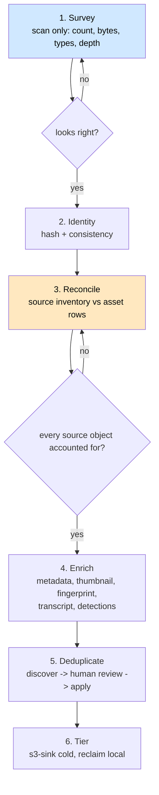

# Workflow: Ingest Migration — Onboard an Existing Corpus

> **Status**: 🔵 **Proposal.** Every ingredient is built — four source kinds, differential scanning,
> hashing, consistency checking, fingerprinting, dedup, S3 sink — and there is **no workflow that
> composes them**, no reconciliation report, and no way to answer "did everything arrive?"
> **Complexity**: **complex.** Multi-phase, long-running, resumable, and the one workflow whose
> failure mode is silent data loss rather than a bad label.
> **Scope**: taking a corpus that already exists somewhere — a NAS, an S3 bucket, a Google Drive — and
> getting it into MetaLoom completely, verifiably and without duplicating it.
> **Audience**: AI coding agents working on `cortex/nodes/*-source`, `cortex/nodes/consistency` and
> the Loom-side reporting this needs.

Family index and shared anatomy: [WORKFLOWS.md](WORKFLOWS.md). Status legend: 🟢 built · 🟡 partly
built · 🔵 plan · 🔴 defect · ⚪ stub.

**Out of scope, and where it lives instead:**

| Not here | There |
|---|---|
| One file uploaded from a browser | [WORKFLOW_UPLOAD.md](WORKFLOW_UPLOAD.md) |
| The source kinds themselves | [NODE_S3SOURCE.md](../features/nodes/s3-source/NODE_S3SOURCE.md), [NODE_CLOUDSOURCE.md](../features/nodes/cloud-source/NODE_CLOUDSOURCE.md) |
| Deciding which duplicate to keep | [WORKFLOW_DEDUP.md](WORKFLOW_DEDUP.md) |
| Where bytes physically live | [../features/rest/REST_BINARY_HANDLING.md](../features/rest/REST_BINARY_HANDLING.md) |
| Running a second Loom to go faster | [../concept/CLUSTERING.md](../concept/CLUSTERING.md) — 🔴 Loom is single-writer; a second instance is destructive |

---

## 1. What already exists

| Capability | Kind / class | State |
|---|---|---|
| Filesystem scan | `filesystem-source` | 🟢 |
| S3 scan, differential index, local object cache, event-driven ingestion | `s3-source`, `cortex/s3-common` | 🟢 24 `CORTEX_S3_*` variables |
| Google Drive / OneDrive / SharePoint | `gdrive-source`, `onedrive-source`, `cortex/cloud-common` | 🟢 ⚠️ dev-only refresh-token auth is a trap (§4) |
| Differential scanning | external `io.metaloom.fs` artifact | 🟢 `cortex/fs` is an empty shell |
| Hashing | `sha512`, `sha256`, `md5`, `chunk-hash` | 🟢 |
| Completeness check | `consistency` → `asset.is_complete`, `zero_chunk_count` | 🟢 |
| Perceptual fingerprint | `fingerprint` + Lucene HNSW | 🟢 (off by default) |
| Exact and near-duplicate handling | `sha512-dedup`, `fingerprint-dedup` | 🟢 |
| Cold tier | `s3-sink` | 🟢 phase 1 |
| Run state, pause/resume, per-item state | `pipeline_run`, `pipeline_run_item` (`V2.56`, `V2.77`) | 🟢 |

The gap is not capability. It is **composition, observability and proof**.

---

## 2. The phases



**Phase 3 is the one that does not exist and the one that matters.** Everything else is a pipeline
someone can already draw in the editor.

| Phase | Buildable today? | Notes |
|---|---|---|
| 1 Survey | 🟡 | The scanners can enumerate; there is no "count and stop" mode and no report |
| 2 Identity | 🟢 | Hash + consistency nodes |
| 3 **Reconcile** | 🔴 | Nothing compares the source inventory against what Loom holds |
| 4 Enrich | 🟢 | Ordinary pipeline. Expensive kinds should run after phase 3, not before |
| 5 Deduplicate | 🟡 | [WORKFLOW_DEDUP.md](WORKFLOW_DEDUP.md) — review UI is a mock |
| 6 Tier | 🟡 | `s3-sink` phase 1 built; reclaiming the local copy needs the plan in [../concept/REST_CORTEX_METADATA_BINARY_HANDLING_PLAN.md](../concept/REST_CORTEX_METADATA_BINARY_HANDLING_PLAN.md) |

### 2.1 Why enrichment comes after reconciliation

Running captioning, transcription and detection during the first pass is the intuitive order and the
expensive mistake. A 500k-object corpus spends days in GPU nodes before anyone knows whether the scan
even saw everything; a scan gap discovered in week two means redoing it. **Identity is cheap, complete
and verifiable. Do that first, prove it, then spend GPU.**

---

## 3. Phase 3: reconciliation (🔵 the work)

The question a migration must answer: *for every object at the source, is there an asset in Loom with
matching bytes — and if not, why not?*

```
source inventory (key, size, mtime, etag/checksum where available)
        vs
asset + asset_location / asset_binary
        =>
MATCHED | MISSING | SIZE_MISMATCH | UNREADABLE | SKIPPED_BY_FILTER | DUPLICATE_OF
```

| Requirement | Notes |
|---|---|
| **Persist the inventory** | The scanners already maintain a differential index (the `S3DifferentialScanner` Avro pattern). Today it is **worker-local** — a reconciliation report needs it in Loom, or at least a summary pushed there |
| **Explain every gap** | "Filtered out by a `MIME` bucket" and "the read failed" are different answers and must not look alike |
| **Be resumable** | A migration outlives a worker, a deploy and a connection. `pipeline_run_item` (`V2.77` normalised its state) is the right home for per-item progress |
| **Be re-runnable cheaply** | A second reconciliation should read the differential index, not rescan the corpus |
| **Report, not just log** | The output is a document an operator signs off on before switching off the old system |

🔴 **A rename is detectable on a cloud drive but not on S3** — the drive providers expose a file id
that survives a move, S3 does not. So on S3 a renamed object is a delete plus a create, and
reconciliation must fall back to content identity (SHA-512) rather than key identity. That asymmetry
is documented in [NODE_CLOUDSOURCE.md](../features/nodes/cloud-source/NODE_CLOUDSOURCE.md) and is a
correctness requirement here, not a footnote.

---

## 4. Operational traps

Each of these is verified in this tree and each will bite a real migration.

| Trap | Consequence | Mitigation |
|---|---|---|
| 🔴 **Loom is single-writer** (`replicaCount: 1`) | A second instance to "go faster" is destructive | Scale **Cortex** workers, never Loom ([../concept/CLUSTERING.md](../concept/CLUSTERING.md)) |
| 🔴 **Loom has no JVM shutdown hook** | SIGTERM skips `deinit()` mid-migration. Only Cortex drains (`CORTEX_DRAIN_TIMEOUT_MS`, 30 s) | Do not restart Loom during a run; fix the hook |
| 🔴 **Dev-only cloud auth** | `CORTEX_GDRIVE_REFRESH_TOKEN` expires after 7 days in "Testing" status; the OneDrive token **rotates on every use** and a stateless worker cannot persist the replacement | Use the service-account / app-only paths for any migration lasting more than a day |
| 🔴 **`cortex.yml` is never read** on the CLI/server path | Options set there silently do nothing, and the container path `/config` disagrees with the loader's probe path anyway | Configure by environment variable |
| 🟢 **`ctx.failure(...).next()` returned SUCCESS** | A failed item was recorded as processed — in a migration, **silent data loss**. Fixed 2026-08-18 | No audit needed on a build after that date; `FailurePathGuardTest` (`cortex/api`) fails the build if it comes back |
| 🔴 **Unschedulable run ⇒ 503** | A kind with no online worker rejects the whole run, naming the kinds | Check worker whitelists before dispatching a long run |
| ⚠️ **`HashDedupNode` blocks on `System.in.read()`** | A size mismatch halts a headless worker indefinitely | Fix, or exclude `sha512-dedup` from the migration graph |
| ⚠️ **Deep paging is capped** | Progress UIs that seek by offset break past `LOOM_SEARCH_MAX_OFFSET` (400) | Page forward from a cursor |
| ⚠️ **Cross-device moves silently copy** | Tiering a large corpus can turn into an unbounded byte copy | [WORKFLOW_TRASH.md](WORKFLOW_TRASH.md) §3.3 |

---

## 5. Progress Assessment

- [x] Four source kinds, differential scanning, local object cache, event-driven S3 ingestion
- [x] Hash, consistency, fingerprint, dedup, s3-sink nodes
- [x] Durable run state with pause/resume and normalised per-item state (`V2.56`, `V2.77`)
- [ ] 🔵 **Survey mode**: scan-and-report without ingesting (phase 1)
- [ ] 🔴 **Reconciliation**: source inventory in Loom, per-object disposition, an operator-facing report (phase 3)
- [ ] 🔵 Content-identity fallback where key identity is unreliable (S3 renames, §3)
- [ ] 🔵 Resumable per-item progress surfaced in the UI, not only in the log
- [ ] 🔵 A documented phase ordering (identity before enrichment) as a demo pipeline set
- [x] 🔴 Audit every ingest-path node for `ctx.failure(...).next()` — done 2026-08-18; every site converted and a build guard added ([../tasks/WORKFLOW_TASKS.md](../tasks/WORKFLOW_TASKS.md) Task 17)
- [ ] 🔴 Fix `HashDedupNode`'s `System.in.read()` halt
- [ ] 🔵 Tiering: reclaim the local copy after `s3-sink` ([../concept/REST_CORTEX_METADATA_BINARY_HANDLING_PLAN.md](../concept/REST_CORTEX_METADATA_BINARY_HANDLING_PLAN.md))
- [ ] 🔵 Throughput guidance: what one worker sustains per kind, so a migration can be planned
- [ ] Customer docs: a migration runbook

---

## 6. Test Setup

A migration cannot be unit-tested into confidence. What it needs:

| Test | Covers |
|---|---|
| `ReconciliationTest` 🔵 | Every disposition: matched, missing, size mismatch, unreadable, filtered, duplicate. Including the S3-rename case resolved by content identity |
| `ResumeTest` 🔵 | Kill the worker mid-run; the second run completes the remainder and does **not** reprocess completed items |
| `MigrationIT` 🔵 (`integration-test/`) | A few hundred synthetic objects across a source kind: survey → identity → reconcile → assert zero unexplained gaps |
| Scale rehearsal 🔵 | Not a test — a documented dry run at 1% of the corpus, with timings, before the real one |

⚠️ Cortex E2E runs against the **packaged** shaded `cortex/cli` JAR and container — rebuild both.
🔴 `./setup-pool.sh` before DAO/endpoint tests and after any Flyway change.

---

## 7. Configuration

The densest configuration surface in the product. Full lists:
[../cortex/CONFIGURATION.md](../cortex/CONFIGURATION.md), [../loom/CONFIGURATION.md](../loom/CONFIGURATION.md).

| Variable | Effect on a migration |
|---|---|
| `CORTEX_S3_ENDPOINT` / `_REGION` / `_ACCESS_KEY` / `_SECRET_KEY` / `_PATH_STYLE` | Without these `s3-source` is **not advertised** and the run is rejected as unschedulable |
| `CORTEX_S3_INDEX_PATH` / `_CACHE_PATH` / `_MAX_CACHE_BYTES` / `_MAX_OBJECT_SIZE` | The differential index and the local cache. 🔴 `_MAX_OBJECT_SIZE` silently excludes larger objects — it will show up in reconciliation as a gap |
| `CORTEX_S3_EVENTS_ENABLED` / `_MODE` / `_QUEUE_URL` / `_WEBHOOK_*` / `_RECONCILE_INTERVAL_MS` | Event-driven ingestion after the bulk pass |
| `CORTEX_GDRIVE_SERVICE_ACCOUNT_JSON` / `_FILE` / `_IMPERSONATE_SUBJECT` | The production Drive path (18 `CORTEX_GDRIVE_*` mappings) |
| `CORTEX_ONEDRIVE_TENANT_ID` / `_CLIENT_ID` / `_CLIENT_SECRET` / `_DEFAULT_DRIVE_ID` | App-only Graph auth; app-only has no `/me`, so a drive id is effectively required (15 mappings) |
| `CORTEX_NODE_WHITELIST` / `_BLACKLIST` | Which kinds this worker will run; a mismatch is a 503 naming the kinds |
| `CORTEX_DRAIN_TIMEOUT_MS` | 30 s default. Raise it for long-running items or SIGTERM abandons work |
| `LOOM_SIMILARITY_ENABLED` | Required for phase 5. Off ⇒ 503, deliberately loud |
| `LOOM_DB_MIN_POOL_SIZE` / `_MAX_POOL_SIZE` | ⚠️ Sustained ingest is the workload most likely to exhaust the pool |

---

## 8. Key Classes Reference

| Class / file | Package or path | Purpose |
|---|---|---|
| `S3SourceNode` / `S3DifferentialScanner` | `io.metaloom.cortex.node.source.s3`, `cortex/s3-common` | S3 enumeration + the differential index pattern |
| `CloudSourceNode` / `CloudDifferentialScanner` | `io.metaloom.cortex.node.source.cloud`, `cortex/cloud-common` | Drive / Graph |
| `FilesystemSourceNode` | `io.metaloom.cortex.node.source.fs` | Local scan |
| `ConsistencyNode` | `io.metaloom.cortex.node.consistency` | `asset.is_complete`, `zero_chunk_count` |
| `PipelineRunEngine` / `RunStateStore` | `io.metaloom.loom.pipeline.engine` | Durable run and item state |
| `PipelineEndpointService.unsupportedNodeKinds` | `io.metaloom.loom.rest.service.impl` | The 503 precheck |
| `BinaryReclaimer` | same | Reference-counted reclaim, needed by tiering |
| `LoomControlChannel` | `io.metaloom.cortex.impl.loom` | Worker registration and reconnect — ⚠️ **linear** backoff, not exponential |

---

## 9. Conventions and Gotchas

| Area | Gotcha |
|---|---|
| **Identity before enrichment** | 🔴 Prove the scan is complete before spending GPU. A gap found after enrichment costs the enrichment |
| **Scale Cortex, never Loom** | 🔴 Loom is single-writer; a second instance is destructive |
| **A rename is invisible on S3** | 🔴 Fall back to content identity; key identity only works where the provider exposes a stable file id |
| **`ctx.failure(...).next()` returned SUCCESS** | 🟢 Fixed 2026-08-18. Worth remembering why it mattered: on an ingest path it was silent data loss, not a cosmetic bug |
| **`cortex.yml` is dead** | 🔴 `CortexOptionsLoader.load()` has no caller. Configure by environment variable |
| **Dev-only refresh tokens** | 🔴 Google's expires in 7 days; Microsoft's rotates on every use and a stateless worker cannot persist the replacement |
| **`_MAX_OBJECT_SIZE` silently excludes** | ⚠️ It surfaces as an unexplained reconciliation gap. Report it as `SKIPPED_BY_FILTER`, not as missing |
| **Reconnect backoff is linear** | ⚠️ `min(base × attempt, 30 000)`. Only the UI uses exponential backoff — specs saying otherwise are wrong |
| **Loom does not drain on SIGTERM** | 🔴 Do not restart Loom during a run |
| **The differential index is worker-local** | ⚠️ Replacing the worker loses it; a reconciliation report needs the inventory in Loom |

---

## 10. Where do I find …?

| Need | Look here |
|---|---|
| The source kinds | [NODE_S3SOURCE.md](../features/nodes/s3-source/NODE_S3SOURCE.md), [NODE_CLOUDSOURCE.md](../features/nodes/cloud-source/NODE_CLOUDSOURCE.md) |
| The differential-scan pattern | `cortex/s3-common/`, `cortex/cloud-common/` |
| Run and item state | [../features/pipeline/PIPELINE.md](../features/pipeline/PIPELINE.md); `V2.56`, `V2.77` |
| Why a second Loom is destructive | [../concept/CLUSTERING.md](../concept/CLUSTERING.md) |
| Storage layout, pools, reclaim | [../features/rest/REST_BINARY_HANDLING.md](../features/rest/REST_BINARY_HANDLING.md) |
| Getting artefacts back out of a worker | [../concept/REST_CORTEX_METADATA_BINARY_HANDLING_PLAN.md](../concept/REST_CORTEX_METADATA_BINARY_HANDLING_PLAN.md) |
| The dedup phase | [WORKFLOW_DEDUP.md](WORKFLOW_DEDUP.md) |
| Cortex configuration in full | [../cortex/CONFIGURATION.md](../cortex/CONFIGURATION.md) |
| Open tasks | [../tasks/WORKFLOW_TASKS.md](../tasks/WORKFLOW_TASKS.md) W13 |

---

_Git HEAD revision: `d4e9134f`_
_Last updated: 2026-08-18 (the `ctx.failure(...).next()` trap is fixed, so the pre-run audit it required is closed). Earlier: 2026-08-07 (new file — proposal; traps verified against the cortex config and node sources)_
