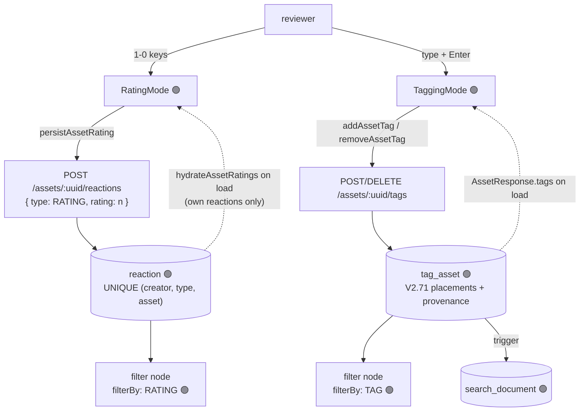
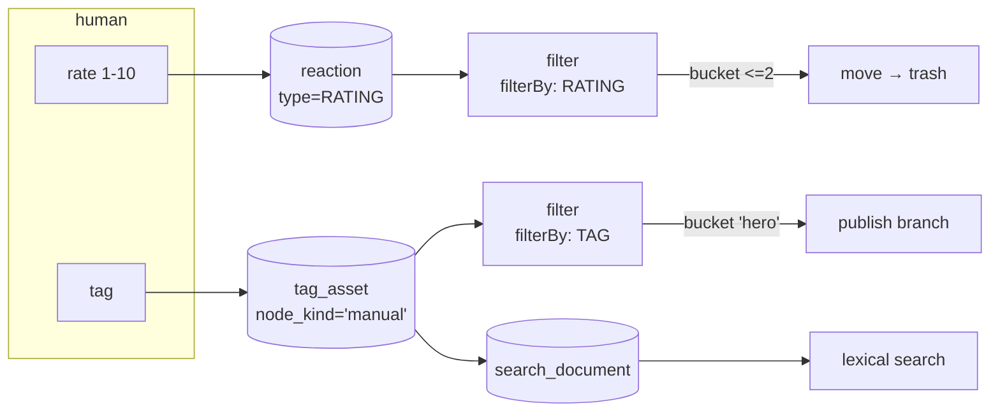

# Workflow: Manual Sorting — Rate and Tag at Keyboard Speed

> **Status**: 🟢 **The loop closes.** The screen, the keyboard layer, both write paths and the two
> filter strategies exist: a reviewer rates and tags, both persist, and a pipeline routes on the
> result. What remains is queue quality, not correctness — the review set is still "the first 20
> assets" (defect X6) and key profiles are still not persisted (X5).
> **Scope**: a human tabs through a set of assets and assigns a **rating** and **tags**, one keystroke
> per decision; those decisions persist and become actionable.
> **Audience**: AI coding agents working on `loom-ui/src/features/workflow/`,
> `loom/services/rest/.../endpoint/impl/AssetEndpoint.java` and `cortex/nodes/filter/`.

Family index and shared anatomy: [WORKFLOWS.md](WORKFLOWS.md). Status legend: 🟢 built · 🟡 partly
built · 🔵 plan · 🔴 defect · ⚪ stub.

**Out of scope, and where it lives instead:**

| Not here | There |
|---|---|
| Machine tagging from pipeline rules | [../concept/NODE_TAG_CONCEPT.md](../concept/NODE_TAG_CONCEPT.md) — the `tag` node |
| Confirming a face cluster / a detection | [WORKFLOW_FACE.md](WORKFLOW_FACE.md), [WORKFLOW_OBJECT_DETECT.md](WORKFLOW_OBJECT_DETECT.md) |
| Putting assets into a collection | [WORKFLOW_COLLECTION_CURATION.md](WORKFLOW_COLLECTION_CURATION.md) |
| What happens to a rated-low asset | [WORKFLOW_TRASH.md](WORKFLOW_TRASH.md) |
| Tag CRUD screens outside the workflow view | [../loom/ui/TASK_UI_ORGANIZATION.md](../loom/ui/TASK_UI_ORGANIZATION.md) |
| The asset-tag REST contract | [../loom/RESTAPI.md](../loom/RESTAPI.md) |

---

## 0. Executive Summary

| Question | Short answer |
|---|---|
| **Can a user rate an asset and have it stick?** | **Yes** — `RatingMode` persists through `persistAssetRating` and rehydrates on load, now scoped to the signed-in reviewer. |
| **Can a user tag an asset and have it stick?** | **Yes** — `handleAddTag`/`handleRemoveTag` go through `tagPersistence.ts`, optimistically with rollback and a toast. |
| **Where is a rating stored?** | In `reaction`, as `type = "RATING"` with a numeric `rating` (V2.78). `UNIQUE (creator_uuid, type, asset_uuid)` then means exactly one rating per user per asset, without colliding with a real 🤣. |
| **What happens when the same asset is seen again?** | The asset row is matched by SHA-512 and its `asset_location` updated. The rating and tags survive because they hang off `asset(uuid)`, not off the location — so re-encountering an asset already carries its decisions forward (§2.3). |
| **Can a pipeline act on a rating or tag?** | **Yes** — `FilterBy.RATING` and `FilterBy.TAG` (§5). The demo ships a `Review Triage` pipeline that publishes what reviewers rated `>=8` and tags what they rated `<=2`. |
| **What is still missing?** | The **queue**: the review set is `listAssets(limit)` sliced to 20, with no `?unrated=`/`?untagged=` filter (defect X6), and no resumable progress (X7). |

---

## 1. Current State



### 1.1 What actually runs

**Rating** — `RatingMode` renders a MUI `Rating` with `max={10}`. Keys `1`-`9` and `0` map to
`set_rating` with params `"1"`-`"10"`. `handleRate` updates local state optimistically, persists, and
**restores the previous value with a toast if the write fails**.

```ts
// ratingPersistence.ts
export const RATING_REACTION_TYPE: TaskReactionType = "RATING";
const request: ReactionCreateRequest = { type: RATING_REACTION_TYPE, rating };
// create when the asset has none, otherwise update the existing reaction uuid
```

On load, `hydrateAssetRatings(token, uuids, userUuid)` lists each asset's reactions and picks **this
reviewer's own** — preferring a `RATING` row and falling back to a legacy `SATISFIED`+rating one, so
a UI deployed ahead of V2.78 still hydrates. ⚠️ The owner filter is a correctness requirement, not a
display nicety: `GET /assets/:uuid/reactions` returns every user's rows, and adopting a colleague's
reaction uuid would make the next keystroke overwrite *their* rating. Per-asset failures are still
swallowed so one bad asset does not blank the screen.

**Tagging** — `TaggingMode` renders an `Autocomplete` over the vocabulary from
`loadTagVocabulary(token)`, still `freeSolo`. `handleAddTag`/`handleRemoveTag` write through
`tagPersistence.ts`. The optimistic chip carries a `pending:` placeholder uuid so the rollback removes
*that* chip rather than whichever now sits at the same index; a removal restores the tag at its
original position.

`assetTags` is `Record<string, WorkflowTag[]>` — objects, not names. Removal needs the tag uuid, and
telling a curated tag from a machine one needs `nodeKind`. The map is built from the **raw**
`AssetResponse`, because `apiToWorkflowAsset` flattens `r.tags` to names.

### 1.2 The write path

| Piece | Where | State |
|---|---|---|
| `POST /api/v1/assets/:uuid/tags` | `AssetEndpoint.java:246` | 🟢 Creates a placement; accepts region (`time_from`/`time_to`/`area*`) |
| `PUT /api/v1/assets/:uuid/tags` | `:252` | 🟢 Full replace |
| `DELETE /api/v1/assets/:uuid/tags/:tagUuid` | `:260` | 🟢 |
| `tagAsset` / `untagAsset` | `loom-ui/src/api/tags.ts:150`, `:164` | 🟢 Called from `tagPersistence.ts` |
| `DEFAULT_TAG_COLLECTION` | `loom-ui/src/api/tags.ts` | 🟢 One constant, shared by the review screen and `AssetDetail` |
| `tag_asset` placement identity + provenance | `V2.71__tag_asset_placements.sql` | 🟢 `uuid` PK, `node_kind` default `'manual'`, `creator_uuid`, `confidence`, region columns |
| `search_document` trigger on tags | `V2.57`-`V2.59` | 🟢 A written tag becomes searchable |

⚠️ **`TagReference` in `loom-ui/src/api/assets.ts` used to drop what the server sends.** It carried
only `uuid`, `name`, `collection`, `color` and `area`; `nodeKind`, `confidence`, `placementUuid`,
`attached` and `attachedBy` were on the wire and invisible to the UI. Extended — anything touching tag
provenance needs it.

⚠️ **`tagAsset` resolves rather than inserts.** `tag` is `UNIQUE (name, collection)`; an endpoint that
INSERTed a new `tag` row per asset broke on the second asset. The fixed write path resolves an
existing tag by `(name, collection)` and creates the **placement**. See
[../concept/NODE_TAG_CONCEPT.md](../concept/NODE_TAG_CONCEPT.md) §2. Do not reintroduce an insert.

---

## 2. Target Design

### 2.1 The three decisions, as settled

| # | Decision | Resolution |
|---|---|---|
| D1 | **Where does a rating live?** `reaction` (today), a new `asset_rating` table, or `asset_user_meta.meta` | ✅ **`reaction`, with its own type.** `ReactionType.RATING` plus `V2.78`. The `UNIQUE (creator_uuid, type, asset_uuid)` index then gives exactly the right semantics — one rating per user per asset — without colliding with a real 🤣. A new table would duplicate a working per-user unique constraint for nothing. ⚠️ `reaction.type` is a varchar read back via `ReactionType.valueOf`, so the enum value must exist or every REST read of that row is a 500 |
| D2 | **Is a rating per user or per asset?** | ✅ **Per user**, as the schema enforces. The UI shows and edits *your own* rating; `FilterBy.RATING` aggregates with the **mean**, rounded half-up, and records `ratingMean` and `ratingCount` alongside. No denormalised `asset.rating` column. ⚠️ A mean moves as reviewers are added, so an asset can change branch between runs without anyone changing their mind — accepted, and stated in the customer docs |
| D3 | **Which tag vocabulary?** | ✅ **`listTags(token, {limit: 200})`, unscoped**, written into `DEFAULT_TAG_COLLECTION`. `freeSolo` stays. 🔴 The original recommendation — "scoped by the collection the queue was built from" — **is not implementable and would be wrong if it were**: `/workflow` takes no route params and `SpaceContext` is a stub, so there is no collection context; `listTags` has no collection filter; and `tag.collection` is a free-text *namespace* on the tag (`UNIQUE (name, collection)`), not an asset collection. The demo's tags live in `category`/`type`, so a filter on `default` would show an empty autocomplete on the reference deployment. Scoping needs a queue that carries a collection first — defect X6 |

### 2.2 The loop, closed



### 2.3 Why re-encountering an asset already works

The brief asks how a second encounter with the same asset should behave. It already behaves
correctly, and the reason is worth recording so it is not "fixed":

- `asset` is keyed by content: `PRIMARY KEY (uuid)` with `UNIQUE (sha512sum)` since `V2.46`. The
  hashing node resolves an existing asset for known bytes.
- Every human decision hangs off `asset(uuid)` — `reaction.asset_uuid`, `tag_asset.asset_uuid` — not
  off `asset_location`.
- `asset_location` is the per-path record. A file moved to a new folder updates or adds a location
  row and touches nothing else.

So **decisions follow the bytes, not the path.** Moving, renaming or re-scanning a file preserves its
rating and tags. The only thing to add is *visibility*: the review UI should show that an asset
already carries decisions, so a reviewer does not redo work — task W8.

---

## 3. Schema

**No new table was needed.** `V2.78__rating_reaction_type.sql` does two things:

| # | Change | Why |
|---|---|---|
| 1 | `UPDATE reaction SET type='RATING' WHERE type='SATISFIED' AND rating IS NOT NULL AND asset_uuid IS NOT NULL` | D1. Rows written by the older UI would otherwise read back as emoji reactions. Scoped to `asset_uuid IS NOT NULL` because a reaction on a comment or annotation is not a workflow rating even if it carries a number, and guarded by `NOT EXISTS` against a pre-existing `RATING` row — nothing has ever written one, so the guard is for a hand-edited database, and a skipped row is **left alone rather than deleted** |
| 2 | `CREATE INDEX "idx_reaction_asset_type" ON "reaction" ("asset_uuid","type")` | The consumer query is "the reactions on this asset"; every index that mentioned `asset_uuid` led with `creator_uuid`, so `loadPageForAsset` was a sequential scan — and `FilterBy.RATING` makes it hot |

Plus `ReactionType.RATING` in `loom-shared/api` (Java enum only — `reaction.type` is a varchar, not a
Postgres enum), mirrored by hand in `loom-ui/src/api/reactions.ts` and regenerated into
`clients/python/loom_client/models/enums.py`.

🔴 **Check the highest migration before claiming a version.** `V2.78` is the highest as of this change.

A migration triggers, per [../guidelines/CODING.md](../guidelines/CODING.md):

```bash
mvn install -pl loom/db/flyway     # or the pool silently skips the new migration
loom/db/jooq/generate.sh           # generates into target/ and only swaps src/jooq/java on success
./setup-pool.sh                    # re-provision the pooled test databases
```

⚠️ An earlier version of this file called `generate.sh` destructive ("`rm -rf`s `src/jooq/java`
first"). It is not: codegen runs into `target/jooq-codegen` and the checked-in sources are replaced
only once it has succeeded, so a failing migration leaves the tree intact.

**No REST change.** `POST/GET /assets/:uuid/reactions` already carried `type` and `rating`, and
`ReactionMethods.listAssetReaction(UUID)` already existed — which is why `test_parity.py`'s
`EXPECTED_JAVA_METHOD_COUNT` stayed at 249.

---

## 4. REST

Everything needed exists. One addition and one clarification:

| Method | Path | Purpose | Permission | State |
|---|---|---|---|---|
| POST | `/api/v1/assets/:uuid/tags` | Add a placement (resolve-or-create the tag) | `UPDATE_ASSET` + `CREATE_TAG` | 🟢 |
| DELETE | `/api/v1/assets/:uuid/tags/:tagUuid` | Remove **every** placement of that tag on the asset | `UPDATE_ASSET` | 🟢 ⚠️ see gotcha |
| POST | `/api/v1/assets/:uuid/reactions` | Create or update a rating | `CREATE_REACTION` | 🟢 |
| GET | `/api/v1/assets/:uuid/reactions` | Read ratings back | `READ_REACTION` | 🟢 |
| GET | `/api/v1/assets?minRating=&tag=&untagged=true` | 🔵 **The queue.** Scope the review set to what needs a decision | `READ_ASSET` | 🔵 not built (defect X6) |

⚠️ Since `V2.71` a tag may be placed on one asset more than once (different regions). `DELETE
/tags/:tagUuid` removes the tag from the asset wholesale. Removing **one placement** needs the
placement `uuid` — a route that does not exist yet. The workflow view only writes asset-level tags,
so it is not blocked, but the region-tag UI is.

---

## 5. Why this matters: the consumer gap, closed

**This is the "how can this be useful?" question from the brief, answered.**

| Consumer | Reads a rating? | Reads a tag? |
|---|---|---|
| `filter` node | 🟢 Yes — `FilterBy.RATING` | 🟢 Yes — `FilterBy.TAG` |
| `tag` node | No (writes only) | No |
| `PipelineMatcher` (auto-trigger) | No — mime type only | No |
| Lexical search | No | 🟢 Yes, via `search_document` triggers |
| `script` node | Possible, at the cost of policy-in-a-script | Same |
| MCP tools / agent | Only by querying the DB directly | Same |

### 5.1 The seam the strategies plug into

`classify` used to take a `NodeContext` and nothing else — no asset, no client — while
`FilterNode.compute` was already holding the `AssetResponse` and dropping it. It now takes a
per-item record:

```java
public record FilterItem(NodeContext<LoomMedia> ctx, AssetResponse asset,
                         List<ReactionResponse> reactions, boolean reactionsAvailable, String text)

Classification classify(FilterItem item, FilterNodeOptions options, List<FilterBucket> buckets)
default boolean needsReactions() { return false; }
```

Widening the seam beat injecting a `LoomClient` into the strategies: a strategy has no asset identity,
so it would re-derive the SHA-512 from the media and `loadAsset` a **second** time per item, forever —
and it would break the codebase's own idiom of keeping every Loom call in the node (`TagNode` does the
same with `TagStrategy`). The change was made in its own step and carried **no behaviour**: the four
existing strategies changed mechanically and no existing test changed, because nothing calls
`classify` directly.

### 5.2 `FilterBy.RATING`

Hints are `>=8`, `<=2`, `4..7`, a bare `8`, and `unrated`. Two deliberate divergences from
`SizeFilterStrategy`, both in the javadoc:

- **A range is inclusive at both ends.** Size's exclusive upper end exists so byte ranges tile without
  a gap nobody would notice. Ratings are ten integers: `1..3` and `4..7` already tile, and a half-open
  `4..7` would silently drop every 7 from a bucket that says it holds them.
- **A bare integer is that exact rating**, not a ceiling. `DateFilterStrategy` already reads a bare
  `2024-03-17` as that one day, so the rule across all three is coherent: **a bare value is exact on a
  discrete domain and a ceiling on a continuous one.**

`needsReactions()` is `true`, so the node makes one `listAssetReaction` call per item — memoised by its
existing per-run `LocalResultCache`, keyed on path plus `configHash`. Several reviewers are reduced to
the **mean**, rounded half-up (D2).

🔴 **Three outcomes, deliberately distinct.** This is the highest-consequence detail in the feature:

| State | Answer |
|---|---|
| `asset == null` (offline, never ingested, load failed) | `other("asset is not known to Loom")` |
| asset known, no rating rows | genuinely **unrated** — an `unrated` bucket catches it, else `other` |
| the reaction fetch **threw** (`reactionsAvailable == false`) | `other("reactions unavailable")` |

Collapsing the last two into "unrated" would route unrated-branch work — typically trash or
re-review — over a Loom outage. Nothing throws: `FilterNode.compute` aborts the whole task on a
classify throw, which is disproportionate for one un-ingested file in a fifty-thousand-item run.

### 5.3 `FilterBy.TAG`

Hints are names, prefix globs (`person/*`, `*`), negations (`!archive`) and `untagged`. **A bucket
matches when at least one positive hint matches and no negated hint does** — `hero, !archive` reads as
"hero but not archive", the only thing anyone means; treating `!` as another alternative would make the
bucket match every archived asset too. A bucket of only negations matches when none apply, which is
the "not reviewed yet" branch. `match()` falls back to the bucket id like MIME, which is why
`validateBuckets` cannot reject an empty match column here (it rejects only a bare `!`).

Curated-vs-machine is the **`tagSource` node option** (`ANY`/`MANUAL`/`MACHINE`), not a `manual:hero`
syntax — that would be a second grammar inside a field that already has one, and the choice is made
once per node rather than per bucket. `MANUAL` treats a null `node_kind` as manual, matching V2.71's
deliberate default. ⚠️ `tagSource` is mixed into `configHash`, or two nodes differing only in it would
share a `LocalResultCache` entry and a `producerVersion`.

Zero round trips: tags ride on the `AssetResponse` the node already loaded.

---

## 6. UI changes

| # | Change | File | State |
|---|---|---|---|
| 1 | Call `addAssetTag` / `removeAssetTag` from `handleAddTag` / `handleRemoveTag` | `tagPersistence.ts`, `WorkflowView.tsx` | 🟢 |
| 2 | Replace `ALL_TAGS` (24 hardcoded strings) with `loadTagVocabulary(token)` | `tagPersistence.ts` | 🟢 |
| 3 | Switch `RATING_REACTION_TYPE` to `RATING`, with a fallback that still reads legacy `SATISFIED`+rating rows | `ratingPersistence.ts` | 🟢 |
| 4 | Show existing decisions on arrival — an "already rated / already tagged" marker so a reviewer can skip | `RatingMode`, `TaggingMode` | 🟢 |
| 5 | Surface `tag_asset` provenance: a machine tag renders outlined with node kind and confidence, and carries no delete affordance | `TagEditor` | 🟢 |
| 6 | 🔴 Persist key profiles (defect X5, shared) | `WorkflowView.tsx` | open |
| 7 | 🔴 A real queue: `?untagged=true` / `?unrated=true` instead of "first 20 assets" (defect X6, shared) | `WorkflowView.tsx` | open |

Both write paths are **optimistic with rollback**, not fire-and-forget: at ten keystrokes a second a
failed POST that silently disappears is worse than no persistence at all. Three details that are easy
to get wrong:

- The optimistic chip carries a `pending:` placeholder uuid and the rollback removes **that** chip.
  Reverting by index or by name removes the wrong one when several writes are in flight.
- A removal restores the tag **at its original index**, not at the end.
- The "already decided" markers reflect what the asset **arrived** carrying (`initiallyRated`,
  `initiallyTagged`), not the live state — which would light up the instant a key is pressed and tell
  the reviewer nothing.

Shared component `TagEditor` renders the chips and the input for both modes, so a chip means the same
thing in each.

---

## 7. Progress Assessment

### Built
- [x] `/workflow` route, rating and tagging modes, keyboard bindings, rebindable profiles
- [x] `persistAssetRating` + `hydrateAssetRatings` with a vitest unit test
- [x] `workflow-rating-mocked.spec.ts` mocked Playwright e2e, incl. a rollback case
- [x] `POST/PUT/DELETE /assets/:uuid/tags` + `tagAsset`/`untagAsset` UI client
- [x] `V2.71` tag placements: per-region identity, provenance, `creator_uuid`, indexes
- [x] Tags reach `search_document`, so a curated tag is immediately searchable
- [x] **Tagging persists** — `tagPersistence.ts`, optimistic with rollback and a toast (§6)
- [x] **The real vocabulary** — `loadTagVocabulary(token)`; `ALL_TAGS` is gone
- [x] **`FilterBy.RATING` + `FilterBy.TAG`** — a pipeline can act on a human decision (§5)
- [x] **D1 settled** — `ReactionType.RATING`, `V2.78` data migration, `idx_reaction_asset_type`
- [x] Per-user rating hydration, so a colleague's rating is neither shown nor overwritten
- [x] Pre-existing decisions marked; machine tags distinguished and not removable from here
- [x] `tagPersistence.test.ts` + `workflow-tagging-mocked.spec.ts`
- [x] Demo data: three rated assets, a curated `hero` tag, and a `Review Triage` pipeline that routes
      on the rating (`DemoDatabaseInitializer`)
- [x] Customer docs: the filter node's Rating/Tag sections, and a review section in the UI docs

### Open
- [ ] 🔴 A real queue and resumable progress (defects X6, X7) — `?unrated=`/`?untagged=` needs a
      `LoomFilterKey` and DAO support; today `AbstractJooqDao.applyFilter` accepts only `UUID`
- [ ] 🔴 Persist key profiles (defect X5)
- [ ] Per-placement delete route for region tags (§4)
- [ ] `AssetModelBuilder.assetSocialInfo` is still a stub returning an empty `SocialInfo` — filling it
      would remove `FilterBy.RATING`'s round trip, but `Rating.stars` is an `int` that cannot express
      "unrated", and it would add a per-asset aggregate to every asset read including list pages
- [ ] A migration test proving a legacy `SATISFIED`+rating row reads back as `RATING`. **Not written
      on purpose**: the migration runs before any test data exists on a pooled database, so the only
      honest coverage is SQL review plus the endpoint round-trip

---

## 8. Test Setup

| Test | Covers | Command |
|---|---|---|
| `ratingPersistence.test.ts` 🟢 | create-vs-update, the `RATING` body, per-user hydration, the legacy fallback, failure tolerance | `cd loom-ui && ./node_modules/.bin/vitest run src/features/workflow/` |
| `tagPersistence.test.ts` 🟢 | POST body + namespace, that `/tags` is never called, a 204 with no body, rejection on non-2xx, vocabulary de-dup, absent-`nodeKind`-is-curated | same |
| `workflow-rating-mocked.spec.ts` 🟢 | rate → reload → persisted; and a 500 rolls the stars back with a toast | `cd loom-ui && ./node_modules/.bin/playwright test e2e/workflow-*` |
| `workflow-tagging-mocked.spec.ts` 🟢 | tag → reload → persisted; a 500 removes the chip; remove issues the DELETE; a machine chip has no delete affordance | same |
| `tags-backend.spec.ts`, `tag-rating-backend.spec.ts`, `region-tags-backend.spec.ts` 🟢 | The tag REST surface from the UI side (live backend) | `./node_modules/.bin/playwright test e2e/tags-backend.spec.ts` |
| `RatingFilterNodeTest` 🟢 | The hint grammar, and the offline contract: a null client routes to `other` and the task still **succeeds** | `mvn -pl cortex/nodes/filter/core -am test` |
| `RatingFilterNodePersistenceTest` 🟢 | The mean across reviewers, the persisted `rating`/`ratingMean`/`ratingCount`/`ratingSource`, and unavailable ≠ unrated | same |
| `TagFilterNodeTest` 🟢 | Exact names, prefix globs, the `!` veto, `untagged`, `tagSource`, and `tagSource` in the config hash | same |
| `ReactionEndpointTest` 🟢 | A `RATING` round-trip (the read is what catches a missing enum constant) plus fine-grained permission cases via a group + role | `./setup-pool.sh` then `mvn -pl loom/core test -Dtest=ReactionEndpointTest` |
| `ReactionDaoTest`, `AssetCascadeTest` 🟢 | A rating and an emoji reaction coexisting on one asset for one user, and both cascading on asset delete | `mvn -pl loom/db/jooq test -Dtest=ReactionDaoTest+AssetCascadeTest` |
| `PipelineGraphParserTest` 🟢 | A built definition resolves the same bucket ports as the same definition parsed from a string | `mvn -pl loom/pipeline test` |
| `DemoPipelineDefinitionTest` 🟢 | `Review Triage` parses through the real parser and registry — the end-to-end proof its bucket ports resolve | `mvn -pl loom/core test -Dtest=DemoPipelineDefinitionTest` |

⚠️ `npx` stalls here — use `./node_modules/.bin/`. ⚠️ Playwright `role`+`name` is a substring match;
use `exact: true`. 🔴 `./setup-pool.sh` before any DAO/endpoint test and after any Flyway change.

---

## 9. Configuration

This workflow reads no environment variable of its own. Indirect gates:

| Variable | Effect |
|---|---|
| `LOOM_SEARCH_ENABLED` | Off ⇒ a tag is still written but is not searchable; the "find what I tagged" half of the value disappears |
| `CORTEX_NODE_WHITELIST` / `_BLACKLIST` | Must include `filter` on the worker, or a run using these strategies is rejected with 503 |

Filter node options (pipeline JSON / worker YAML, per-instance via `PipelineConfigurable`):

| Option | Type | Meaning |
|---|---|---|
| `filterBy` | enum | `RATING` or `TAG` |
| `tagSource` | enum | `ANY` (default), `MANUAL` or `MACHINE`; `filterBy=TAG` only. Mixed into `configHash` |
| `buckets` | list | Bucket hints; each resolves to an output port |

⚠️ `PipelineGraphParser.readOptions` re-encodes the options object so nested values are plain
`Map`s/`List`s. Before that, a definition **built in code** kept Vert.x `JsonObject`/`JsonArray`
values, which `FilterPortResolver` (in `node-model`, which has no Vert.x) could not read — so a
programmatically built filter resolved no bucket ports at all. Half of task 14 in
[../tasks/PIPELINE_TASKS.md](../tasks/PIPELINE_TASKS.md); the demo-MIME rewiring half is still open.

---

## 10. Key Classes Reference

| Class / file | Package or path | Purpose |
|---|---|---|
| `WorkflowView` | `loom-ui/src/features/workflow/WorkflowView.tsx` | `TagEditor`, `RatingMode`, `TaggingMode`, and the three handlers |
| `ratingPersistence` | same directory | `RATING_REACTION_TYPE`, `persistAssetRating`, `hydrateAssetRatings` |
| `tagPersistence` | same directory | `WorkflowTag`, `addAssetTag`, `removeAssetTag`, `loadTagVocabulary`, `isCurated`, `isPending` |
| `tags.ts` | `loom-ui/src/api/tags.ts` | `listTags`, `tagAsset`, `untagAsset`, `DEFAULT_TAG_COLLECTION` |
| `reactions.ts` | `loom-ui/src/api/reactions.ts` | `createAssetReaction`, `updateAssetReaction`, `listAssetReactions`, the hand-mirrored `TaskReactionType` union |
| `ReactionType` | `io.metaloom.loom.api.reaction` (`loom-shared/api`) | Carries `RATING`; `reaction.type` is read back with `valueOf` |
| `AssetEndpoint` | `io.metaloom.loom.rest.endpoint.impl` | Tag routes `:246-260`, reaction routes `:298-322` |
| `FilterItem` | `io.metaloom.cortex.node.filter` | What a strategy sees about one item: context, asset, reactions, availability, text |
| `FilterNode` / `FilterBy` / `FilterStrategy` | same | The seam §5 extends |
| `RatingFilterStrategy` / `TagFilterStrategy` / `TagSource` | same | The two decision strategies and the curated/machine option |
| `MimeFilterStrategy` / `SizeFilterStrategy` | same | The shapes those two were modelled on — hint parsers, no LLM dependency |
| `TagNode` / `TagRule` | `io.metaloom.cortex.node.tag` | Machine tagging; shares the write path and the `node_kind` provenance convention |

---

## 11. Conventions and Gotchas

| Area | Gotcha |
|---|---|
| **`tag` is unique per collection** | 🔴 `UNIQUE (name, collection)`. The asset-tag endpoint **resolves** an existing tag and creates a placement; it must never INSERT a tag row per asset |
| **`reaction.type` must be an enum name** | 🔴 A varchar column read back through `ReactionType.valueOf`. A free string means every REST read of that row is a 500 |
| **One rating per (user, type, asset)** | 🟢 `UNIQUE (creator_uuid, type, asset_uuid)`. Since `RATING` has its own type a star rating and a 🤣 are separate rows (defect X8 closed) |
| **Reactions come back for every user** | 🔴 `GET /assets/:uuid/reactions` is not scoped to the caller. Picking "the first one carrying a number" shows a colleague's rating **and** hands its uuid to the update path, so the next keystroke overwrites their row. Filter on `status.creator.uuid` |
| **Unavailable ≠ unrated** | 🔴 A failed reaction lookup must not be read as "nobody rated it". The unrated branch is where trash and re-review work goes, and a Loom blip would send a well-reviewed library down it |
| **A bare hint value** | ⚠️ Exact on a discrete domain (`RATING`, `DATE`), a ceiling on a continuous one (`SIZE`). Stated in each strategy's javadoc so nobody "harmonises" them |
| **Placements, not pairs** | ⚠️ Since `V2.71` `tag_asset` has its own `uuid`; the same tag can sit on one asset twice at different regions. Deleting "the tag" and deleting "this placement" differ |
| **`node_kind` defaults to `'manual'`** | ⚠️ Deliberate: an insert that forgets to say who wrote it is treated as human, because a machine row mislabelled human is merely not filtered out, while a human row mislabelled machine could be deleted by a reconciling node |
| **Decisions follow bytes, not paths** | 🟢 `asset` is keyed by SHA-512; decisions hang off `asset(uuid)`. Do not attach a decision to `asset_location` |
| **Optimistic writes need rollback** | ⚠️ At ten keystrokes a second, a silently failed POST is worse than no persistence. Roll back by **placeholder uuid**, never by index or name — several writes are in flight |
| **`tag.collection` is a namespace** | 🔴 Free text on the tag (`UNIQUE (name, collection)`), *not* an asset collection. `CollectionResponse` is an unrelated concept with a confusingly similar name |

---

## 12. Where do I find …?

| Need | Look here |
|---|---|
| The two modes and the shared chip/input component | `loom-ui/src/features/workflow/WorkflowView.tsx` — `TagEditor`, `RatingMode`, `TaggingMode` |
| The two write paths | `loom-ui/src/features/workflow/ratingPersistence.ts` and `tagPersistence.ts` |
| Tag placement schema and its rationale | `loom/db/flyway/.../V2.71__tag_asset_placements.sql` |
| Why `tagAsset` resolves rather than inserts | [../concept/NODE_TAG_CONCEPT.md](../concept/NODE_TAG_CONCEPT.md) §2 |
| Reaction schema, and the rating's own type | `V2.17__add_social.sql`, `V2.78__rating_reaction_type.sql` |
| The filter seam | `cortex/nodes/filter/core/src/main/java/io/metaloom/cortex/node/filter/` |
| Bucket-port routing rules | [../features/pipeline/NODE_DATA_TYPES.md](../features/pipeline/NODE_DATA_TYPES.md) §8.6 |
| A worked pipeline that routes on a decision | `DemoDatabaseInitializer.reviewTriageDefinition()` |
| Shared workflow defects | [WORKFLOWS.md](WORKFLOWS.md) §4 |
| Open tasks | [../tasks/WORKFLOW_TASKS.md](../tasks/WORKFLOW_TASKS.md) W8 (W1 and W2 are done) |

---

_Git HEAD revision: `43ada5a8`_
_Last updated: 2026-08-08 (tag persistence, ReactionType.RATING + V2.78, FilterBy.RATING/TAG, demo Review Triage pipeline)_
