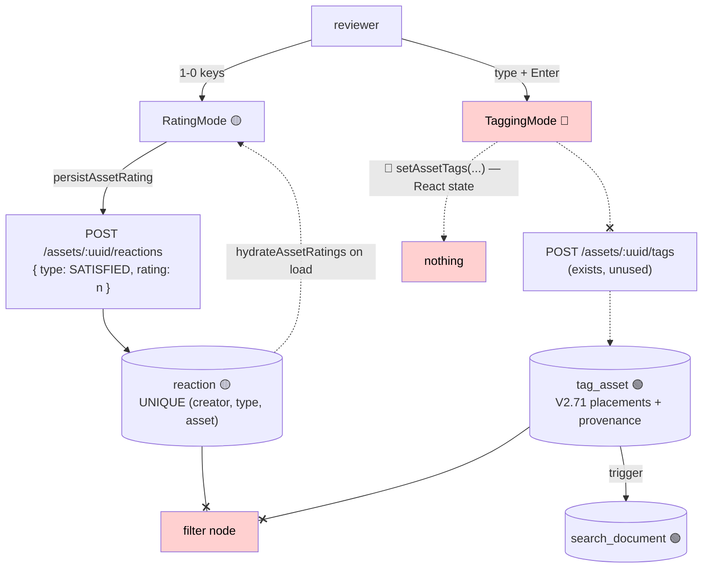
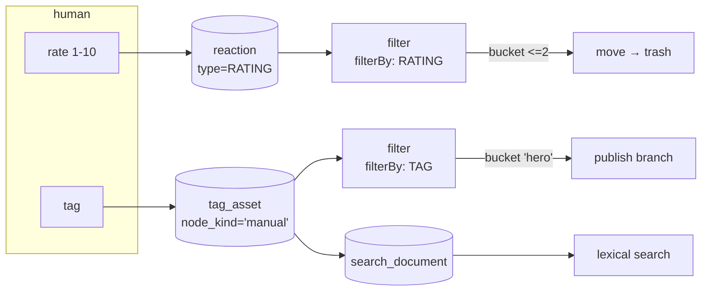

# Workflow: Manual Sorting — Rate and Tag at Keyboard Speed

> **Status**: 🟡 **Partly built.** The screen, the keyboard layer and the rating write path exist.
> 🔴 Tagging writes nothing to the server, the rating is stored on a table that was designed for emoji
> reactions, and **no node, filter or trigger can read either decision back** — so the loop does not
> close.
> **Scope**: a human tabs through a set of assets and assigns a **rating** and **tags**, one keystroke
> per decision; those decisions persist and become actionable.
> **Audience**: AI coding agents working on `loom-ui/src/features/workflow/`,
> `loom/services/rest/.../endpoint/impl/AssetEndpoint.java` and `cortex/nodes/filter/`.

Family index and shared anatomy: [WORKFLOWS.md](WORKFLOWS.md). Status legend: 🟢 built · 🟡 partly
built · 🔵 plan · 🔴 defect · ⚪ stub.

**Out of scope, and where it lives instead:**

| Not here | There |
|---|---|
| Machine tagging from pipeline rules | [../concept/NODE_TAG_CONCEPT.md](../concept/NODE_TAG_CONCEPT.md) — the `tag` node |
| Confirming a face cluster / a detection | [WORKFLOW_FACE.md](WORKFLOW_FACE.md), [WORKFLOW_OBJECT_DETECT.md](WORKFLOW_OBJECT_DETECT.md) |
| Putting assets into a collection | [WORKFLOW_COLLECTION_CURATION.md](WORKFLOW_COLLECTION_CURATION.md) |
| What happens to a rated-low asset | [WORKFLOW_TRASH.md](WORKFLOW_TRASH.md) |
| Tag CRUD screens outside the workflow view | [../loom/ui/TASK_UI_ORGANIZATION.md](../loom/ui/TASK_UI_ORGANIZATION.md) |
| The asset-tag REST contract | [../loom/RESTAPI.md](../loom/RESTAPI.md) |

---

## 0. Executive Summary

| Question | Short answer |
|---|---|
| **Can a user rate an asset and have it stick?** | **Yes** — `RatingMode` persists through `persistAssetRating` and rehydrates on load. |
| **Can a user tag an asset and have it stick?** | 🔴 **No.** `handleAddTag` writes React state only. `tagAsset()` already exists in `loom-ui/src/api/tags.ts:150` and is never called. |
| **Where is a rating stored?** | ⚠️ In `reaction`, as `type = "SATISFIED"` with a numeric `rating` — an emoji reaction wearing a rating. |
| **What happens when the same asset is seen again?** | Today: the asset row is matched by SHA-512 and its `asset_location` updated. The rating and tags survive because they hang off `asset(uuid)`, not off the location — so re-encountering an asset already carries its decisions forward. That part works. |
| **Can a pipeline act on a rating or tag?** | 🔴 **No.** `FilterBy` has no `TAG`/`RATING` strategy; `PipelineMatcher` triggers on mime type only. This is the gap that makes the workflow feel pointless (§5). |
| **How much is new invention?** | Little. The tag write path, the region-tag schema and the provenance columns all exist. The work is wiring, one storage decision, and two filter strategies. |

---

## 1. Current State



### 1.1 What actually runs

**Rating** — `RatingMode` (`WorkflowView.tsx:202-243`) renders a MUI `Rating` with `max={10}`. Keys
`1`-`9` and `0` map to `set_rating` with params `"1"`-`"10"`. `handleRate` (`:837-846`) updates local
state optimistically, then:

```ts
// ratingPersistence.ts
export const RATING_REACTION_TYPE: TaskReactionType = "SATISFIED";
const request: ReactionCreateRequest = { type: RATING_REACTION_TYPE, rating };
// create when the asset has none, otherwise update the existing reaction uuid
```

On load, `hydrateAssetRatings` lists each asset's reactions and picks the first carrying a numeric
`rating`. Per-asset failures are swallowed so one bad asset does not blank the screen.

**Tagging** — `TaggingMode` (`:246-274`) renders an `Autocomplete` over `ALL_TAGS`, a **hardcoded
24-string array** at `WorkflowView.tsx:79-84`. `handleAddTag` / `handleRemoveTag` (`:847-852`) mutate
`assetTags` React state. Nothing is sent. Initial tags come from the asset response
(`apiToWorkflowAsset` maps `r.tags`), so the screen shows real tags and then silently discards every
edit.

### 1.2 The write path that already exists

| Piece | Where | State |
|---|---|---|
| `POST /api/v1/assets/:uuid/tags` | `AssetEndpoint.java:246` | 🟢 Creates a placement; accepts region (`time_from`/`time_to`/`area*`) |
| `PUT /api/v1/assets/:uuid/tags` | `:252` | 🟢 Full replace |
| `DELETE /api/v1/assets/:uuid/tags/:tagUuid` | `:260` | 🟢 |
| `tagAsset(token, assetUuid, request)` | `loom-ui/src/api/tags.ts:150` | 🟢 Written, typed, documented — **zero callers in `features/workflow/`** |
| `untagAsset(token, assetUuid, tagUuid)` | `:164` | 🟢 Same |
| `tag_asset` placement identity + provenance | `V2.71__tag_asset_placements.sql` | 🟢 `uuid` PK, `node_kind` default `'manual'`, `creator_uuid`, `confidence`, region columns |
| `search_document` trigger on tags | `V2.57`-`V2.59` | 🟢 A written tag becomes searchable |

⚠️ **`tagAsset` resolves rather than inserts.** `tag` is `UNIQUE (name, collection)`; an endpoint that
INSERTed a new `tag` row per asset broke on the second asset. The fixed write path resolves an
existing tag by `(name, collection)` and creates the **placement**. See
[../concept/NODE_TAG_CONCEPT.md](../concept/NODE_TAG_CONCEPT.md) §2. Do not reintroduce an insert.

---

## 2. Target Design

### 2.1 Three decisions to settle first

| # | Decision | Recommendation |
|---|---|---|
| D1 | **Where does a rating live?** `reaction` (today), a new `asset_rating` table, or `asset_user_meta.meta` | **Keep `reaction`, but give it its own type.** Add `RATING` to `ReactionType` and switch `RATING_REACTION_TYPE`. The `UNIQUE (creator_uuid, type, asset_uuid)` index then gives exactly the right semantics — one rating per user per asset — without colliding with a real 🤣. A new table would duplicate a working per-user unique constraint for nothing. ⚠️ `reaction.type` is a varchar read back via `ReactionType.valueOf`, so the enum value must exist or every REST read of that row is a 500 |
| D2 | **Is a rating per user or per asset?** | **Per user**, as the schema already enforces. A single "the rating" needs an aggregate — expose `GET /assets/:uuid/reactions` and let the consumer decide (mean, own, max). Do not add a denormalised `asset.rating` column |
| D3 | **Which tag vocabulary?** | Replace the hardcoded `ALL_TAGS` with `listTags(token)`, scoped by the collection the queue was built from. `freeSolo` stays, so a reviewer can coin a tag; a coined tag resolves-or-creates through the same endpoint |

### 2.2 The loop, closed



### 2.3 Why re-encountering an asset already works

The brief asks how a second encounter with the same asset should behave. It already behaves
correctly, and the reason is worth recording so it is not "fixed":

- `asset` is keyed by content: `PRIMARY KEY (uuid)` with `UNIQUE (sha512sum)` since `V2.46`. The
  hashing node resolves an existing asset for known bytes.
- Every human decision hangs off `asset(uuid)` — `reaction.asset_uuid`, `tag_asset.asset_uuid` — not
  off `asset_location`.
- `asset_location` is the per-path record. A file moved to a new folder updates or adds a location
  row and touches nothing else.

So **decisions follow the bytes, not the path.** Moving, renaming or re-scanning a file preserves its
rating and tags. The only thing to add is *visibility*: the review UI should show that an asset
already carries decisions, so a reviewer does not redo work — task W8.

---

## 3. Schema

**No new table is needed.** Two small changes:

| # | Change | Migration | Why |
|---|---|---|---|
| 1 | Add `RATING` to `ReactionType` (Java enum only — `reaction.type` is a varchar, not a Postgres enum) | none | D1. 🔴 Existing rows written as `SATISFIED` by `ratingPersistence` need a data migration or they read back as reactions, not ratings |
| 2 | Index `reaction (asset_uuid, type)` | next free `V2.7x` | The consumer query is "the ratings on this asset"; today only `(creator_uuid, type, asset_uuid)` exists, whose leading column is the wrong one |

🔴 **Check the highest migration before claiming a version.** `V2.77__normalize_pipeline_run_item_state.sql`
is the highest at `21e8a8cd`.

A migration triggers, per [../guidelines/CODING.md](../guidelines/CODING.md):

```bash
mvn install -pl loom/db/flyway     # or the pool silently skips the new migration
loom/db/jooq/generate.sh           # DESTRUCTIVE: rm -rf's src/jooq/java first
./setup-pool.sh                    # re-provision the pooled test databases
```

---

## 4. REST

Everything needed exists. One addition and one clarification:

| Method | Path | Purpose | Permission | State |
|---|---|---|---|---|
| POST | `/api/v1/assets/:uuid/tags` | Add a placement (resolve-or-create the tag) | `UPDATE_ASSET` + `CREATE_TAG` | 🟢 |
| DELETE | `/api/v1/assets/:uuid/tags/:tagUuid` | Remove **every** placement of that tag on the asset | `UPDATE_ASSET` | 🟢 ⚠️ see gotcha |
| POST | `/api/v1/assets/:uuid/reactions` | Create or update a rating | `CREATE_REACTION` | 🟢 |
| GET | `/api/v1/assets/:uuid/reactions` | Read ratings back | `READ_REACTION` | 🟢 |
| GET | `/api/v1/assets?minRating=&tag=&untagged=true` | 🔵 **The queue.** Scope the review set to what needs a decision | `READ_ASSET` | 🔵 not built (defect X6) |

⚠️ Since `V2.71` a tag may be placed on one asset more than once (different regions). `DELETE
/tags/:tagUuid` removes the tag from the asset wholesale. Removing **one placement** needs the
placement `uuid` — a route that does not exist yet. The workflow view only writes asset-level tags,
so it is not blocked, but the region-tag UI is.

---

## 5. Why this matters: the consumer gap

🔴 **This is the "how can this be useful?" question from the brief, answered honestly.**

| Consumer | Reads a rating? | Reads a tag? |
|---|---|---|
| `filter` node | No — `FilterBy` is `LANGUAGE`/`MIME`/`SIZE`/`DATE` | No |
| `tag` node | No (writes only) | No |
| `PipelineMatcher` (auto-trigger) | No — mime type only | No |
| Lexical search | No | 🟢 Yes, via `search_document` triggers |
| `script` node | Possible, at the cost of policy-in-a-script | Same |
| MCP tools / agent | Only by querying the DB directly | Same |

The fix is one seam, used twice. `FilterBy`'s own javadoc describes the extension contract:

> adding one is a strategy class plus a Dagger binding plus a value in the descriptor's `filterBy`
> parameter, and never an edit to `FilterNode`

**`FilterBy.RATING`** — bucket hints as thresholds and ranges, reusing `SizeFilterStrategy`'s parser
shape: `>=8`, `<=2`, `4..7`, `unrated`. Needs the asset's reactions, so unlike `MIME`/`SIZE`/`DATE` it
costs one Loom round trip per item — cheaper than `LANGUAGE`'s LLM call, and cacheable per run.

**`FilterBy.TAG`** — bucket hints as tag names or globs: `hero`, `archive`, `!reviewed`, `person/*`.
Reads `asset.tags` from the same response.

That is task **W1**, and it is the single highest-leverage change in the workflow family
([WORKFLOWS.md](WORKFLOWS.md) §5).

---

## 6. UI changes

| # | Change | File | Effort |
|---|---|---|---|
| 1 | 🔴 Call `tagAsset` / `untagAsset` from `handleAddTag` / `handleRemoveTag`; reflect the server response, not local state | `WorkflowView.tsx:847-852` | small |
| 2 | 🔴 Replace `ALL_TAGS` (24 hardcoded strings) with `listTags(token)` | `:79-84` | small |
| 3 | Switch `RATING_REACTION_TYPE` to `RATING` once D1 lands, plus a one-off migration of existing `SATISFIED`+rating rows | `ratingPersistence.ts:17` | small |
| 4 | Show existing decisions on arrival — a "already rated / already tagged" marker so a reviewer can skip | `RatingMode`, `TaggingMode` | small |
| 5 | Surface `tag_asset` provenance: distinguish a machine tag (`node_kind != 'manual'`, with `confidence`) from a curated one, and make removing a machine tag an explicit act | both modes | medium |
| 6 | 🔴 Persist key profiles (defect X5, shared) | `:742` | medium |
| 7 | 🔴 A real queue: `?untagged=true` / `?unrated=true` instead of "first 20 assets" (defect X6, shared) | `:749` | medium |

A tagging write path must be **optimistic with rollback**, not fire-and-forget: at ten keystrokes a
second a failed POST that silently disappears is worse than no persistence at all.

---

## 7. Progress Assessment

### Built
- [x] `/workflow` route, rating and tagging modes, keyboard bindings, rebindable profiles
- [x] `persistAssetRating` + `hydrateAssetRatings` with a vitest unit test
- [x] `workflow-rating-mocked.spec.ts` mocked Playwright e2e
- [x] `POST/PUT/DELETE /assets/:uuid/tags` + `tagAsset`/`untagAsset` UI client
- [x] `V2.71` tag placements: per-region identity, provenance, `creator_uuid`, indexes
- [x] Tags reach `search_document`, so a curated tag is immediately searchable

### Open
- [ ] 🔴 **Tagging persists nothing** — wire `tagAsset`/`untagAsset` (§6.1)
- [ ] 🔴 **`ALL_TAGS` is hardcoded** — load the real vocabulary (§6.2)
- [ ] 🔴 **`FilterBy.RATING` + `FilterBy.TAG`** — until these exist no pipeline can act on a decision (§5)
- [ ] ⚠️ **Rating storage decision D1** — `ReactionType.RATING` + data migration for existing rows
- [ ] `reaction (asset_uuid, type)` index (§3)
- [ ] Show pre-existing decisions; distinguish machine tags from curated ones (§6.4, §6.5)
- [ ] A real queue and resumable progress (defects X6, X7)
- [ ] Per-placement delete route for region tags (§4)
- [ ] Mocked Playwright e2e for the tagging mode
- [ ] Demo data: a demo asset carrying a rating and a curated tag (`DemoDatabaseInitializer`)
- [ ] Customer docs under `website/content/english/docs`

---

## 8. Test Setup

| Test | Covers | Command |
|---|---|---|
| `ratingPersistence.test.ts` 🟢 | create-vs-update, hydration failure tolerance | `cd loom-ui && ./node_modules/.bin/vitest run src/features/workflow/ratingPersistence.test.ts` |
| `workflow-rating-mocked.spec.ts` 🟢 | rating renders, star value updates | `cd loom-ui && ./node_modules/.bin/playwright test e2e/workflow-rating-mocked.spec.ts` |
| `tags-backend.spec.ts`, `tag-rating-backend.spec.ts`, `region-tags-backend.spec.ts` 🟢 | The tag REST surface from the UI side | `./node_modules/.bin/playwright test e2e/tags-backend.spec.ts` |
| `tagPersistence.test.ts` 🔵 **to write** | Mirror `ratingPersistence.test.ts`: add-then-remove, resolve-existing-tag, rollback on failure | — |
| `workflow-tagging-mocked.spec.ts` 🔵 **to write** | Type a tag, press Enter, assert the POST body and the chip | — |
| `TagFilterStrategyTest` / `RatingFilterStrategyTest` 🔵 **to write** | Bucket-hint parsing and routing, mirroring `MimeFilterStrategy`'s tests | `mvn -pl cortex/nodes/filter/core -am test` |
| `AssetEndpointTest` 🟡 | Extend with a rating round-trip and a permission case | `mvn -pl loom/core test -Dtest=AssetEndpointTest` |

⚠️ `npx` stalls here — use `./node_modules/.bin/`. ⚠️ Playwright `role`+`name` is a substring match;
use `exact: true`. 🔴 `./setup-pool.sh` before any DAO/endpoint test and after any Flyway change.

---

## 9. Configuration

This workflow reads no environment variable of its own. Indirect gates:

| Variable | Effect |
|---|---|
| `LOOM_SEARCH_ENABLED` | Off ⇒ a tag is still written but is not searchable; the "find what I tagged" half of the value disappears |
| `CORTEX_NODE_WHITELIST` / `_BLACKLIST` | Must include `filter` on the worker once §5 lands, or a run using the new strategies is rejected with 503 |

Filter node options once §5 lands (pipeline JSON / worker YAML, per-instance via `PipelineConfigurable`):

| Option | Type | Meaning |
|---|---|---|
| `filterBy` | enum | `RATING` or `TAG` |
| `buckets` | list | Bucket hints; each resolves to an output port. ⚠️ Task 14 in [../tasks/PIPELINE_TASKS.md](../tasks/PIPELINE_TASKS.md): `FilterPortResolver.asList` rejects a Vert.x `JsonArray`, so a programmatically built definition resolves no bucket port |

---

## 10. Key Classes Reference

| Class / file | Package or path | Purpose |
|---|---|---|
| `WorkflowView` | `loom-ui/src/features/workflow/WorkflowView.tsx` | `RatingMode` (`:202`), `TaggingMode` (`:246`), `ALL_TAGS` (`:79`), handlers (`:837-852`) |
| `ratingPersistence` | same directory | `RATING_REACTION_TYPE`, `persistAssetRating`, `hydrateAssetRatings` |
| `tags.ts` | `loom-ui/src/api/tags.ts` | `listTags`, `tagAsset:150`, `untagAsset:164` |
| `reactions.ts` | `loom-ui/src/api/reactions.ts` | `createAssetReaction`, `updateAssetReaction`, `listAssetReactions` |
| `ReactionType` | `io.metaloom.loom.api.reaction` (`loom-shared/api`) | 🔴 has no `RATING`; `reaction.type` is read back with `valueOf` |
| `AssetEndpoint` | `io.metaloom.loom.rest.endpoint.impl` | Tag routes `:246-260`, reaction routes `:298-322` |
| `FilterNode` / `FilterBy` / `FilterStrategy` | `io.metaloom.cortex.node.filter` | The seam §5 extends |
| `MimeFilterStrategy` / `SizeFilterStrategy` | same | The two strategies to copy — no LLM dependency, bucket-hint parsers |
| `TagNode` / `TagRule` | `io.metaloom.cortex.node.tag` | Machine tagging; shares the write path and the `node_kind` provenance convention |

---

## 11. Conventions and Gotchas

| Area | Gotcha |
|---|---|
| **`tag` is unique per collection** | 🔴 `UNIQUE (name, collection)`. The asset-tag endpoint **resolves** an existing tag and creates a placement; it must never INSERT a tag row per asset |
| **`reaction.type` must be an enum name** | 🔴 A varchar column read back through `ReactionType.valueOf`. A free string means every REST read of that row is a 500 |
| **One rating per (user, type, asset)** | ⚠️ `UNIQUE (creator_uuid, type, asset_uuid)`. Today a star rating and a 🤣 are the same row (defect X8) |
| **Placements, not pairs** | ⚠️ Since `V2.71` `tag_asset` has its own `uuid`; the same tag can sit on one asset twice at different regions. Deleting "the tag" and deleting "this placement" differ |
| **`node_kind` defaults to `'manual'`** | ⚠️ Deliberate: an insert that forgets to say who wrote it is treated as human, because a machine row mislabelled human is merely not filtered out, while a human row mislabelled machine could be deleted by a reconciling node |
| **Decisions follow bytes, not paths** | 🟢 `asset` is keyed by SHA-512; decisions hang off `asset(uuid)`. Do not attach a decision to `asset_location` |
| **Optimistic writes need rollback** | ⚠️ At ten keystrokes a second, a silently failed POST is worse than no persistence |
| **`ALL_TAGS` is a mock** | 🔴 24 hardcoded strings at `WorkflowView.tsx:79`; `loom-ui/src/mock/data.ts` is the tracked mock inventory |

---

## 12. Where do I find …?

| Need | Look here |
|---|---|
| The two modes | `loom-ui/src/features/workflow/WorkflowView.tsx:202` and `:246` |
| The working write path to copy | `loom-ui/src/features/workflow/ratingPersistence.ts` |
| The unused tag client | `loom-ui/src/api/tags.ts:150` |
| Tag placement schema and its rationale | `loom/db/flyway/.../V2.71__tag_asset_placements.sql` |
| Why `tagAsset` resolves rather than inserts | [../concept/NODE_TAG_CONCEPT.md](../concept/NODE_TAG_CONCEPT.md) §2 |
| Reaction schema | `loom/db/flyway/.../V2.17__add_social.sql` |
| The filter seam to extend | `cortex/nodes/filter/core/src/main/java/io/metaloom/cortex/node/filter/` |
| Bucket-port routing rules | [../features/pipeline/NODE_DATA_TYPES.md](../features/pipeline/NODE_DATA_TYPES.md) §8.6 |
| Shared workflow defects | [WORKFLOWS.md](WORKFLOWS.md) §4 |
| Open tasks | [../tasks/WORKFLOW_TASKS.md](../tasks/WORKFLOW_TASKS.md) W1, W2, W8 |

---

_Git HEAD revision: `21e8a8cd`_
_Last updated: 2026-08-07 (new file — verified against WorkflowView.tsx, ratingPersistence.ts, V2.71, FilterBy)_
