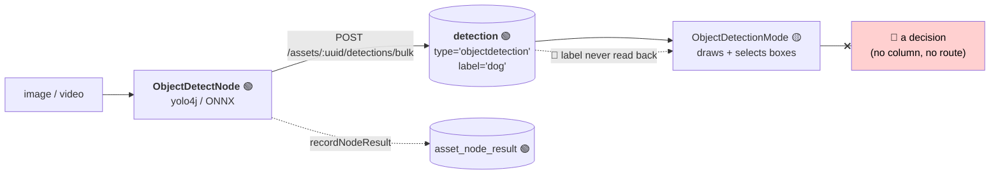

# Workflow: Object Detection Review — Confirm or Reject a Box

> **Status**: 🔴 **Blocked at the schema.** Detection runs and persists correctly; the review screen
> renders boxes over the asset; and there is **nowhere to put the answer** — `detection` has no review
> status column, no confirm endpoint and no permission for one.
> **Scope**: a human confirms, rejects or corrects the object detections a node proposed.
> **Audience**: AI coding agents working on `loom/db/flyway`, `loom/services/rest` and
> `loom-ui/src/features/workflow/`.

Family index and shared anatomy: [WORKFLOWS.md](WORKFLOWS.md). Status legend: 🟢 built · 🟡 partly
built · 🔵 plan · 🔴 defect · ⚪ stub.

**Out of scope, and where it lives instead:**

| Not here | There |
|---|---|
| Face detections and the identity loop | [WORKFLOW_FACE.md](WORKFLOW_FACE.md) — same table, different downstream |
| The YOLO node itself: models, options, GPU, video scanning | `cortex/nodes/objectdetect/`, [../features/nodes/NODES.md](../features/nodes/NODES.md) |
| Per-pixel masks rather than boxes | [../features/nodes/sam2/NODE_SAM2.md](../features/nodes/sam2/NODE_SAM2.md) |
| Spatial relations between detections | [../concept/NODE_SCENE_LAYOUT_PLAN.md](../concept/NODE_SCENE_LAYOUT_PLAN.md) |
| UI gap tasks for detections as an entity | [../loom/ui/TASK_UI_AI_ML.md](../loom/ui/TASK_UI_AI_ML.md) |

---

## 0. Executive Summary

| Question | Short answer |
|---|---|
| **Does object detection run?** | 🟢 **Yes.** `ObjectDetectNode` runs YOLO via `yolo4j`, writes `detection` rows with a real `label`, records a ledger row and a `producerVersion` that names the model file. |
| **Is `objectdetect` faces-only?** | **No** — that claim in [../METALOOM_CONTEXT.md](../METALOOM_CONTEXT.md) §7 is stale. `YoloObjectDetector` loads an arbitrary model + labels file and reports `YoloLib.labels().size()` classes at init. |
| **Can a human confirm a box?** | 🔴 **No.** `detection` has no `status`. The UI's confirm/reject writes to a React `useState` and evaporates on navigation. |
| **Does the review screen even show the right labels?** | 🔴 **No.** The UI's `DetectionResponse` interface has no `label` field, so every box is captioned with the literal string `objectdetection`. |
| **How much is new invention?** | Almost none. `dedup_group.status` is the pattern, `V2.47` is the audit-column precedent, and the screen already draws and selects boxes. One migration, one endpoint, three UI fixes. |

---

## 1. Current State



### 1.1 What runs

`ObjectDetectNode.persist(...)`:

```java
items.add(new DetectionCreateRequest()
    .setType("objectdetection")
    .setNodeKind(name())
    .setProducerVersion(producerVersion())   // "objectdetect/1:<model file name>"
    .setLabel(detection.labelOrId())         // the indexed column, promoted out of meta in V2.43
    .setDetectionIndex(index++)
    .setFrameNumber(detection.frameIndex())
    .setBboxX(...).setConfidence(detection.confidence()));
client().bulkCreateAssetDetections(asset.getUuid(), new DetectionBulkCreateRequest().setDetections(items)).sync();
```

`producerVersion` names the model file deliberately: the same pixels scanned with a VOC model and a
COCO model yield different labels, and a ledger row that did not say which would make the two
indistinguishable after the fact. That is also what makes an invalidation sweep possible
(`WHERE node_kind = ? AND producer_version <> ?`) once review state exists.

Upsert key `(asset_uuid, node_kind, frame_number, detection_index)`. ⚠️ Two documented limits, shared
with `facedetect`: the key omits `node_id`, so two instances of the kind in one graph overwrite each
other; and an upsert never deletes, so a re-run finding fewer objects leaves the previous run's
higher-indexed rows behind. **Both become visible bugs once a human has approved a row** — §2.4.

### 1.2 What the review screen does

`ObjectDetectionMode` (`WorkflowView.tsx:477-569`) and the `object-default` key profile
(`:171-185`: `Y` confirm, `N` reject, `Tab`/arrows to cycle detections).

🟢 It draws normalised bboxes as absolute-percentage overlays, colours them by decision state,
supports click-to-select, and lists them with per-item confirm/reject buttons.

🔴 `handleConfirmObject` / `handleRejectObject` (`:858-861`) call `setObjectDecisions`. Nothing else.

### 1.3 Two defects worth fixing regardless of the workflow

| # | Defect | Evidence |
|---|---|---|
| 🔴 **X2** | The UI's `DetectionResponse` interface omits `label`. `ObjectDetectionMode` reads `(d.meta)?.label` — always `undefined` — and falls back to `d.type`, so every box is captioned `objectdetection` | `loom-ui/src/api/detections.ts:4-20` vs `DetectionResponse.java:19`. `DetectionCreateRequest`/`UpdateRequest` in the UI are missing it too |
| 🔴 **X1** | `FacedetectNode` writes `setType("face")` while the UI (and the `V2.27` column comment) expect `facedetection`, so the face branch of the same screen is always empty | `FacedetectNode.java:510` vs `WorkflowView.tsx:780` |

X2 is a five-line fix and makes the existing screen genuinely useful before any schema work.

---

## 2. Target Design

### 2.1 Review state on `detection`

Follow `dedup_group` exactly — it is the tree's established review vocabulary.

```sql
CREATE TYPE "review_status" AS ENUM ('PENDING', 'CONFIRMED', 'REJECTED');

ALTER TABLE "detection" ADD COLUMN "status" review_status NOT NULL DEFAULT 'PENDING';
ALTER TABLE "detection" ADD COLUMN "reviewed_at" timestamp WITHOUT TIME ZONE;
ALTER TABLE "detection" ADD COLUMN "reviewer_uuid" uuid REFERENCES "user" ("uuid");
ALTER TABLE "detection" ADD COLUMN "corrected_label" varchar;

CREATE INDEX "idx_detection_review" ON "detection" ("asset_uuid", "type", "status");
```

| Column | Why |
|---|---|
| `status` | The decision. `PENDING` default so every existing row and every new machine row starts unreviewed |
| `reviewed_at` / `reviewer_uuid` | 🔴 **Not** `editor_uuid`. `editor_uuid` is nullable-for-workers audit (`V2.47`) and is touched by the node's own upsert; conflating them means a re-run silently claims a human reviewed it |
| `corrected_label` | The third answer. "That is a *cat*, not a dog" is more valuable than a reject, and re-labelling into `label` would destroy what the model actually said — which is the training signal |
| the index | The queue query: `WHERE asset_uuid = ? AND type = ? AND status = 'PENDING'` |

⚠️ Name the type `review_status`, not `detection_status` — [WORKFLOW_FACE.md](WORKFLOW_FACE.md) needs a
`cluster` status and [WORKFLOW_SAFETY_TRIAGE.md](WORKFLOW_SAFETY_TRIAGE.md) needs a verdict status
with the same three values. One shared type, decided once. `dedup_status` predates this and stays as
it is; do not churn a shipped enum.

🔴 **Check the highest migration before claiming a version.** `V2.77` is the highest at `21e8a8cd`.

Migration obligations ([../guidelines/CODING.md](../guidelines/CODING.md)):

```bash
mvn install -pl loom/db/flyway     # or setup-pool silently skips the new migration
loom/db/jooq/generate.sh           # DESTRUCTIVE: rm -rf's src/jooq/java first
./setup-pool.sh
```

Plus: DAO API change in `loom/db/api`, impls in **both** `loom/db/jooq` and `loom/db/memory`, contract
tests in `loom/db/api-test`, and a delete-cascade test.

### 2.2 REST

| Method | Path | Purpose | Permission |
|---|---|---|---|
| `GET` | `/api/v1/assets/:uuid/detections?type=objectdetection&status=PENDING` | The per-asset queue | `READ_DETECTION` |
| `GET` | `/api/v1/detections?status=PENDING&type=objectdetection` | 🔵 The **cross-asset** queue — what a reviewer actually wants | `READ_DETECTION` |
| `POST` | `/api/v1/assets/:uuid/detections/:detectionUuid/review` | `{status, correctedLabel?}` | `UPDATE_DETECTION` |
| `POST` | `/api/v1/assets/:uuid/detections/review-bulk` | `{reviews: [{uuid, status, correctedLabel?}]}` | `UPDATE_DETECTION` |

A **bulk** route is not a nicety here. At `Y`-per-box speed a reviewer generates decisions faster than
round trips complete; the UI should batch on navigation. The bulk create route
(`/detections/bulk`) is the shape to mirror, including its `{total, created, failed}` response.

⚠️ `POST` creates **and** updates everywhere in this API; `PATCH`/`PUT` exist only on User, Group and
Asset. A `/review` sub-resource keeps the decision distinct from `POST /detections/:uuid`, which
updates geometry.

### 2.3 UI

| # | Change | File |
|---|---|---|
| 1 | 🔴 Add `label` (and `correctedLabel`, `status`) to `DetectionResponse`, `DetectionCreateRequest`, `DetectionUpdateRequest`; read `d.label` in `ObjectDetectionMode` | `loom-ui/src/api/detections.ts`, `WorkflowView.tsx:794` |
| 2 | 🔴 `handleConfirmObject`/`handleRejectObject` POST the review, batched, with rollback | `WorkflowView.tsx:858-861` |
| 3 | Add a **relabel** action — a key binding opening an `Autocomplete` over the model's label set | `ObjectDetectionMode`, `object-default` profile |
| 4 | Queue from `status=PENDING` rather than "the first 20 assets" | `:749` |
| 5 | Confidence-ordered review: lowest-confidence first is where a human adds the most value | queue query |
| 6 | Grant `UPDATE_DETECTION` in the demo roles and add it to `PERMISSION_GROUPS` if absent | `AdminArea.tsx`, `DemoDatabaseInitializer` |

The model's label vocabulary for change 3 is available at the worker
(`YoloObjectDetector.labels()` → `YoloLib.labels()`) but is **not exposed over REST**. Simplest
honest option: derive the vocabulary from the distinct `label` values already present on the asset's
detections, and leave `freeSolo` on. A `GET /node-descriptors`-style label endpoint is a larger change
and should not gate this.

### 2.4 What a confirmed detection means for re-runs

🔴 The interaction between review state and the upsert key is the one genuinely subtle part.

Today a re-run **overwrites** rows keyed by `(asset, node_kind, frame_number, detection_index)`.
Once a human has confirmed row `#3`, an overwrite silently replaces a reviewed answer with an
unreviewed one — and `detection_index` is not stable across model versions, so `#3` may not even be
the same object.

Rule to implement: **a node upsert must not clear a non-`PENDING` status.** Two acceptable
implementations:

- **Preserve** — the upsert leaves `status`, `reviewed_at`, `reviewer_uuid` and `corrected_label`
  untouched when the incoming geometry is within an IoU threshold of the stored box; otherwise it
  resets to `PENDING`. More correct, needs an IoU helper.
- **Version** — when `producer_version` differs, write a new row and mark the old one superseded
  rather than overwriting. Keeps the review history; costs a schema column.

Pick one and state it in the migration comment. Do not leave it implicit — this is exactly the class
of bug `V2.43`'s upsert key was introduced to fix, reappearing one level up.

---

## 3. Progress Assessment

### Built
- [x] `ObjectDetectNode` + `YoloObjectDetector` (arbitrary model + labels), video scanning
- [x] `detection` rows with `label`, `producer_version` naming the model, upsert key, ledger row
- [x] `/assets/:uuid/detections` CRUD + `/detections/bulk`, four `*_DETECTION` permissions
- [x] `ObjectDetectionMode`: normalised bbox overlay, selection, per-item buttons, key profile

### Open
- [ ] 🔴 **X2** — `label` missing from the UI's detection DTOs; every box reads `objectdetection` (§1.3)
- [ ] 🔴 **X3** — no review status on `detection`; the decision has nowhere to go (§2.1)
- [ ] 🔵 `review_status` enum + four columns + index, with DAO/impl/contract/cascade tests (§2.1)
- [ ] 🔵 Review + bulk-review endpoints and a cross-asset queue route (§2.2)
- [ ] 🔵 UI: batched writes with rollback, relabel action, PENDING-first confidence-ordered queue (§2.3)
- [ ] 🔴 Decide and implement the re-run rule so an upsert cannot clear a human decision (§2.4)
- [ ] Mocked Playwright e2e for the object mode
- [ ] Demo data: an asset with a few PENDING detections
- [ ] Customer docs
- [ ] 🔴 Correct [../METALOOM_CONTEXT.md](../METALOOM_CONTEXT.md) §7: `objectdetect` is **not** faces-only

---

## 4. Test Setup

| Test | Covers | Command |
|---|---|---|
| `ObjectDetectNodeTest` 🟢 | Detection + persistence | `mvn -pl cortex/nodes/objectdetect/core -am test` |
| `DetectionDaoTest` 🟡 → extend | `status` round-trip, `listByStatus`, reviewer columns, delete-cascade | `mvn -pl loom/db/jooq test -Dtest=DetectionDaoTest` |
| `DetectionEndpointTest` 🟡 → extend | Review route 200 + 403 without `UPDATE_DETECTION`; bulk partial failure; invalid status 400; unknown uuid 404 | `mvn -pl loom/core test -Dtest=DetectionEndpointTest` |
| `DetectionUpsertReviewTest` 🔵 **new** | The §2.4 rule: a re-run does **not** clear a `CONFIRMED` status | — |
| `workflow-objects-mocked.spec.ts` 🔵 **new** | Mock detections with real labels; assert the caption is `dog`, not `objectdetection`; press `Y` and assert the POST body; assert a failed POST reverts | `./node_modules/.bin/playwright test` |

🔴 `./setup-pool.sh` before DAO/endpoint tests and after the Flyway change. Grant test permissions via
group+role. ⚠️ `npx` stalls — use `./node_modules/.bin/`. ⚠️ Playwright `role`+`name` is a substring
match; pass `exact: true`.

---

## 5. Configuration

No new environment variable. The node's options (pipeline JSON / worker YAML):

| Option | Meaning |
|---|---|
| `modelPath` / `labelsPath` | The ONNX model and its label file. Both are part of `producerVersion` |
| `useGpu` | ⚠️ `YoloLib` holds **one** native detector per JVM — a second `objectdetect` instance with different options in the same worker is refused, not silently reconfigured |
| `onnxRuntimeLibPath` | Native runtime override. `System.load` registers a SONAME, so `LD_LIBRARY_PATH` is not needed |

| Variable | Effect |
|---|---|
| `CORTEX_NODE_WHITELIST` / `_BLACKLIST` | Must permit `objectdetect`, or a run using it is rejected with 503 naming the kind |

---

## 6. Key Classes Reference

| Class / file | Package or path | Purpose |
|---|---|---|
| `ObjectDetectNode` | `io.metaloom.cortex.node.objectdetect` | `persist` at `:556`, `producerVersion` at `:595` |
| `YoloObjectDetector` | same | `yolo4j` binding; `labels()`; one detector per JVM |
| `VideoObjectScanner` | `...objectdetect.video` | Frame sampling for video |
| `DetectionResponse` (Java) | `io.metaloom.loom.rest.model.detection` | Has `label`; its javadoc already warns it could be "written and then never read back" — which is exactly what happened on the UI side |
| `detections.ts` | `loom-ui/src/api/detections.ts` | 🔴 The DTO missing `label` |
| `ObjectDetectionMode` | `loom-ui/src/features/workflow/WorkflowView.tsx:477` | The review screen |
| `DedupGroupEndpointService` | `io.metaloom.loom.rest.service.impl` | The review-endpoint pattern to copy |
| `AbstractMediaNode` | `io.metaloom.cortex.common.node` | `recordNodeResult` / `resultRef` |

---

## 7. Conventions and Gotchas

| Area | Gotcha |
|---|---|
| **`label` is a column, not meta** | 🔴 Promoted out of `meta` by `V2.43` so it can be indexed. Reading `meta.label` returns undefined |
| **`type` strings differ per node** | 🔴 `objectdetect` writes `objectdetection`; `facedetect` writes `face` while everything else expects `facedetection` (defect X1) |
| **A worker is not a user** | ⚠️ `detection.creator_uuid` is nullable since `V2.47`. A reviewer needs a **separate** `reviewer_uuid`; do not overload `editor_uuid` |
| **Upserts must not clear a review** | 🔴 §2.4. The `(asset, node_kind, frame_number, detection_index)` key omits `node_id` and never deletes |
| **`producer_version` names the model** | 🟢 Deliberate — it is what makes an invalidation sweep possible after a model change |
| **One YOLO per JVM** | ⚠️ `YoloLib.init` populates a single native detector; a second instance with different options is refused |
| **Bulk over chatty** | ⚠️ Keyboard review outruns per-item round trips. Batch on navigation, and roll back the chips a failed batch did not persist |
| **`objectdetect` is not faces-only** | ⚠️ A stale claim in [../METALOOM_CONTEXT.md](../METALOOM_CONTEXT.md) §7 — it also constrains [../concept/NODE_SCENE_LAYOUT_PLAN.md](../concept/NODE_SCENE_LAYOUT_PLAN.md), which should be re-read with this corrected |

---

## 8. Where do I find …?

| Need | Look here |
|---|---|
| The node | `cortex/nodes/objectdetect/core/src/main/java/io/metaloom/cortex/node/objectdetect/` |
| The review screen | `loom-ui/src/features/workflow/WorkflowView.tsx:477` |
| The DTO to fix | `loom-ui/src/api/detections.ts` |
| Detection schema and its rationale | `loom/db/flyway/.../V2.43__rework_detection_embedding.sql` |
| Machine-written audit columns | `loom/db/flyway/.../V2.47__machine_written_audit_columns.sql` |
| The review-record pattern | `loom/db/flyway/.../V2.61__add_dedup_group.sql` |
| Detection endpoints | `loom/services/rest/.../endpoint/impl/AssetEndpoint.java:348-394` |
| The same table's other consumer | [WORKFLOW_FACE.md](WORKFLOW_FACE.md) |
| Shared workflow defects | [WORKFLOWS.md](WORKFLOWS.md) §4 |
| Open tasks | [../tasks/WORKFLOW_TASKS.md](../tasks/WORKFLOW_TASKS.md) W5, W6 |

---

_Git HEAD revision: `21e8a8cd`_
_Last updated: 2026-08-07 (new file — verified against ObjectDetectNode.java, detections.ts, V2.43)_
