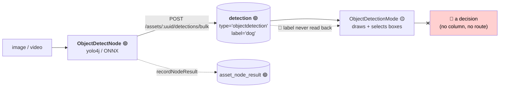

# Workflow: Object Detection Review — Confirm or Reject a Box

> **Status**: 🟢 **Built.** `V2.81` gives `detection` a review status, reviewer and corrected label;
> `/confirm`, `/reject` and `/review-bulk` record the verdict; the review screen persists it and a
> node re-run cannot clear it. Remaining gaps are UI affordances (§2.3 items 7-8), not schema.
> **Scope**: a human confirms, rejects or corrects the object detections a node proposed.
> **Audience**: AI coding agents working on `loom/db/flyway`, `loom/services/rest` and
> `loom-ui/src/features/workflow/`.

Family index and shared anatomy: [WORKFLOWS.md](WORKFLOWS.md). Status legend: 🟢 built · 🟡 partly
built · 🔵 plan · 🔴 defect · ⚪ stub.

**Out of scope, and where it lives instead:**

| Not here | There |
|---|---|
| Face detections and the identity loop | [WORKFLOW_FACE.md](WORKFLOW_FACE.md) — same table, different downstream |
| The YOLO node itself: models, options, GPU, video scanning | `cortex/nodes/objectdetect/`, [../features/nodes/NODES.md](../features/nodes/NODES.md) |
| Per-pixel masks rather than boxes | [../features/nodes/sam2/NODE_SAM2.md](../features/nodes/sam2/NODE_SAM2.md) |
| Spatial relations between detections | [../concept/NODE_SCENE_LAYOUT_PLAN.md](../concept/NODE_SCENE_LAYOUT_PLAN.md) |
| UI gap tasks for detections as an entity | [../loom/ui/TASK_UI_AI_ML.md](../loom/ui/TASK_UI_AI_ML.md) |

---

## 0. Executive Summary

| Question | Short answer |
|---|---|
| **Does object detection run?** | 🟢 **Yes.** `ObjectDetectNode` runs YOLO via `yolo4j`, writes `detection` rows with a real `label`, records a ledger row and a `producerVersion` that names the model file. |
| **Is `objectdetect` faces-only?** | **No** — that claim in [../METALOOM_CONTEXT.md](../METALOOM_CONTEXT.md) §7 is stale. `YoloObjectDetector` loads an arbitrary model + labels file and reports `YoloLib.labels().size()` classes at init. |
| **Can a human confirm a box?** | 🔴 **No.** `detection` has no `status`. The UI's confirm/reject writes to a React `useState` and evaporates on navigation. |
| **Does the review screen even show the right labels?** | 🔴 **No.** The UI's `DetectionResponse` interface has no `label` field, so every box is captioned with the literal string `objectdetection`. |
| **How much is new invention?** | Almost none. `dedup_group.status` is the pattern, `V2.47` is the audit-column precedent, and the screen already draws and selects boxes. One migration, one endpoint, three UI fixes. |

---

## 1. Current State



### 1.1 What runs

`ObjectDetectNode.persist(...)`:

```java
items.add(new DetectionCreateRequest()
    .setType("objectdetection")
    .setNodeKind(name())
    .setProducerVersion(producerVersion())   // "objectdetect/1:<model file name>"
    .setLabel(detection.labelOrId())         // the indexed column, promoted out of meta in V2.43
    .setDetectionIndex(index++)
    .setFrameNumber(detection.frameIndex())
    .setBboxX(...).setConfidence(detection.confidence()));
client().bulkCreateAssetDetections(asset.getUuid(), new DetectionBulkCreateRequest().setDetections(items)).sync();
```

`producerVersion` names the model file deliberately: the same pixels scanned with a VOC model and a
COCO model yield different labels, and a ledger row that did not say which would make the two
indistinguishable after the fact. That is also what makes an invalidation sweep possible
(`WHERE node_kind = ? AND producer_version <> ?`) once review state exists.

Upsert key `(asset_uuid, node_kind, frame_number, detection_index)`. ⚠️ Two documented limits, shared
with `facedetect`: the key omits `node_id`, so two instances of the kind in one graph overwrite each
other; and an upsert never deletes, so a re-run finding fewer objects leaves the previous run's
higher-indexed rows behind. **Both become visible bugs once a human has approved a row** — §2.4.

### 1.2 What the review screen does

`ObjectDetectionMode` (`WorkflowView.tsx:477-569`) and the `object-default` key profile
(`:171-185`: `Y` confirm, `N` reject, `Tab`/arrows to cycle detections).

🟢 It draws normalised bboxes as absolute-percentage overlays, colours them by decision state,
supports click-to-select, and lists them with per-item confirm/reject buttons.

🟢 `handleConfirmObject` / `handleRejectObject` now write through `review-bulk` with a 400 ms debounce,
optimistic state and rollback on failure. They wrote only `setObjectDecisions` before `V2.81`, so a
decision was lost on reload.

### 1.3 Two defects worth fixing regardless of the workflow

| # | Defect | Evidence |
|---|---|---|
| 🟢 **X2** | *Fixed.* The UI's `DetectionResponse` omitted `label`, so `ObjectDetectionMode` read `(d.meta)?.label` — always `undefined` — and captioned every box `objectdetection`. It now reads `d.correctedLabel ?? d.label`, pinned by `workflow-object-review-mocked.spec.ts` | `loom-ui/src/api/detections.ts` |
| 🔴 **X1** | `FacedetectNode` writes `setType("face")` while the UI (and the `V2.27` column comment) expect `facedetection`, so the face branch of the same screen is always empty | `FacedetectNode.java:510` vs `WorkflowView.tsx:780` |

X1 remains open: `FacedetectNode` writes `type="face"` while the `V2.27` column comment says
`facedetection`. The workflow view now agrees with the node, so the face branch is no longer empty,
but the two names still disagree with each other.

---

## 2. Design As Built

Implemented in `V2.81__detection_review_state.sql`. This section records what shipped; where it
diverges from the proposal that preceded it, the reason is given inline.

### 2.1 Review state on `detection`

```sql
ALTER TYPE "cluster_status" RENAME TO "review_status";

ALTER TABLE "detection" ADD COLUMN "status" "review_status" NOT NULL DEFAULT 'PENDING';
ALTER TABLE "detection" ADD COLUMN "reviewed_at" timestamp WITHOUT TIME ZONE;
ALTER TABLE "detection" ADD COLUMN "reviewer_uuid" uuid REFERENCES "user" ("uuid");
ALTER TABLE "detection" ADD COLUMN "corrected_label" varchar;

CREATE INDEX "idx_detection_review" ON "detection" ("asset_uuid", "type", "status");
CREATE INDEX "idx_detection_status_type" ON "detection" ("status", "type");
```

| Column | Why |
|---|---|
| `status` | The decision. `PENDING` default, so every existing row and every new machine row starts unreviewed. No back-fill was needed: every row that existed was machine-written and unreviewed |
| `reviewed_at` / `reviewer_uuid` | 🔴 **Not** `editor_uuid`. `editor_uuid` is nullable-for-workers audit (`V2.47`) and is touched by the node's own upsert; conflating them means a re-run silently claims a human reviewed it |
| `corrected_label` | The third answer. "That is a *cat*, not a dog" is more valuable than a reject, and re-labelling into `label` would destroy what the model actually said — which is the training signal |
| `idx_detection_review` | The per-asset queue: `WHERE asset_uuid = ? AND type = ? AND status = 'PENDING'` |
| `idx_detection_status_type` | ⚠️ The **cross-asset** queue has no `asset_uuid` predicate and therefore cannot use an index led by it. Two queues, two indexes — the pair `V2.79` created for `cluster` |

⚠️ The type is a **rename of `cluster_status`**, not a fresh `CREATE TYPE`. `V2.79` had already
shipped that enum with exactly these three values; `ALTER TYPE ... RENAME` is a catalog-only
operation (same labels, same OIDs, no table rewrite), so one shared type costs nothing and a second
identical one would have bought only a duplicate jOOQ enum. `JooqClusterStatus` regenerates as
`JooqReviewStatus`; `ClusterDaoImpl` is the only code that referenced it.
[WORKFLOW_SAFETY_TRIAGE.md](WORKFLOW_SAFETY_TRIAGE.md) can now reuse it as-is. `dedup_status`
predates all of this and stays as it is.

Migration obligations ([../guidelines/CODING.md](../guidelines/CODING.md)):

```bash
mvn install -pl loom/db/flyway     # or setup-pool silently skips the new migration
loom/db/jooq/generate.sh
./setup-pool.sh
```

🔴 **Check the highest migration before claiming a version, and sort numerically** — a lexical sort
returns `V2.9`. `V2.81` was the next free one at the time of writing.

⚠️ Two obligations the earlier draft listed do not exist in this tree: there is no memory
implementation of `DetectionDao` (`loom/db/memory` holds only `User` and `Token`), and
`loom/db/api-test` holds no per-entity classes — the contract test *is* `CRUDDaoTestcases`,
implemented by the jOOQ DAO test. `generate.sh` is also no longer destructive: it generates into a
scratch directory and only swaps it in on success.

DAO surface (`loom/db/api`, implemented in `loom/db/jooq`):

| Method | Purpose |
|---|---|
| `loadPage(status, type, fromId, pageSize)` | The cross-asset queue, keyset-paged. Mirrors `ClusterDao.loadPage` |
| `listByStatus(assetUuid, type, status)` | The per-asset queue |
| `updateReview(detectionUuid, status, correctedLabel, reviewerUuid)` | Records a verdict. Stamps `reviewed_at`/`reviewer_uuid` and deliberately leaves `edited`/`editor_uuid` alone |

The verdict is a `String` in the domain layer with a `JooqReviewStatus` bridge in the DAO impl —
`loom-db-api` cannot depend on generated code. Constants live in
`io.metaloom.loom.db.model.review.ReviewStatus`, which `Cluster.STATUS_*` now points at.

### 2.2 REST

| Method | Path | Purpose | Permission |
|---|---|---|---|
| `GET` | `/api/v1/assets/:uuid/detections?type=objectdetection&status=PENDING` | The per-asset queue | `READ_DETECTION` |
| `GET` | `/api/v1/detections?status=PENDING&type=objectdetection` | The **cross-asset** queue — what a reviewer actually wants | `READ_DETECTION` |
| `POST` | `/api/v1/assets/:uuid/detections/:detectionUuid/confirm` | `{correctedLabel?}`, body optional | `UPDATE_DETECTION` |
| `POST` | `/api/v1/assets/:uuid/detections/:detectionUuid/reject` | — | `UPDATE_DETECTION` |
| `POST` | `/api/v1/assets/:uuid/detections/review-bulk` | `{reviews: [{uuid, status, correctedLabel?}]}` → `{total, created, failed}` | `UPDATE_DETECTION` |

⚠️ Two RPC sub-resources rather than the single `/review {status, …}` the proposal sketched, so the
shape matches the shipped `ClusterEndpoint` (`/clusters/:uuid/confirm`, `/reject`). The bulk route
still carries an explicit `status` per item: a batch is a mixed set of decisions, and splitting it
into two requests would break the atomicity a reviewer expects from one pass over an asset.

⚠️ `review-bulk` is a **literal** segment sharing its shape with `/detections/:detectionUuid`, so it
must be registered *before* it in `AssetEndpoint` — Vert.x matches in registration order and would
otherwise bind `detectionUuid` to the string `"review-bulk"`. Same reason `/detections/bulk` sits
where it does.

🔴 The response field is **`reviewStatus`, not `status`**. `AbstractCreatorEditorRestResponse`
already publishes a `status` object carrying the creator/editor audit block. `ClusterResponse` made
the same choice for the same reason.

A **bulk** route is not a nicety here. At `Y`-per-box speed a reviewer generates decisions faster
than round trips complete, so the UI debounces and batches. A bad item is counted in `failed` and
skipped rather than failing the batch: losing twenty good decisions because the twenty-first named a
stale uuid is worse than reporting the one that did not apply.

The cross-asset queue needed a new top-level `DetectionEndpoint` (registered in `EndpointModule`
**and** `LoomOpenAPI.endpoints()`), mirroring the `ClusterEndpoint` / `/assets/:uuid/clusters` split.
It uses `addListRoute`, so paging is documented in OpenAPI.

### 2.3 UI

| # | Change | Status |
|---|---|---|
| 1 | `label`, `correctedLabel`, `reviewStatus`, `reviewedAt` on `DetectionResponse`; read `d.correctedLabel ?? d.label` in `ObjectDetectionMode` | done |
| 2 | `handleConfirmObject`/`handleRejectObject` POST the review, batched (400 ms) through `review-bulk`, with rollback and a toast | done |
| 3 | Decisions seeded from the server's `reviewStatus` on load, so a reload shows what was recorded | done |
| 4 | `handleConfirmCluster`/`handleDenyCluster` wired to the existing `/clusters/:uuid/confirm` and `/reject` | done |
| 5 | Face clusters sourced from `listAssetClusters` + `listClusterMembers` instead of the `FACE_CLUSTERS` mock, which is an empty array — the face review pane could never render anything | done |
| 6 | `Detection` added to `PERMISSION_GROUPS` in `AdminArea.tsx`; demo data seeds one CONFIRMED-with-correction and one REJECTED box | done |
| 7 | A **relabel** action — a key binding opening an `Autocomplete` over the model's label set | 🔵 not done |
| 8 | Queue from `status=PENDING` across assets rather than "the first 20 assets"; confidence-ordered | 🔵 not done |

For 7, the model's label vocabulary is available at the worker (`YoloObjectDetector.labels()` →
`YoloLib.labels()`) but is **not exposed over REST**. Simplest honest option: derive the vocabulary
from the distinct `label` values already present on the asset's detections, and leave `freeSolo` on.
The REST surface already accepts a correction (`correctedLabel` on both review routes), so 7 is a UI
affordance rather than a backend change.

### 2.4 What a confirmed detection means for re-runs

🔴 The interaction between review state and the upsert key is the one genuinely subtle part.

A re-run **overwrites** rows keyed by `(asset, node_kind, frame_number, detection_index)`. Once a
human has confirmed row `#3`, an unguarded overwrite silently replaces a reviewed answer with an
unreviewed one — and `detection_index` is not stable across model versions, so `#3` may not even be
the same object.

**The rule, as implemented and stated in the migration comment:**

> A node upsert must not clear a non-`PENDING` status. `status`, `reviewed_at`, `reviewer_uuid` and
> `corrected_label` are preserved on conflict — **unless the incoming `producer_version` differs
> from the stored one, in which case all four reset to `PENDING`.**

This is the proposal's *version* option without its extra schema column: a stale review is retired
rather than kept against a superseded row. Within one `producer_version` the ordinal is stable and
the verdict stands; across a model change the ordinal is not an identity, so carrying the verdict
forward would attribute a human decision to a box they never saw. It needs no IoU helper, and living
in the upsert itself means no caller can forget it.

Implemented in `DetectionDaoImpl.reviewOverrides()` via a third `AbstractJooqDao.upsert` overload
taking per-column override expressions — a plain `preserved` entry can only hold a value, not
conditionally retire it. `ClusterDaoImpl` is unaffected and still uses the two-argument form.

Pinned by `DetectionUpsertReviewTest`: the verdict survives a same-version re-run, a `REJECTED` false
positive does not return to the queue, and a `producer_version` change resets all four columns.

---

## 3. Progress Assessment

### Built
- [x] `ObjectDetectNode` + `YoloObjectDetector` (arbitrary model + labels), video scanning
- [x] `detection` rows with `label`, `producer_version` naming the model, upsert key, ledger row
- [x] `/assets/:uuid/detections` CRUD + `/detections/bulk`, four `*_DETECTION` permissions
- [x] `ObjectDetectionMode`: normalised bbox overlay, selection, per-item buttons, key profile

- [x] `review_status` enum + four columns + two indexes (`V2.81`), with `DetectionDaoTest` (CRUD
      contract, status round-trip, `listByStatus`, `loadPage`, cascade) and `DetectionUpsertReviewTest` (§2.1)
- [x] `/confirm`, `/reject`, `/review-bulk` and the cross-asset `GET /detections` queue (§2.2)
- [x] The re-run rule: preserve the verdict, retire it on a `producer_version` change (§2.4)
- [x] UI: batched writes with rollback, decisions seeded from the server, `label` read from the column
- [x] Cluster confirm/reject wired, and clusters sourced from the API instead of an empty mock
- [x] `UPDATE_DETECTION` permission test (`AbstractCRUDEndpointTest` has no generic update-403 case)
- [x] Mocked Playwright e2e for the object mode (`workflow-object-review-mocked.spec.ts`)
- [x] Demo data: reviewed and pending boxes on the demo image assets
- [x] Customer docs (`website/content/english/docs/ui/index.adoc`)

### Open
- [ ] 🔵 Relabel action in the UI — the REST surface already accepts `correctedLabel` (§2.3 item 7)
- [ ] 🔵 Cross-asset PENDING-first, confidence-ordered queue in the UI (§2.3 item 8)
- [ ] 🔴 **X1** — `facedetect` writes `type="face"`, the `V2.27` column comment says `facedetection` (§1.3)
- [ ] 🔴 Correct [../METALOOM_CONTEXT.md](../METALOOM_CONTEXT.md) §7: `objectdetect` is **not** faces-only

---

## 4. Test Setup

| Test | Covers | Command |
|---|---|---|
| `ObjectDetectNodeTest` 🟢 | Detection + persistence | `mvn -pl cortex/nodes/objectdetect/core -am test` |
| `DetectionDaoTest` 🟡 → extend | `status` round-trip, `listByStatus`, reviewer columns, delete-cascade | `mvn -pl loom/db/jooq test -Dtest=DetectionDaoTest` |
| `DetectionEndpointTest` 🟡 → extend | Review route 200 + 403 without `UPDATE_DETECTION`; bulk partial failure; invalid status 400; unknown uuid 404 | `mvn -pl loom/core test -Dtest=DetectionEndpointTest` |
| `DetectionUpsertReviewTest` 🔵 **new** | The §2.4 rule: a re-run does **not** clear a `CONFIRMED` status | — |
| `workflow-objects-mocked.spec.ts` 🔵 **new** | Mock detections with real labels; assert the caption is `dog`, not `objectdetection`; press `Y` and assert the POST body; assert a failed POST reverts | `./node_modules/.bin/playwright test` |

🔴 `./setup-pool.sh` before DAO/endpoint tests and after the Flyway change. Grant test permissions via
group+role. ⚠️ `npx` stalls — use `./node_modules/.bin/`. ⚠️ Playwright `role`+`name` is a substring
match; pass `exact: true`.

---

## 5. Configuration

No new environment variable. The node's options (pipeline JSON / worker YAML):

| Option | Meaning |
|---|---|
| `modelPath` / `labelsPath` | The ONNX model and its label file. Both are part of `producerVersion` |
| `useGpu` | ⚠️ `YoloLib` holds **one** native detector per JVM — a second `objectdetect` instance with different options in the same worker is refused, not silently reconfigured |
| `onnxRuntimeLibPath` | Native runtime override. `System.load` registers a SONAME, so `LD_LIBRARY_PATH` is not needed |

| Variable | Effect |
|---|---|
| `CORTEX_NODE_WHITELIST` / `_BLACKLIST` | Must permit `objectdetect`, or a run using it is rejected with 503 naming the kind |

---

## 6. Key Classes Reference

| Class / file | Package or path | Purpose |
|---|---|---|
| `ObjectDetectNode` | `io.metaloom.cortex.node.objectdetect` | `persist` at `:556`, `producerVersion` at `:595` |
| `YoloObjectDetector` | same | `yolo4j` binding; `labels()`; one detector per JVM |
| `VideoObjectScanner` | `...objectdetect.video` | Frame sampling for video |
| `DetectionResponse` (Java) | `io.metaloom.loom.rest.model.detection` | Has `label`; its javadoc already warns it could be "written and then never read back" — which is exactly what happened on the UI side |
| `detections.ts` | `loom-ui/src/api/detections.ts` | 🔴 The DTO missing `label` |
| `ObjectDetectionMode` | `loom-ui/src/features/workflow/WorkflowView.tsx:477` | The review screen |
| `DedupGroupEndpointService` | `io.metaloom.loom.rest.service.impl` | The review-endpoint pattern to copy |
| `AbstractMediaNode` | `io.metaloom.cortex.common.node` | `recordNodeResult` / `resultRef` |

---

## 7. Conventions and Gotchas

| Area | Gotcha |
|---|---|
| **`label` is a column, not meta** | ⚠️ Promoted out of `meta` by `V2.43` so it can be indexed. Reading `meta.label` returns undefined |
| **The DTO field is `reviewStatus`** | 🔴 `AbstractCreatorEditorRestResponse` already publishes a `status` object (the creator/editor audit block). Same choice `ClusterResponse` made |
| **`review-bulk` must precede `:detectionUuid`** | 🔴 Same segment count, and Vert.x matches in registration order — otherwise `detectionUuid` binds to the literal `"review-bulk"` |
| **`type` strings differ per node** | 🔴 `objectdetect` writes `objectdetection`; `facedetect` writes `face` while everything else expects `facedetection` (defect X1) |
| **A worker is not a user** | ⚠️ `detection.creator_uuid` is nullable since `V2.47`. A reviewer needs a **separate** `reviewer_uuid`; do not overload `editor_uuid` |
| **Upserts must not clear a review** | 🟢 §2.4, implemented. The `(asset, node_kind, frame_number, detection_index)` key omits `node_id` and never deletes |
| **`producer_version` names the model** | 🟢 Deliberate — it is what makes an invalidation sweep possible after a model change |
| **One YOLO per JVM** | ⚠️ `YoloLib.init` populates a single native detector; a second instance with different options is refused |
| **Bulk over chatty** | ⚠️ Keyboard review outruns per-item round trips. Batch on navigation, and roll back the chips a failed batch did not persist |
| **`objectdetect` is not faces-only** | ⚠️ A stale claim in [../METALOOM_CONTEXT.md](../METALOOM_CONTEXT.md) §7 — it also constrains [../concept/NODE_SCENE_LAYOUT_PLAN.md](../concept/NODE_SCENE_LAYOUT_PLAN.md), which should be re-read with this corrected |

---

## 8. Where do I find …?

| Need | Look here |
|---|---|
| The node | `cortex/nodes/objectdetect/core/src/main/java/io/metaloom/cortex/node/objectdetect/` |
| The review screen | `ObjectDetectionMode` in `loom-ui/src/features/workflow/WorkflowView.tsx` |
| The UI DTOs and review calls | `loom-ui/src/api/detections.ts` |
| The review columns and the re-run rule | `loom/db/flyway/.../V2.81__detection_review_state.sql` |
| The re-run rule in code | `DetectionDaoImpl.reviewOverrides()`, pinned by `DetectionUpsertReviewTest` |
| Detection schema and its rationale | `loom/db/flyway/.../V2.43__rework_detection_embedding.sql` |
| Machine-written audit columns | `loom/db/flyway/.../V2.47__machine_written_audit_columns.sql` |
| The review-record pattern | `loom/db/flyway/.../V2.61__add_dedup_group.sql` |
| Detection endpoints | `AssetEndpoint` (asset sub-resource) and `DetectionEndpoint` (cross-asset queue) |
| The same table's other consumer | [WORKFLOW_FACE.md](WORKFLOW_FACE.md) |
| Shared workflow defects | [WORKFLOWS.md](WORKFLOWS.md) §4 |
| Open tasks | [../tasks/WORKFLOW_TASKS.md](../tasks/WORKFLOW_TASKS.md) W5, W6 |

---

_Git HEAD revision: `21e8a8cd`_
_Last updated: 2026-08-07 (new file — verified against ObjectDetectNode.java, detections.ts, V2.43)_
