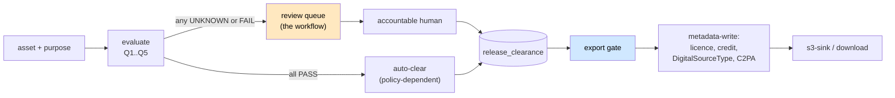

# Workflow: Rights and Release — The Gate Before an Asset Leaves

> **Status**: 🔵 **Proposal. The most speculative file in this family, and the one with the highest
> product value.** Every input exists in some form; none of them is connected, and there is no concept
> of "cleared for use" anywhere in the tree.
> **Complexity**: **very complex.** It composes five other workflows, needs the metadata write-back
> concept that is not built, and encodes policy rather than mechanism.
> **Scope**: the decision that an asset may be published, licensed, exported or handed to a client —
> and the export that carries the evidence with it.
> **Audience**: AI coding agents and product owners. Read §1 before building anything; the design
> questions there outrank the implementation.

Family index and shared anatomy: [WORKFLOWS.md](WORKFLOWS.md). Status legend: 🟢 built · 🟡 partly
built · 🔵 plan · 🔴 defect · ⚪ stub.

**Out of scope, and where it lives instead:**

| Not here | There |
|---|---|
| Identifying the people in an asset | [WORKFLOW_FACE.md](WORKFLOW_FACE.md) |
| Deciding whether content is safe | [WORKFLOW_SAFETY_TRIAGE.md](WORKFLOW_SAFETY_TRIAGE.md) |
| Fixing wrong rights metadata | [WORKFLOW_METADATA_REPAIR.md](WORKFLOW_METADATA_REPAIR.md) |
| The mechanics of writing metadata into a file | [../concept/ASSET_METADATA_WRITE.md](../concept/ASSET_METADATA_WRITE.md) |
| Pricing, contracts, customers | ➜ sibling repo `metaloom-saas` |
| Where an exported file physically goes | [NODE_S3SINK.md](../features/nodes/s3-sink/NODE_S3SINK.md) |

⚠️ **This file specifies a capability, not legal advice.** "Cleared" means "an accountable person
recorded a decision against stated evidence". Whether that decision is legally sufficient is the
operator's judgment, in their jurisdiction. Do not let the implementation imply otherwise.

---

## 1. The five questions a release gate answers

An asset is releasable when all five have an answer and an owner. MetaLoom can already *produce
evidence* for each; it cannot record a decision about any.

| # | Question | Evidence MetaLoom can produce | State |
|---|---|---|---|
| Q1 | **Who owns it?** | `metadata` node: EXIF/IPTC/XMP creator, copyright, `asset_location.license` | 🟡 extracted, never validated |
| Q2 | **Who is in it, and did they agree?** | `facedetect` → `embedding` → cluster → `person` | 🔴 clustering does not exist; consent has no home at all |
| Q3 | **Is it safe / appropriate?** | `guard` verdict | 🟡 produced, no decision ([WORKFLOW_SAFETY_TRIAGE.md](WORKFLOW_SAFETY_TRIAGE.md)) |
| Q4 | **Was any of it machine-generated?** | `imagegen`, `videogen`, `captioning`, `llm`, `translate` all write ledger rows naming their model | 🟡 the ledger knows; nothing reads it as provenance |
| Q5 | **What may the recipient do with it?** | Licence terms | 🔴 no model at all |

🔴 **Q2 and Q5 are unrepresentable today.** `person` has no consent field, and there is no licence
entity — only a free-text `asset_location.license` column marked `/* unclear */` in `V2.10`. Those two
gaps are the actual work; the rest is composition.

---

## 2. Design

### 2.1 A release record, not a boolean

A single `released` flag is wrong: clearance is always *for a purpose*. The same photograph may be
cleared for internal use and not for advertising.

```sql
CREATE TABLE "release_clearance" (
    "uuid"           uuid NOT NULL DEFAULT uuid_generate_v4(),
    "asset_uuid"     uuid NOT NULL REFERENCES "asset" ("uuid") ON DELETE CASCADE,
    "purpose"        varchar NOT NULL,        -- 'internal' | 'web' | 'print' | 'advertising' | ...
    "status"         review_status NOT NULL DEFAULT 'PENDING',
    "expires_at"     timestamp WITHOUT TIME ZONE,
    "evidence"       jsonb NOT NULL,          -- snapshot of the five answers AT DECISION TIME
    "note"           varchar,
    "decided_at"     timestamp WITHOUT TIME ZONE NOT NULL DEFAULT now(),
    "decider_uuid"   uuid NOT NULL REFERENCES "user" ("uuid"),
    CONSTRAINT "release_clearance_pkey" PRIMARY KEY ("uuid"),
    CONSTRAINT "release_clearance_key" UNIQUE ("asset_uuid", "purpose")
);
```

| Choice | Why |
|---|---|
| `purpose` in the key | Clearance is scoped. One row per (asset, purpose) |
| `evidence` as a **snapshot** | 🔴 The decision must remain readable after a re-run changes the underlying values. A clearance that silently re-derives itself is not a record of anything |
| `expires_at` | Model releases and licences expire. A clearance with no expiry is a claim about the future |
| `decider_uuid` `NOT NULL` | A machine cannot clear an asset. This is the one table in the tree where that is a feature |
| ⚠️ Cascade on asset delete | Consistent with `V2.74`. But consider whether a clearance record should outlive the asset for audit — a genuine open question, not an oversight |

### 2.2 Consent (Q2)

The face workflow ends at "this cluster is Anna Meyer". A release gate needs the next fact: *did Anna
agree, for what, and until when?*

```sql
CREATE TABLE "person_consent" (
    "uuid"          uuid NOT NULL DEFAULT uuid_generate_v4(),
    "person_uuid"   uuid NOT NULL REFERENCES "person" ("uuid") ON DELETE CASCADE,
    "scope"         varchar NOT NULL,     -- matches release_clearance.purpose
    "granted"       boolean NOT NULL,
    "valid_from"    date, "valid_until" date,
    "document_uuid" uuid REFERENCES "asset" ("uuid") ON DELETE SET NULL,  -- the signed release, itself an asset
    "note"          varchar,
    "created"       timestamp NOT NULL DEFAULT now(),
    "creator_uuid"  uuid NOT NULL REFERENCES "user" ("uuid"),
    CONSTRAINT "person_consent_pkey" PRIMARY KEY ("uuid")
);
```

🟢 `document_uuid` pointing at an asset is the elegant part: a signed model release is a PDF, the
`tika` node can extract its text, and it lives in the same system as the media it authorises.

🔴 **Depends on [WORKFLOW_FACE.md](WORKFLOW_FACE.md) reaching stage 4.** Without confirmed clusters
linked to persons, consent has nothing to attach to. Do not build consent first.

⚠️ **Absence of consent is not absence of a person.** An unrecognised face is an *unknown*, and the
gate must fail closed on unknowns — that is the entire point of the gate.

### 2.3 Licence (Q5)

`asset_location.license` is a free-text varchar the schema itself marks `/* unclear */`. Replace with
an SPDX-style identifier plus optional custom terms, on the **asset**, not the location — a licence
follows the content, not the path. This is a small change with a large blast radius (API responses,
search, export), so it wants its own migration and its own tests.

### 2.4 AI provenance (Q4)

🟢 The hard part is already done: `asset_node_result` records `node_kind` and `producer_version` for
every generated or model-derived value, so "was any of this machine-made?" is a query, not an
investigation.

What is missing is carrying that outward. On export, the file should be marked per
[../concept/ASSET_METADATA_WRITE.md](../concept/ASSET_METADATA_WRITE.md): IPTC `DigitalSourceType`
(`trainedAlgorithmicMedia` for a generated image, `compositeWithTrainedAlgorithmicMedia` for a
partially generated one), and C2PA where the toolchain allows.

⚠️ **A caption written by a VLM does not make the image algorithmic media.** Distinguish generated
*pixels* (`imagegen`, `videogen`) from generated *description*. Getting this wrong mislabels an entire
archive, and the mislabel is what a downstream platform acts on.

### 2.5 The gate as a pipeline



🔴 **Auto-clear is a policy decision, and the default must be off.** An automatic clearance is a
machine making a legal-adjacent claim on a human's behalf. If it is offered at all, it must be
per-purpose, opt-in, and recorded as `decider_uuid` = the operator who enabled the policy, never as a
null or a service account.

### 2.6 The export gate

The gate is worthless unless it is the **only** way out. Every byte-carrying route must consult it:

| Exit | Enforced? |
|---|---|
| `GET /assets/:uuid/binary/data` | 🔴 Would need the check |
| `s3-sink` node | 🔴 Would need the check |
| A collection download | 🔴 Would need the check |
| The agent quoting a transcript | ⚠️ Text is also an exit — decide explicitly whether it is in scope |

This is the same shape as the restricted-by-default problem in
[WORKFLOW_SAFETY_TRIAGE.md](WORKFLOW_SAFETY_TRIAGE.md) §3.3, and it should reuse whatever mechanism
that workflow picks. **Two half-enforced gates are worse than one enforced gate.**

---

## 3. Build order

Strictly sequential; each step is useless without its predecessor.

1. **Licence model** (§2.3) — small, independently valuable, no dependencies.
2. **AI provenance read path** (§2.4) — "is any of this machine-made?" as a query. Also small.
3. **`release_clearance`** with an evidence snapshot (§2.1), covering Q1, Q3, Q4 only.
4. **The export gate** (§2.6) — even with three of five questions, this is already a real product.
5. **Consent** (§2.2) — *after* [WORKFLOW_FACE.md](WORKFLOW_FACE.md) reaches stage 4.
6. **Metadata write-back on export** (§2.4) — after [../concept/ASSET_METADATA_WRITE.md](../concept/ASSET_METADATA_WRITE.md) is built.
7. **Auto-clear policies** (§2.5) — last, opt-in, off by default.

Steps 1-4 are worth building on their own. Steps 5-7 should not start until their dependencies exist.

---

## 4. Progress Assessment

- [x] Rights metadata extracted by the `metadata` node (Q1 evidence)
- [x] `guard` verdicts produced (Q3 evidence)
- [x] `asset_node_result` records model provenance for every generated value (Q4 evidence)
- [x] `person` entity, and the pictures a person owns (`PERSON_IMAGE` attachments, `V2.90`) (Q2 foundation)
- [ ] 🔵 Licence model replacing free-text `asset_location.license` (§2.3)
- [ ] 🔵 AI-provenance query: generated pixels vs generated description (§2.4)
- [ ] 🔵 `release_clearance` with a purpose key and an evidence snapshot (§2.1)
- [ ] 🔴 Export gate on **every** byte-carrying exit (§2.6)
- [ ] 🔵 `person_consent`, blocked on [WORKFLOW_FACE.md](WORKFLOW_FACE.md) stage 4 (§2.2)
- [ ] 🔵 Metadata write-back: licence, credit, `DigitalSourceType`, C2PA (§2.4)
- [ ] 🔵 Clearance review mode: the five answers side by side, one decision, an evidence trail
- [ ] 🔵 Expiry sweep: clearances and consents that lapse
- [ ] 🔵 Redaction on export (blur unconsented faces) — depends on `image-manipulation` + confirmed clusters
- [ ] 🔵 Auto-clear policies, off by default (§2.5)
- [ ] Customer docs, with the "capability, not legal advice" framing
- [ ] Open question: should a clearance record survive asset deletion for audit? (§2.1)

---

## 5. Test Setup

| Test | Covers |
|---|---|
| `ReleaseClearanceDaoTest` 🔵 | One row per (asset, purpose); evidence snapshot immutable after write; expiry; cascade |
| `ExportGateTest` 🔴 | **The critical suite.** Every byte-carrying route refuses an uncleared asset: binary download, `s3-sink`, collection download. A new exit added without a gate check must fail this |
| `ProvenanceClassificationTest` 🔵 | Generated pixels vs generated description; a VLM caption does **not** mark the image algorithmic |
| `ConsentEvaluationTest` 🔵 | Fails closed on an unknown face; expired consent is not consent; scope mismatch is not consent |
| `ClearanceExpiryTest` 🔵 | A lapsed clearance stops passing the gate without anyone touching the row |
| `workflow-release-mocked.spec.ts` 🔵 | The five answers render; a decision posts with the evidence snapshot; a missing answer blocks the decision |

🔴 `./setup-pool.sh` before DAO/endpoint tests and after every Flyway change; install `loom/db/flyway`
first. Grant test permissions via group+role. ⚠️ `npx` stalls — use `./node_modules/.bin/`.

---

## 6. Configuration

| Variable | Effect |
|---|---|
| `LOOM_AI_ENABLED` | Q3/Q4 evidence producers |
| `CORTEX_NODE_WHITELIST` / `_BLACKLIST` | Must permit `metadata`, `guard`, and later a metadata-write kind |

Proposed, all **off by default**:

| Setting | Default | Meaning |
|---|---|---|
| Export gate enforcement | 🔵 **on** once built | Off would make the feature decorative |
| Auto-clear per purpose | 🔵 **off** | §2.5 |
| Default clearance expiry | 🔵 none | An unbounded default is a claim about the future |

These are **policy**, so they belong in versioned, auditable configuration — not in environment
variables where a change leaves no trace. That is the same argument as
[WORKFLOW_SAFETY_TRIAGE.md](WORKFLOW_SAFETY_TRIAGE.md) §6, and for the same reason.

---

## 7. Key Classes Reference

| Class / file | Package or path | Purpose |
|---|---|---|
| `MetadataNode` | `io.metaloom.cortex.node.metadata` | Q1 evidence: creator, copyright, rights |
| `GuardNode` | `io.metaloom.cortex.node.guard` | Q3 evidence |
| `ImagegenNode` / `VideogenNode` | `io.metaloom.cortex.node.{imagegen,videogen}` | Q4: generated **pixels** |
| `AbstractMediaNode.recordNodeResult` | `io.metaloom.cortex.common.node` | The ledger every provenance query reads |
| `PersonDao`, and `AttachmentDao.listByPerson` for a person's pictures | `io.metaloom.loom.db.*` | Q2 foundation |
| `AssetEndpoint` `/binary/data` | `io.metaloom.loom.rest.endpoint.impl` | An exit the gate must cover |
| `S3SinkNode` | `io.metaloom.cortex.node.s3sink` | Another exit |
| `ImageManipulationNode` | `io.metaloom.cortex.node.imagemanipulation` | Redaction: blur an unconsented region |

---

## 8. Conventions and Gotchas

| Area | Gotcha |
|---|---|
| **Clearance is per purpose** | 🔴 A single `released` boolean is the wrong model and will have to be undone |
| **Evidence is a snapshot** | 🔴 A clearance that re-derives itself records nothing. Freeze the five answers at decision time |
| **Fail closed on unknowns** | 🔴 An unrecognised face is not an absent person. An ungated exit is not a cleared one |
| **A machine cannot clear an asset** | 🔴 `decider_uuid` is `NOT NULL` by design — the only table in the tree where that is deliberate |
| **Generated pixels ≠ generated description** | 🔴 A VLM caption does not make an image algorithmic media. Mislabelling an archive is worse than not labelling it |
| **Every exit, or none** | 🔴 One ungated download route makes the whole gate decorative. Reuse the enforcement point from [WORKFLOW_SAFETY_TRIAGE.md](WORKFLOW_SAFETY_TRIAGE.md) §3.3 |
| **Licences follow content, not paths** | ⚠️ `asset_location.license` is on the wrong table and is free text the schema itself marks `/* unclear */` |
| **Expiry is not optional** | ⚠️ Model releases and licences lapse. A clearance with no expiry is a claim about the future |
| **Capability, not legal advice** | ⚠️ Say so in the customer docs and in the UI |

---

## 9. Where do I find …?

| Need | Look here |
|---|---|
| Rights metadata extraction and where a licence should live | [../features/nodes/metadata/METADATA_OVERVIEW.md](../features/nodes/metadata/METADATA_OVERVIEW.md) |
| Marking AI-written values on export (IPTC, C2PA) | [../concept/ASSET_METADATA_WRITE.md](../concept/ASSET_METADATA_WRITE.md) |
| The identity chain consent depends on | [WORKFLOW_FACE.md](WORKFLOW_FACE.md) |
| The safety input | [WORKFLOW_SAFETY_TRIAGE.md](WORKFLOW_SAFETY_TRIAGE.md) |
| Byte-carrying routes to gate | [../features/rest/REST_BINARY_HANDLING.md](../features/rest/REST_BINARY_HANDLING.md) |
| Redaction primitives | [../features/nodes/image-manipulation/NODE_IMAGE_MANIPULATION.md](../features/nodes/image-manipulation/NODE_IMAGE_MANIPULATION.md) |
| Provenance ledger | `V2.45__add_asset_node_result.sql` |
| Commercial and hosted-service planning | ➜ sibling repo `metaloom-saas` |
| Open tasks | [../tasks/WORKFLOW_TASKS.md](../tasks/WORKFLOW_TASKS.md) W14 |

---

_Git HEAD revision: `21e8a8cd`_
_Last updated: 2026-08-07 (new file — proposal; the most speculative spec in this family)_
