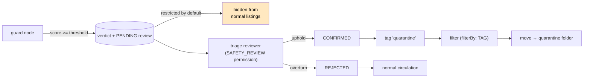

# Workflow: Safety Triage — Uphold or Overturn a Machine Verdict

> **Status**: 🔵 **Proposal.** The `guard` node is built and produces a normalised verdict
> (`safe`, `label`, `score` = P(unsafe), `categories`, a JSON `result`). There is **no queue, no human
> decision and no consequence** — the verdict lands in a JSON component and stops there.
> **Complexity**: **medium.** No new node. One review record, one endpoint, one mode, and a
> quarantine path that reuses the `move` node from [WORKFLOW_TRASH.md](WORKFLOW_TRASH.md).
> **Scope**: what happens after a model says content may be unsafe — who decides, what the decision
> means, and how the material is handled while it is undecided.
> **Audience**: AI coding agents working on `cortex/nodes/guard`, `loom/services/rest` and
> `loom-ui/src/features/workflow/`.

Family index and shared anatomy: [WORKFLOWS.md](WORKFLOWS.md). Status legend: 🟢 built · 🟡 partly
built · 🔵 plan · 🔴 defect · ⚪ stub.

**Out of scope, and where it lives instead:**

| Not here | There |
|---|---|
| The `guard` node: dialects, model families, prompts, options | `cortex/nodes/guard/`, [../features/nodes/NODES.md](../features/nodes/NODES.md) |
| Moving files, and the `move` node this depends on | [WORKFLOW_TRASH.md](WORKFLOW_TRASH.md) |
| Reviewing model-written prose | [WORKFLOW_AI_REVIEW.md](WORKFLOW_AI_REVIEW.md) |
| Whether an asset may be published | [WORKFLOW_RIGHTS_RELEASE.md](WORKFLOW_RIGHTS_RELEASE.md) |
| Who is allowed to see a flagged asset | [../features/permissions/PERMISSIONS.md](../features/permissions/PERMISSIONS.md) |

---

## 1. What exists

`GuardNode` (`cortex/nodes/guard`, kind `guard`) classifies text, pixels or both against one of three
open guardrail model families — Meta Llama Guard 3/4, Google ShieldGemma 1/2, IBM Granite Guardian
3.x — behind a `GuardDialect` seam, and normalises every family onto one vocabulary:

| Port | Direction | Type | Carries |
|---|---|---|---|
| `text` | in | `text/*` | Prose from any upstream extractor: a Whisper transcript, Tika body text, OCR, a caption |
| `media` | in | `media/image` | Pixels |
| `safe` | out | `control/filter` ONE | The boolean, wired straight into a downstream branch |
| `label` | out | `scalar/string` ONE | The verdict label |
| `score` | out | `scalar/number` ONE | **Always P(unsafe)**, whichever family produced it |
| `categories` | out | `scalar/string` MANY | The shared `GuardCategory` vocabulary |
| `result` | out | `struct/json` ONE | The full normalised verdict |

The verdict is persisted through `JsonCompCreateRequest` into `asset_json_comp`.

🟢 The normalisation is the valuable part and it is done: `score` means the same thing across
families, so swapping the model does not silently invert a threshold.

---

## 2. Why a human step is mandatory here

Unlike every other workflow in this family, the cost of the two errors is wildly asymmetric and the
model is known to be miscalibrated on real archives:

| Error | Cost |
|---|---|
| **False positive** | A legitimate asset is quarantined. Recoverable, annoying, and common — guardrail models flag medical images, art, historical photographs and news footage |
| **False negative** | Unsafe material stays in a shared library |

Neither can be resolved by moving a threshold, which is exactly why a queue exists. Two further
constraints shape the design:

- 🔴 **The reviewer is exposed to the content.** This workflow is the only one where the review screen
  is itself a hazard. It needs an explicit permission, a blur-by-default presentation with a
  deliberate reveal, and no thumbnails of flagged content anywhere else in the UI.
- 🔴 **The verdict is not a fact about the asset, it is a fact about a model version.** Store the
  model identity with the verdict (`producer_version` already does this) or a model upgrade silently
  invalidates every past decision.

---

## 3. Design

### 3.1 The review record

Reuse the shared `review_status` enum from
[WORKFLOW_OBJECT_DETECT.md](WORKFLOW_OBJECT_DETECT.md) §2.1, with domain-appropriate semantics. 🟢 It
exists already (`V2.81`, renamed from `cluster_status`) and backs both `cluster.status` and
`detection.status`, so this needs no new type — only a column:

| Status | Meaning |
|---|---|
| `PENDING` | Flagged, undecided. The asset is **restricted by default** — this is the safe direction |
| `CONFIRMED` | The reviewer upholds the flag. The asset is quarantined |
| `REJECTED` | The reviewer overturns it. The asset returns to normal circulation and the verdict is retained as a false-positive record |

Store the review against the ledger row (`asset_node_result`), as in
[WORKFLOW_AI_REVIEW.md](WORKFLOW_AI_REVIEW.md) §2.1 — one mechanism, three workflows — plus a
`category` correction so "this is violence, not sexual content" is expressible. Retaining overturned
verdicts is what makes the false-positive rate measurable, which is the only way to justify a
threshold change later.

### 3.2 The consequence

The quarantine path is **exactly** the trash path with a different folder and a different marker.
Build [WORKFLOW_TRASH.md](WORKFLOW_TRASH.md)'s `move` node once and both workflows are served —
that is the main argument for the two specs sharing a dependency rather than each inventing a mover.

⚠️ Quarantine **moves**, never deletes. Legal retention obligations frequently point the opposite way
from a deletion instinct, and the decision to destroy material is never a workflow's to make.

### 3.3 Restricted-by-default

The genuinely new requirement: a `PENDING` or `CONFIRMED` asset must disappear from ordinary listings,
search results and thumbnails for anyone without the triage permission.

🔴 **This is the hard part, and it is a cross-cutting authorization change, not a workflow feature.**
Today permissions are checked per resource type (`READ_ASSET`), not per row. Options:

| Option | Cost |
|---|---|
| Filter in the search provider and every asset list query | Touches many call sites; easy to miss one, and a miss is the failure mode that matters |
| A `restricted` boolean on `asset` plus a single guard in the asset DAO's read path | Centralised, but the DAO layer has no notion of the requesting principal today |
| Move flagged assets to a separate library with its own ACL | 🟢 Reuses the existing permission model with no new mechanism; costs a move per flag and makes the restriction visible in the tree |

**Recommendation: the third.** It composes with what exists instead of adding a row-level
authorization concept the codebase does not have — and it makes the state auditable. Record the choice
in [../features/permissions/PERMISSIONS.md](../features/permissions/PERMISSIONS.md) whichever way it
goes; a half-enforced restriction is worse than none, because it reads as protection.

---

## 4. Progress Assessment

- [x] `GuardNode` with three model families behind `GuardDialect`, normalised `GuardVerdict` / `GuardCategory`
- [x] Five output ports incl. `safe` as `control/filter`, so a graph can already branch on it
- [x] Verdict persisted to `asset_json_comp`
- [ ] 🔵 `SAFETY_REVIEW` (or equivalent) permission — decide whether it is a new permission or a role convention
- [ ] 🔵 Review record with category correction, on the shared `review_status` enum (§3.1)
- [ ] 🔵 Review endpoint + a `PENDING` queue route
- [ ] 🔴 Restricted-by-default enforcement — pick one of the three options and write it down (§3.3)
- [ ] 🔵 `"safety"` mode: blur by default, deliberate reveal, category picker, uphold/overturn
- [ ] 🔵 Quarantine path: `quarantine` tag → `filter` → `move` (depends on [WORKFLOW_TRASH.md](WORKFLOW_TRASH.md))
- [ ] 🔵 False-positive reporting: overturn rate per model version, per category
- [ ] 🔵 Threshold calibration recorded against a real corpus, not assumed
- [ ] Mocked Playwright e2e; demo data that does **not** ship offensive material — synthesise a flagged verdict against an innocuous asset
- [ ] Customer docs, including the reviewer-exposure caveat

---

## 5. Test Setup

| Test | Covers |
|---|---|
| `GuardNodeTest` 🟢 | Dialect normalisation, score orientation |
| `SafetyReviewEndpointTest` 🔵 | Uphold/overturn, category correction, **403 without the triage permission**, unknown uuid 404 |
| `RestrictedVisibilityTest` 🔵 | 🔴 The important one: a `PENDING` asset does not appear in asset lists, search results, thumbnails or the agent's context for a user without the permission |
| `workflow-safety-mocked.spec.ts` 🔵 | Blur by default; reveal is deliberate; uphold posts; overturn posts; a failed post reverts |

⚠️ **Never ship offensive fixtures.** Every test above works with a synthesised verdict row attached
to an ordinary test asset. 🔴 `./setup-pool.sh` before DAO/endpoint tests. Grant test permissions via
group+role, never a direct `user_permission` grant.

---

## 6. Configuration

| Variable | Effect |
|---|---|
| `LOOM_AI_ENABLED` / `_PROVIDER_TYPE` / `_URL` / `_MODEL_ID` | The guard model backend |
| `CORTEX_NODE_WHITELIST` / `_BLACKLIST` | Must permit `guard`, or a run using it is rejected with 503 |

Node options (pipeline JSON / worker YAML): the dialect/model family, the unsafe-score threshold, and
which categories are actionable. ⚠️ The threshold is **policy**, and it belongs in the pipeline
definition where it is versioned and auditable — not in an environment variable where a change leaves
no trace.

---

## 7. Key Classes Reference

| Class / file | Package or path | Purpose |
|---|---|---|
| `GuardNode` | `io.metaloom.cortex.node.guard` | `KIND = "guard"`, ports at `:85`-`:115`, persistence at `:265` |
| `GuardDialect` / `GuardVerdict` / `GuardCategory` | same | The family seam and the normalised vocabulary |
| `move` node (🔵) | `io.metaloom.cortex.node.move` | The quarantine mover — [WORKFLOW_TRASH.md](WORKFLOW_TRASH.md) §3 |
| `FilterNode` | `io.metaloom.cortex.node.filter` | Routes on the `quarantine` tag once `FilterBy.TAG` exists |
| `PostgresSearchProvider` | `io.metaloom.loom.db.jooq.search` | Must honour restriction (§3.3) |
| `Permission` | `io.metaloom.loom.db.model.perm` | Where a triage permission would be added |

---

## 8. Conventions and Gotchas

| Area | Gotcha |
|---|---|
| **Restricted by default** | 🔴 `PENDING` means restricted. Fail closed — an unreviewed flag must never be treated as safe because nobody got to it |
| **Quarantine moves, never deletes** | 🔴 Retention obligations often point the opposite way from a deletion instinct |
| **The reviewer is exposed** | 🔴 Blur by default, deliberate reveal, an explicit permission, and no flagged thumbnails elsewhere in the UI |
| **A verdict is about a model version** | 🔴 `producer_version` must be on the review; a model upgrade invalidates past decisions |
| **Keep overturned verdicts** | ⚠️ The false-positive rate is the only honest basis for changing a threshold |
| **`score` is always P(unsafe)** | 🟢 Normalised across all three families. Do not add a dialect that inverts it |
| **Half-enforced restriction is worse than none** | 🔴 It reads as protection. Pick one enforcement point and test that every listing path honours it |
| **No offensive test fixtures** | ⚠️ Synthesise verdicts against ordinary assets |
| **Thresholds are policy** | ⚠️ Put them in the versioned pipeline definition, not in an env var |

---

## 9. Where do I find …?

| Need | Look here |
|---|---|
| The node | `cortex/nodes/guard/core/src/main/java/io/metaloom/cortex/node/guard/` |
| The mover this depends on | [WORKFLOW_TRASH.md](WORKFLOW_TRASH.md) §3 |
| The shared review enum | [WORKFLOW_OBJECT_DETECT.md](WORKFLOW_OBJECT_DETECT.md) §2.1 |
| The review-against-ledger mechanism | [WORKFLOW_AI_REVIEW.md](WORKFLOW_AI_REVIEW.md) §2.1 |
| Permission model and enforcement points | [../features/permissions/PERMISSIONS.md](../features/permissions/PERMISSIONS.md), [../features/rbac/RBAC.md](../features/rbac/RBAC.md) |
| Search filtering | [../features/search/SEARCH.md](../features/search/SEARCH.md) |
| Open tasks | [../tasks/WORKFLOW_TASKS.md](../tasks/WORKFLOW_TASKS.md) W12 |

---

_Git HEAD revision: `21e8a8cd`_
_Last updated: 2026-08-07 (new file — proposal; guard node ports verified)_
