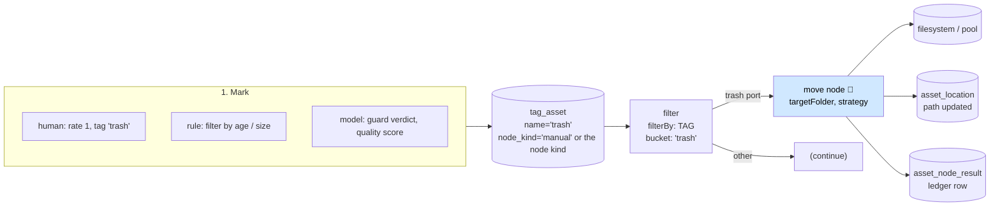

# Workflow: Auto Trash — Mark for Disposal, Then Move the Bytes

> **Status**: 🔵 **Concept. Nothing built.** There is no trash marker, no `move` node and no disposal
> policy. Two nodes move files today (`sha512-dedup` and `fingerprint-dedup-apply`), both hard-wired
> to a `dupFolder` and both usable only for duplicates.
> **Scope**: how an asset gets marked for disposal — by a human, by a rule or by a model — and how the
> bytes then leave the working set without being destroyed.
> **Audience**: AI coding agents adding a `move` node under `cortex/nodes/` and the marker path in
> Loom.

Family index and shared anatomy: [WORKFLOWS.md](WORKFLOWS.md). Status legend: 🟢 built · 🟡 partly
built · 🔵 plan · 🔴 defect · ⚪ stub.

**Out of scope, and where it lives instead:**

| Not here | There |
|---|---|
| Deciding *which* duplicate is redundant | [WORKFLOW_DEDUP.md](WORKFLOW_DEDUP.md) |
| Assigning the rating or tag that triggers disposal | [WORKFLOW_MANUAL_SORT.md](WORKFLOW_MANUAL_SORT.md) |
| Removing an asset from the **database** (delete cascades) | [../loom/PERSISTENCE.md](../loom/PERSISTENCE.md); every asset FK cascades since `V2.74` |
| Copying an asset to cold storage rather than disposing of it | [WORKFLOW_INGEST_MIGRATION.md](WORKFLOW_INGEST_MIGRATION.md), [../concept/NODE_S3SINK_PLAN.md](../concept/NODE_S3SINK_PLAN.md) |
| Quarantining content because it is unsafe | [WORKFLOW_SAFETY_TRIAGE.md](WORKFLOW_SAFETY_TRIAGE.md) |
| Rules for adding a node at all | [../guidelines/NEW_NODE.md](../guidelines/NEW_NODE.md) |

---

## 0. Executive Summary

| Question | Short answer |
|---|---|
| **Is there a trash today?** | **No.** No marker, no folder convention, no node. |
| **Is there anything close?** | Two: `blacklist` (a per-user "I do not want to see this asset" record, `V2.14`) and the dedup nodes' `dupFolder` move. Neither is general. |
| **What is the smallest honest design?** | A **marker** (a tag, per the brief) plus a **`move` node** that relocates an asset's file and updates `asset_location`. Nothing else needs inventing. |
| **What does "filesystem-border aware" cost?** | 🔴 It is the crux. `FileUtils.moveFile` delegates to commons-io, which falls back to **copy + delete** across a boundary — silently turning a metadata operation into a full byte copy. `asset_location` already stores `filekey_stdev` (the device id), so the boundary is knowable before the move. |
| **What must land first?** | `FilterBy.TAG` / `FilterBy.RATING` ([WORKFLOW_MANUAL_SORT.md](WORKFLOW_MANUAL_SORT.md) §5). Without a way to route on a human decision, the `move` node has no input. |

---

## 1. The design



Three separable pieces. Only the middle one is new code.

| Piece | State | Notes |
|---|---|---|
| **The marker** | 🟡 | A tag is the right carrier. `tag_asset` already has provenance (`node_kind`, `confidence`, `creator_uuid`) and per-region placements, and tags are searchable. No new table |
| **The router** | 🔴 | `FilterBy.TAG` does not exist. Task W1 |
| **The mover** | 🔵 | A new `move` node kind. §3 |

### 1.1 Why a tag and not a status column

The brief proposes "assign a trash tag and let a `move` node act on it". That is right, and worth
recording *why*:

- A `status` column on `asset` would be a single global state; an asset can be trash in one library's
  opinion and not in another's.
- `tag_asset` already answers *who* marked it and *with what confidence* (`V2.71`), which a boolean
  column cannot.
- Tags reach `search_document`, so "show me everything marked for disposal" is free.
- Withdrawal is already specified: the `tag` node may only remove a placement it can prove is its own
  (`node_kind` + `node_id` + `producer_version`) — see
  [../concept/NODE_TAG_CONCEPT.md](../concept/NODE_TAG_CONCEPT.md). A human's `trash` tag can never be
  withdrawn by a node, which is exactly the safety property this workflow needs.

⚠️ Do not reuse `blacklist`. It is per-user (`UNIQUE (asset_uuid, creator_uuid)`), carries a
`review_count`, and reads as "this user does not want to see this" — a personal filter, not a disposal
instruction. It is a fine candidate for a *different* feature and would be a confusing home for this
one.

---

## 2. Disposal is a move, never a delete

🔴 **The `move` node must never delete.** Three reasons, all structural:

1. `asset` is content-addressed (`UNIQUE (sha512sum)`); deleting bytes while the row survives leaves a
   record pointing at nothing.
2. Every asset FK cascades since `V2.74`. Deleting the *row* silently takes detections, embeddings,
   tags, dedup memberships, comments and reactions with it — a reviewer marking a photo as trash does
   not intend to erase a year of annotation.
3. Recovery. A trash folder is reversible; an `unlink` is not.

Deleting the database row is a separate, deliberate operation with its own permission
(`DELETE_ASSET`) and its own delete-cascade tests. It is out of scope here.

---

## 3. The `move` node (🔵 to build)

**Kind**: `move` · **Module**: `cortex/nodes/move` (aggregator + `core`) · **Package**:
`io.metaloom.cortex.node.move` · No model, no sidecar. Read
[../guidelines/NEW_NODE.md](../guidelines/NEW_NODE.md) before creating anything.

### 3.1 Ports

| Port | Direction | Content type | Cardinality | Purpose |
|---|---|---|---|---|
| `media` | in | `media/*` | ONE | The item to relocate |
| `moved` | out | `scalar/boolean` | ONE | Whether a move happened, so a downstream node can branch |
| `path` | out | `scalar/string` | ONE | The new absolute path, for the ledger and for chaining |

Ports, content types and cardinality rules:
[../features/pipeline/NODE_DATA_TYPES.md](../features/pipeline/NODE_DATA_TYPES.md).

### 3.2 Options

| Option | Type | Default | Meaning |
|---|---|---|---|
| `targetFolder` | Path | `trash` | Destination root. Relative paths resolve against the item's library root |
| `layout` | enum | `MIRROR` | `FLAT` (basename in `targetFolder`), `MIRROR` (preserve the path below the library root), `DATE` (`YYYY/MM/` from the asset's capture date) |
| `crossDevice` | enum | `COPY` | 🔴 The important one. `COPY` = fall back to copy+delete; `SKIP` = leave the file and report `SKIPPED`; `FAIL` = `ctx.failure(...).abort()` |
| `onConflict` | enum | `SUFFIX` | `SUFFIX` (` (1)`, ` (2)`), `SKIP`, `FAIL`. ⚠️ Never `OVERWRITE` — the destination of a trash move may itself be a distinct asset |
| `dryRun` | boolean | `false` | Log the intended move, touch nothing. Inherited pattern from the dedup nodes |
| `updateLocation` | boolean | `true` | PATCH `asset_location.path` after a successful move |

Plus the `AbstractNodeOptions` inheritance: `enabled`, `processIncomplete`, `retryFailed`, `timeoutMs`.

### 3.3 Filesystem-border awareness — the actual mechanism

🔴 This is the requirement from the brief, and the current helper does **not** satisfy it:

```java
// io.metaloom.utils.fs.FileUtils.moveFile (external `utils` project)
org.apache.commons.io.FileUtils.moveFile(sourceFile, targetFile);
```

Commons-IO's `moveFile` attempts `File.renameTo` and, when that fails — which is exactly what happens
across a mount point — performs a **full copy followed by a delete**. For a 40 GB video that is a
silent, unbounded, non-atomic operation. The node must know before it starts.

Three signals, in order of preference:

1. **`java.nio.file.Files.getFileStore(path)`** on source and destination. Equal `FileStore` ⇒ same
   device ⇒ `Files.move(..., ATOMIC_MOVE)` succeeds. This is the check to implement.
2. **`asset_location.filekey_stdev`** — the schema already records the device id alongside
   `filekey_inode` (`V2.10`). A cross-device move is detectable from the database without touching the
   filesystem, which matters for planning a batch.
3. `Files.move(..., ATOMIC_MOVE)` catching `AtomicMoveNotSupportedException` — correct but reactive;
   it cannot warn before a run.

Behaviour, given `crossDevice`:

```
same FileStore      -> Files.move(src, dst, ATOMIC_MOVE)            # metadata only
different, COPY     -> log at WARN with both stores and the byte count, then copy + delete
different, SKIP     -> ctx.skipped(); ledger row records why
different, FAIL     -> ctx.failure("cross-device move ...").abort()
```

⚠️ **Preserve extended attributes.** `FileUtils.moveFile` reads the source's
`UserDefinedFileAttributeView` and rewrites it on the target, because MetaLoom stores hashes there.
`Files.move` on the same device preserves xattrs for free; the copy path must not. Reuse that helper's
logic rather than reimplementing it — and note that `xattr` is unsupported on some filesystems, a
known environmental limitation in this tree.

### 3.4 Loom-side effects

| Effect | How |
|---|---|
| `asset_location.path` updated | `POST /api/v1/assets/:uuid` (POST creates **and** updates everywhere in this API) |
| Ledger row | `recordNodeResult(asset, ctx, SUCCESS, "moved to <path>", producerVersion(), resultRef("asset_location", uuid))` — `WhisperNode` is the reference implementation |
| Idempotency | A file already inside `targetFolder` is a **no-op skip**, mirroring `FingerprintDedupApplyNode` |

🔴 Use `ctx.failure(msg).abort()`, never `ctx.failure(msg).next()` — `NodeContextImpl.next()` drops the
cause and returns SUCCESS. Nineteen nodes in the tree still make that mistake; a node that moves files
must not join them.

---

## 4. Emptying the trash

Moving is reversible; the trash still grows. Two follow-on paths, both explicitly deferred:

| Path | Shape | Why deferred |
|---|---|---|
| **Retention sweep** | A scheduled pipeline: `filesystem-source` rooted at the trash folder → `filter` (`filterBy: DATE`, `age>30d`) → a `purge` node that deletes the file **and** the asset row | Needs a delete node with `DELETE_ASSET`, delete-cascade tests, and a policy decision about the cascade (`V2.74`) |
| **Cold tier** | `s3-sink` from the trash folder, then remove the local copy | The Loom-side half of getting artefacts in and out is still a plan — [../concept/REST_CORTEX_METADATA_BINARY_HANDLING_PLAN.md](../concept/REST_CORTEX_METADATA_BINARY_HANDLING_PLAN.md) |

Neither is in scope for the first build. A trash folder that only fills is still strictly better than
today.

---

## 5. Build order

1. 🔴 `FilterBy.TAG` (+ `RATING`) — task W1. Without it nothing can route into a move.
2. `cortex/nodes/move` with `crossDevice: SKIP` as the shipped default (safe: never silently copies
   40 GB), `dryRun` honoured, and unit tests for every branch of §3.3.
3. `asset_location` update + ledger write-back (§3.4).
4. Descriptor + `@Binds @IntoMap @StringKey("move")` binding. ⚠️ A descriptor makes the kind visible
   in the palette; the `@StringKey` binding is what makes it **runnable**. Both, or the run fails at
   the worker with `RegistryNodeFactory.createNode()` returning `null`.
5. A demo pipeline: source → filter(TAG:trash) → move.
6. Customer docs under `website/content/english/docs/nodes/move/`.
7. Per-node E2E in `integration-test/`: tag an asset, run the pipeline, assert the file moved, the
   location updated, the ledger row exists, and a second run is a no-op.

---

## 6. Progress Assessment

- [ ] 🔴 `FilterBy.TAG` / `FilterBy.RATING` (task W1, shared with [WORKFLOW_MANUAL_SORT.md](WORKFLOW_MANUAL_SORT.md))
- [ ] 🔵 `cortex/nodes/move` module, `MoveNode`, `MoveNodeOptions`, `MoveNodeModule`
- [ ] 🔵 `FileStore` comparison + `ATOMIC_MOVE`, with `crossDevice` behaviour and xattr preservation
- [ ] 🔵 `onConflict` handling; a file already in `targetFolder` is an idempotent skip
- [ ] 🔵 `asset_location.path` update + `asset_node_result` ledger row
- [ ] 🔵 `MoveDescriptorProvider` + `META-INF/services` + `@StringKey("move")`
- [ ] 🔵 Unit tests: same-device, cross-device x3 policies, conflict x3, dry-run, idempotent re-run
- [ ] 🔵 Per-node E2E in `integration-test/`
- [ ] 🔵 Demo pipeline + demo data
- [ ] 🔵 Customer docs
- [ ] Deferred: retention sweep, cold tier (§4)
- [ ] Open question: should `move` supersede `dupFolder` in the two dedup nodes, or coexist? Superseding
      is cleaner but changes a shipped node's contract — decide before the second mover exists

---

## 7. Test Setup

Nothing exists. The suite to write:

| Test | Covers |
|---|---|
| `MoveNodeTest` | Same-device move preserves xattrs; `updateLocation` PATCHes the right uuid; ledger row written; already-in-target is `SKIPPED` |
| `MoveNodeCrossDeviceTest` | With a stubbed `FileStore` resolver: `COPY` warns and copies, `SKIP` returns `SKIPPED`, `FAIL` returns `FAILED` (⚠️ assert `FAILED`, not `SUCCESS` — the `.next()` trap) |
| `MoveNodeConflictTest` | `SUFFIX` numbering, `SKIP`, `FAIL`; never overwrites |
| `MoveNodeOptionsValidationTest` | Blank `targetFolder` rejected; unknown enum value rejected with the accepted values named |
| `NodeRegistrarTest` | `move` is a registered kind |
| `NodePortConformanceTest` | Descriptor ports match the node's declared ports |
| `MoveNodeIT` (`integration-test/`) | The end-to-end story in §5.7 |

```bash
mvn -pl cortex/nodes/move/core -am test
mvn -pl cortex/cli test -Dtest=NodeRegistrarTest
./it.sh
```

⚠️ Cortex E2E runs against the **packaged** shaded `cortex/cli` JAR and container — rebuild both.
⚠️ Install the node module **before** regenerating `node-descriptors.json`, or the harvest reads a
stale jar. ⚠️ Install `cortex/processor` before the CLI build or Dagger fails with `<error>` in place
of the new module.

---

## 8. Configuration

The node reads **no environment variable** — all options come from the pipeline definition or worker
YAML, and reach the node only because it implements `PipelineConfigurable`. Relevant existing
variables:

| Variable | Effect |
|---|---|
| `CORTEX_NODE_WHITELIST` / `_BLACKLIST` | Must permit `move`, or a run using it is rejected with 503 naming the kind |
| `CORTEX_DRAIN_TIMEOUT_MS` (default 30000) | A move in flight at SIGTERM is drained within this budget. Cortex registers a shutdown hook; Loom does not |

---

## 9. Key Classes Reference

| Class / file | Package or path | Purpose |
|---|---|---|
| `MoveNode` (🔵) | `io.metaloom.cortex.node.move` | To build |
| `FingerprintDedupApplyNode` | `io.metaloom.cortex.node.dedup` | The move-to-folder pattern to copy: live safeguards, dry-run, idempotent skip, ledger-only result |
| `HashDedupNode` | same | `moveMedia` template. 🔴 also the node that blocks on `System.in.read()` — do not copy that |
| `FileUtils.moveFile` | `io.metaloom.utils.fs` (external `utils` project) | xattr-preserving move; 🔴 delegates to commons-io and copies across devices |
| `FilterNode` / `FilterBy` | `io.metaloom.cortex.node.filter` | The router this workflow needs extended |
| `TagNode` | `io.metaloom.cortex.node.tag` | Can write the marker from a rule; provenance-guarded withdrawal |
| `AbstractMediaNode` | `io.metaloom.cortex.common.node` | `recordNodeResult` / `resultRef` |
| `AssetEndpoint` | `io.metaloom.loom.rest.endpoint.impl` | Where the location update lands |

---

## 10. Conventions and Gotchas

| Area | Gotcha |
|---|---|
| **Never delete** | 🔴 Disposal moves bytes. Deleting the asset row cascades to every child table since `V2.74` |
| **Cross-device is a silent copy** | 🔴 commons-io falls back to copy+delete. Compare `FileStore` first; `asset_location.filekey_stdev` already records the device id |
| **Preserve xattrs** | ⚠️ MetaLoom stores hashes in user-defined attributes. The copy path must carry them across; `xattr` is unsupported on some filesystems |
| **Never overwrite on conflict** | ⚠️ A collision in the trash folder may be a genuinely different asset |
| **`ctx.failure(...).next()` returns SUCCESS** | 🔴 Use `.abort()`. A file-moving node that reports success on failure is the worst instance of this bug |
| **A human tag cannot be machine-withdrawn** | 🟢 The `tag` node may only remove placements it can prove are its own. Rely on it; do not add a bypass |
| **`blacklist` is not trash** | ⚠️ Per-user visibility filter (`UNIQUE (asset_uuid, creator_uuid)`), not a disposal instruction |
| **Descriptor ≠ registration** | ⚠️ A descriptor makes the kind visible; `@Binds @IntoMap @StringKey` makes it runnable. Unknown kind at the worker ⇒ `null` ⇒ the task fails |
| **`FilterPortResolver.asList`** | ⚠️ Rejects a Vert.x `JsonArray`, so a programmatically built definition resolves no bucket port ([../tasks/PIPELINE_TASKS.md](../tasks/PIPELINE_TASKS.md) Task 14) — it will bite the demo pipeline in §5.5 |

---

## 11. Where do I find …?

| Need | Look here |
|---|---|
| The move pattern to copy | `cortex/nodes/dedup/core/.../FingerprintDedupApplyNode.java` |
| The xattr-preserving helper | `io.metaloom.utils.fs.FileUtils` (external `utils` checkout) |
| Device id already in the schema | `loom/db/flyway/.../V2.10__add_asset_location.sql` (`filekey_inode`, `filekey_stdev`) |
| Rules for a new node | [../guidelines/NEW_NODE.md](../guidelines/NEW_NODE.md) |
| Ports and cardinality | [../features/pipeline/NODE_DATA_TYPES.md](../features/pipeline/NODE_DATA_TYPES.md) |
| Node write-back / ledger convention | [../features/nodes/NODES.md](../features/nodes/NODES.md) §2 |
| The marker's provenance rules | [../concept/NODE_TAG_CONCEPT.md](../concept/NODE_TAG_CONCEPT.md) |
| Asset delete cascades | `loom/db/flyway/.../V2.74__asset_social_cascade.sql`; [../loom/PERSISTENCE.md](../loom/PERSISTENCE.md) |
| Open tasks | [../tasks/WORKFLOW_TASKS.md](../tasks/WORKFLOW_TASKS.md) W1, W4 |

---

_Git HEAD revision: `21e8a8cd`_
_Last updated: 2026-08-07 (new file — concept; move node not built, cross-device behaviour verified against commons-io)_
