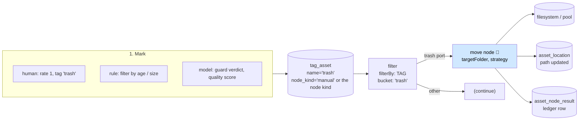

# Workflow: Auto Trash — Mark for Disposal, Then Move the Bytes

> **Status**: 🟢 **The mover is built.** `move` and `assign` ship as Cortex kinds, the shared move
> mechanics live in `cortex/fs`, and the two dedup nodes no longer move anything themselves - they
> report on ports and a downstream `move` node acts. The marker half is unchanged: a `trash` tag plus
> `filter(TAG)`, both of which already existed.
> **Scope**: how an asset gets marked for disposal — by a human, by a rule or by a model — and how the
> bytes then leave the working set without being destroyed.
> **Audience**: AI coding agents adding a `move` node under `cortex/nodes/` and the marker path in
> Loom.

Family index and shared anatomy: [WORKFLOWS.md](WORKFLOWS.md). Status legend: 🟢 built · 🟡 partly
built · 🔵 plan · 🔴 defect · ⚪ stub.

**Out of scope, and where it lives instead:**

| Not here | There |
|---|---|
| Deciding *which* duplicate is redundant | [WORKFLOW_DEDUP.md](WORKFLOW_DEDUP.md) |
| Assigning the rating or tag that triggers disposal | [WORKFLOW_MANUAL_SORT.md](WORKFLOW_MANUAL_SORT.md) |
| Removing an asset from the **database** (delete cascades) | [../loom/PERSISTENCE.md](../loom/PERSISTENCE.md); every asset FK cascades since `V2.74` |
| Copying an asset to cold storage rather than disposing of it | [WORKFLOW_INGEST_MIGRATION.md](WORKFLOW_INGEST_MIGRATION.md), [NODE_S3SINK.md](../features/nodes/s3-sink/NODE_S3SINK.md) |
| Quarantining content because it is unsafe | [WORKFLOW_SAFETY_TRIAGE.md](WORKFLOW_SAFETY_TRIAGE.md) |
| Rules for adding a node at all | [../guidelines/NEW_NODE.md](../guidelines/NEW_NODE.md) |

---

## 0. Executive Summary

| Question | Short answer |
|---|---|
| **Is there a trash today?** | 🟢 **Yes.** `filter(TAG:trash) → move(targetFolder: trash)` is wireable end to end. |
| **Is there anything close?** | `blacklist` is still a per-user visibility filter, not disposal. The dedup nodes' `dupFolder` is **gone** - superseded by `move`. |
| **What did it take?** | A **marker** (a tag, per the brief) plus a **`move` node**. Both existed or were built; nothing else had to be invented. |
| **What does "filesystem-border aware" cost?** | 🟢 Solved in `cortex/fs`: `FileStores.sameStore` probes the boundary **before** anything is written, and `crossDevice` decides what happens. The default declines rather than silently copying. |
| **What blocked it?** | `FilterBy.TAG`/`RATING`, which landed in `6a54f296`. The old "🔴 does not exist" note here was stale by the time the node was built. |

---

## 1. The design



Three separable pieces. Only the middle one is new code.

| Piece | State | Notes |
|---|---|---|
| **The marker** | 🟢 | A tag is the right carrier. `tag_asset` already has provenance (`node_kind`, `confidence`, `creator_uuid`) and per-region placements, and tags are searchable. No new table |
| **The router** | 🟢 | `FilterBy.TAG` and `FilterBy.RATING` (commit `6a54f296`) |
| **The mover** | 🟢 | The `move` kind, `cortex/nodes/relocate`. §3 |

### 1.1 Why a tag and not a status column

The brief proposes "assign a trash tag and let a `move` node act on it". That is right, and worth
recording *why*:

- A `status` column on `asset` would be a single global state; an asset can be trash in one library's
  opinion and not in another's.
- `tag_asset` already answers *who* marked it and *with what confidence* (`V2.71`), which a boolean
  column cannot.
- Tags reach `search_document`, so "show me everything marked for disposal" is free.
- Withdrawal is already specified: the `tag` node may only remove a placement it can prove is its own
  (`node_kind` + `node_id` + `producer_version`) — see
  [NODE_TAG.md](../features/nodes/tag/NODE_TAG.md). A human's `trash` tag can never be
  withdrawn by a node, which is exactly the safety property this workflow needs.

⚠️ Do not reuse `blacklist`. It is per-user (`UNIQUE (asset_uuid, creator_uuid)`), carries a
`review_count`, and reads as "this user does not want to see this" — a personal filter, not a disposal
instruction. It is a fine candidate for a *different* feature and would be a confusing home for this
one.

---

## 2. Disposal is a move, never a delete

🔴 **The `move` node must never delete.** Three reasons, all structural:

1. `asset` is content-addressed (`UNIQUE (sha512sum)`); deleting bytes while the row survives leaves a
   record pointing at nothing.
2. Every asset FK cascades since `V2.74`. Deleting the *row* silently takes detections, embeddings,
   tags, dedup memberships, comments and reactions with it — a reviewer marking a photo as trash does
   not intend to erase a year of annotation.
3. Recovery. A trash folder is reversible; an `unlink` is not.

Deleting the database row is a separate, deliberate operation with its own permission
(`DELETE_ASSET`) and its own delete-cascade tests. It is out of scope here.

---

## 3. The `move` node (🟢 built)

**Kind**: `move` · **Module**: `cortex/nodes/relocate/core` (shared with `assign`) · **Package**:
`io.metaloom.cortex.node.relocate` · No model, no sidecar.

The node turned out to be broader than "a trash mover". The same primitive serves cold-tier staging
and library migration, so the destination is a seam rather than a folder option:

| `target` | Resolves to | Needs Loom? |
|---|---|---|
| `FOLDER` | the configured folder on **this worker** | no - the only offline-capable target |
| `POOL` | `asset_pool`: its `fs_path` **or** its `s3_bucket`, never both | yes |
| `LIBRARY` | the library's pool, plus re-pointing the binary's `library_uuid` | yes |
| `S3_BUCKET` | a bucket named on the node; need not be a pool | no Loom, but needs `CORTEX_S3_*` |

Adding a target is a `MoveDestination` class plus a `@Binds @IntoMap @MoveTargetKey` line - never an
edit to `MoveNode`. This is the `FilterBy` seam, applied again.

⚠️ **A collection is not a move target.** It has no path and no bytes, so "add to a collection" is
the `assign` kind (§3.5). Keeping them apart is why a node that relocates 40 GB can never quietly
become one that writes a join row.

### 3.1 Ports

| Port | Direction | Content type | Cardinality | Purpose |
|---|---|---|---|---|
| `media` | in | `media/*` | ONE | The item to relocate. Descriptor-only; read with `ctx.media()` |
| `moved` | out | `scalar/boolean` | ONE | Whether the bytes went anywhere |
| `path` | out | `scalar/string` | ONE | Where they are now: an absolute path, or an `s3://` reference |
| `flag` | out | `scalar/string` | ONE | `MOVED` \| `COPIED` \| `ALREADY_THERE` \| `SKIPPED` \| `DRY_RUN` \| `FAILED` |

`path` is a `scalar/string`, deliberately not `artifact/file`: that family means "a file this node
produced", and would make a relocated original an `s3-sink` upload candidate.

### 3.2 Options

All per-instance via `PipelineConfigurable` - two move nodes in one graph legitimately send different
items to different places.

| Option | Type | Default | Meaning |
|---|---|---|---|
| `target` | enum | `FOLDER` | The seam selector |
| `targetFolder` | Path | `trash` | FOLDER only. Relative resolves against `sourceRoot` |
| `sourceRoot` | Path | — | The scan root `MIRROR` makes paths relative to |
| `layout` | `FLAT\|MIRROR\|DATE\|CONTENT` | `MIRROR` | Forced to `CONTENT` for pool/library/bucket |
| `poolUuid` / `libraryUuid` / `bucket` | String | — | Per-target; required by the matching destination |
| `onConflict` | `SUFFIX\|SKIP\|FAIL` | `SUFFIX` | ⚠️ There is deliberately **no `OVERWRITE`** |
| `crossDevice` | `COPY\|SKIP\|FAIL` | **`SKIP`** | Never silently copy 40 GB |
| `sourcePolicy` | `KEEP\|DELETE_AFTER_VERIFY` | **`KEEP`** | 🔴 The only option that can destroy data |
| `verify` | `SIZE\|SHA512` | `SHA512` | What earns permission to delete the original |
| `updateLocation` | boolean | `true` | Record the new location in Loom |
| `dryRun` | boolean | `false` | OR'd with the worker-global `--dryrun` |

⚠️ `sourcePolicy: KEEP` makes the node a **copier**, and it says so: the `flag` port reads `COPIED`,
not `MOVED`. Reporting a copy as a move is how a cold-tier run silently fails to reclaim anything.
`target: S3_BUCKET` with `DELETE_AFTER_VERIFY` and `verify: SHA512` is rejected at configure time -
an object cannot be digested without downloading it back.

### 3.3 Filesystem-border awareness — the actual mechanism

🟢 Built in `cortex/fs`, and the probe runs **before** anything is written:

```
same FileStore   -> Files.move(src, dst, ATOMIC_MOVE)      # metadata only, xattrs travel free
different, COPY  -> WARN naming both stores and the byte count
                    -> .part copy -> xattr restore -> atomic publish -> verify -> optional unlink
different, SKIP  -> ctx.skipped("cross-device: <a> -> <b>, <n> bytes")
different, FAIL  -> ctx.failure(...).abort()
```

`FileStores.sameStore` resolves each side through its nearest **existing** ancestor, because the
destination of a first move does not exist yet. An unresolvable side answers "not the same", which
routes into the cross-device policy rather than into an atomic move that would then fail.

🔴 **`io.metaloom.utils.fs.FileUtils.moveFile` is no longer called from Cortex.** It delegates to
commons-io (copy+delete across a boundary, with no warning) and wraps both of its xattr blocks in
`catch (Exception e) { e.printStackTrace(); }`, so `loom_sha512` could vanish with no signal and every
downstream node would silently re-digest the file. `cortex/fs/XAttrs` returns a result that separates
"this filesystem has no xattrs" (benign, debug) from "the attribute existed and could not be copied"
(a warning). The external helper is left alone deliberately - fixing it would gate this work on a
cross-repo release, and two divergent movers would be worse than one unused one.

### 3.4 Loom-side effects

| Effect | How |
|---|---|
| `asset_location.path` updated | `POST /api/v1/binaries/:uuid` via `updateBinary`. ⚠️ **Not** `/locations` - see §10 |
| `asset_location.library_uuid` / `.pool_uuid` | Same call. Both fields were added to `AssetBinaryUpdateRequest` for this; before that a relocation into another library was not expressible over REST at all |
| `asset.filename` kept in step | `updateAsset` with a `FileInfo`. Filesystem destinations only |
| Ledger row | `recordNodeResult(..., resultRef("asset_location", binaryUuid))` |
| Idempotency | A file already at the destination is a no-op skip, per target |

🔴 **One fact, two places.** `asset.filename` holds an absolute path in practice - both dedup nodes
call `new File(asset.getFile().getFilename()).exists()` on it - while `asset_location.path` is the
real locator. Nothing reconciles them, and nothing kept either current after the old dedup move.
`LoomLocationWriter` writes both, plus `media.setPath()` in-heap so later nodes in the same graph do
not open a vanished path. That is a patch; the real fix is to strip path semantics from
`asset.filename`, and it is a separate task.

### 3.5 The `assign` node (🟢 built)

**Kind**: `assign` · same module. Adds an asset to a **collection** or a **library** and never touches
a file - every one of its tests asserts the source is byte-identical and at the same path afterwards.

| Port | Direction | Content type | Purpose |
|---|---|---|---|
| `media` | in | `media/*` | The item |
| `assigned` | out | `scalar/boolean` | Whether a new membership was written |
| `target` | out | `scalar/string` | The resolved collection/library uuid |

Options: `target` (`COLLECTION`/`LIBRARY`), `collectionUuid` **xor** `collectionName`,
`libraryUuid`, `onMissing` (`FAIL`/`CREATE`/`SKIP`, default `FAIL`), `dryRun`.

This needed REST that did not exist: `collection_asset` had a DAO writer used only by a cascade test,
and `library_asset` had none at all. Both now have membership routes, client methods and tests - see
§3.6.

### 3.6 The REST the mover needed

| Route | Permission | Why |
|---|---|---|
| `POST/PUT/DELETE/GET /collections/:uuid/assets` | `UPDATE_/READ_COLLECTION` | `assign` had nowhere to write |
| `POST/DELETE/GET /libraries/:uuid/assets` | `UPDATE_/READ_LIBRARY` | ditto, and `library_asset` had no DAO writer |
| `GET /assets/:uuid/collections` · `/libraries` | `READ_*` | Membership is M:N on both axes |
| `libraryUuid`/`poolUuid` on `POST /binaries/:uuid` | `UPDATE_ASSET_BINARY` (+ `READ_ASSET_POOL` for an explicit pool) | A relocation into another library or pool was previously inexpressible |

🔴 **`V2.80` fixes a pre-existing defect found while building this.** `collection_asset.collection_uuid`
was a plain foreign key, so `DELETE /collections/:uuid` on a collection with **any** member failed
with a constraint violation - a 500. `V2.73`'s own comment claimed the collection side was "already
handled"; it was not. Nothing noticed because membership had no REST surface, so the only collections
anyone deleted were empty. The library side still blocks deliberately: a library must not be deleted
out from under the assets in it.

## 4. Emptying the trash

Moving is reversible; the trash still grows. Two follow-on paths, both explicitly deferred:

| Path | Shape | Why deferred |
|---|---|---|
| **Retention sweep** | A scheduled pipeline: `filesystem-source` rooted at the trash folder → `filter` (`filterBy: DATE`, `age>30d`) → a `purge` node that deletes the file **and** the asset row | Needs a delete node with `DELETE_ASSET`, delete-cascade tests, and a policy decision about the cascade (`V2.74`) |
| **Cold tier** | `s3-sink` from the trash folder, then remove the local copy | The Loom-side half of getting artefacts in and out is still a plan — [../concept/REST_CORTEX_METADATA_BINARY_HANDLING_PLAN.md](../concept/REST_CORTEX_METADATA_BINARY_HANDLING_PLAN.md) |

Neither is in scope for the first build. A trash folder that only fills is still strictly better than
today.

---

## 5. Build order

1. 🟢 `FilterBy.TAG` (+ `RATING`) — landed in `6a54f296`, before this work started.
2. 🟢 `cortex/fs` — the shared move mechanics, extracted rather than written per node: `AtomicFiles`
   (was duplicated verbatim in `watermark` and `image-manipulation`), `XAttrs`, `FileStores`,
   `PathContainment`, `Conflicts`, `LocalMover`.
3. 🟢 Loom REST: membership routes, and `libraryUuid`/`poolUuid` on the binary update.
4. 🟢 `cortex/nodes/relocate` — `move` and `assign`, with `crossDevice: SKIP` and
   `sourcePolicy: KEEP` as the shipped defaults.
5. 🟢 `asset_location` update + ledger write-back (§3.4).
6. 🟢 Registration: both `@Binds @IntoMap @StringKey` bindings, `NodeSpecCatalog`, and the
   regenerated `node-descriptors.json` (42 → 44 contracts).
7. 🟢 The dedup supersede (§6).
8. 🔵 Still open: a demo pipeline, customer docs, and the per-node E2E in `integration-test/`.

---

## 6. Progress Assessment

- [x] 🟢 `FilterBy.TAG` / `FilterBy.RATING` (`6a54f296`)
- [x] 🟢 `cortex/fs`: `AtomicFiles`, `XAttrs`, `FileStores`, `PathContainment`, `Conflicts`, `LocalMover` (39 tests)
- [x] 🟢 `watermark` and `image-manipulation` re-pointed at the shared `AtomicFiles`; both duplicates deleted
- [x] 🟢 `cortex/nodes/relocate`: `MoveNode` + 4 destinations, `AssignNode` + 2 assignments, `RelocateNodeModule`
- [x] 🟢 `FileStore` comparison before the move, `crossDevice` x3, xattr carry-over with honest failure reporting
- [x] 🟢 `onConflict` x3, never overwriting; per-target idempotent skip
- [x] 🟢 `asset_location` update (path **and** library/pool) + `asset.filename` + ledger row
- [x] 🟢 Both `@StringKey` bindings, `NodeSpecCatalog`, regenerated descriptors, `NodeRegistrarTest`
- [x] 🟢 Loom: membership routes, `V2.80` cascade fix, Java + Python clients, 80 tests
- [x] 🟢 The dedup supersede: ports in, `dupFolder` out, `keepExcludeFolder` in, `.next()` bug fixed (28 tests)
- [x] 🟢 Node tests: 41 in `relocate` (move, cross-device, conflict, options, assign)
- [ ] 🔵 Remaining node tests: persistence, pipeline-chain, singleton, and the two assertj helpers
- [ ] 🔵 Per-node E2E in `integration-test/`
- [ ] 🔵 Demo pipeline + demo data
- [ ] 🔵 Customer docs
- [ ] Deferred: retention sweep, cold tier (§4)
- [x] 🟢 Resolved: `move` **supersedes** `dupFolder`. The dedup nodes report on ports; the move node acts (§6)

---

## 6a. The dedup supersede

Both dedup nodes moved files themselves, into a `dupFolder` that only worker YAML could set. They no
longer do. The decision stays where the evidence is; the action moves to where an author can see it:

| Node | Was | Is |
|---|---|---|
| `hash-dedup` / `sha512-dedup` | moved the duplicate into `dupFolder` | writes `duplicate` (`media/*`, selective) + `original` (`scalar/string`) |
| `fingerprint-dedup-apply` | moved the confirmed duplicate | writes `confirmed_dup` (`media/*`, selective) + `keep_path` |

All five KEEP safeguards are **unchanged** and still run against the live filesystem before the port
is written; only their consequence changed. Wire `confirmed_dup → move.media`.

🔴 **One safeguard could not move downstream.** "The keeper is not itself a trashed file" asks about
the KEEP, and the move node only ever sees the duplicate. It survives as `keepExcludeFolder` on the
apply node - default empty, i.e. off - which is also what `dupFolder` migrates to.

⚠️ **`dupFolder` was removed outright, and a stale one is silently ignored.**
`CortexOptionsLoader` sets `FAIL_ON_UNKNOWN_PROPERTIES = false`, so an operator's existing
`cortex.yml` keeps a worker booting - but their duplicates stop being moved with nothing in the log
to say why. There is no code path left to warn from. **This belongs in the release notes.** No saved
pipeline graph carried it (neither node is `PipelineConfigurable`), so the blast radius is operator
YAML only, and no demo pipeline used a dedup kind.

---

## 7. Test Setup

| Test | Covers | State |
|---|---|---|
| `cortex/fs` (39) | `AtomicFilesTest`, `XAttrsTest` (`assumeTrue` on xattr support), `FileStoresTest`, `PathContainmentTest`, `ConflictsTest`, `LocalMoverTest` | 🟢 |
| `MoveNodeTest` (11) | Same-store rename; the media handle follows the bytes on a move and **not** on a copy; already-in-target `SKIPPED`; 🔴 `/x/trash-old` is not inside `/x/trash`; remote media untouched; dry run; MIRROR/FLAT/CONTENT layouts | 🟢 |
| `MoveNodeCrossDeviceTest` (6) | Stubbed boundary probe: `SKIP` default touches nothing; `FAIL` asserts **FAILED** not SUCCESS; `COPY` keeps or removes the source per policy; SHA-512 verify; no `.part` survives | 🟢 |
| `MoveNodeConflictTest` (4) | `SUFFIX` numbering across runs; `SKIP`; `FAIL`; **the occupant is never overwritten** in any case | 🟢 |
| `MoveOptionsValidationTest` (12) | Defaults; blank folder; every enum named with its accepted values; per-target requirements; the S3+SHA512+delete combination refused | 🟢 |
| `AssignNodeTest` (8) | Adds; already-a-member skips; missing target fails or skips; dry run; unknown asset; resolve-by-name; uuid-xor-name. **Every case asserts the file was not touched** | 🟢 |
| `HashDedupNodeTest` (4) | Signals the duplicate instead of moving it; size mismatch still skips (`@Timeout(10)` is the assertion); same file; unknown file | 🟢 |
| `FingerprintDedupApplyNodeTest` (12) | The five safeguards now gate a port; `keepExcludeFolder`; the look-alike-folder regression. **Every case asserts nothing was moved** | 🟢 |
| Loom (80) | `CollectionEndpointTest` (new, 20), `LibraryEndpointTest` (17), `AssetBinaryEndpointTest` (15), `CollectionDaoTest` (10), `LibraryDaoTest` (9), `AssetCascadeTest` (9) | 🟢 |
| `NodeRegistrarTest`, `NodeSpecGoldenTest`, `NodeDescriptorServiceLoaderTest` | `move` and `assign` are registered, contracted and counted | 🟢 |
| `MoveNodeIT` / `AssignNodeIT` (`integration-test/`) | The end-to-end story in §5 | 🔵 to write |
| `MoveNodePersistenceTest`, `*PipelineTest`, `*SingletonTest`, assertj helpers | The rest of the NEW_NODE.md set | 🔵 to write |

```bash
mvn -pl cortex/nodes/move/core -am test
mvn -pl cortex/cli test -Dtest=NodeRegistrarTest
./it.sh
```

⚠️ Cortex E2E runs against the **packaged** shaded `cortex/cli` JAR and container — rebuild both.
⚠️ Install the node module **before** regenerating `node-descriptors.json`, or the harvest reads a
stale jar. ⚠️ Install `cortex/processor` before the CLI build or Dagger fails with `<error>` in place
of the new module.

---

## 8. Configuration

The node reads **no environment variable** — all options come from the pipeline definition or worker
YAML, and reach the node only because it implements `PipelineConfigurable`. Relevant existing
variables:

| Variable | Effect |
|---|---|
| `CORTEX_NODE_WHITELIST` / `_BLACKLIST` | Must permit `move`, or a run using it is rejected with 503 naming the kind |
| `CORTEX_DRAIN_TIMEOUT_MS` (default 30000) | A move in flight at SIGTERM is drained within this budget. Cortex registers a shutdown hook; Loom does not |

---

## 9. Key Classes Reference

| Class / file | Package or path | Purpose |
|---|---|---|
| `MoveNode` / `AssignNode` | `io.metaloom.cortex.node.relocate` | The two kinds |
| `MoveDestination` + `Folder`/`Pool`/`Library`/`S3Bucket` | same | The target seam. Adding one never edits `MoveNode` |
| `LoomLocationWriter` | same | The single place that tells Loom where the bytes went - binary, `asset.filename`, and the in-heap handle |
| `LocalMover` | `io.metaloom.cortex.fs` | 🔴 The only method in the tree that unlinks a source file, and only after a verify |
| `FileStores` / `XAttrs` / `Conflicts` / `PathContainment` / `AtomicFiles` | same | Boundary probe, attribute carry-over, name rotation, containment, atomic publish |
| `FingerprintDedupApplyNode` | `io.metaloom.cortex.node.dedup` | The gate: five live safeguards, then a port |
| `HashDedupNode` | same | Detection + a ledger row. 🔴 also the node that used to block on `System.in.read()` |
| `FileUtils.moveFile` | `io.metaloom.utils.fs` (external `utils` project) | ⚠️ **No longer called from Cortex.** Copies across devices without warning and loses xattrs silently |
| `FilterNode` / `FilterBy` | `io.metaloom.cortex.node.filter` | The router this workflow needs extended |
| `TagNode` | `io.metaloom.cortex.node.tag` | Can write the marker from a rule; provenance-guarded withdrawal |
| `AbstractMediaNode` | `io.metaloom.cortex.common.node` | `recordNodeResult` / `resultRef` |
| `AssetEndpoint` | `io.metaloom.loom.rest.endpoint.impl` | Where the location update lands |

---

## 10. Conventions and Gotchas

| Area | Gotcha |
|---|---|
| **Never delete** | 🔴 Disposal moves bytes. Deleting the asset row cascades to every child table since `V2.74`. The node's one unlink is gated on `sourcePolicy` **and** a passed verify |
| **Cross-device is a silent copy** | 🟢 Fixed: `FileStores.sameStore` probes before writing. ⚠️ Do not reach for `FileUtils.moveFile` again |
| **Preserve xattrs** | 🟢 `XAttrs` carries them and **reports** a failure instead of printing a stack trace. Losing `loom_sha512` costs a full re-read per item downstream |
| **Never overwrite on conflict** | ⚠️ There is deliberately no `OVERWRITE`. A collision in the trash folder may be a genuinely different asset |
| **`ctx.failure(...).next()` returns SUCCESS** | 🔴 Use `.abort()`. Fixed in both dedup nodes as part of this work; the move node never had it |
| **`Path.startsWith`, not `String.startsWith`** | 🔴 `/data/dups-old` is not inside `/data/dups`. The old `isInFolder` said it was; `PathContainment` is the fix and has a test named after the bug |
| **A path is a `scalar/string`** | ⚠️ Not `artifact/file` - that means "a file this node produced", and would make a relocated original an `s3-sink` upload candidate |
| **`/locations` does not exist** | 🔴 `AssetLocationMethods` in the Java client calls routes no endpoint serves. The live API is `AssetBinaryMethods` over `/binaries` |
| **A pool path is a *server* path** | 🔴 `asset_pool.fs_path` names a directory on the Loom host. `PoolDestination` checks it is a directory on the **worker** and fails loudly, rather than writing somewhere Loom will never look |
| **A human tag cannot be machine-withdrawn** | 🟢 The `tag` node may only remove placements it can prove are its own. Rely on it; do not add a bypass |
| **`blacklist` is not trash** | ⚠️ Per-user visibility filter (`UNIQUE (asset_uuid, creator_uuid)`), not a disposal instruction |
| **Descriptor ≠ registration** | ⚠️ A descriptor makes the kind visible; `@Binds @IntoMap @StringKey` makes it runnable. Unknown kind at the worker ⇒ `null` ⇒ the task fails |
| **`FilterPortResolver.asList`** | ⚠️ Rejects a Vert.x `JsonArray`, so a programmatically built definition resolves no bucket port ([../tasks/PIPELINE_TASKS.md](../tasks/PIPELINE_TASKS.md) Task 14) — it will bite the demo pipeline in §5.5 |

---

## 11. Where do I find …?

| Need | Look here |
|---|---|
| The move pattern to copy | `cortex/nodes/dedup/core/.../FingerprintDedupApplyNode.java` |
| The xattr-preserving helper | `io.metaloom.utils.fs.FileUtils` (external `utils` checkout) |
| Device id already in the schema | `loom/db/flyway/.../V2.10__add_asset_location.sql` (`filekey_inode`, `filekey_stdev`) |
| Rules for a new node | [../guidelines/NEW_NODE.md](../guidelines/NEW_NODE.md) |
| Ports and cardinality | [../features/pipeline/NODE_DATA_TYPES.md](../features/pipeline/NODE_DATA_TYPES.md) |
| Node write-back / ledger convention | [../features/nodes/NODES.md](../features/nodes/NODES.md) §2 |
| The marker's provenance rules | [NODE_TAG.md](../features/nodes/tag/NODE_TAG.md) |
| Asset delete cascades | `loom/db/flyway/.../V2.74__asset_social_cascade.sql`; [../loom/PERSISTENCE.md](../loom/PERSISTENCE.md) |
| Open tasks | [../tasks/WORKFLOW_TASKS.md](../tasks/WORKFLOW_TASKS.md) W1, W4 |

---

_Git HEAD revision: `98a6dbe1`_
_Last updated: 2026-08-08 (the mover is built. `move` and `assign` ship as kinds; `cortex/fs` holds the
shared mechanics and absorbed two duplicated `AtomicFiles`; the dedup nodes were superseded and now
report on ports; `V2.80` fixed a pre-existing collection-delete 500 found on the way. Still open: demo
data, customer docs, the per-node E2E and four of the standard node tests.)_
