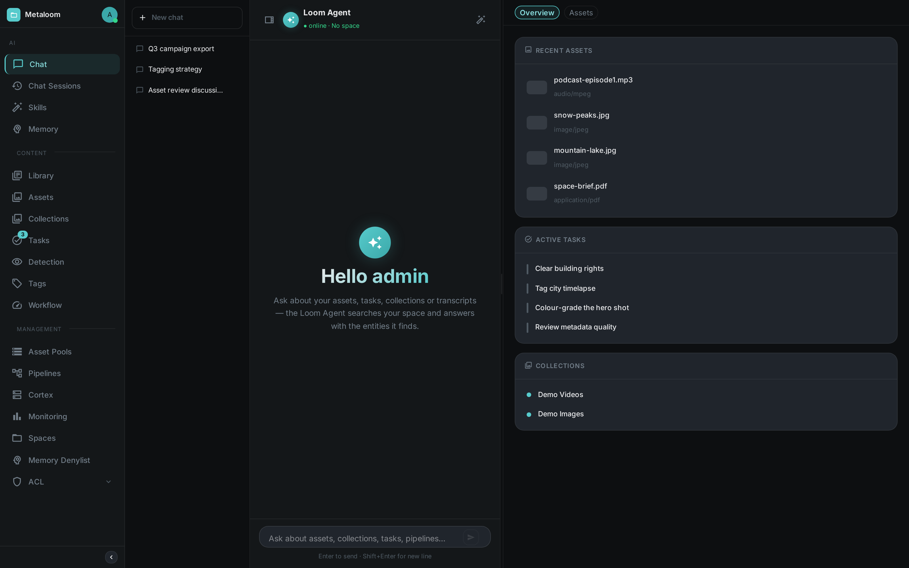
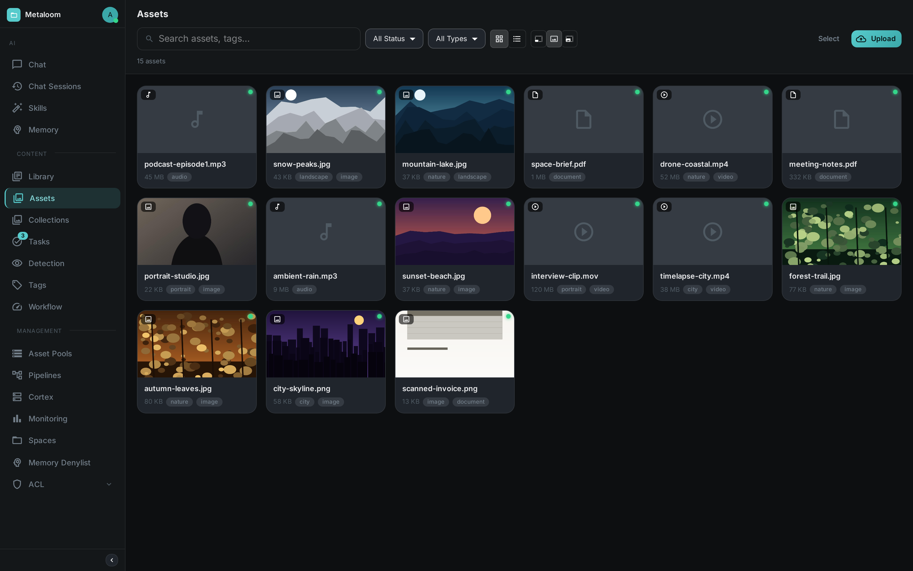

This guide gets a full MetaLoom stack running locally in a few minutes using the demo container.
No build tools or configuration files are required.

== What You Will Run

The demo image (`metaloom/loom-demo`) bundles everything in one container:

* *Loom UI* — the browser interface you will spend your time in: chat, assets, pipelines and
  administration, served at `/ui/` by the server itself. **This is the front door.**
* *Loom* — the asset management server behind it (REST API, WebSocket and the UI, all on port 8092)
* *Loom App* — an optional desktop client built with Electron, wrapping the same UI

For the full set of images and their ports, see link:../deployment/[Container Images].

== Prerequisites

* Docker and Docker Compose installed
* A terminal

== Start the Demo Stack

The `metaloom/loom-demo` image bundles Loom together with a pre-seeded PostgreSQL database and a set of sample assets so you can explore the system without any manual setup.

[source,bash]
----
docker run -d \
  --name loom-demo \
  -p 8092:8092 \
  metaloom/loom-demo:latest
----

== Open the Loom UI

++++

	

		

			

				<h2 data-toc-skip><a href="http://localhost:8092/ui/">http://localhost:8092/ui/</a></h2>
				
Log in with <strong>admin</strong> / <strong>finger</strong>. The demo database is pre-seeded, so every screen has real content from the first click.

			

			

				<a href="../ui/" class="docs-card-link">Screenshot tour</a>
				<a href="../loom/chat/" class="docs-card-link">Chat &amp; AI Agent</a>
				<a href="../ui/#assets" class="docs-card-link">Assets</a>
				<a href="../ui/#pipeline-editing" class="docs-card-link">Pipeline editor</a>
				<a href="../ui/#administration" class="docs-card-link">Administration</a>
			

		

	

++++

The UI is the front door to everything the server can do — you do not need the REST API to get
started. You land on the link:../loom/chat/[AI assistant]; the asset browser, pipeline editor,
tags, face detection and the admin area are one click away in the navigation.

Browse, search and preview the seeded media in the asset area:

Key areas of the UI:

[options="header",cols="1,2"]
|===
| Section | Purpose
| Chat & AI Agent | Ask questions about your assets in natural language (the landing page)
| Assets | Browse, search, upload and preview media assets
| Pipelines | Author pipelines in the editor and watch runs execute live
| Users & Groups | Create and manage user accounts, group memberships and role assignments
| API Keys | Generate and revoke long-lived API tokens (see link:../loom/authentication/[Authentication])
| Settings | Server configuration and system status
|===

For a screenshot tour of every area, see link:../ui/[Loom UI].

=== Credentials

[options="header",cols="1,1"]
|===
| Field | Value
| Username | `admin`
| Password | `finger`
|===

(The password is set by `LOOM_INITIAL_PASSWORD`, which the demo image defaults to `finger`.)

The server itself — REST API, WebSocket and SSE — is on http://localhost:8092 for when you want to
integrate rather than click.

== Loom App

Loom App is a desktop application built with link:https://www.electronjs.org/[Electron].
It embeds the Loom UI inside a native window and adds OS-level integrations:

* System tray icon with quick access to the connected server
* Native file drag-and-drop for asset ingestion
* Local connection profiles for managing multiple Loom servers

Download the latest release from the link:https://github.com/metaloom/loom-app/releases[Loom App releases page] or build from source.

To connect Loom App to the demo instance, launch the app and point it at `http://localhost:8092`.

== Next Steps

Once the stack is running and you can log in:

. Explore the REST API — link:../loom/rest-api/[REST API Reference]
. Understand the authentication model — link:../loom/authentication/[Authentication]
. Read how Cortex processes assets — link:../operation/[Operation]
. Deploy to production — link:../loom/artifacts/[Loom Artifacts], link:../loom/helm-chart/[Helm Chart]
