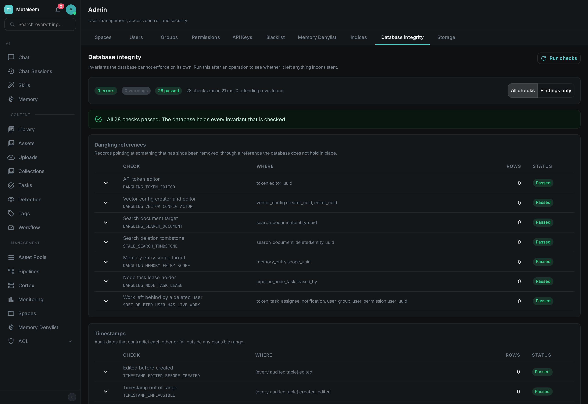
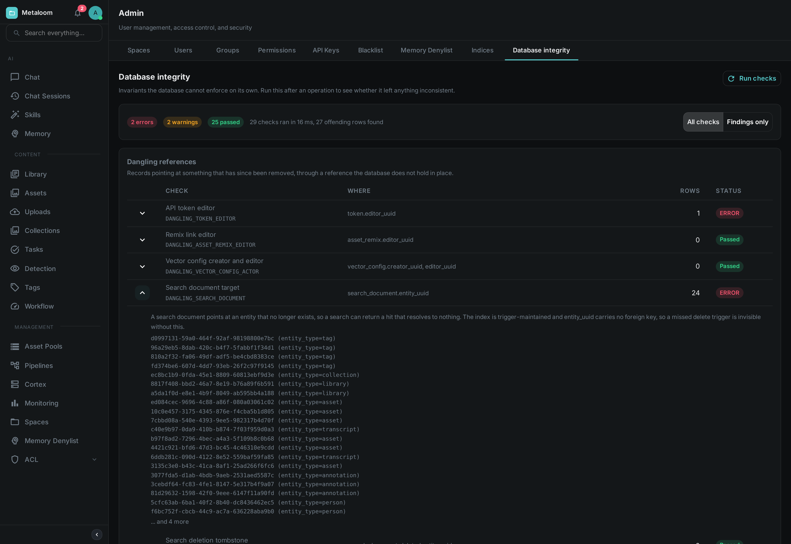
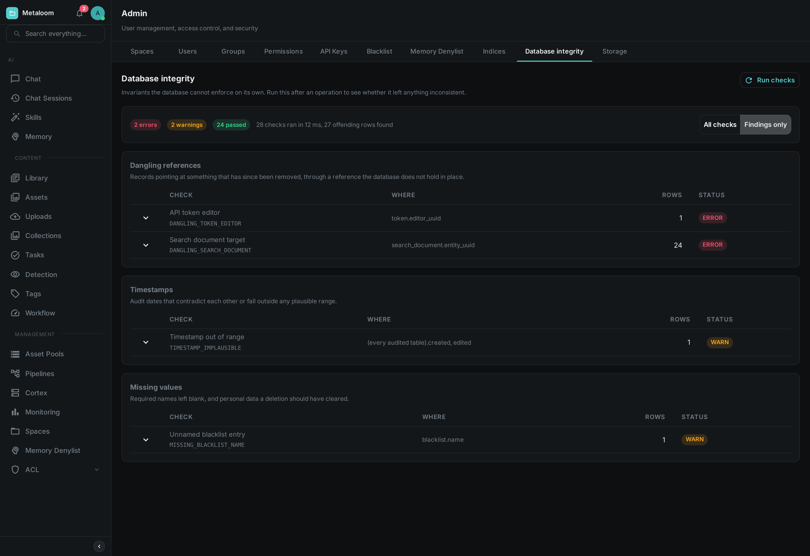

= Database Integrity

Loom keeps a catalogue: assets and the things said about them — tags, people, transcripts, tasks,
comments, pipeline runs. Most of the rules that keep it coherent are enforced by the database itself,
which simply refuses anything that would break them. A handful cannot be, and this page is about
those.

Open *Admin → Database Integrity* and press *Run checks*. Nothing is changed by running it: the
report reads, counts and reports, and never repairs.

== When To Use It

The report is most useful when something has already gone slightly wrong and you want to know how far
it spread. Good moments to run it:

* After importing a large batch of media, or after migrating a catalogue in from elsewhere.
* After restoring from a backup, or after any direct change to the database that did not go through
  Loom.
* After an upgrade, once the new version has been running for a while.
* When a screen shows a result that leads nowhere — a search hit that opens onto nothing, a task
  assigned to somebody who is gone.

Running it periodically on a healthy installation is fine too. On a catalogue of ordinary size it
takes well under a second.

== Reading The Report

The screen lists *every* check, grouped by what it looks for, whether or not it found anything. That
is deliberate: a list of problems tells you what is wrong, but not what was examined, and when you
have come here because something looks off you usually want both. The counters along the top say how
many checks reported errors, how many reported warnings and how many passed.

Each row shows:

Check:: The name of the check, with its identifier underneath — something like
`DANGLING_SEARCH_DOCUMENT`. Quote the identifier when asking for help; the name above it may be
reworded between versions, but the identifier will not.

Where:: The table and column the check looked at.

Rows:: How many records are affected. Zero for a check that passed.

Status:: *Passed*, or the severity of what it found. *Error* means something the software will
misread or fail on. *Warning* means something that looks wrong but that a person has to judge — a
record with no name may simply be one nobody has named yet.

Expanding any row explains what that check is for. On a row that found something it also lists the
identifiers of the affected records, up to a limit; when there are more than the list shows, it says
so — the count beside it is always the complete figure.

Switch the toggle to *Findings only* when the catalogue gets in the way and you just want the list of
problems. Groups whose checks all passed disappear with them.

A check can also report *Did not run*. That is neither a pass nor a fail: it means the check itself
could not complete, so nothing is known about the rule it covers, and it is counted separately from
both the passes and the findings. One check failing this way does not stop the others.

== What Is Checked

[options="header",cols="1,3"]
|===
| Group | What it looks for

| Dangling references
| A record pointing at something that has since been removed. Only a few kinds of reference can end
  up this way; most are held in place by the database and cannot. The search index is the usual
  suspect, because it is maintained separately from the records it describes.

| Timestamps
| Records claiming to have been changed before they were created, dates from before the software
  existed, or dates in the future. Usually a sign that something wrote to the database directly.

| Missing values
| A name or title that is required but blank. These are the fields shown as a record's identity, so a
  blank one produces something you can see but cannot refer to.

| Unknown values
| A field holding a value the software does not recognise — a status or a category outside the set it
  knows. These are the findings most likely to produce an error when the record is next opened.

| Row counts and constraints
| Duplicates where there should be one record, and combinations of fields that should not be able to
  occur together. The database prevents most of these; the check catches records that got in before
  the rule did.
|===

== What It Does Not Do

It does not repair anything. Every finding needs a decision — some are cosmetic, some mean data was
lost, and a few are records that a person deliberately left incomplete. Automatic repair would have to
guess which is which.

It also does not check the media files themselves. Whether the bytes on disk are intact and readable
is a separate question, answered by the consistency step in a processing pipeline.

== Permissions

Viewing the report requires the *Database integrity* permission, granted per role under
*Admin → Permissions*. It is deliberately separate from the metrics permission: metrics are counters
about how the instance is running, while this report names individual records, and so reveals
something about what is stored.
