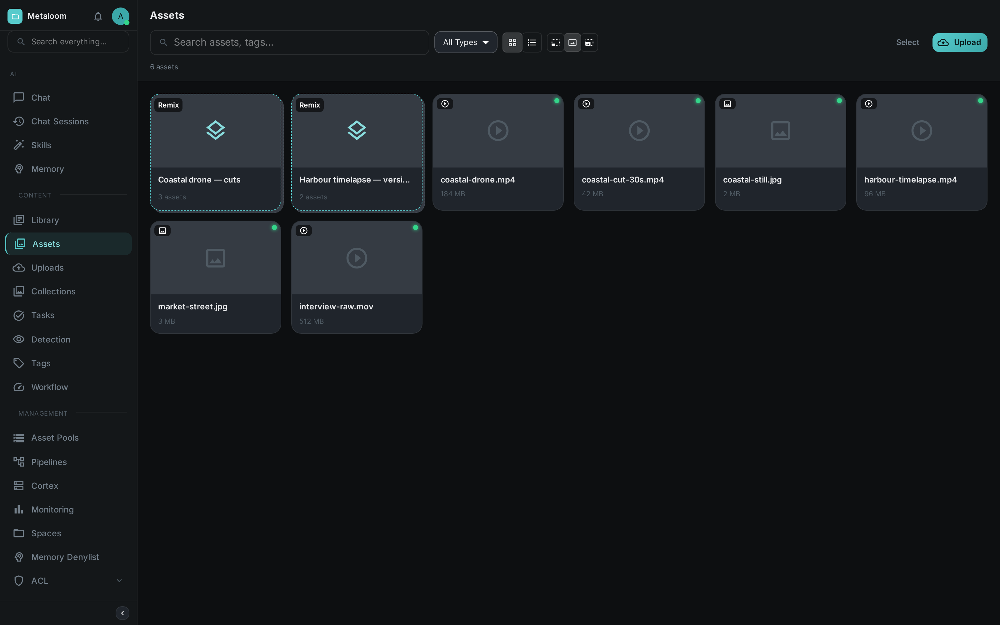
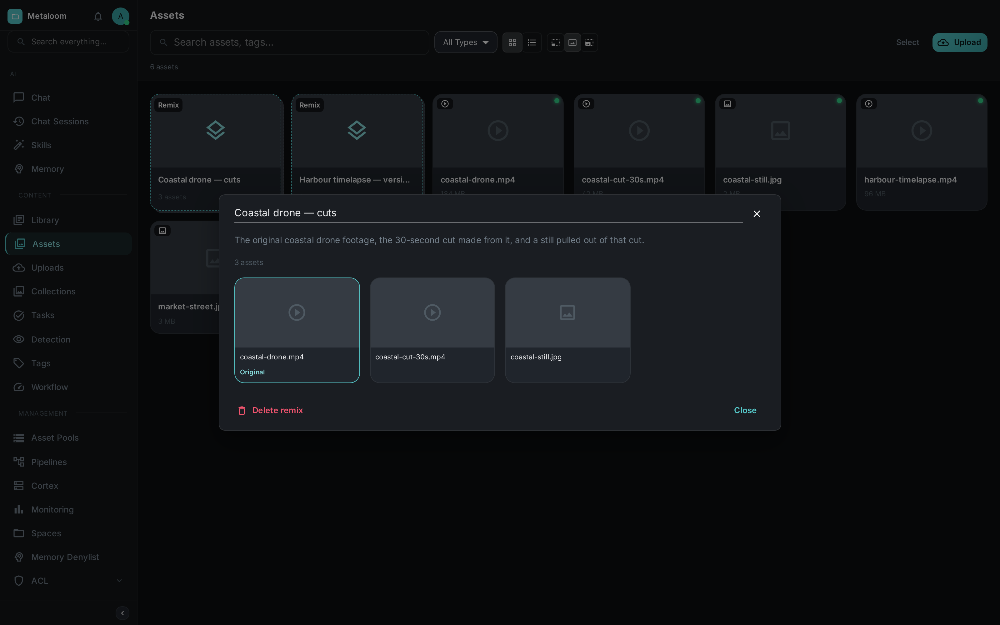
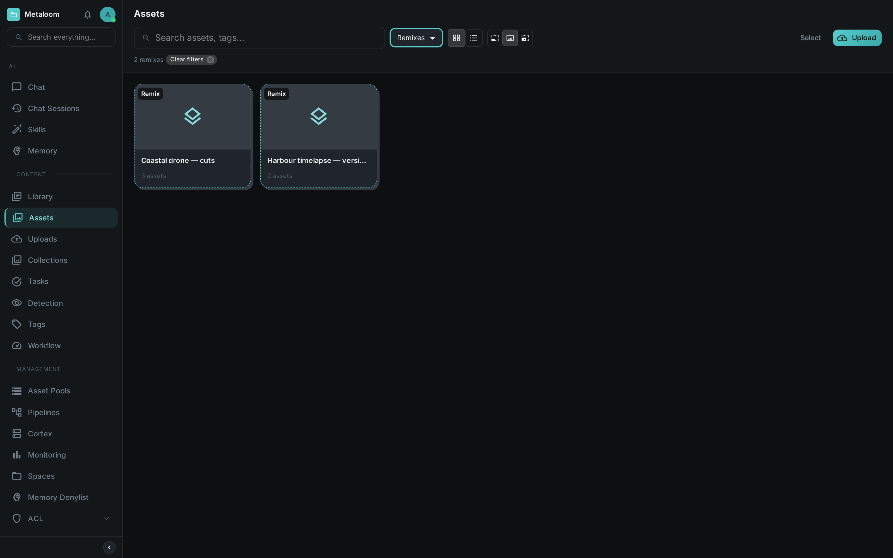
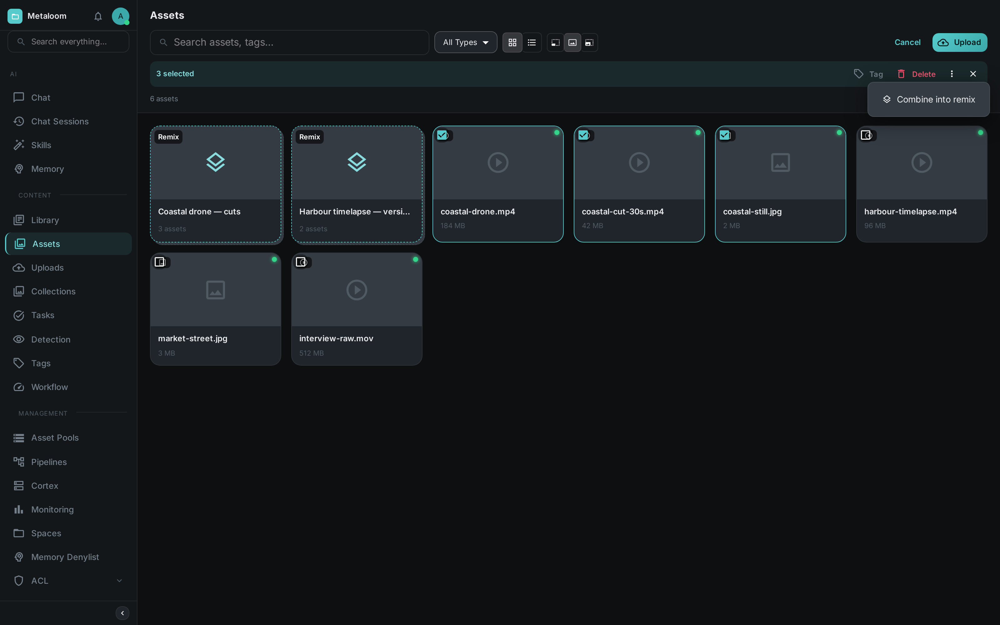
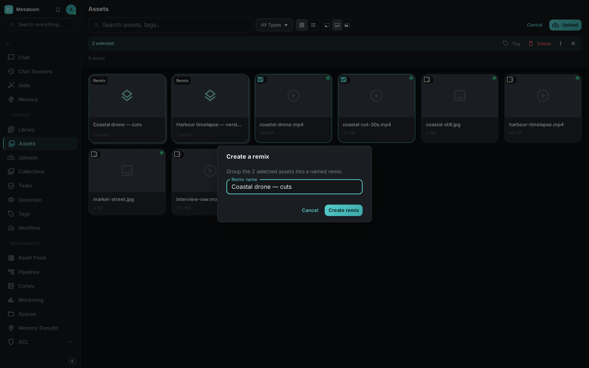

= Remixes

The same piece of work rarely exists as one file. There is the footage that came off the camera, the
cut somebody made from it, the still pulled out of that cut, the version re-encoded for the web. All
different files, all the same thing.

A *remix* is a named group that holds them together. You give it a name, you say which file is the
original, and from then on the group sits in your asset browser as a single card you can open.

== What a remix is not

Remixes sit alongside two things Loom already does, and it is worth being clear about the
difference.

A *collection* organises assets by topic — the autumn campaign, the product shots, everything from
the trade fair. The files in a collection have nothing to do with one another beyond belonging to
the same piece of work. A remix says something much stronger: these files *are* one another, in
different forms.

*Duplicate detection* finds files that are byte-for-byte the same, or near enough that one of them
should probably go. A remix is the opposite situation — the files are genuinely different and all of
them are worth keeping. Nothing is ever deleted because of a remix.

== Seeing your remixes

Remixes appear at the front of the asset grid, before your files. They are drawn differently — a
dashed border, a stacked card, and a count of what is inside — so you can tell at a glance which
cards are groups and which are files.

The assets inside a remix still appear in the grid on their own, as they always did. Putting a file
in a remix does not hide it or move it anywhere.

== Opening one

Click a remix card and it opens over the grid, showing everything inside it. You do not lose your
place — close it and you are exactly where you were.

The original is outlined and labelled. Hover any other member and you can promote it to be the
original instead, or take it out of the group. Click a member's picture to jump to that asset's own
page.

The address bar carries the opened remix, so you can bookmark it or paste it to a colleague and they
will land on the same group.

TIP: Renaming is done in place — click the name at the top of the panel, type, and press Enter.

== Finding one

Remixes are searchable. Type into the search box above the asset grid and the remix band narrows to
the groups that match, alongside the assets that match.

A remix matches on its name, on its description, and on *the filenames of the assets inside it* —
which is usually how you actually look for one. You rarely remember what you called a group, but you
do remember that the drone footage is in it.

To see nothing but remixes, choose *Remixes* from the type filter beside the search box. The asset
grid steps aside and only the groups are left.

The main link:../../ui/#search[search screen] can filter to remixes too — tick *Remixes* in its type
row. A remix hit there opens the group over the asset grid, the same as clicking its card.

== Building one from a selection

The usual way to make a remix is to pick the files first. Press *Select* above the grid, tick the
assets that belong together, then open the *⋮* menu in the selection bar and choose *Combine into
remix*.

Give the group a name and it is created with everything you selected already in it.

Afterwards, open the remix and mark whichever file is the original.

== Adding a single asset

When you are already looking at one file and want to file it with others, use the actions menu on
the asset page and choose *Add to remix…*. Pick an existing remix from the list, or type a name that
is not in the list to start a new one containing this asset.

An asset's remixes are shown as chips near its name, next to its collections. Clicking one takes you
back to the grid with that remix open.

Adding a file that is already in the remix does nothing and reports no error, so you can re-submit a
selection without checking it first.

== What happens when things are deleted

Deleting a remix removes only the group. Every file in it is untouched and stays exactly where it
was.

Deleting a file removes it from any remix it was in. If the file happened to be the original, the
remix survives and simply no longer names one — losing the source footage should not also lose the
record of everything that was made from it.

== Permissions

Remixes are governed separately from the assets in them, so somebody can curate groups without being
able to change the files themselves.

[cols="1,3"]
|===
| Permission | Allows

| `READ_REMIX`
| See remixes and open them. Listing what is inside one also needs `READ_ASSET`.

| `CREATE_REMIX`
| Make new remixes. Also needs `READ_ASSET`, since a new remix names the assets that go into it.

| `UPDATE_REMIX`
| Rename a remix, change which file is the original, and add or remove members.

| `DELETE_REMIX`
| Delete a remix.
|===

== Beyond the browser

Everything above is available through the API, so remixes can be built and read by scripts as well
as by hand — see link:../rest-api/[REST API] for `/remixes` and its member routes, and
link:../python-client/[Python Client] for the typed equivalents.

The link:../chat/[AI agent] can also see them: ask it what versions of a file exist, or which groups
an asset belongs to, and it will read the remixes through its tools.
