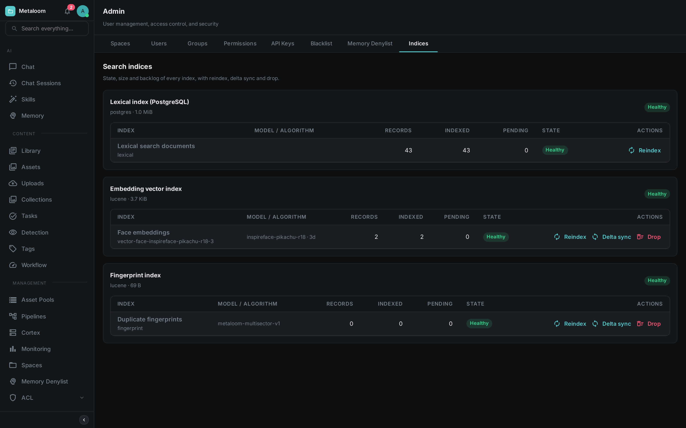
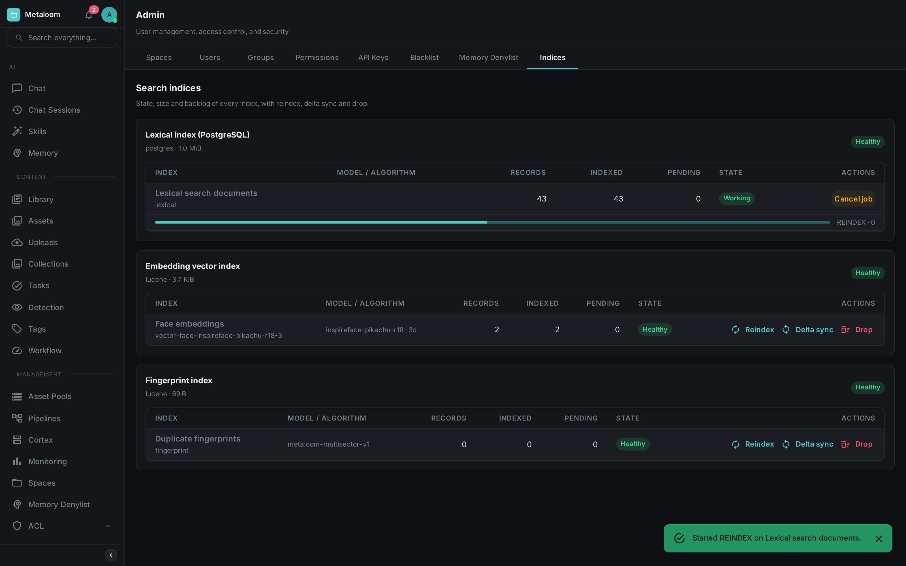

= Search Indices

Loom keeps several indices so that searching, face matching and duplicate detection are fast. They are
maintained automatically and you can normally ignore them. This page is for the times you cannot: after
a bulk import, after changing an embedding model, or when search is returning less than you expect.

Every index on this page is a **rebuildable cache**. The originals live in the database, and an index
can be emptied and reconstructed from them at any time without losing anything.

Open *Admin → Indices* in the Loom UI to see all of them at once.

Each card is a storage area; the rows beneath it are the indices kept there. In the screenshot the
lexical index holds 43 documents and matches the database exactly, the embedding vector index holds
two face vectors, and the fingerprint index is switched on but has nothing in it yet because no media
has been fingerprinted.

== The Indices

[options="header",cols="1,2,2"]
|===
| Index | What it holds | What it powers

| Lexical search documents
| The searchable text of every asset: filename, path, transcripts, captions, extracted metadata, tags
| The search box and `/search`

| Face embeddings
| One numeric fingerprint per detected face
| "Who else appears in this photo", face clustering

| Semantic text embeddings
| One numeric fingerprint per asset, describing what it is *about*
| Meaning-based search, where "sunset over water" finds a beach clip that never uses those words

| Duplicate fingerprints
| One perceptual fingerprint per media file
| Near-duplicate detection and the deduplication review queue
|===

Face and semantic embeddings are only present if you run the corresponding pipeline nodes, and semantic
search additionally needs an embedding service. An index that is not configured is shown as *Disabled*
with the reason, rather than hidden — so you can tell "switched off" from "broken".

== Reading the Screen

Each index shows two counts side by side, and their disagreement is the useful part.

*Records* is what the database holds. *Indexed* is what the index holds. When they match, the index is
current.

[options="header",cols="1,3"]
|===
| State | Meaning

| Healthy
| The index matches the database. Nothing to do.

| Behind
| New material is waiting to be indexed. This is normal shortly after an import and clears on its own,
  usually within seconds. If it does not fall over several minutes, something upstream is stuck.

| Drifted
| The index holds more entries than the database does — leftovers from assets that were deleted while
  the index was unavailable. Run a *Delta sync*.

| Working
| A maintenance job is running. Its progress is shown beneath the row.

| Unavailable
| The index is switched on but could not be opened. This is a fault worth investigating; the reason is
  shown when you hover the state.

| Disabled
| The index is not switched on for this installation. Not a fault.
|===

*Size on disk* is shown once per storage area rather than per index, because several indices share the
same files and there is no honest way to split the figure between them.

== Maintenance Actions

Actions start a background job. You can leave the screen; the job keeps running and its progress
reappears when you come back. Only one job runs per index at a time.

While a job runs, the index switches to *Working*, a progress bar appears beneath it, and the action
buttons are replaced by *Cancel job*. Cancelling is polite rather than abrupt: the job stops at the
next item, and whatever it had already written stays written — these operations can always be run
again. The bar above is deliberately indeterminate; see the note under *Reindex*.

Reindex::
Empties the index and rebuilds it from the database. Always safe, but it walks your whole library, so
it can take a while — and while it runs, that index returns less than the full picture. Use it after
changing an embedding model, after restoring a backup, or when an index has drifted badly enough that a
delta sync is not worth it.
+
The lexical index rebuilds in a single database operation, so it cannot report a percentage and its
progress bar simply sweeps until it finishes. The other indices are walked item by item and do show a
real percentage.

Delta sync::
Writes what is missing, refreshes what changed, and removes leftovers. Much cheaper than a reindex and
the right first response to *Behind* or *Drifted*. This is the only action that removes leftovers — a
reindex gets rid of them for free by starting from empty.
+
NOTE: For semantic text embeddings, a delta sync sends every changed asset to your embedding service.
If that service is metered, this action costs money. It is never triggered automatically by opening the
screen.

Drop::
Empties the index without refilling it. Searches against it return nothing until you reindex. Nothing
is lost — the source data is untouched — but it is a visible outage of that feature, so it asks for
confirmation. Use it when retiring a superseded embedding model.

The lexical index offers only *Reindex*. It is kept up to date by the database itself as you work, so
it cannot fall behind, and there is nothing to gain by emptying it.

TIP: After a drop or a large delta sync the reported size on disk does not shrink immediately. The
space is reclaimed in the background over the following minutes.

== Permissions

Two permissions control this screen, so you can let someone watch without letting them act.

[options="header",cols="1,3"]
|===
| Permission | Allows

| `READ_SEARCH_INDEX`
| Viewing the screen: sizes, backlogs, which model produced an index, and job history. Changes nothing.

| `MANAGE_SEARCH_INDEX`
| Starting a reindex, a delta sync or a drop.
|===

Assign them under *Admin → Permissions*, or to an API key under *Admin → API Keys*.

== Configuration

The index backends are opt-in. See link:../configuration/[Configuration] for the full list; the
relevant settings are:

[options="header",cols="2,1,3"]
|===
| Setting | Default | Effect

| `LOOM_VECTOR_INDEX_PROVIDER` | `none` | Set to `lucene` to enable face and semantic embedding indices
| `LOOM_VECTOR_INDEX_PATH` | `vector-index` | Where those indices are stored on disk
| `LOOM_SIMILARITY_ENABLED` | `false` | Enables the duplicate fingerprint index
| `LOOM_SIMILARITY_INDEX_PATH` | `similarity-index` | Where it is stored on disk
| `LOOM_SEARCH_SEMANTIC_ENABLED` | `false` | Enables semantic search; also needs `LOOM_SEARCH_EMBED_URL` and `LOOM_SEARCH_EMBED_MODEL`
|===

Both index directories should be on persistent storage in production. If they are lost, nothing is
gone — but every affected index has to be rebuilt before those features work again.

On Kubernetes, set these through `extraEnv` in the link:../helm-chart/[Helm chart] values.
