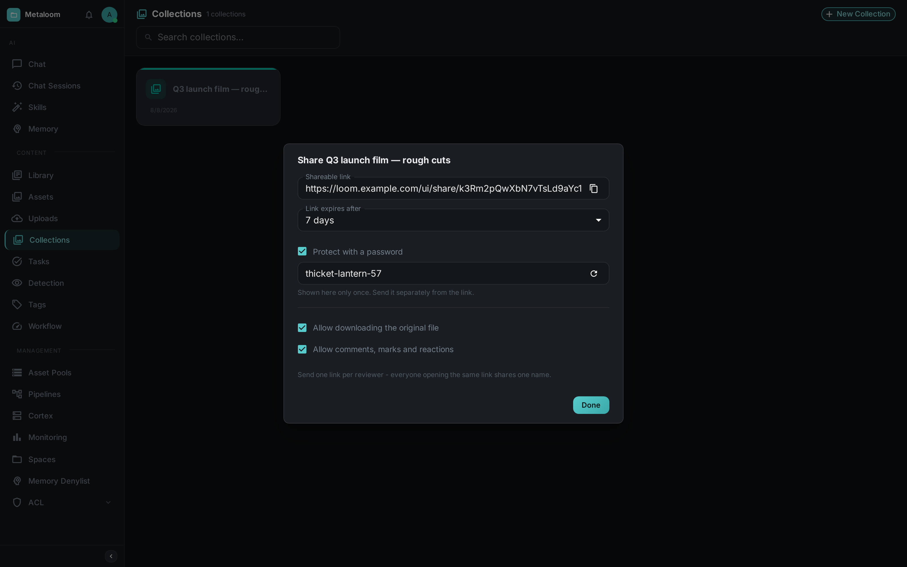
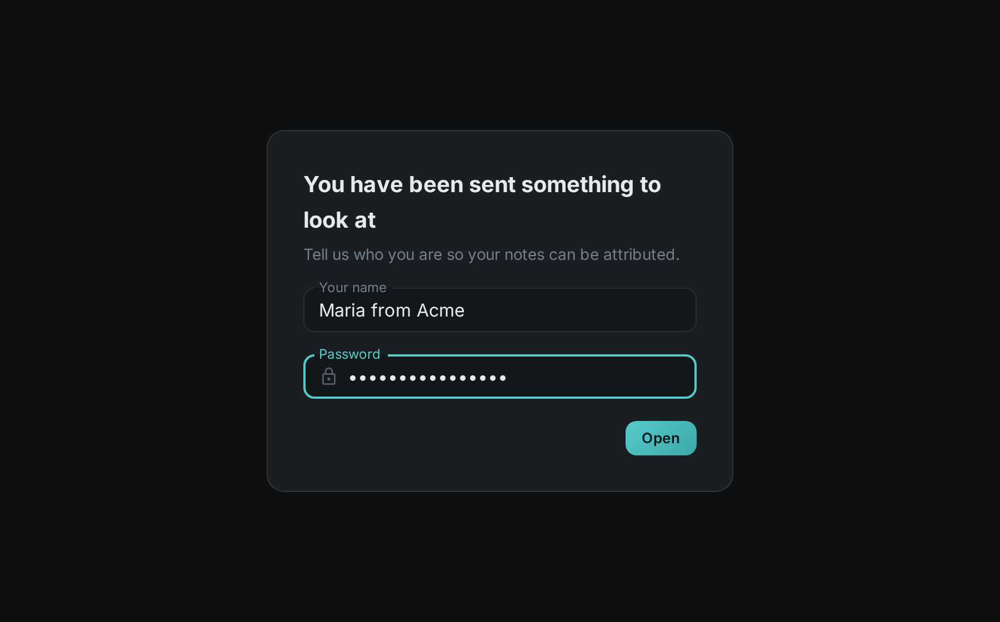
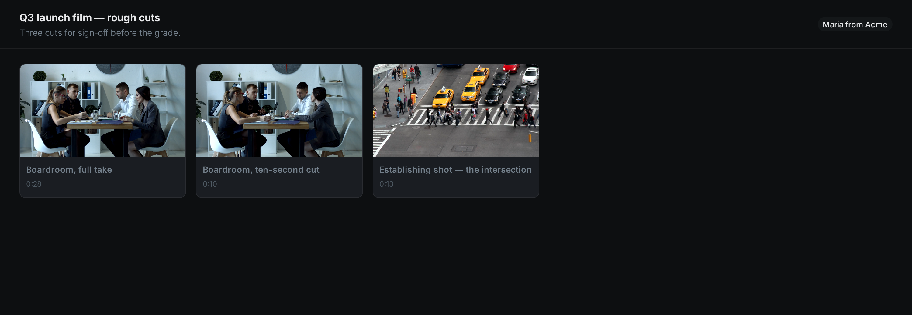
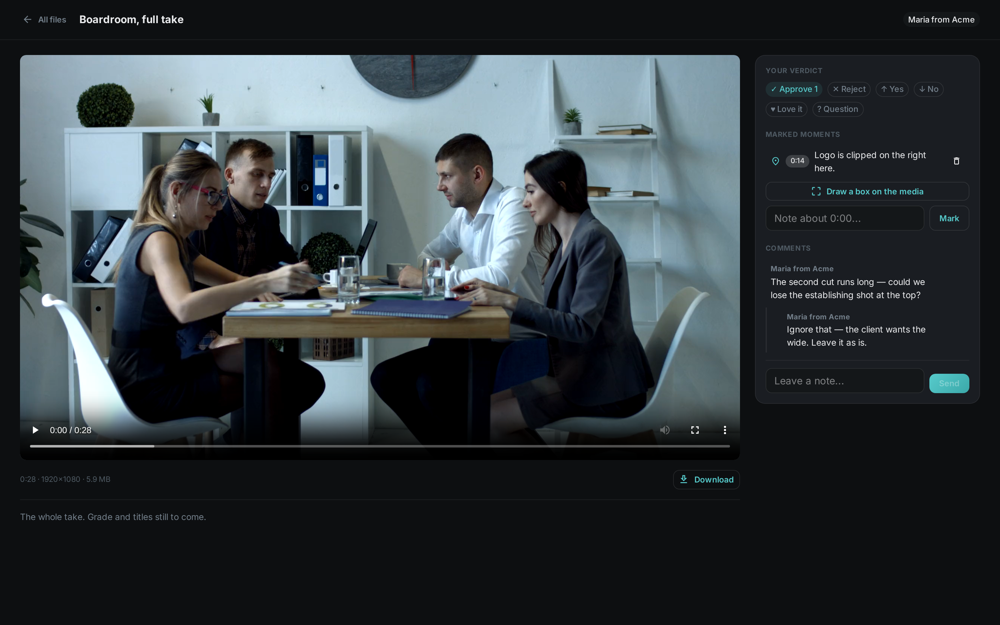

= Sharing

Not everyone who needs to see your material should need an account. A *share link* is a single URL
you can send to a client, a colleague at another company, or anyone else outside your Loom
installation. They open it in a browser and see exactly what you shared — one file, or a whole
collection — with nothing else around it.

You choose how long the link lives, whether it needs a password, whether the original file can be
downloaded, and whether the person at the other end can write back.

== Creating a link

Every asset and every collection can be shared. On a collection, hover the card and press the share
icon; on an asset, open the actions menu and choose *Share*.

The link exists the moment the dialog opens — there is nothing to save. Everything you change after
that applies to the same link straight away.

Shareable link::
Press the copy button and paste it into an email or a chat. The address contains a long random
string; nobody will find it by guessing.

Link expires after::
One day, seven days, one month, one year, or never. Seven days is the default, because a review link
that outlives the review is the mistake people make most often. An expired link simply stops
working.

Protect with a password::
On by default, with a password already generated for you. It is made of two words and a number so it
can be read out over the phone and typed on a small screen. You can replace it with your own, press
the refresh icon for a different one, or uncheck the box for a link anyone can open.
+
IMPORTANT: The password is shown *once*, here, and is never displayed again — Loom only stores a
one-way hash of it. Copy it before you close the dialog, and send it separately from the link
itself.

Allow downloading the original file::
When off, the recipient can watch or view the material in their browser but cannot save the original
file.

Allow comments, marks and reactions::
When off, the link is read-only.

[TIP]
====
*Send one link per reviewer.* A link carries one name — the first person to open it. If two people
use the same link, their notes appear under the same name and either can delete the other's. Making
a second link takes a few seconds and keeps their feedback apart.
====

To withdraw a link, delete it. The URL stops working immediately, and anything written through it is
removed with it.

== What the recipient sees

The first time somebody opens the link, they are asked who they are — and for the password, if the
link has one.

The name is only used to label their comments; there is no account, no sign-up and no email address.
If they would rather not say, they can skip the question and their notes appear as *Anonymous*. Once
answered, the question is not asked again, and the answer is what you will see beside their feedback.

After that they are looking at the material.

A shared collection opens as a grid; a shared single file opens straight into the viewer. Video and
audio play in place, with a normal player they can scrub through. Images can be viewed full size.

If you allowed it, the panel beside the media is where they answer.

Your verdict::
One press to approve or reject, plus a few softer options for when the answer is not yes or no.

Marked moments::
A note pinned to the exact point in the clip they are watching — they never type a timecode.
Pressing the timestamp later jumps the player back to it.
+
They can also press *Draw a box on the media* and drag a rectangle over the picture, to point at
one thing rather than one moment. On a video the box remembers the moment as well as the place, so
clicking it later returns to both. The box is stored as a proportion of the frame, so it stays over
the same detail whether the review happens on a large monitor or a phone.

Comments::
A short thread, with one level of replies.

You are notified whenever somebody leaves feedback, and everything they said is attached to the link
you created, so it stays with the material rather than in your inbox.

== What is not shared

A share link shows the material and nothing else about your installation.

* Only the file or collection you named is reachable. If you share one clip, the link cannot be
  bent into showing another.
* Removing an asset from a shared collection removes it from the link at the same moment.
* The recipient sees the file name, and — unless you turn it off — its size, duration, dimensions
  and description. They do not see who uploaded it, where it is stored, what tags it carries, what
  your pipelines concluded about it, or anything else in your library.
* A link that has expired, been deleted, or never existed all answer the same way, so the address
  cannot be used to find out what else you might have.

Repeated wrong password attempts on the same link are slowed down automatically.

== Frequently asked

Can I change what a link shows after I have sent it?::
You can change the expiry, the password and the two switches at any time, and the change takes
effect on the next page the recipient loads. You cannot repoint a link at different material —
that would hand somebody something you never gave them. Make a new link instead.

What happens to my links if my account is deleted?::
They keep working. A link handed to a client outlives the person who created it; it simply stops
having an owner listed.

Does the recipient need to install or sign up for anything?::
No. A browser is all that is required.
