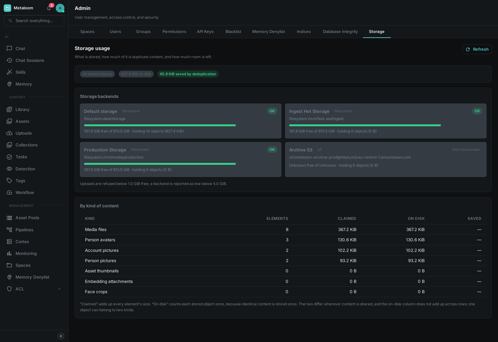

= Storage Usage

Everything Loom holds that is not a database row is a file: the media you uploaded, the thumbnails
and face crops produced while processing it, the pictures attached to people and to accounts. This
page is about seeing how much of it there is and how much room is left.

Open *Admin → Storage*. Nothing is changed by looking: the report reads, counts and reports.

== The two byte columns

The table gives every kind of content two sizes, and they are usually different numbers.

Claimed:: The sum of every element's size. If you have nine hundred face crops of 40 KB each, this
says 36 MB. It is the figure to use when deciding what a customer or a project has accumulated.

On disk:: What those elements actually occupy. Loom stores content by its fingerprint, so two
elements holding byte-identical content are stored once. If most of those nine hundred crops are
duplicates, this column may say 4 MB.

The gap between them is shown as *Saved*, and on an installation with a lot of derived material it is
often the larger part of the total. Neither number alone is the truth: the first overstates what you
would free by deleting things, and the second gives no sense of how much material there is.

[NOTE]
====
The *On disk* column does not add up down the page. One stored file can belong to two kinds at once —
adding a face crop to a person's pictures deliberately keeps a single copy of the image and lets both
refer to it. The single *on disk* figure in the summary at the top is the real total and is counted
separately.
====

== Space still in use after a delete

The summary shows an *unreferenced* figure when there is one: stored files that nothing points at any
more.

Removing a picture, a face crop or an attachment removes the record of it immediately, and it stops
appearing everywhere in Loom. The file itself is not removed in the same step, because the same file
may still be in use by something else — that is the flip side of storing identical content once.
Reclaiming it is a separate piece of housekeeping.

In practice this figure grows slowly and is worth watching rather than acting on. If it becomes a
large share of your storage, that is worth raising.

== Storage backends

One card per place Loom writes to: the default storage directory, plus one for every storage pool you
have configured.

Free space:: How much room the volume has, and how much it has in total. The bar and the status
label come from two thresholds you configure — see below.

Not measurable:: What an S3 or compatible object store reports. A bucket has no size and no free
space, so Loom says so rather than showing a reassuring green bar for a question that was never
asked. The number of objects and the bytes they occupy are still counted, since those come from
Loom's own records.

A pool Loom cannot reach — a bucket that has been renamed, credentials that have expired — is
reported on its own card with the reason. The rest of the report is unaffected.

== Thresholds, and what happens when you cross them

Two settings, both in bytes:

`LOOM_STORAGE_MIN_FREE_SPACE`:: The hard limit, 1 GiB by default. Once a volume has less than this
free, Loom *refuses new uploads to it* with a clear error rather than filling the disk and taking the
database down with it. The backend shows as *Full*.

`LOOM_STORAGE_WARN_FREE_SPACE`:: The early warning, 5 GiB by default. Below this the backend shows as
*Low* and a warning is written to the log. Nothing is refused.

Both apply to every kind of upload — media, attachments, pictures of people, account pictures. Neither
applies to an object store, which has no capacity to run out of.

Loom re-checks free space in the background every five minutes
(`LOOM_STORAGE_SPACE_CHECK_INTERVAL_MS`) and logs a warning or an error when a backend crosses a
threshold, so a filling disk shows up in your logs without anyone opening this screen. The same
figures are exported as metrics — see link:../metrics[Metrics] for `loom_storage_free_bytes`,
`loom_storage_watermark` and their siblings.

== Kinds of content

Media files:: The originals you uploaded. Almost always the largest row.

Asset thumbnails:: Preview images generated during processing.

Face crops:: The cutout of each detected face, stored so that reviewing faces does not mean fetching
the whole video frame every time.

Person pictures and Person avatars:: The pictures belonging to a person. The avatar is whichever one
of them is shown as that person's face; it is listed separately so you can see how much of the total
is the gallery rather than the picture actually in use.

Account pictures:: Profile pictures uploaded by users on their own profile page.

Embedding attachments:: Data stored alongside a similarity embedding.

A future release may add a kind; it will appear as a new row rather than being folded into an
existing one.

== Who can see it

Reading this screen needs the `READ_STORAGE` permission. It is granted to the administrator role by
default. It is deliberately separate from the permission to *edit* storage pools: seeing how full a
volume is and being able to repoint it at a different bucket are different things to trust somebody
with.

See also link:../binary-storage[Binary Storage] for where the bytes go and how to choose between disk
and S3 per library.
