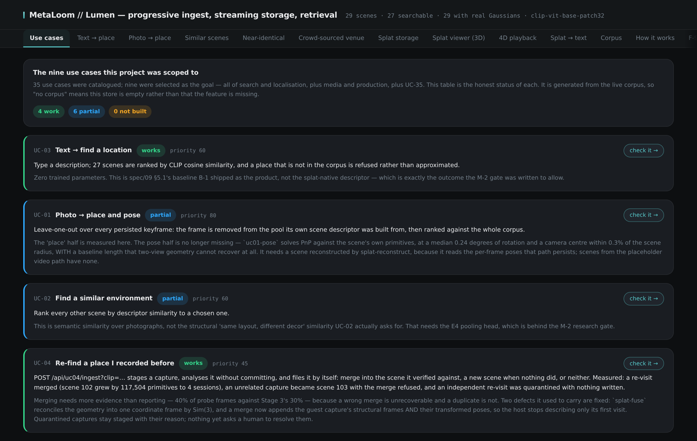

*MetaLoom // Lumen* is the spatial media engine. You hand it video of a place; it reconstructs the
place as a three-dimensional Gaussian-splat scene, keeps every scene in a versioned store, and lets
you find places again — with a sentence, with a photograph, or with a new capture of the same
location.

Lumen is a **commercial offering**. Unlike the open source MetaLoom platform, it is licensed per
deployment and ships as a container image for your own GPU hardware — see the
link:/lumen/[product page] for what it does and whom to talk to.

.The web console's use-case overview — each capability with its live, honest status

== What Lumen is for

Video is the easiest way to capture a place and the hardest way to find one again. A folder of
clips has no notion of *where* — two recordings of the same café share nothing a filename search
could discover. Lumen's answer is to make the **place itself** the unit of storage: captures are
reconstructed into scenes, scenes are indexed, and every question — "where was that?", "have I been
here before?", "does this footage show the same room?" — is answered against reconstructed
geometry, not against file metadata.

Three properties distinguish it:

* **Real reconstruction.** Scenes are trained radiance fields rendered as Gaussian splats, not
  photo carousels. A scene can be orbited interactively in the browser, rendered from any
  viewpoint, and described in words.
* **A store, not files.** Scenes live in a write-ahead log with quantised primitives, spatial
  ordering, compaction, level-of-detail pyramids and published quality tiers. Any scene can be read
  at any point in its history.
* **Honest retrieval.** Search is calibrated against measured score distributions: a place that is
  not in the corpus is *refused*, not approximated. Merging two captures of one venue requires
  geometric verification, never mere similarity.

== Where to go next

[cols="1,3"]
|===

| link:concepts[Concepts]
| How a clip becomes a scene: the frame gate, pose recovery, optimisation, decomposition — and how
the store keeps and serves the result.

| link:web-ui[The web console]
| A screenshot tour of the browser interface: search, the 3D splat viewer, storage insight and the
ingest queue.

| link:container[Running Lumen]
| The container image: GPU requirements, volumes, fetching the encoder weights and serving the
console.

|===
