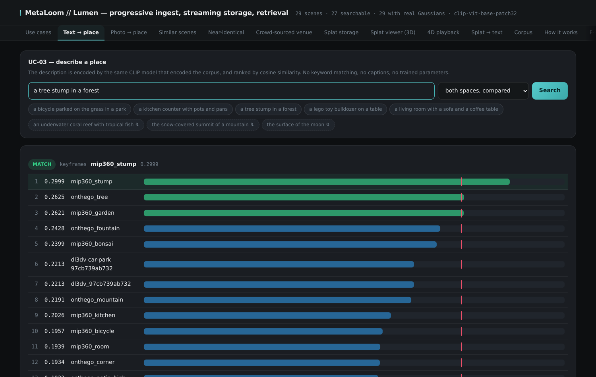
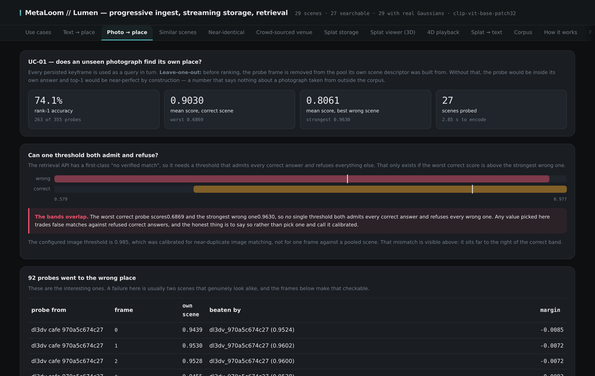
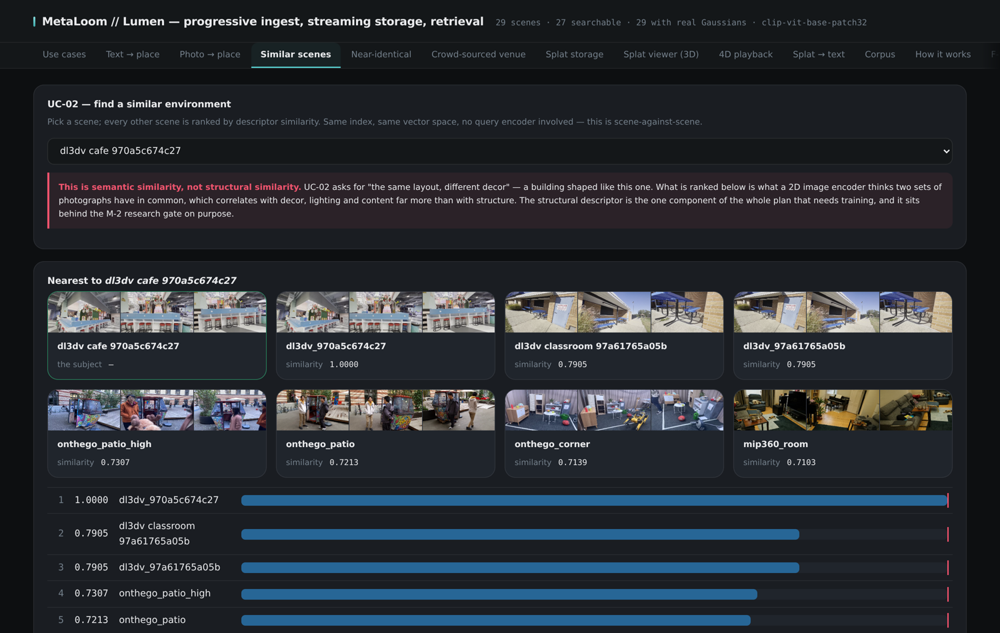
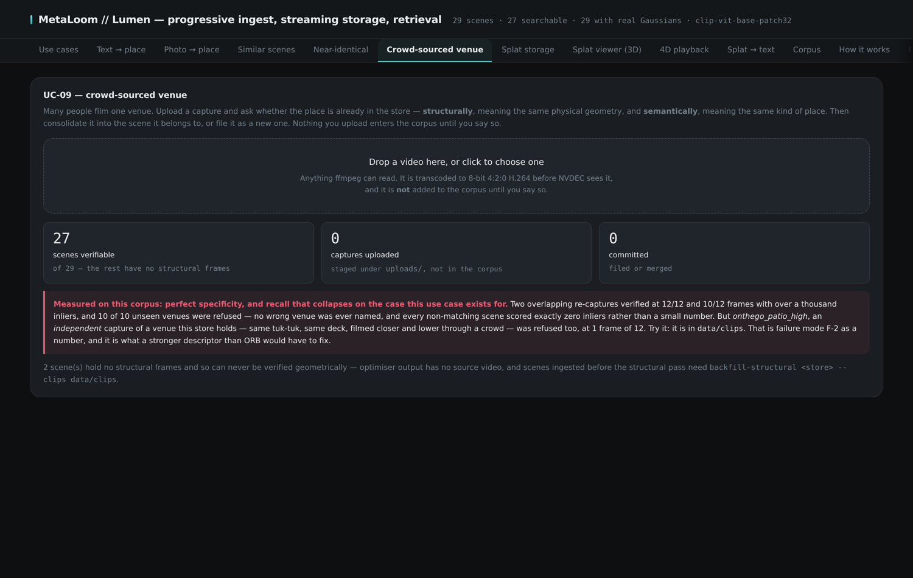
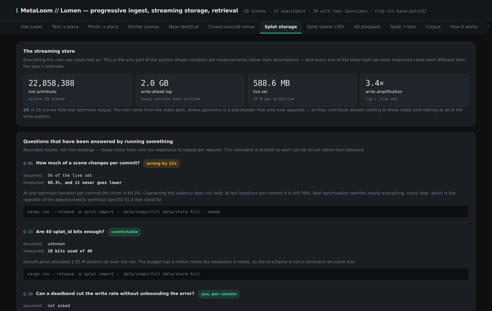
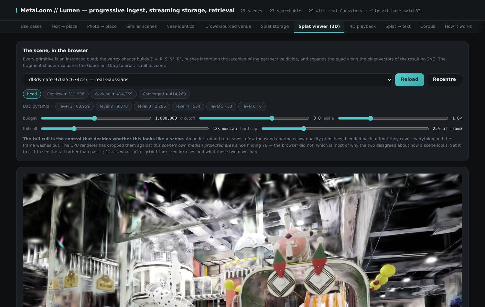
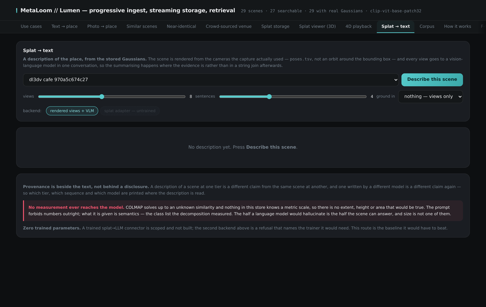
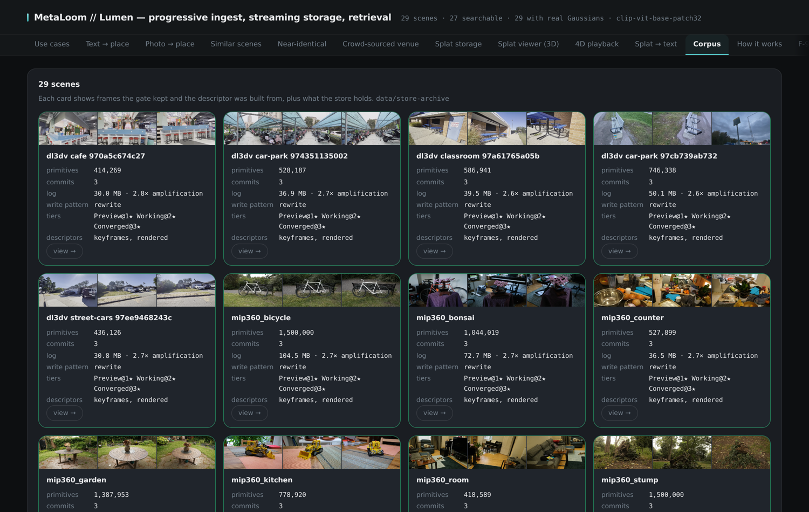
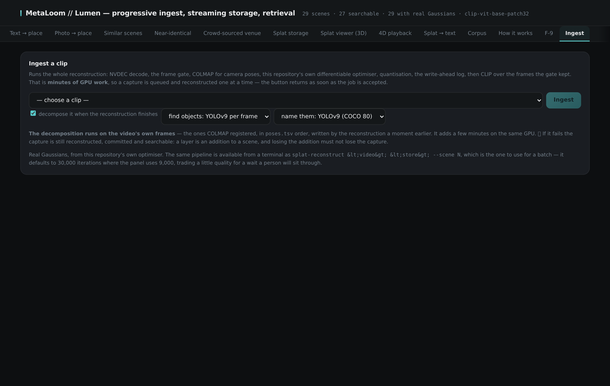

The web console is bundled into the Lumen server itself — one process, no separate deployment. It
is deliberately transparent: every panel shows not just a result but the machinery behind it — the
vector space that was searched, the admission threshold, where each candidate fell relative to it —
so an operator can tell a correct "no match" from a broken one.

The console binds to the local machine only and carries no authentication; the
link:../container[container image] explains how exposure is handled when it serves beyond
localhost.

== Text → place

Type a description of a place; every scene in the corpus is ranked against it in a joint
image-text embedding space. The dashed suggestion chips are places deliberately *not* in the
corpus — they must come back refused, and the plot shows the admission threshold every candidate
was measured against.

.A description finds its scene at rank 1, with the threshold drawn where it was calibrated

== Photo → place

The same search driven by an image instead of a sentence. The panel runs a leave-one-out
evaluation over every stored keyframe: each frame is removed from its own scene's descriptor
before being ranked against the whole corpus, so the headline number cannot be inflated by
self-matching.

.Leave-one-out over the corpus — each keyframe ranked against every scene, score bands plotted

== Similar scenes

Ranks every other scene by descriptor similarity to a chosen one — and states plainly that this
is semantic similarity ("looks like the same kind of place"), which is not the structural
identity that venue verification establishes.

.Scene-to-scene similarity across the corpus

== Crowd-sourced venue

The only panel that takes input from outside the corpus. Drop a video in; it is decoded and
analysed but *not* stored, then ranked twice — semantically by embedding similarity and
structurally by two-view geometric verification, with the verified image pair and every signal
shown per candidate. Only a geometrically verified capture may merge into a venue, at which point
the venue's primitive counts split by session of origin.

.An outside capture, ranked semantically and verified geometrically before any merge is offered

== Splat storage

The store's own dashboard: live primitive counts, log and live-set sizes, write amplification,
tier watermarks, and a compaction dry run. The lower half records the storage questions that have
been answered by running something — each with what was assumed, what was measured, and the exact
command that reproduces the measurement.

.The streaming store, measured rather than assumed

== Splat viewer (3D)

Real Gaussians read back out of the store — by tier, at any historical sequence, or from any
pyramid level — and rendered as actual splats in WebGL, orbited interactively. The sliders expose
the primitive budget, the size cutoff and the tail cull, so what the store holds and what the
renderer draws can be told apart.

.Half a million primitives, orbited in the browser, straight from the store

== Splat → text

A stored scene rendered from the viewpoints its capture actually used and handed to a
vision-language model for description. A scene too thin to describe honestly is refused, with the
number that refused it.

.A place, described from its reconstruction rather than its footage

== Corpus

Every ingested scene: its frames, primitive count, log size, tier watermarks, and which
descriptor sources exist for it. This is where a corpus is audited at a glance.

.The corpus, scene by scene

== Ingest

Run a clip through the whole pipeline with live progress. Reconstruction is minutes of exclusive
GPU work, so submissions enter a queue behind a single worker and their stage-by-stage progress —
gate, poses, optimisation, commit — streams into the panel.

.The ingest queue, with per-stage progress for each submitted capture

