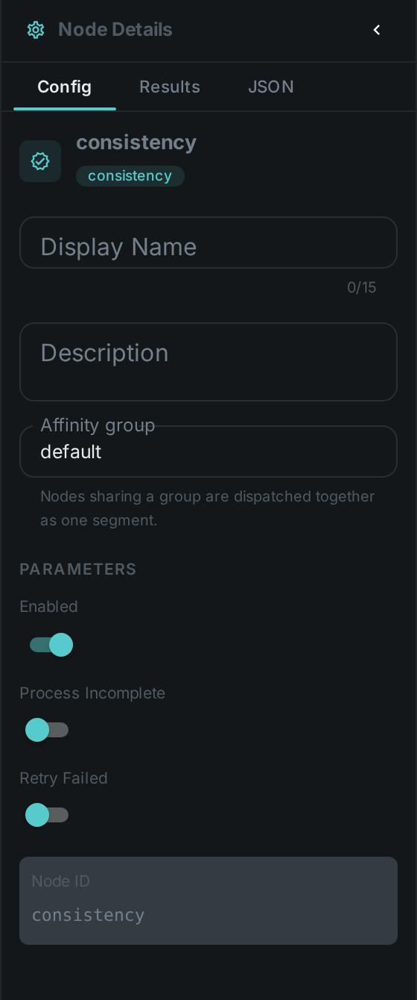
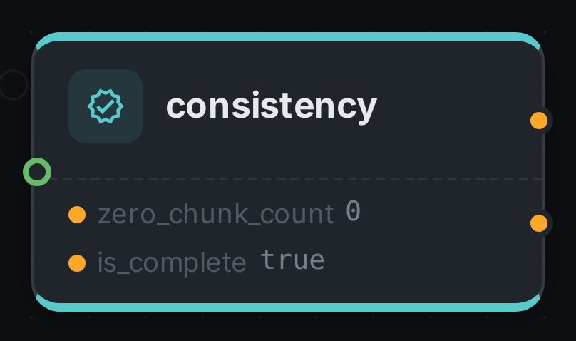

The consistency node checks that a media file is complete and not corrupt by counting **zero chunks**
(runs of empty bytes) that indicate a truncated or partially-downloaded file. Running it early lets a
pipeline skip expensive processing on broken media.

++++

++++

[cols="1,3"]
|===
| Kind | `consistency`
| Applies to | Video, Audio
| Input ports | `media`
| Output ports | `zero_chunk_count` (Integer), `is_complete` (Boolean)
| Requirements | CPU only. Reads the file bytes from storage.
| Persists to | `asset` consistency block + `asset_node_result` ledger
|===

Connect `is_complete` to a downstream node that should not waste time on a broken file — for example
link:../thumbnail/[Thumbnail], whose optional `is_complete` port makes it skip incomplete videos.

== Configuration

.The node's settings in the pipeline editor

No custom options beyond the common node flags.

== Seeing it run

Turn on link:../../pipeline/#debug-mode[Debug Mode] and every node keeps what it produced, on the
card itself. Below is a real run of this node over `pexels-jack-sparrow-5977265.mp4`.

The strip on the card lists what each output port carried — `zero_chunk_count`, `is_complete`.

== Use Cases

* **Ingest gatekeeping** — detect truncated or corrupt downloads before spending time on hashing,
  transcoding or ML nodes.
* **Data-quality reporting** — flag incomplete assets in a library for re-fetch.
