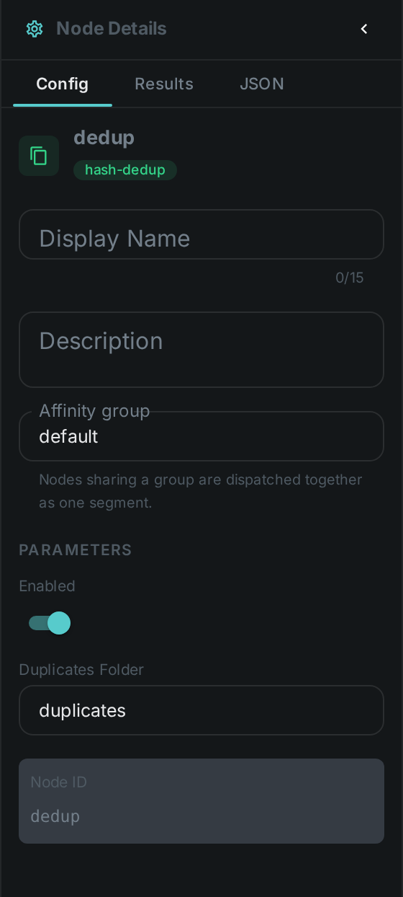
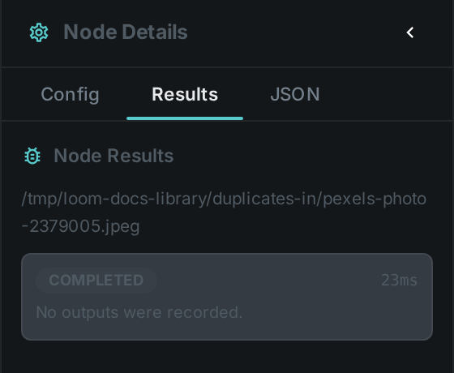

The deduplication nodes find duplicate media and tell you which copy is redundant. They do not move
anything themselves — you wire their result into a link:../move/[Move] node, which decides where the
extra copy goes and whether the original survives. There are two ways to decide that two files are
"the same":

* **By content hash** — the files are byte-for-byte identical.
* **By perceptual fingerprint** — the files *look* like the same footage, even when they are different
  encodes, resolutions or crops. Because that is a judgement call, near-duplicates are never deleted
  automatically: they are collected for a person to confirm first.

++++

++++

[cols="1,3"]
|===
| Kinds | `sha512-dedup` (exact), `fingerprint-dedup` (find near-duplicates), `fingerprint-dedup-apply` (act on confirmed ones)
| Applies to | Any file (hash) / Video (fingerprint)
| Input ports | Hash dedup takes `hash`, which accepts *any* hash type — connect the `hash` port of a link:../hash/[hash] node; fingerprint dedup takes `fingerprint` — connect the `fingerprint` port of link:../fingerprint/[Fingerprint]
| Output ports | `sha512-dedup` emits `duplicate` and `original`; `fingerprint-dedup-apply` emits `confirmed_dup` and `keep_path`. Both stay silent when there is nothing to act on. `fingerprint-dedup` has none — it writes review entries
| Requirements | CPU only. Nothing is written to disk by these nodes.
| Persists to | Duplicate groups awaiting review, plus a processing ledger entry per file
|===

== Finding near-duplicate videos

Near-duplicate detection is a four-step workflow, and the split is deliberate: nothing is moved until
a person has agreed to it, and the moving itself is a step you can see.

. **Find.** `fingerprint-dedup` compares each video's perceptual fingerprint against every other
  fingerprinted video and groups the ones that match closely enough. Each group records one file to
  *keep* and one or more *duplicates*. **No file is changed at this stage.**
. **Review.** The groups queue up under *Workflow → Dedup*, where you work through them a keystroke
  at a time — see link:../../ui/#reviewing-duplicates[Reviewing duplicates]. Confirming a group
  approves the proposed clean-up; rejecting it means those files are never touched again. Once you
  have decided a set of files, the search will not put it back in the queue on the next run.
. **Confirm.** `fingerprint-dedup-apply` acts only on confirmed groups, re-checks the file that would
  be kept against what is on disk right now, and passes the redundant copy on. It touches no files.
. **Move.** A link:../move/[Move] node takes it from there — into a trash folder, an archive bucket,
  or wherever you decided. This is the only step that changes anything on disk, and you can leave it
  in dry-run until you trust the rest.

TIP: Fingerprint dedup needs the link:../fingerprint/[Fingerprint] node to have run first, and
near-duplicate lookup must be switched on in the server configuration. Without it, the workflow has
nothing to compare.

=== Which copy is kept

The node picks the copy that is **largest among the complete files**, and it refuses to propose a
group at all when that choice looks unsafe — for example when one of the candidate duplicates is
*larger* than the file that would be kept, or when no candidate is known to be complete. The intent
is that a clean-up can only ever discard the lesser copy.

Before it passes anything on, the apply step checks all over again against the files as they are on
disk right now: the file being kept must still exist, still be complete, still be at least as large as
the duplicate, and must still hold the same content it had when the group was proposed. If any of that
no longer holds, the item is skipped rather than guessed at, and nothing appears on its output port.

That last check matters most when a review has been sitting in the queue for a while: a file that was
replaced in place in the meantime still exists and is still the right size, but is no longer the copy
the reviewer approved. Verifying it costs nothing when a checksum is already on record for the file,
which is the normal case once it has been through a hash step.

Both steps are safe to re-run. Re-running the search updates the same pending group instead of piling
up new ones, and the link:../move/[Move] node at the end skips files that are already at their
destination.

=== Wiring it up

Connect `confirmed_dup` to the `media` port of a link:../move/[Move] node. That node decides where
confirmed duplicates go — a trash folder you can still look in, or an archive bucket — and whether the
original is removed once the destination has been verified. Keeping that decision in the pipeline
rather than in a worker's configuration is the point: it is visible to whoever drew the graph.

== Configuration

.The node's settings in the pipeline editor

The apply step (`DedupNodeOptions`):

[options="header",cols="1,2"]
|===
| Option | Meaning
| `keepExcludeFolder` | Never act when the file being *kept* is itself inside this folder. Set it to the same folder your Move node trashes into, so a copy that has already been discarded can never be used to justify discarding another. Empty by default, which turns the check off
|===

NOTE: These nodes used to have a `dupFolder` setting and moved files into it themselves. That setting
is gone. If you have it in a worker configuration it is now ignored — add a link:../move/[Move] node
to your pipeline instead, or duplicates will simply stop being cleared.

Near-duplicate search (`fingerprint-dedup`):

[options="header",cols="1,2"]
|===
| Option | Meaning
| `algorithm` | Which fingerprint version to compare (defaults to the one the Fingerprint node produces)
| `topK` | How many similar videos to consider per file
| `scoreThreshold` | How close a match has to be before it counts as a near-duplicate. Higher is stricter.
| `abortOnLargerDup` | Refuse to propose a group when a candidate duplicate is larger than the file that would be kept. On by default.
| `allowPartial` | Allow a group even when no candidate is known to be a complete file. Off by default.
|===

== Seeing it run

Turn on link:../../pipeline/#debug-mode[Debug Mode] and every node keeps what it produced. For a file
that turned out to be a duplicate you will see the `duplicate` port carrying it, and `original`
naming the copy the system already had. For a file that did not, both stay empty — which is exactly
how the routing works: a downstream node wired to `duplicate` simply receives nothing for that item.

TIP: The empty case is not a failure. A pipeline that finds no duplicates should show a green run with
silent ports, and that is what it does.

== Use Cases

* **Ingest cleanup** — collapse byte-identical files as they are scanned from a folder or NAS.
* **Near-duplicate video pruning** — find re-encodes and re-uploads of the same footage, review them,
  and clear out the redundant copies once approved.
* **Reclaiming storage safely** — the review step means a large clean-up can be checked before any
  file moves, and the Move node at the end can be left in dry-run until you are satisfied.
