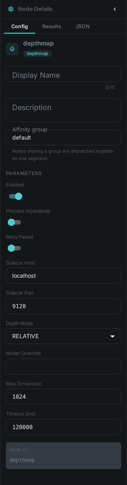

The depth map node works out **how far each part of a photo is from the camera**, from the photo
alone. No stereo pair, no depth sensor, no camera metadata — a single image goes in, and a
greyscale map comes out in which bright means close and dark means far.

That map is what turns a flat list of detected things into a scene you can reason about. On its own
it powers depth-aware cropping, background separation and subject isolation; combined with
link:../scene-layout/[Scene Layout] it is what lets MetaLoom say a person is standing *in front of*
a car rather than merely overlapping it in the frame.

The model runs behind a small HTTP sidecar, so the node stays a pure client and your worker needs no
machine-learning runtime of its own.

++++

++++

[cols="1,3"]
|===
| Kind | `depthmap`
| Applies to | Images. Video is not supported yet
| Input ports | `media` — the image asset itself, no upstream node required
| Output ports | `meta` (the description below, and what link:../scene-layout/[Scene Layout] connects to), `map` (the PNG on the worker), `flag` (String)
| Requirements | A running **depth sidecar** (`/v1/depth`). CPU works for the default model; a GPU is much faster and is recommended for metric mode
| Persists to | The generated map stays on the worker under `depthmap_bin`; a processing record is stored against the asset
|===

== What it produces

A **16-bit greyscale PNG** and a small JSON description of it:

[source,json]
----
{
  "model": "depth-anything/Depth-Anything-V2-Small-hf",
  "convention": "NEARNESS",
  "source": "RELATIVE",
  "width": 1024, "height": 683,
  "imageWidth": 4000, "imageHeight": 2667,
  "stats": { "p05": 0.11, "p50": 0.38, "p95": 0.82 },
  "path": "/var/lib/cortex/depthmap_bin/ab12/<hash>.png"
}
----

=== Reading the map

The one rule worth remembering: **brighter is closer**. The map stores *nearness*, not distance —
white is right in front of the lens, black is the far background. Every model is normalised to that
same convention before it reaches you, so a map is readable the same way regardless of which model
produced it.

Two further details matter if you process the map yourself:

* `width` and `height` describe **the map**, which is a scaled-down version of your image. `imageWidth`
  and `imageHeight` give the original, so you can map coordinates between the two.
* Relative mode gives you reliable *ordering* — what is in front of what — but not distances. If you
  need actual metres, switch to metric mode and read `metric.min_m` / `metric.max_m`.

== Configuration

.The node's settings in the pipeline editor

`DepthmapNodeOptions`:

[options="header",cols="1,2"]
|===
| Option | Meaning
| `depthHost` / `depthPort` | Where the depth sidecar is listening. Defaults to `localhost:9120`
| `mode` | `RELATIVE` (default) orders things front-to-back; `METRIC` also reports a range in metres
| `model` | Use a specific model instead of the sidecar's default for the selected mode
| `maxDim` | Longest side sent for analysis, default 1024. Lower is faster and coarser; this also sets the size of the produced map
| `timeoutMs` | How long to wait for the sidecar, default 120000
|===

== Requirements and models

The default model is **Depth Anything V2 Small**, published under Apache 2.0 and usable
commercially. It is small enough to run on a CPU, though a GPU will process a large library far
faster. Metric mode uses **ZoeDepth** (MIT), which is heavier and really does want a GPU.

[NOTE]
====
The larger Depth Anything V2 models are published under a **non-commercial** licence and are
deliberately not the default. If you want higher quality with commercial terms intact, use a DPT /
MiDaS model instead. See link:../../legal/model-licenses/[Model licences].
====

== Use Cases

* **Subject isolation** — find the foreground automatically for cut-outs, blurred backgrounds or
  depth-aware crops that keep the subject.
* **Better automatic cropping** — a crop that respects depth keeps the person and drops the wall,
  instead of cutting by rule of thirds and hoping.
* **Scene understanding** — feed link:../scene-layout/[Scene Layout] so captions and search can talk
  about what is in front of what.
* **Quality triage** — flat depth across an entire frame is a good signal for a photograph of a
  screen, a document scan, or a flat-lay, which you may want routed differently.

== Deployment note

The generated map is stored on the worker that produced it. If you connect `meta` to
link:../scene-layout/[Scene Layout], put both nodes in the **same affinity group** in your pipeline
so they run on the same machine — otherwise the second node cannot find the map the description
points at.
