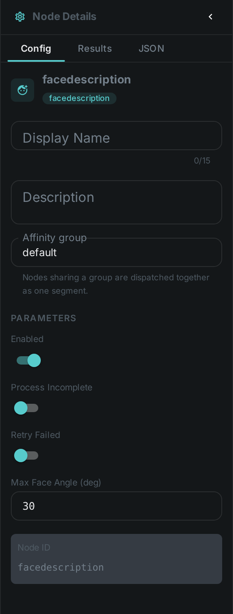
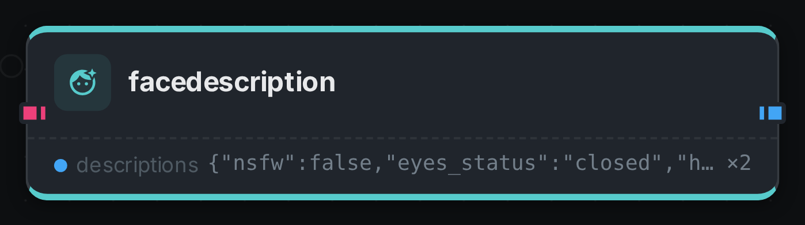

The face description node produces a **natural-language description** of the faces detected in an
asset, using a vision-language model. Its `detections` port carries a *sequence* — one element per
detected face — and the node describes each element in turn, so a picture with three faces comes back
with three descriptions in the same order. A sequence with no elements means there is nothing to
describe and no model call is made.

++++

++++

[cols="1,3"]
|===
| Kind | `facedescription`
| Applies to | Image (video is stubbed / not yet implemented)
| Input ports | `detections` (**many**) — connect the `detections` port of link:../facedetect/[Face Detection]; the crops travel with the elements, so the picture itself is not wired in
| Output ports | `descriptions` (**many** — one per incoming face, aligned with the input sequence)
| Requirements | A vision-language / LLM model service reachable from the worker. CPU on the worker; the model runs in the service.
| Persists to | `asset_json_comp` + `asset_node_result` ledger
|===

== Configuration

.The node's settings in the pipeline editor

Uses the model-service connection shared with the LLM/captioning family. There is nothing to
configure about where the faces come from — connect the `detections` port and the node follows it.

== Seeing it run

Turn on link:../../pipeline/#debug-mode[Debug Mode] and every node keeps what it produced, on the
card itself. Below is a real run over a frame with two people in it, fed the boxes
link:../facedetect/[Facedetect] found in that same frame.

Two boxes in, two descriptions out, aligned by element index — that alignment is why a face that
cannot be described still emits an empty document rather than being skipped. Each description is the
JSON the prompt asks for: eye state, mouth state, an age estimate, whether the face is frontal or in
profile.

== Use Cases

* **Searchable people descriptions** — "man with glasses, outdoors" style text for retrieval.
* **Accessibility / alt text** for images containing people.
* **Review context** — a quick textual summary of who/what is in a flagged image.
