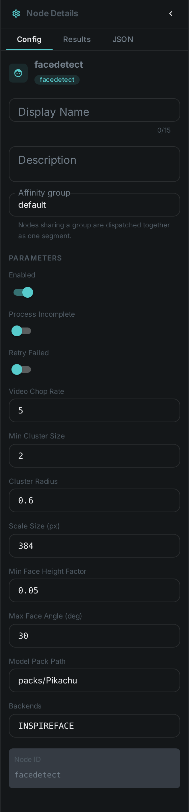
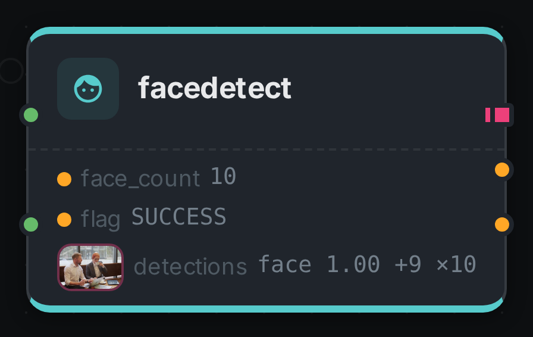
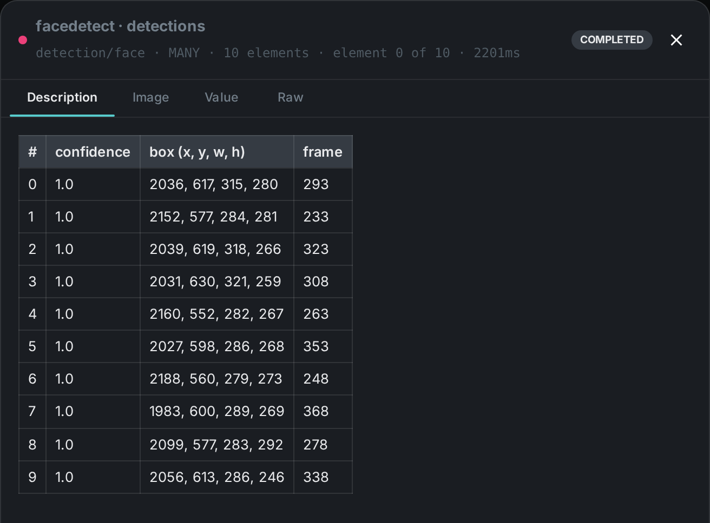

The face detection node finds faces in images and video frames, computes a **face embedding** (a
vector) for each one, and **groups those embeddings into the distinct people it believes it saw**.
Each group is proposed for review; a person on your team confirms who it is. Video is processed by
scanning frames at a configurable rate.

Grouping happens **within a single asset**. One video's faces are sorted into the people in that
video — it does not yet recognise the same person across two different files. See
<<Grouping faces into people>>.

++++

++++

[cols="1,3"]
|===
| Kind | `facedetect`
| Applies to | Image, Video
| Input ports | `image` or `video` — exactly one of the two is wired
| Output ports | `detections` (**many** — one element per detected face, the boxes that feed link:../scene-layout/[Scene Layout], link:../dominant-color/[Dominant Colour] and link:../facedescription/[Face Description]), `face_count` (Integer — **distinct people**, not boxes), `flag` (String). Embedding vectors and face groups are **not** connectable ports: they are written straight to Loom, so face search and the review screen read them from there rather than through the graph
| Requirements | **InspireFace native runtime** and its model pack. CPU works; a GPU-enabled pack accelerates video/large batches. Model files require local storage and memory.
| Persists to | Detections, embeddings, face groups and one cropped face image per detection — all upserted, so re-running replaces rather than duplicates
|===

== Configuration

.The node's settings in the pipeline editor

`FacedetectNodeOptions`:

[options="header",cols="1,2"]
|===
| Option | Meaning
| `inspirefacePackPath` | Path to the InspireFace model pack
| `capabilities` | Which InspireFace capabilities to enable (detection, recognition, …)
| `videoChopRate` | How often to sample frames from a video. Lower samples more densely and costs more
| `videoScaleSize` | Longest edge a frame is shrunk to before detection. **`0` means full resolution**, which is the default and finds the most small faces
| `minFaceHeightFactor` | Minimum face size (as a fraction of frame height) to keep
| `maxFaceAngle` | Maximum head rotation, in degrees, accepted for a face. A face turned further than this is discarded however confident the detector is, because a face in profile produces an embedding that cannot be matched to anything. Two people talking to each other rather than to the camera routinely sit past the default of 30°, and the node then reports nothing at full detection confidence — raise it for conversational or side-on footage
| `embeddingsEnabled` | Whether to compute a recognition vector per face. Switch it off for a run that only needs boxes; without it faces can be drawn but never grouped
| `embeddingModel` | The name recorded against every vector. Change it whenever the model pack changes — see <<Changing the model pack>>
| `faceClusterMinimum` | How many faces have to agree before they are treated as one person. The default of `2` counts the face itself, so it means "needs at least one lookalike". A face that matches nobody is still reported as its own person
| `faceClusterEPS` | How similar two faces must be to count as the same person — a **distance**, so *smaller is stricter*. The default of `0.6` is a starting point, not a calibrated value; see <<Tuning the grouping>>
|===

== Detection over time

On a video the node does not look at every frame, and it does not follow anyone: it samples frames
at `videoChopRate`, detects independently in each one, and keeps the sharpest faces it found across
the whole scan. So its output is a handful of detections at scattered moments rather than a box per
frame.

That is why the `detections` port and `face_count` report different numbers, and should:
`detections` is every box the scan kept, while `face_count` is how many **distinct people** those
boxes turned out to be. Ten sampled faces of three people is ten detections and a face count of
three.

Below is a real run of this node over a video, with its boxes painted in as the clip plays.

++++

  <video controls muted loop playsinline preload="metadata" poster="../../pipeline/facedetect-demo-poster.jpg" src="../../pipeline/facedetect-demo.mp4"></video>

++++

A box fades rather than disappearing because between two sampled frames there is no new answer —
what you are seeing dissolve is the most recent report, going stale. The strip underneath holds the
ten most recent detections with the crop the node cut for each; selecting one jumps to its frame.

The same output is what link:../../pipeline/#debug-mode[Debug Mode] shows for this node, one frame
at a time.

== Seeing it run

Turn on link:../../pipeline/#debug-mode[Debug Mode] and every node keeps what it produced, on the
card itself. Below is a real run of this node over `pexels-jack-sparrow-5977265.mp4`.

The strip on the card lists what each output port carried — `face_count`, `flag`, `detections`.

Selecting one of them opens it full size.

== Grouping faces into people

Once every face has an embedding, the node compares them to each other and sorts them into groups —
one group per person it believes it saw. Each group is saved as **pending review**: the software has
made a proposal, and nobody has agreed to it yet.

Two properties of this are worth knowing before you rely on it.

**It groups within one asset, not across your library.** Confirming a group means "this person
appears in *this* video". The same person in a second video produces a second, separate group that
knows nothing about the first. Recognising somebody across the whole library is a different and
larger job, and this node does not do it yet.

**A face that matches nobody is still a person.** A portrait contains exactly one face, which by
definition has no lookalike. Rather than discard it, the node reports it as a group of one and marks
it as uncorroborated — so a photograph of a person reports one person, not none.

=== Reviewing a proposal

Groups appear in the face review screen with the actual cropped faces they contain, so you can see
at a glance whether the software got it right. You can then:

* **Confirm** it, either onto somebody already in your people list or by creating a new person; or
* **Reject** it, if it is not a person worth keeping — a poster on a wall, a reflection, a mistake.

A rejected group is kept as a record of the decision rather than deleted, so the same false grouping
does not come back and ask again.

Crucially, **re-running the node never undoes your decision.** It rewrites the geometry of its own
proposals — new boxes, new vectors — and leaves the verdicts alone. A group you confirmed last month
is still confirmed, still attached to the same person, after the asset is processed again.

=== Where the face pictures come from

Every cropped face you see in the review screen was cut by the node at detection time and stored in
**your own deployment**. Face images and embeddings are biometric data: they are never fetched from,
or sent to, an outside service.

=== Tuning the grouping

Two settings control how readily two faces are treated as the same person.

`faceClusterEPS` is a distance, so **smaller is stricter**. Lower it and you get more groups, each
purer — the same person may be split across several. Raise it and groups merge, eventually pulling
two different people together. Merging two people is usually the more expensive mistake to correct,
so err low and let a reviewer merge.

`faceClusterMinimum` is how much corroboration it takes to form a group. It counts the face itself,
so the default of `2` means "at least one lookalike". Raising it suppresses groups built from a
single lucky frame.

WARNING: The default of `0.6` is a reasonable starting point, not a value validated against your
footage. The model pack's own documentation suggests a stricter threshold than this default implies.
If grouping is visibly wrong on your material, this is the first setting to change — and worth
recording what you calibrated it against.

=== Changing the model pack

Face vectors from two different model packs are not comparable — they are coordinates in different
spaces. Change `inspirefacePackPath` and every vector computed before the change becomes
meaningless next to every vector computed after it.

The node guards against this by recording the pack in the model name against every vector it writes,
so old and new populations stay separate rather than being silently mixed. Change `embeddingModel`
whenever you change the pack, re-run face detection over the affected assets, and expect the groups
to be re-proposed.

== Use Cases

* **Who is in this video** — get a per-asset list of the distinct people present, then confirm the
  ones you recognise onto named people.
* **Building a people directory** — confirming a group either attaches it to somebody you already
  have or creates them, so the directory grows out of real footage rather than being typed in.
* **Content moderation / review** — flag assets that contain people, and see how many.
* **Face search & recognition** — the stored embeddings are what a library-wide face search will be
  built on.
* Feed link:../facedescription/[Face Description] by connecting the `detections` port — it runs once
  per element of the sequence.
