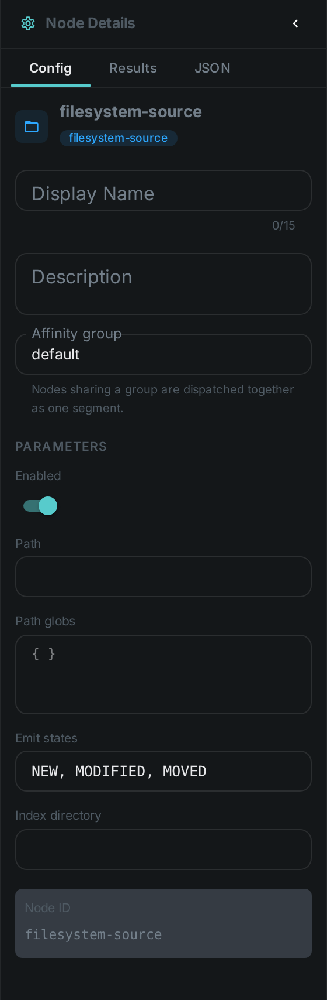
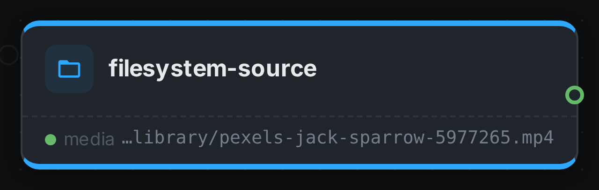

The filesystem source is a **source node** — the entry point of a pipeline. Instead of processing a
media item, it *enumerates* media from disk (a directory tree walked recursively, or a set of path
globs) and feeds each file into the graph.

++++

++++

[cols="1,3"]
|===
| Kind | `filesystem-source`
| Applies to | — (source node; produces the media stream)
| Input ports | None — it is the root of the DAG
| Output ports | `media` — one media item per discovered file, carrying its path and origin. It is typed as *any media*, because the concrete type is only known once a worker opens the file
| Requirements | CPU only, but the worker **must be able to read the media path** — the shared media mount has to be visible to the process.
| Persists to | n/a (source)
|===

A pipeline has exactly one source node. When Loom dispatches a source task, this node runs on the
chosen worker and streams discovered items back; path discovery lives in `FilesystemMediaScanner`.

== Configuration

.The node's settings in the pipeline editor

`FilesystemSourceNodeOptions`:

[options="header",cols="1,2"]
|===
| Option | Meaning
| `path` | Root directory to walk recursively
| `pathGlobs` | A set of path globs (take precedence over `path` when both are set)
|===

Values from the pipeline definition win; the option defaults are used when the definition supplies no
selection.

== Seeing it run

Turn on link:../../pipeline/#debug-mode[Debug Mode] and every node keeps what it produced, on the
card itself. Below is a real run of this node over `pexels-jack-sparrow-5977265.mp4`.

The strip on the card lists what each output port carried — `media`.

== Use Cases

* **Folder / NAS ingest** — scan a storage location for new media to process.
* **Targeted runs** — process only files matching specific globs.
