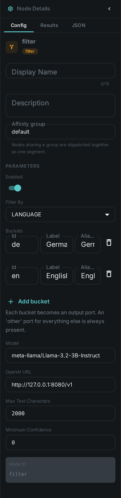
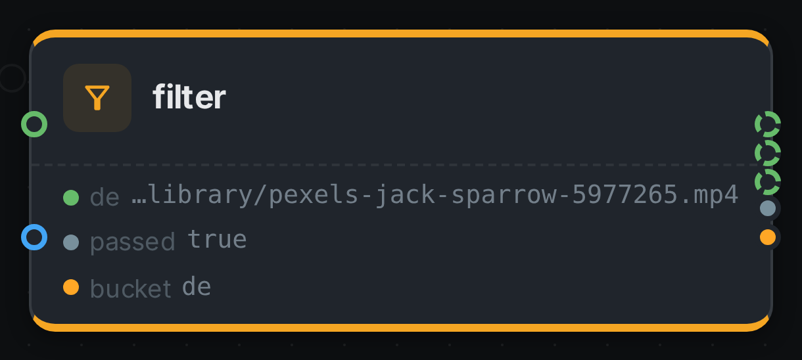

The Filter node is a **router**. Instead of producing metadata, it decides which group each item
belongs to and sends it down the matching branch, so the work you hang off each branch only runs on
the items that belong there.

You configure a list of **buckets**, and the node grows **one output port per bucket** — plus an
`other` port that is always present. Wire the ports you care about; that is the whole configuration.

++++

++++

[cols="1,3"]
|===
| Kind | `filter`
| Applies to | — (routing; sits between other nodes)
| Input ports | `media` — the item being routed. `text` — the text to classify; optional, and without it every item lands in `other`
| Output ports | One per configured bucket, plus `other`, `passed` and `bucket`
| Requirements | Only `Language` needs a reachable OpenAI-compatible endpoint. `MIME type`, `Size` and `Date` read the file itself and need nothing
| Persists to | The routing decision, as a JSON component on the asset
|===

== How routing works

The **port is the branch**. Each item is written to exactly one bucket port, and anything wired to a
port that carried nothing is skipped for that item. Nothing else has to be configured: there is no
branch setting on the connection, and no limit of two ways.

Skipping carries down the branch. If a node is skipped because its branch did not fire, everything
downstream of it is skipped for that item too — you do not have to repeat the condition at each step.

Two ports behave differently on purpose:

`passed`:: `true` when the item matched a bucket other than `other`. Useful when you want the plain
yes/no rather than the group.

`bucket`:: The id of the bucket the item landed in. This port carries a value for **every** item, so
a node wired to it runs whichever way the item went — that is how you record or count the decision
without also being routed by it.

In the editor a branch port is drawn with a **dashed** outline, so you can see at a glance which
connections carry every item and which carry only some.

== Configuring buckets

Each bucket has:

[options="header",cols="1,3"]
|===
| Field | Meaning
| Id | Becomes the output port. Lowercase letters, digits and underscore; typing "Brazilian Portuguese" turns into `brazilian_portuguese` for you
| Label | The name shown on the node. Defaults to the id
| Match | The hints this bucket matches on, comma separated. What they mean depends on *Filter by* — other names for a language (`german, deutsch`), MIME patterns (`image/*`), size thresholds (`<10MB`) or dates (`2024-01-01..2024-12-31`)
|===

Use the **Add bucket** button to grow a branch, and the delete icon to remove one. The node's ports
follow immediately, and removing a bucket also removes any connections that were hanging off it.

`other` cannot be used as a bucket id — it is the catch-all and is always there. Neither can
`passed`, `bucket`, `media` or `text`.

== Filtering by

The **Filter by** setting chooses what the buckets are matched against. Buckets are tried top to
bottom and the first one that matches wins, so a narrow bucket above a broad one behaves as written.

[options="header",cols="1,2,2"]
|===
| Filter by | Each item goes to the bucket whose… | Match hints look like
| Language | …language matches the text wired into the node | `german, deutsch`
| MIME type | …pattern matches the item's file type | `image/*`, `video/mp4`, or a bare `image`
| Size | …threshold the item's size falls into | `<10MB`, `1MB..100MB`, `>1GB`, or a bare `10MB` meaning "up to"
| Date | …window the item's modification date falls into | `>=2024-01-01`, `2024-01-01..2024-12-31`, `2024-03-17`, `age<30d`
|===

Only **Language** costs anything. The other three read the item's own metadata, so a pipeline that
only splits images from video, or last month's files from last year's, runs with no model backend at
all — and adds no time per item.

=== Language

Language is decided by a language model, which means it needs a reachable OpenAI-compatible endpoint but no
extra model download and no separate service. Wire the `text` port from whatever produced the text:
a transcript from link:../whisper/[Whisper], extracted document text from link:../tika/[Tika], or
recognised text from link:../ocr/[OCR].

If the model is unreachable the item **fails** rather than being quietly routed to `other` — an item
that could not be classified is not the same as one that did not match. An answer the model gives
that names no configured bucket does land in `other`, which is what that branch is for.

Set a **Minimum confidence** to send uncertain classifications to `other` instead of trusting them.
It applies to Language only; the other three are not guesses.

=== MIME type

The type comes from the file's name — `holiday.png` is `image/png`. A pattern is an exact type
(`image/png`), a family (`image/*`), or a bare word read as a family (`image` means `image/*`). A
bucket with no hints at all falls back to its own id, so three buckets called `image`, `video` and
`audio` route correctly with nothing typed in.

An extension nothing recognises is `application/octet-stream`, which a bucket can ask for like any
other type.

=== Size

Sizes are the numbers a file manager shows: `KB`, `MB`, `GB` and `TB` are 1024-based, and `KiB`,
`MiB`, `GiB`, `TiB` are accepted as the same thing. A bare number with no unit is bytes.

`<`, `<=`, `>` and `>=` compare; `1MB..100MB` is a range whose lower end is included and whose
upper end is not, so neighbouring ranges tile without overlapping; and a bare `10MB` means "up to
10MB". That last one is what makes the common ladder read as written:

[options="header",cols="1,2"]
|===
| Bucket | Match
| `small` | `1MB`
| `medium` | `100MB`
| `large` | `>100MB`
|===

=== Date

The date is the file's last-modified time. Absolute conditions use ISO dates and always cover the
whole day: `<=2024-12-31` includes every moment of 31 December, and `2024-01-01..2024-12-31` is the
whole year. A bare `2024-03-17` is that one day.

Relative conditions are ages, and the `age` prefix is required: `age<30d` is "changed in the last 30
days" and `age>1y` is "untouched for over a year". Writing `<30d` on its own is refused, because it
reads as *before* while meaning *newer than* — and getting that backwards would route a whole run the
wrong way. Ages take `h`, `d`, `w`, `m` (months) and `y`.

A hint that cannot be read as a threshold or a date — `<10 megabytes`, `last month` — stops the
pipeline with a message naming the bucket, rather than starting a run in which every item quietly
lands in `other`.

== Configuration

.The node's settings in the pipeline editor

== Seeing it run

Turn on link:../../pipeline/#debug-mode[Debug Mode] and every node keeps what it produced, on the
card itself. Below is a real run of this node over `pexels-jack-sparrow-5977265.mp4`.

The strip on the card lists what each output port carried — `de`, `passed`, `bucket`.

== Use Cases

* **Language routing** — send German transcripts to one summarisation prompt and English ones to
  another, and everything else to a review branch.
* **Type routing** — send images to link:../captioning/[Captioning] and video to
  link:../scene-detection/[Scene Detection] from one source, with no model round trip to decide
  which is which.
* **Cost control by size** — run the expensive analysis only on files above a threshold, and a
  cheap thumbnail path on everything else.
* **Backfill by date** — process last month's arrivals on one branch and the historical archive on
  another, so a re-run does not redo years of work.
* **Catching the unexpected** — wire `other` to a review step and see what your library actually
  contains.
* **Recording the decision** — wire `bucket` into link:../script/[Script] to count or store which
  group each item fell into, without changing what else runs.

== Notes

* The node remembers its answer per item for the lifetime of the worker, so re-running a pipeline
  does not pay for the same classification twice. Changing the buckets or the model counts as a
  different question and is classified afresh.
* Two Filter nodes can sit in one pipeline — route by language first, then by something else — and
  they keep their decisions separate.
