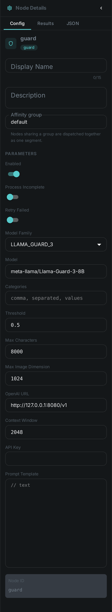
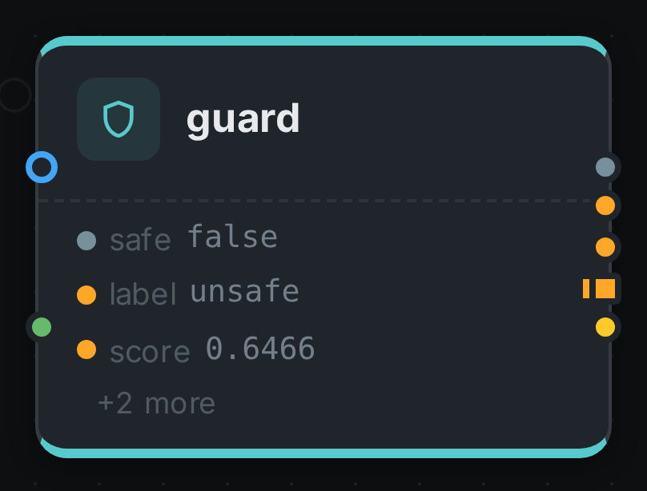

The guard node **screens your content against a harm taxonomy and gives you a yes/no answer with a
confidence score behind it**. Connect text to it — a link:../whisper/[Whisper] transcript,
link:../tika/[Tika] document content, an link:../ocr/[OCR] result, a link:../captioning/[caption] —
or point it at image assets, and every item comes back labelled `safe` or `unsafe`, with the harm
categories that fired and how sure the model was.

The `safe` output is a **branch**. Connect a node behind it and that node runs only for the items
that came back clean, so a publishing step, an S3 upload or a tagging pass can be gated on the
verdict without a link:../filter/[filter] node in between.

Three families of open guardrail model are supported behind this one node — Meta's Llama Guard,
Google's ShieldGemma and IBM's Granite Guardian. They disagree about almost everything: how many
questions they answer per item, what they call each kind of harm, even how many categories exist.
The node normalises all of it, so **swapping the model does not mean rewiring the pipeline**.

++++

++++

[cols="1,3"]
|===
| Kind | `guard`
| Applies to | Any asset with text connected; image assets when the configured model can read pictures
| Input ports | `text` — accepts any text type, so a transcript, a document body, an OCR result or a caption can all be wired into it. `media` — the picture itself, for an image asset
| Output ports | `safe` (Branch), `label` (String), `score` (Number), `categories` (String, one per flagged category), `result` (the structure below)
| Requirements | An **OpenAI-compatible endpoint** serving one of the supported guardrail models
| Persists to | `asset_json_comp` — one verdict per asset
|===

== What it produces

[source,json]
----
{
  "safe": false,
  "score": 0.6466,
  "threshold": 0.5,
  "family": "LLAMA_GUARD_3",
  "model": "meta-llama/Llama-Guard-3-8B",
  "subject": "text",
  "categories": [
    {
      "canonical": "VIOLENT_CRIME",
      "native": "S1",
      "label": "Violent Crimes",
      "score": 0.6466
    }
  ],
  "raw": "unsafe\nS1",
  "probes": 1,
  "scoreExact": true,
  "textChars": 183
}
----

That is a real verdict, from the run the screenshots on this page were taken of: a delivery
complaint that ends in a threat, screened by Llama Guard 3. `score` is the probability that the item
is unsafe, and it means the same thing whichever model produced it. `safe` is simply
`score < threshold` — note how close 0.65 is to the default 0.5, which is why the threshold is worth
tuning against your own content rather than left at the default.

Each flagged category is reported twice on purpose. `canonical` is MetaLoom's own name for that kind
of harm and is the same word whichever model you run; `native` is the model's own code, kept so you
can trace a verdict back to the model card without guesswork.

== One node, three families of model

Pick the family in the node's settings. It selects the prompt format, the list of harm categories,
and — the part you will feel — how much work one verdict costs.

[options="header",cols="1,1,2,2"]
|===
| Family | Setting | Categories | Cost per item

| **Llama Guard 3** (Meta)
| `LLAMA_GUARD_3`
| 14 hazards, from violent crime to election interference
| **One** model call, whatever you select

| **Llama Guard 4** (Meta)
| `LLAMA_GUARD_4`
| The same 14 minus code-interpreter abuse
| **One** model call. Reads pictures as well as text

| **ShieldGemma** (Google)
| `SHIELDGEMMA`
| 4 policies: dangerous content, harassment, hate speech, sexually explicit
| One call **per category**

| **ShieldGemma 2** (Google)
| `SHIELDGEMMA_2`
| 3 image policies: sexually explicit, violence & gore, dangerous content
| One call **per category**. Pictures only

| **Granite Guardian** (IBM)
| `GRANITE_GUARDIAN`
| 9 risks, including jailbreak attempts and unethical behaviour that the other two have no word for
| One call **per category**
|===

The difference in cost is real and worth planning around. Llama Guard asks the model a single
question covering its whole taxonomy, so screening a million assets costs a million calls.
ShieldGemma and Granite Guardian ask one yes/no question per category, so leaving all nine Granite
risks switched on costs nine million. What you buy for that is a genuinely independent score per
category, rather than one number covering everything the model flagged.

**Narrowing the `categories` setting is therefore a throughput decision**, not just a policy one. If
you only care about sexual content and violence, selecting those two makes the node four times
faster on ShieldGemma. It makes no difference at all on Llama Guard.

== The categories all three models agree on

Whichever family you run, a flagged item is reported in one shared vocabulary. That is what lets you
connect `categories` to a link:../tag/[tag] node, or route on a specific kind of harm, and keep the
pipeline working after you change models.

[options="header",cols="1,3"]
|===
| Category | Reached from

| `VIOLENT_CRIME`
| Llama Guard `S1`, ShieldGemma 2 `violence_gore`, Granite `violence`

| `NON_VIOLENT_CRIME`, `SEX_CRIME`, `CHILD_EXPLOITATION`
| Llama Guard `S2`, `S3`, `S4`

| `DEFAMATION`, `SPECIALIZED_ADVICE`, `PRIVACY`, `INTELLECTUAL_PROPERTY`
| Llama Guard `S5`–`S8`

| `INDISCRIMINATE_WEAPONS`
| Llama Guard `S9`

| `HATE`
| Llama Guard `S10`, ShieldGemma `hate_speech`, Granite `social_bias`

| `SELF_HARM`
| Llama Guard `S11`

| `SEXUAL_CONTENT`
| Llama Guard `S12`, ShieldGemma `sexually_explicit`, Granite `sexual_content`

| `ELECTIONS`, `CODE_INTERPRETER_ABUSE`
| Llama Guard `S13`, `S14`

| `HARASSMENT`, `DANGEROUS_CONTENT`
| ShieldGemma `harassment`, `dangerous_content`

| `PROFANITY`, `UNETHICAL_BEHAVIOUR`, `JAILBREAK`
| Granite Guardian `profanity`, `unethical_behavior`, `jailbreak`

| `OTHER`
| Granite Guardian's general `harm` criterion, and any code a newer model revision introduces that
  this release does not recognise yet
|===

== Screening pictures

Two of the five models read images: **Llama Guard 4** and **ShieldGemma 2**. Point the node at either
one and image assets are classified from their pixels — no captioning step in between.

[IMPORTANT]
====
**Image screening needs vLLM, not llama.cpp.** llama.cpp cannot serve either multimodal guard model
today: no vision projector has been published for Llama Guard 4, and ShieldGemma 2 has no llama.cpp
conversion at all. Text screening works on llama.cpp with all five.

If an image asset reaches a text-only model with nothing connected to `text`, the node **fails that
item** rather than passing it. A content guard that quietly waves through everything it cannot read
is worse than one that stops and tells you.
====

You can also connect text *and* run on image assets at the same time — a caption plus the picture it
describes, say. Both are screened and the node reports the worse of the two, which is the reading you
want from a gate.

If you would rather screen pictures with a text-only model, put link:../captioning/[captioning] or
link:../vlm/[VLM] in front of the guard and connect its output to `text`. You are then screening the
description rather than the image, which catches less — but it runs anywhere.

== Gating a branch on the verdict

`safe` is a branch, so anything connected behind it runs only for items that passed:

[source,json]
----
{
  "nodes": [
    { "id": "source",  "type": "filesystem-source", "name": "Incoming",
      "options": { "path": "/media/incoming" } },
    { "id": "extract", "type": "tika",  "name": "Extract text" },
    { "id": "guard",   "type": "guard", "name": "Screen content",
      "options": { "family": "LLAMA_GUARD_3", "threshold": 0.6 } },
    { "id": "publish", "type": "s3-sink", "name": "Publish to the public bucket" }
  ],
  "edges": [
    { "id": "e1", "source": "source",  "sourcePort": "media",
      "target": "extract", "targetPort": "media" },
    { "id": "e2", "source": "extract", "sourcePort": "content",
      "target": "guard",   "targetPort": "text" },
    { "id": "e3", "source": "guard",   "sourcePort": "safe",
      "target": "publish", "targetPort": "media" }
  ]
}
----

A flagged asset simply does not reach `publish`. It is still fully processed and its verdict is still
stored, so nothing is lost — you can find every flagged asset afterwards and review it:

[source,bash]
----
curl -s -H "Authorization: Bearer $TOKEN" \
  "$LOOM/api/v1/assets/$ASSET/json-comps" \
  | jq '.data[] | select(.schemaType == "guard") | .data | {safe, score, categories}'
----

Connecting `categories` to a link:../tag/[tag] node instead of gating gives you the softer version:
nothing is blocked, but every flagged asset is searchable by the kind of harm that was found.

== Choosing a threshold

`threshold` is the score at which an item is flagged, and the default of `0.5` is a starting point
rather than a recommendation. Lower it to catch more and review more; raise it to flag only what the
model is confident about.

Run the node over a representative sample first and look at the `score` values it produces. A
threshold picked from your own content is worth far more than one picked from a model card, because
where the scores fall depends on what you are screening.

[NOTE]
====
**Watch for `"scoreExact": false` in the stored verdict.** All three families report their confidence
as a probability, and the node reads it directly from the model. Some backends do not return that
information at all — when that happens the node falls back to the model's plain yes/no answer, scores
it `1.0` or `0.0`, and marks the verdict inexact. Everything still works, but `threshold` has nothing
meaningful left to compare against, so tuning it stops having any effect. If you see this, check that
your endpoint supports returning token probabilities.
====

.The node's settings in the pipeline editor

[options="header",cols="1,2"]
|===
| Option | Meaning
| `family` | Which guardrail model you are running (default `LLAMA_GUARD_3`). Selects the prompt format, the categories and the cost per item
| `model` | The model id to select on the endpoint (default `meta-llama/Llama-Guard-3-8B`). Recorded with every verdict
| `categories` | The harm categories to check, using the selected family's own codes. Leave empty to check all of them
| `threshold` | The score at or above which an item is flagged (default `0.5`)
| `maxChars` | Upper bound on the text sent to the model; longer input is truncated (default `8000`)
| `maxImageDim` | Longest side an image is scaled down to before it is sent (default `1024`)
| `openaiUrl` | Base URL of the OpenAI-compatible backend (default `\http://127.0.0.1:8080/v1`)
| `contextWindow` | Tokens the model is told it may use for one call (default `2048`)
| `apiKey` | Bearer token for the endpoint. Leave empty for a local backend
| `promptTemplate` | Replaces the family's built-in prompt. Leave empty unless you have a reason not to — see below
|===

There is no option naming where the text comes from: the `text` port accepts any text type, so you
draw a connection instead.

`categories` is a comma-separated list and must use the codes of the family you selected — `S1, S12`
for Llama Guard, `hate_speech, sexually_explicit` for ShieldGemma, `violence, jailbreak` for Granite
Guardian. Pick from the wrong family and the node tells you so, and names the ones it does accept.

[WARNING]
====
**Leave `promptTemplate` alone unless you have measured the alternative.** These are classifiers, not
chat models: each one was tuned against one specific wording, and rewriting it changes the answers in
ways that are not obvious from reading the output. The option exists so you can adapt to a new model
revision before MetaLoom ships support for it — not as a policy knob. To change *what* is screened,
use `categories`.
====

== Seeing it run

Turn on link:../../pipeline/#debug-mode[Debug Mode] and every node keeps what it produced, on the
card itself. Below is a real run of this node over the shared delivery-complaint transcript, escalated
into a threat — screened by Llama Guard 3.

The strip on the card lists what each output port carried. Opening the `result` port shows the
verdict as a table: the score, the threshold, and every category that fired with its own confidence.

== Licensing

All five models are third-party weights you provide and operate — MetaLoom ships none of them. Llama
Guard carries Meta's Llama Community License, ShieldGemma the Gemma Terms of Use, and Granite
Guardian is Apache-2.0. See link:../../legal/model-licenses/[Model Licenses] before you deploy.

== See also

* link:../filter/[Filter] — route items several ways rather than gating one branch
* link:../tag/[Tag] — make the flagged categories searchable instead of blocking the asset
* link:../sentiment/[Sentiment] — the other node that scores upstream text
* link:../../legal/model-licenses/[Model Licenses]
