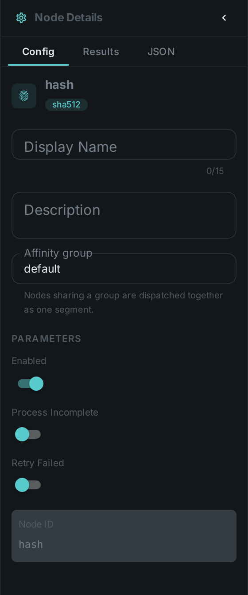
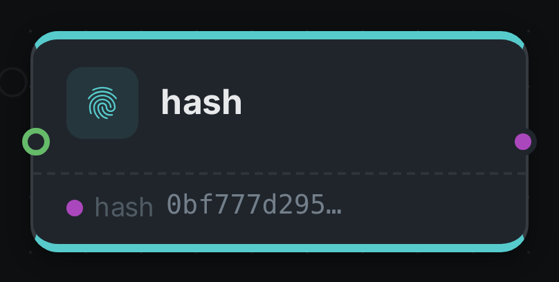

The hashing nodes compute content hashes of a media file. They are the foundation of asset identity in
MetaLoom: the SHA-512 hash is the content key used to look an asset up, avoid recomputation, and match
against blacklists. Four kinds live in the same module and can be toggled independently.

++++

++++

[cols="1,3"]
|===
| Kinds | `md5`, `sha256`, `sha512`, `chunk-hash`
| Applies to | Any file
| Input ports | `media` (typically the first processing step after the source)
| Output ports | `hash` — one port per kind, typed `hash/md5`, `hash/sha256`, `hash/sha512` or `hash/chunk`. The type is what downstream nodes match on, so a link:../dedup/[dedup] node never has to name the node that produced it
| Requirements | CPU only. Streams the file, so memory use is low regardless of file size. Reads the full file bytes from storage.
| Persists to | `asset` row hash columns + `asset_node_result` ledger
|===

`chunk-hash` computes a content-based chunked hash used for near-duplicate detection on partially
modified files.

== Configuration

.The node's settings in the pipeline editor

Per-node options (`HashNodeOptions`) enable each algorithm individually:

[options="header",cols="1,1,2"]
|===
| Option | Default | Meaning
| `md5` | off | Compute the MD5 hash
| `sha256` | off | Compute the SHA-256 hash
| `sha512` | on | Compute the SHA-512 hash (the system-wide content identity)
| `chunkHash` | off | Compute the chunked content hash
|===

In online mode a hash node checks Loom first and short-circuits when the hash is already stored.

== Seeing it run

Turn on link:../../pipeline/#debug-mode[Debug Mode] and every node keeps what it produced, on the
card itself. Below is a real run of this node over `pexels-photo-2379005.jpeg`.

The strip on the card lists what each output port carried — `hash`.

== Use Cases

* **Asset identity** — resolve an asset by its SHA-512 across the platform.
* **Exact deduplication** — find byte-identical files (see link:../dedup/[Deduplication]).
* **Near-duplicate detection** — `chunk-hash` flags files that were partially modified.
* **Blacklisting** — match incoming media against a hash blacklist.
