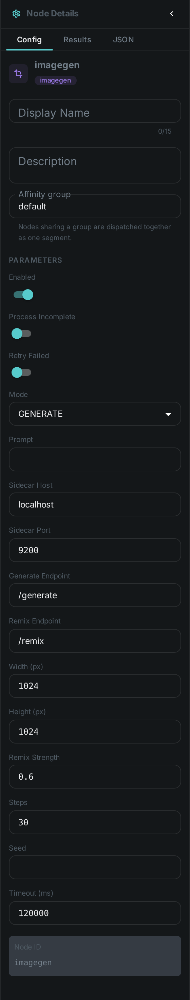
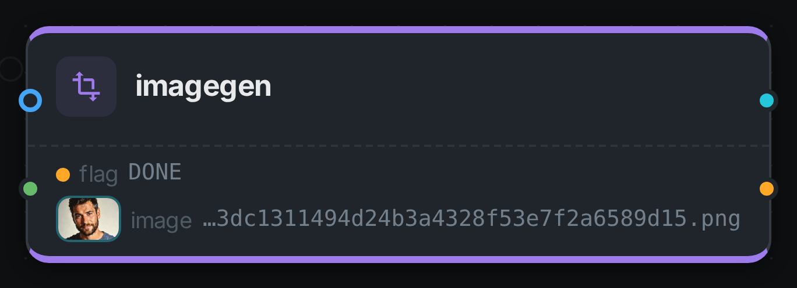
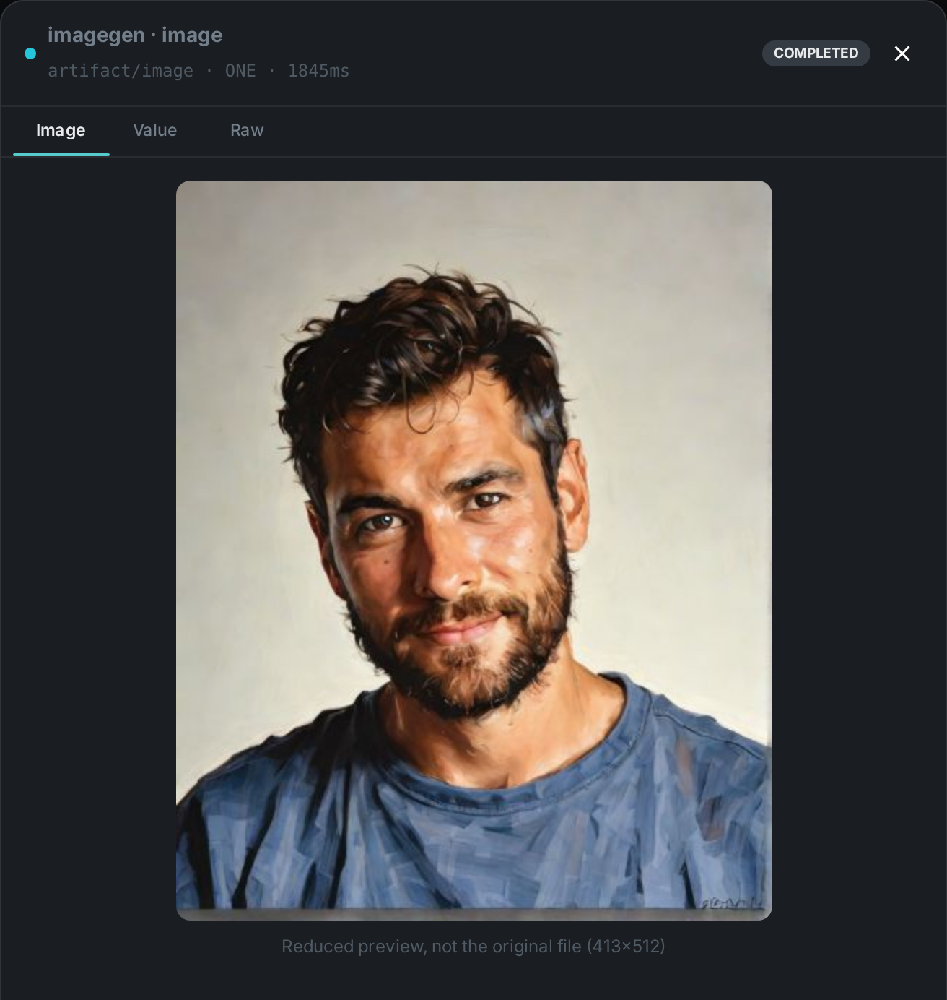

The image-generation node **generates a new image with a diffusion model**. Unlike the analysis
nodes, which describe a property of the media itself, `imagegen` produces a fresh image and attaches
it to the asset. It works in four ways:

* **`GENERATE`** — draw a picture from a text prompt alone.
* **`REMIX`** — repaint the asset's own image, steered by a prompt.
* **`EDIT`** — combine the asset's image with other pictures wired into it, so you can say
  "the person from the first image holding the product from the second". Give it a mask and the
  change is confined to that one region, leaving the rest of the picture alone.
* **`MASK`** — produce a black-and-white mask of a region you name in words. **Experimental:** the
  model is often imprecise about which region it marks, so prefer a plain `EDIT` instruction, which
  handles "change only her hair" well on its own.

The diffusion model runs behind a small HTTP sidecar, so the node stays a pure client and needs no
model runtime of its own. The sidecar is model-agnostic, and three are shipped — pick one with the
`port` option. They differ in what they can do and in what their licences allow, so read
<<choosing-the-model>> before deciding.

[IMPORTANT]
====
`EDIT` and `MASK` need the **Qwen-Image-2.1** sidecar; the other two backends do not offer them and
the node will report an error. Those weights are **non-commercial** — see
link:../../legal/model-licenses/[Model Licenses].

To change one part of a picture, describe the change and say what to leave alone — "change her hair
colour to dark brown, keep everything else exactly the same". That works well. You do not need a
mask for it, and `MASK` mode is not yet accurate enough to rely on.
====

++++

++++

[cols="1,3"]
|===
| Kind | `imagegen`
| Applies to | Image assets
| Input ports | A generation `prompt` from the node configuration; in `REMIX` mode also `media`, the asset's own image; in `EDIT` mode `references` (other pictures to combine in) and `mask` (the region to change)
| Output ports | `image` (the generated PNG, ready for link:../s3-sink/[S3 Sink]), `flag` (String)
| Requirements | A running **image sidecar**. A GPU is recommended for interactive latency; `EDIT` additionally needs the Qwen-Image-2.1 sidecar, which uses about 46 GB of video memory at the default resolution and 66 GB at 2K.
| Persists to | `asset_node_result` ledger only — the generated PNG stays in the worker's local `imagegen_bin` cache (as with thumbnails)
|===

== Configuration

.The node's settings in the pipeline editor

Set these in the panel above, or in the node's `options` block in a pipeline definition. The
result-affecting options (`mode`, `prompt`, `width`/`height`, `strength`, `steps`, `seed`) apply per
node instance, so two `imagegen` nodes in one pipeline can render two different prompts side by
side; `host`/`port` are worker settings:

[options="header",cols="1,2"]
|===
| Option | Meaning
| `mode` | `GENERATE`, `REMIX`, `EDIT` or `MASK` (default `GENERATE`)
| `prompt` | The generation prompt (required)
| `maskPrompt` | The region to confine an edit to, in plain words — "the boy's hair". Required in `MASK` mode; in `EDIT` it is used only when nothing is wired into the mask port
| `host` / `port` | Address of the image sidecar (default `localhost:9200`)
| `width` / `height` | Output size for `GENERATE` (default `1024` × `1024`)
| `outputResolution` | What the model renders at, and what an edit's size follows from (default `1024`; `2048` gives 2K at around four times the cost)
| `strength` | Denoise strength for `REMIX`, in `(0, 1]` (default `0.6`)
| `negativePrompt` | What to steer away from. Has no effect unless `trueCfgScale` is above `1.0`
| `trueCfgScale` | How strongly the negative prompt is applied, `1.0`–`10.0` (default `1.0`, which switches it off)
| `composite` | Blend an edit back through the mask so nothing outside the region can change (default off)
| `steps` | Number of inference steps (default `30`)
| `seed` | Optional RNG seed for reproducible output
|===

== Seeing it run

Turn on link:../../pipeline/#debug-mode[Debug Mode] and every node keeps what it produced, on the
card itself. Below is a real run in `REMIX` mode over `pexels-photo-2379005.jpeg`, prompted for
_"the same portrait as an oil painting, warm light, visible brush strokes"_.

The `image` port carries an artifact, so the card shows the picture rather than its path. `REMIX` is
the mode worth photographing: `GENERATE`, the shipped default, ignores the incoming media entirely
and answers from the prompt alone.

== Running the sidecar

The sidecar is a small FastAPI service. A minimal run with the default (ungated) model:

[source,bash]
----
cd sidecars/ideogram-sidecar
python -m venv venv && ./venv/bin/pip install -r requirements.txt
./venv/bin/uvicorn server:app --host 0.0.0.0 --port 9200
# smoke test
curl -s -X POST localhost:9200/generate \
  -H 'content-type: application/json' \
  -d '{"prompt":"a red panda astronaut, studio lighting"}' -o out.png
----

[#choosing-the-model]
=== Choosing the model

[options="header",cols="1,1,2"]
|===
| Sidecar | Default port | Weights
| `sidecars/ideogram-sidecar` | `9200` | SDXL-Turbo — **non-commercial** community licence (Ideogram 4 optional, gated, also non-commercial)
| `sidecars/mage-flow-sidecar` | `9210` | Mage-Flow 4B — **MIT**, commercial use permitted. Stronger prompt following and legible text, and it also handles `REMIX` as an instruction edit
| `sidecars/qwen-image-sidecar` | `9230` | Qwen-Image-2.1 — **non-commercial** research licence. The only backend offering `EDIT` and `MASK`: combining up to ten pictures, and confining a change to a named region. Uses about 46 GB of video memory, or 66 GB at 2K
|===

There is a trade-off here and it is worth stating plainly: the only backend that can combine images
or edit a region is also the only one you may not use commercially. If you need a commercial
deployment, use Mage-Flow and do without those two modes.

For Mage-Flow, set `steps` to match the checkpoint: `4` for the default Turbo variant, `20` for the
RL-aligned one, `30` for Base. The node always sends `steps`, so leaving it at the `30` default would
run a 4-step model seven times longer than necessary. Its `strength` option has no effect on
Mage-Flow, which edits from an instruction rather than a denoise strength. Mage-Flow needs a GPU with
at least 24 GB; it also applies a content filter that cannot be disabled, and a rejected prompt is
reported as an error rather than producing an image.

== Use Cases

* **Illustrations & hero images** — generate on-brand artwork from a prompt for a catalogue entry.
* **Restyling** — remix an existing asset into a new style while preserving its composition.
* **Placeholders & variations** — produce derived visuals for review workflows.

The generated PNG is written to the worker's local `imagegen_bin` cache and a node-result ledger row
records that the node ran for the asset.
