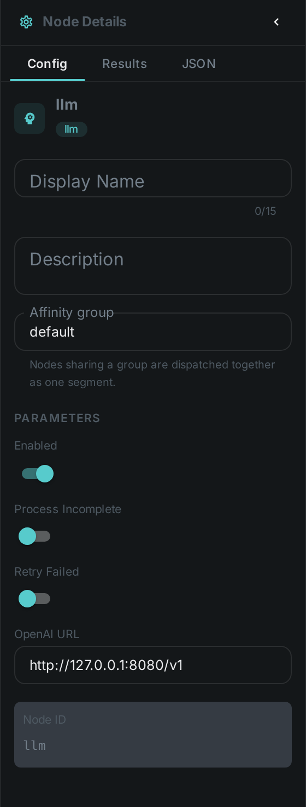
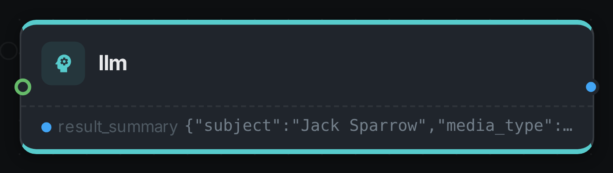

The LLM node sends asset metadata to a **Large Language Model** and stores the model's response as
enrichment — for example a classification, a set of suggested tags, or a description. Multiple prompts
can be configured, and **each prompt adds its own output port**, so downstream nodes connect to the
one answer they care about rather than to the node as a whole.

++++

++++

[cols="1,3"]
|===
| Kind | `llm`
| Applies to | Any (operates on the asset's filename / metadata)
| Input ports | `media` — the asset, whose filename and stored fields the prompts reason over
| Output ports | `result_{promptId}` — **one port per configured prompt**, so a `summary` prompt produces a `result_summary` port you can connect to link:../tts/[Text-to-Speech] or link:../sentiment/[Sentiment Analysis]
| Requirements | An LLM provider service reachable from the worker. The node supports an OpenAI-compatible (vLLM) endpoint; CPU on the worker, the model runs in the service.
| Persists to | `asset_json_comp` per prompt + `asset_node_result` ledger
|===

== Configuration

.The node's settings in the pipeline editor

Set these in the panel above, or in the node's `options` block in a pipeline definition:

[options="header",cols="1,2"]
|===
| Option | Meaning
| `openaiUrl` | Base URL of the OpenAI-compatible LLM server (llama.cpp, vLLM, Ollama `/v1`, …)
| `prompts` | A map of prompt definitions. Each one adds a `result_{promptId}` output port, which appears on the node in the editor as soon as the prompt is defined
|===

== Seeing it run

Turn on link:../../pipeline/#debug-mode[Debug Mode] and every node keeps what it produced, on the
card itself. Below is a real run of this node over `pexels-jack-sparrow-5977265.mp4`.

The strip on the card lists what each output port carried — `result_summary`.

== Use Cases

* **Auto-classification** — categorise assets from their metadata or transcript.
* **Tag suggestions** — propose tags for review.
* **Description generation** — draft human-readable summaries stored alongside the asset.
