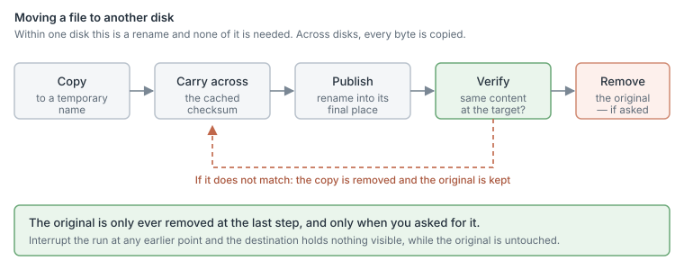
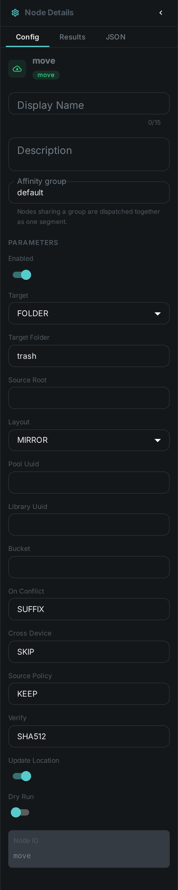
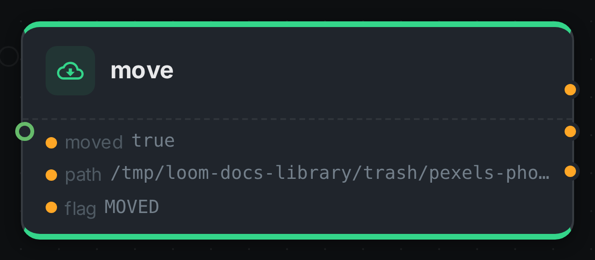

Every media library eventually needs to put a file somewhere else. Duplicates you have reviewed
should leave the working set. Material flagged for disposal should go to a trash folder you can still
look in tomorrow. Finished projects should move to cheaper storage. Until now none of that was a step
you could draw into a pipeline — two nodes could move files, but only duplicates, and only into one
folder set by whoever configured the worker.

This node is that missing step. It relocates an asset's file to a folder, a storage pool, a library,
or an S3 bucket, and it records where the file went so the rest of the system keeps working.

It runs no model and needs nothing installed alongside it.

++++

++++

[cols="1,3"]
|===
| Kind | `move`
| Applies to | Any item whose file is on the worker
| Input ports | `media` — the item to relocate
| Output ports | `moved` (Boolean), `path` (String), `flag` (String)
| Requirements | None for a folder. A connection to the server for a pool or a library. S3 credentials on the worker for a bucket
| Persists to | The asset's binary record — its path, and its library and pool when you move it into one
|===

== Where it can send a file

[cols="1,3"]
|===
| Folder | A directory on the machine running the pipeline. The simplest target, and the only one that works when the server is unreachable.
| Storage | One of your configured storage pools. The file lands where the pool keeps its content, so the system can find it again.
| Library | The library's storage, and the file is recorded as belonging to that library from then on.
| Bucket | An S3 bucket named on the node. The one target that needs no shared filesystem at all, which is what makes it the cold-tier option.
|===

Adding a file to a **collection** is a different node — see link:../assign/[Assign]. A collection is a
grouping, not a place, so nothing is moved.

== It will not overwrite, and it will not delete by accident

Three deliberate refusals, because a file mover that gets these wrong destroys work that cannot be
recovered.

**It never overwrites.** If something is already at the destination with the same name, the incoming
file lands beside it as `clip_1.mp4`, or the item is skipped, or the step fails — whichever you chose.
There is no "overwrite" setting, because a name collision in a trash folder is very often a
completely different file that happens to share a name.

**It only ever removes an original after checking the copy.** Within one disk the file is renamed, so
there is only ever one copy of it and nothing is deleted — the `flag` port reads `MOVED`. Across
disks the bytes have to be written a second time, and there the node keeps the original by default
and says so: the `flag` reads `COPIED`. Removing it is something you switch on, and even then it
happens only after the destination has been checked to hold the same content.

**It does not silently spend an hour copying.** Moving a file within one disk is instant. Moving it
to a different disk is a full copy of every byte, and for a 40 GB video that is a very different
operation. The node works out which it would be *before* it starts, and by default declines the
second one rather than surprising you with it. You can tell it to go ahead — it will, and it will say
so in the log, naming both disks and the size.

== Settings

.The node's settings in the pipeline editor

[cols="1,1,2"]
|===
| Setting | Default | What it does

| Target | Folder | Folder, storage pool, library, or S3 bucket
| Target folder | `trash` | Where a folder move puts the file. A relative path is relative to the scanned root
| Layout | Mirror | `Flat` puts everything in one directory; `Mirror` keeps the folder structure the file already had; `Date` files it under year and month. Storage, library and bucket targets always use the system's own layout so the file can be found again
| On conflict | Add a suffix | Add a suffix, skip the item, or fail the step. Never overwrite
| Across disks | Skip | Skip, copy, or fail when the destination is on another disk
| Original file | Keep | Keep it, or remove it once the destination has been verified. Only applies to a copy across disks or to a bucket — a move within one disk is a rename, which leaves no original behind
| Verify | Full checksum | Full checksum, or size only. What has to match before the original may be removed
| Update the record | On | Record the new location on the asset
| Dry run | Off | Report what would happen and touch nothing
|===

== Building a trash workflow

The usual shape is three nodes: something decides, the filter routes, and this node acts.

. Tag the assets you want gone — by hand in the review screen, or with a rule.
. Add a link:../filter/[Filter] node set to filter by tag, with a bucket for `trash`.
. Wire that bucket into this node's `media` port, with the target folder you want.

Start with **Dry run** switched on. You will see exactly which files would move and where, without
anything being touched.

The same three nodes build a quarantine workflow — only the tag and the destination change.

== Clearing out duplicates

link:../dedup/[Deduplication] finds duplicates and, for near-duplicates, waits for a person to confirm
them. Those nodes no longer move anything themselves: they report their findings, and you wire that
into this node. That way the destination, the conflict handling and whether the original survives are
all visible in the pipeline instead of buried in a worker's configuration.

Wire the `confirmed_dup` port of the dedup apply node into this node's `media` port.

== What gets recorded

After a successful move the asset's binary record points at the new location, and the asset's file
name is kept in step with it. A processing record notes what happened, so the run history shows the
move alongside everything else that touched the asset.

If the file moves to a bucket, the record holds an `s3://` reference and the file name is deliberately
left alone — it is a local path, and pointing it at a bucket would break everything that reads it.

== Seeing it run

Turn on link:../../pipeline/#debug-mode[Debug Mode] and every node keeps what it produced, on the
card itself. Below is a real run of this node, sending a photograph to a `trash` folder.

The strip on the card lists what each output port carried — `moved`, `path`, `flag`. `path` is where
the file is now, and it is the port to read when you need to know that; `flag` reads `MOVED` here
because the destination was on the same disk, so relocating the file was a rename.

== Good to know

* A file already at its destination is reported as `ALREADY_THERE` and nothing happens, so re-running
  a pipeline over the same library is safe.
* Items that live in the cloud rather than on the worker are skipped. Their local copy is a cache, not
  the asset, and relocating a cache entry would be meaningless.
* Storage pools and libraries are configured on the server, so the machine running the pipeline needs
  to be able to reach the storage as well. If it cannot, the step fails and tells you which pool and
  which path — it will not quietly write the file somewhere the system will never look.
* Cached checksums travel with the file, so moving an asset does not force everything downstream to
  read it again from scratch.
