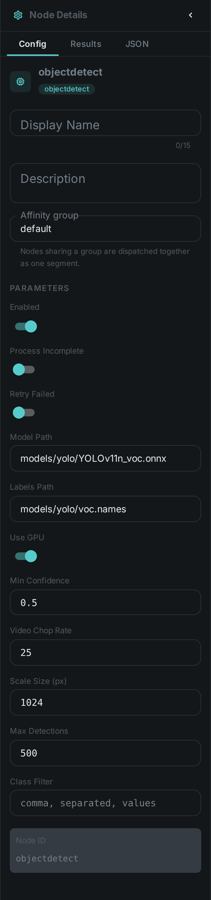
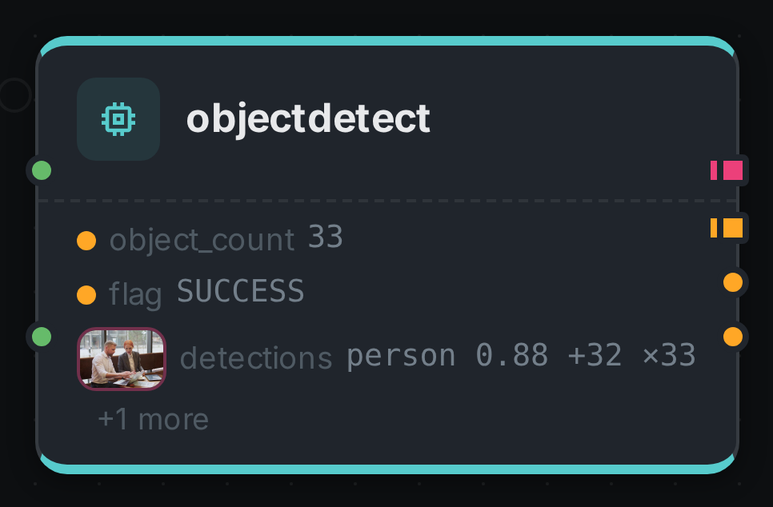
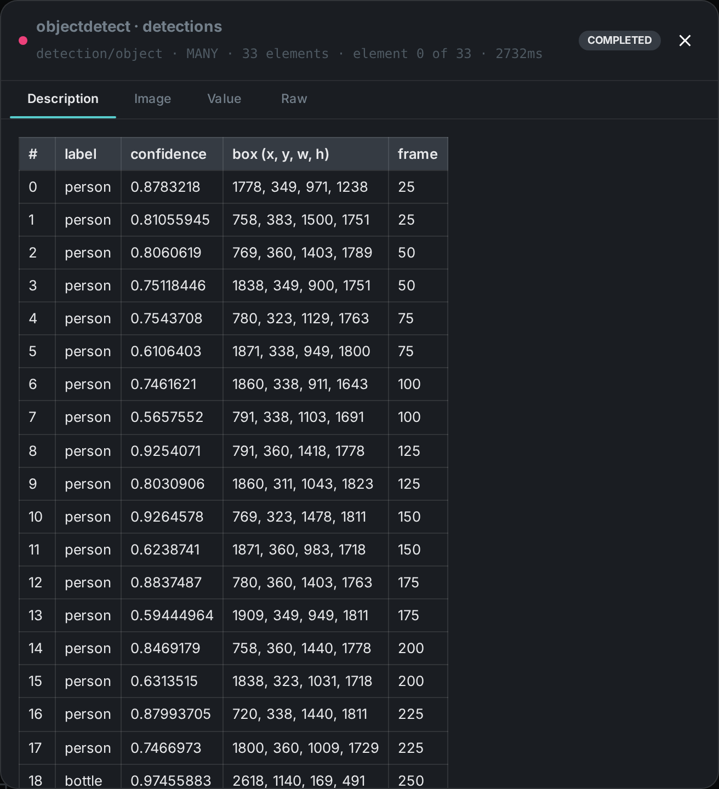

The object detection node finds objects — people, vehicles, animals, furniture — in images and video
frames, and reports each one as a labelled box with a confidence score. Video is processed by
sampling frames at a configurable rate and running detection on each sample.

++++

++++

[cols="1,3"]
|===
| Kind | `objectdetect`
| Applies to | Image, Video
| Input ports | `image` or `video` — exactly one of the two is wired
| Output ports | `detections` (**many** — one element per detected object, the boxes that feed link:../scene-layout/[Scene Layout], link:../dominant-color/[Dominant Colour] and link:../image-manipulation/[Image Manipulation]), `labels` (**many** — the distinct class names, ready to wire into link:../tag/[Tag]), `object_count` (Integer), `flag` (String)
| Requirements | **YOLO native runtime** plus an ONNX detection model and its class-name file. A CUDA-capable GPU is strongly recommended for video; on CPU the runtime still works, at a fraction of the speed.
| Persists to | `detection` table (bulk upsert) + `asset_node_result` ledger
|===

== Configuration

.The node's settings in the pipeline editor

[options="header",cols="1,2"]
|===
| Option | Meaning
| `modelPath` | Path to the ONNX detection model
| `labelsPath` | Path to the class-name file that belongs to that model, one name per line
| `useGpu` | Run inference on the GPU when one is available
| `minConfidence` | Discard detections the model is less sure about than this. The engine never reports anything below 0.4, so that is the lowest usable setting
| `videoChopRate` | Run detection on every Nth video frame. The single biggest cost lever the node has
| `videoScaleSize` | Longest edge a frame is scaled to before inference. Boxes are reported against the original resolution regardless
| `maxDetections` | Upper bound on the detections kept for one file
| `classFilter` | Keep only these class names. Left empty, every class the model knows is kept
|===

== Seeing it run

Turn on link:../../pipeline/#debug-mode[Debug Mode] and every node keeps what it produced, on the
card itself. Below is a real run of `YOLOv11n_voc.onnx` over `pexels-jack-sparrow-5977265.mp4` at the
shipped `videoChopRate: 25` — every 25th frame of a 326-frame clip.

Four ports. `detections` carries one element per box, `labels` the distinct class names it saw
(`person`, `bottle`), `object_count` the total, and `flag` how the node finished. Opening
`detections` shows every box with the frame it was measured on:

The `frame` column is what makes those boxes usable. Detection ran on 13 of the clip's 326 frames, so
the boxes belong to thirteen different moments and only the ones sharing a frame number describe the
same picture — the same sampling the
link:../../pipeline/#detections-over-time[detection player] on the pipeline page animates.

== What the model can find

The node reports whatever classes its model was trained on, and nothing else — the class list comes
from the labels file, not from the node. A model trained on 20 everyday classes will never report a
`traffic light` no matter how clearly one is in frame. Choosing the model is choosing the vocabulary.

Detections are reported per frame, so a thirty-second clip of a busy street produces far more rows
than a photograph of the same street. `maxDetections` is what keeps that bounded: when it stops a
scan early the `flag` port reports `CAPPED` rather than `SUCCESS`, so a downstream consumer can tell
"this is everything in the file" from "this is the first few hundred".

== Cost

Object detection on video is the most expensive thing in a typical pipeline, because it is inference
per sampled frame rather than once per file. Three settings decide the bill:

* **`videoChopRate`** — halving it doubles the work for the whole file. The default samples roughly
  one frame per second of footage, which is enough to know what is in a clip and not enough to
  follow anything across it.
* **`videoScaleSize`** — frames are scaled down before inference. Smaller is faster and misses small
  or distant objects.
* **`useGpu`** — the difference between a clip processing in seconds and in minutes.

== Use Cases

* **Search by content** — connect the `labels` port to link:../tag/[Tag] and every asset is tagged
  with what is in it, with no rules to write.
* **Spatial understanding** — feed `detections` into link:../scene-layout/[Scene Layout] together
  with a depth map to derive relations like "person in front of car".
* **Smart cropping** — feed `detections` into link:../image-manipulation/[Image Manipulation] so a
  thumbnail frames the subject instead of the centre of the picture.
* **Review and moderation** — flag assets containing particular classes using `classFilter`.
