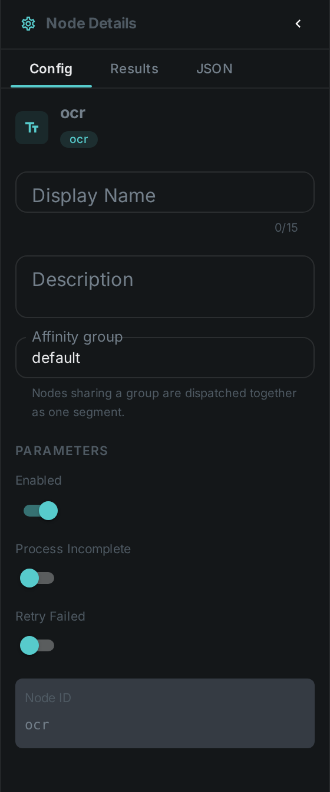
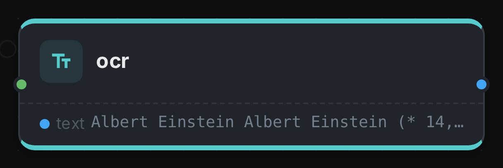

The OCR node extracts text from images and document scans using **Tesseract** (via Tess4J). The
recognized text is stored so it can be indexed and searched.

++++

++++

[cols="1,3"]
|===
| Kind | `ocr`
| Applies to | Image
| Input ports | `media`
| Output ports | `text` (String)
| Requirements | Tesseract / Tess4J plus its `tessdata` language files on the worker. CPU-bound; storage for the tessdata models.
| Persists to | `asset_json_comp` + `asset_node_result` ledger
|===

== Configuration

.The node's settings in the pipeline editor

Set these in the panel above, or in the node's `options` block in a pipeline definition:

[options="header",cols="1,2"]
|===
| Option | Meaning
| `tessDataPath` | Path to the Tesseract `tessdata` directory
| `language` | Recognition language(s), e.g. `eng`, `deu`
|===

== Seeing it run

Turn on link:../../pipeline/#debug-mode[Debug Mode] and every node keeps what it produced, on the
card itself. Below is a real run of this node over `albert_einstein.png`.

The strip on the card lists what each output port carried — `text`.

== Use Cases

* **Searchable scans** — index text from screenshots, receipts and scanned documents.
* **Document workflows** — surface embedded text for classification or routing.
* **Compliance** — find images that contain particular text.
