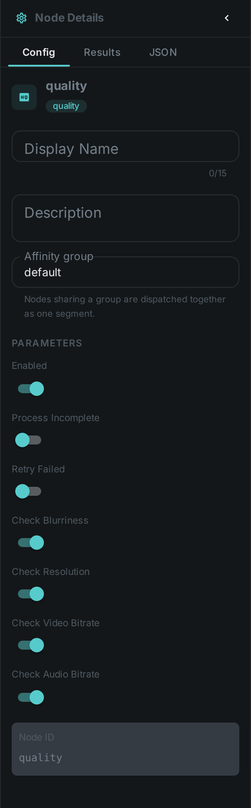
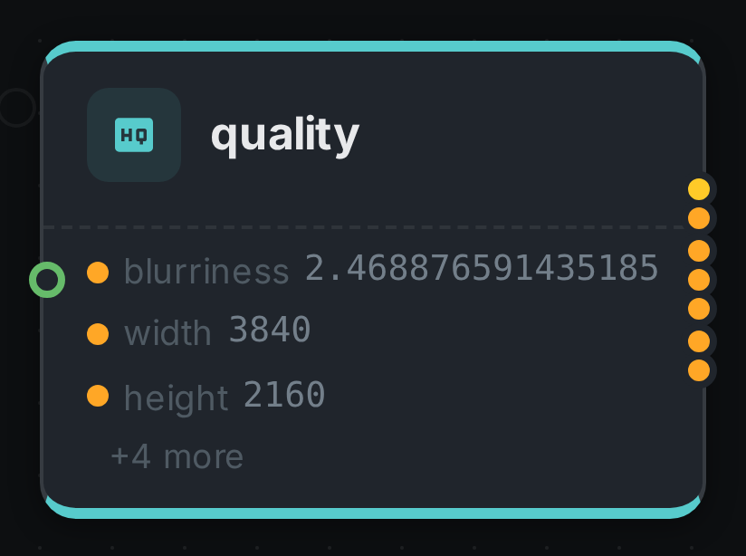

The quality node measures **perceptual quality metrics** of an image or video — resolution,
blurriness (via a Laplacian measure) and bitrate — so low-quality assets can be flagged or filtered.

++++

++++

[cols="1,3"]
|===
| Kind | `quality`
| Applies to | Image, Video
| Input ports | `media`
| Output ports | `metrics` (all of them together — this is what the link:../filter/[quality filter] connects to), `blurriness`, `width`, `height`, `fps`, `frame_count`, `flag`. The frame-rate and frame-count ports carry a value only for video
| Requirements | OpenCV / video4j **native runtime**. CPU-bound. No GPU required.
| Persists to | `asset_json_comp` + `asset_node_result` ledger
|===

== Configuration

.The node's settings in the pipeline editor

`QualityNodeOptions` toggle individual checks:

[options="header",cols="1,2"]
|===
| Option | Meaning
| `checkBlurriness` | Compute a blurriness score (Laplacian variance)
| `checkResolution` | Record image/video dimensions
| `checkVideoBitrate` | Measure the video bitrate
| `checkAudioBitrate` | Measure the audio bitrate
|===

== Seeing it run

Turn on link:../../pipeline/#debug-mode[Debug Mode] and every node keeps what it produced, on the
card itself. Below is a real run of this node over `pexels-jack-sparrow-5977265.mp4`.

The strip on the card lists what each output port carried — `blurriness`, `width`, `height`, and 4 more.

== Use Cases

* **Quality gating** — pair with the link:../filter/[quality filter] to route low-quality assets
  differently or skip them.
* **Blurry-image detection** — flag out-of-focus photos.
* **Library stats** — resolution/bitrate reporting across an asset pool.
