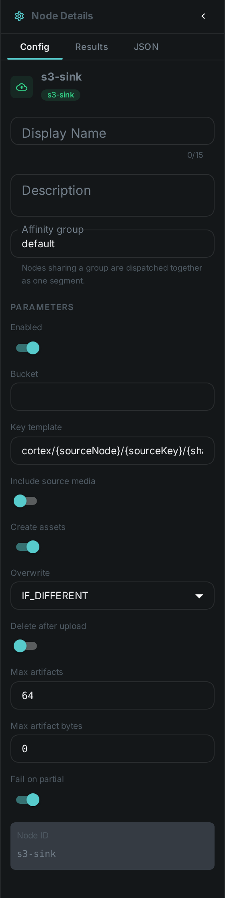
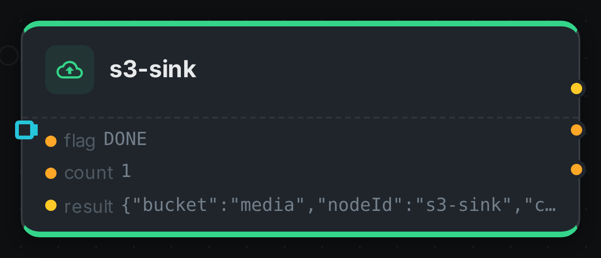

The S3 sink is an **output node**. It takes the files other nodes produce — contact sheets, depth
maps, generated images, speech audio — uploads them to an S3 bucket, and registers each one in
Loom as an asset.

Without it, those files exist only on the worker that made them. The interface cannot show a
thumbnail it cannot reach, a re-run on a different machine recomputes work that was already done,
and replacing a worker loses everything it produced. The sink is what makes produced media
durable.

++++

++++

[cols="1,3"]
|===
| Kind | `s3-sink`
| Applies to | Any media (what matters is what upstream produced)
| Input ports | `artifacts` (**many**) — every produced file connected to it. Archiving originals as well is the `includeSource` option, not a second connection
| Output ports | `result` (the per-upload index), `count` (Integer), `flag` (String)
| Requirements | CPU only, plus S3 credentials on the worker
| Persists to | The bucket, a new asset per uploaded file, and an index of them on the source asset
|===

== What it uploads

Everything connected to its `artifacts` port. That port carries a **sequence**, so several producers
can feed it at once and each file arrives as its own element: connect
link:../thumbnail/[Thumbnail]'s `thumbnail`, link:../depthmap/[Depth Map]'s `map`,
link:../imagegen/[Image Generation]'s `image` and link:../tts/[Text-to-Speech]'s `audio` to the same
port and the sink uploads all four.

The port only accepts artifact types — worker-local produced files. That is deliberate: a media
reference that merely *points* at something is not a file this node can upload, and the editor
refuses the connection rather than letting the run fail.

NOTE: A link:../script/[Script] node that emits images exposes them as ports too, named by whoever
declared the outputs. Connect those ports the same way.

Switch on **Include source media** to also archive the media item itself. That turns
`Filesystem Source → S3 Sink` into a straightforward "copy this library into a bucket" pipeline.
Media that already lives in a bucket is not copied back.

== What lands in Loom

Each uploaded file becomes **its own asset**, with its own content hash, its file name, its
detected type, and an origin recording exactly where the bytes are (`s3://bucket/key`). A
thumbnail is therefore something you can look up, tag, search and serve like any other asset.

The *source* asset separately gets an index of everything this sink published for it — the object
locations, sizes and types, and whether each upload succeeded. A partially failed run is visible
in Loom rather than only in a log file.

== Where files are stored

The object key is built from a template. The default is:

[source]
----
cortex/{sourceNode}/{sourceKey}/{sha512:4}/{sha512}{ext}
----

which produces keys like `cortex/thumbnail/thumbnail/e7c2/e7c22b99…c019629.thumb` — `{sourceNode}`
is the node the file came from and `{sourceKey}` is the port it left by.

Because the key is derived from the file's own content hash, the same file always lands in the
same place. That makes re-runs cheap: the sink checks whether the object is already there and
skips it, so re-processing a library that has already been published transfers almost nothing.

Available placeholders: `{sha512}`, `{sha512:N}` (first N characters), `{sourceSha512}`,
`{nodeId}`, `{sourceNode}`, `{sourceKey}`, `{ext}`, `{filename}`, `{basename}`, `{assetUuid}`,
`{index}`, `{indexSuffix}`.

TIP: Using `{sha512}` requires a hashing node earlier in the pipeline.

== Configuration

.The node's settings in the pipeline editor

Set on the node in the pipeline editor:

[options="header",cols="1,2"]
|===
| Option | Meaning
| `bucket` | Destination bucket
| `keyTemplate` | Where objects are stored, as described above
| `includeSource` | Also upload the media item itself
| `createAssets` | Register each upload in Loom as an asset. On by default
| `overwrite` | `IF_DIFFERENT` (default), `NEVER` or `ALWAYS`
| `deleteAfterUpload` | Remove the local file once the object is confirmed. Off by default
| `maxArtifacts` | Cap per media item
| `maxArtifactBytes` | Per-file size cap; `0` is unlimited
| `failOnPartial` | Report the node failed when some uploads did not succeed
|===

Connection settings live on the worker (`CORTEX_S3_*`), never on the node, so credentials are
never stored in a pipeline. See link:../s3-source/[S3 Source] for the full list — the two nodes
share them.

== Two things to be aware of

**Run the sink on the same worker as the node that produced the files.** It reads them from local
disk, so a sink placed on a different machine has nothing to upload. Until pipelines can pin nodes
together automatically, keep producer and sink on the same worker — for example by giving that
worker a node whitelist covering both. The sink fails loudly rather than quietly doing nothing if
it is ever placed wrongly.

**Deleting local files is off by default, deliberately.** Some nodes read another node's output
from the same worker's disk — Scene Layout reads the depth map that way. Turning on
`deleteAfterUpload` in a pipeline like that removes the file before the next node gets to it, and
the failure looks like a depth-map problem rather than a sink one.

== Seeing it run

Turn on link:../../pipeline/#debug-mode[Debug Mode] and every node keeps what it produced, on the
card itself. Below is a real run of this node over `pexels-photo-2379005.jpeg`.

The strip on the card lists what each output port carried — `flag`, `count`, `result`.

== Use Cases

* **Publish thumbnails** so the interface can display them regardless of which worker made them.
* **Keep generated media** — captions, speech, generated images — beyond the life of a worker.
* **Archive a library** into object storage with `Filesystem Source → S3 Sink`.
