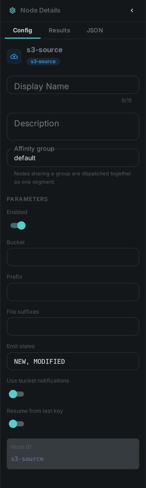
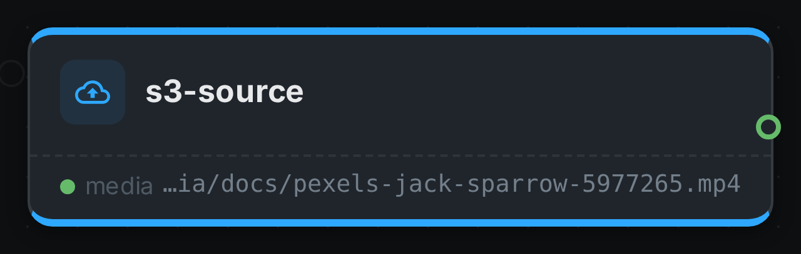

The S3 source is a **source node** — the entry point of a pipeline. Instead of processing a media
item, it *enumerates* objects from S3-compatible object storage (AWS S3, MinIO, Ceph) and feeds each
one into the graph.

It is **differential**: a small local index remembers what each bucket looked like on the previous
run, so a re-run picks up only what is new or changed. Pointing a pipeline at a bucket of a million
objects and running it every hour therefore costs almost nothing after the first pass.

++++

++++

[cols="1,3"]
|===
| Kind | `s3-source`
| Applies to | — (source node; produces the media stream)
| Input ports | None — it is the root of the DAG
| Output ports | `media` — one media item per changed object, carrying its `s3://bucket/key` origin and change state. It is typed as *any media*, because the concrete type is only known once a worker downloads the object
| Requirements | CPU only, plus S3 credentials on the worker. No shared media mount is needed.
| Persists to | n/a (source)
|===

== No shared storage required

Unlike the filesystem source, this node does **not** need every worker to see the same mount. It
emits object *references* (`s3://bucket/key`) rather than file paths, and each worker downloads the
objects it is asked to process into its own local cache. A pipeline can therefore be spread across
machines that share nothing but access to the bucket.

Because the download is what a worker does when it actually needs the bytes, enumerating a bucket
transfers no media at all — only object listings.

TIP: Every worker that processes S3 media needs the S3 settings, not just the one running the source
node. A worker that only computes hashes still has to fetch the objects it hashes.

== Picking up only new objects

Three strategies, which can be combined:

[options="header",cols="1,2,2"]
|===
| Strategy | How it works | When to use it
| Differential scan (default)
| Lists the bucket and compares it against the local index. Listing returns metadata only, so this is fast and transfers no media.
| Always on. This is the strategy that is guaranteed to be correct.

| Bucket notifications (`useEvents`)
| The bucket tells the worker which objects changed, so a run processes just those and skips listing entirely.
| Very large buckets, or when you want runs to be near-instant.

| Resume from last key (`startAfter`)
| Continues listing after the highest key seen so far.
| Only for buckets whose keys are added in ascending order (e.g. date-prefixed) and never edited afterwards.
|===

Notifications can be lost in transit, and resuming cannot see edits to older keys. Both are therefore
treated as accelerators: a full listing still runs periodically (every six hours by default) so that
nothing stays invisible.

=== Enabling bucket notifications

Turn events on for the worker, then point the bucket at it. With MinIO:

[source,bash]
----
mc admin config set myminio notify_webhook:cortex \
    endpoint="http://cortex:8093/s3-events" auth_token="<shared-secret>"
mc admin service restart myminio
mc event add myminio/media arn:minio:sqs::cortex:webhook --event put,delete
----

On AWS, send the bucket's notifications to an SQS queue and give the worker the queue URL instead.

== Configuration

.The node's settings in the pipeline editor

Set on the node in the pipeline editor:

[options="header",cols="1,2"]
|===
| Option | Meaning
| `bucket` | Bucket to read from
| `prefix` | Key prefix to limit the scan, e.g. `2026/07/`. Empty scans the whole bucket
| `suffixes` | Comma-separated file suffixes to accept, e.g. `mp4,mkv,jpg`. Empty accepts everything
| `emitStates` | Which changes flow downstream: `NEW`, `MODIFIED`, `PRESENT`, `DELETED`. Defaults to new and modified
| `useEvents` | Process only the objects the bucket reported as changed, instead of listing it
| `startAfter` | Continue listing after the highest key seen so far
|===

Connection settings are configured **on the worker**, not on the node, so that credentials are never
stored in a pipeline definition:

[options="header",cols="1,2"]
|===
| Setting | Meaning
| `CORTEX_S3_ENDPOINT` | Endpoint override, e.g. `http://minio:9000`. Leave unset for AWS
| `CORTEX_S3_REGION` | Region
| `CORTEX_S3_ACCESS_KEY` / `CORTEX_S3_SECRET_KEY` | Credentials. When unset, the standard AWS credential sources are used (environment, profile, instance role)
| `CORTEX_S3_PATH_STYLE` | Path-style addressing. Defaults to on whenever an endpoint is set, which is what MinIO needs
| `CORTEX_S3_CACHE_PATH` | Where downloaded objects are cached
| `CORTEX_S3_MAX_CACHE_BYTES` | Size budget for that cache; the oldest entries are removed past it
| `CORTEX_S3_MAX_OBJECT_SIZE` | Largest object to download. `0` means unlimited
| `CORTEX_S3_RECONCILE_INTERVAL_MS` | How long the fast strategies may be trusted before a full listing is forced
| `CORTEX_S3_EVENTS_ENABLED` | Accept bucket notifications
| `CORTEX_S3_EVENTS_WEBHOOK_SECRET` | Shared secret the bucket must send with each notification
| `CORTEX_S3_EVENTS_QUEUE_URL` | SQS queue URL, when notifications arrive that way instead
|===

A worker with no S3 settings simply does not offer the S3 source, and is never asked to run one.

== Seeing it run

Turn on link:../../pipeline/#debug-mode[Debug Mode] and every node keeps what it produced, on the
card itself. Below is a real run of this node over `pexels-jack-sparrow-5977265.mp4`.

The strip on the card lists what each output port carried — `media`.

== Use Cases

* **Cloud archive ingest** — process a media bucket without copying it to a shared filesystem first.
* **Continuous ingest** — pick up newly uploaded objects on a schedule, without rescanning history.
* **Distributed processing** — spread heavy work across machines that share no storage.
