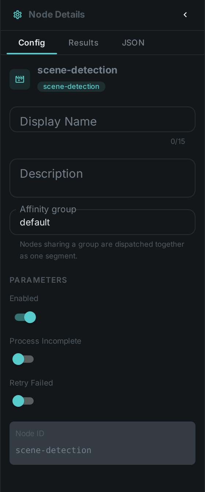
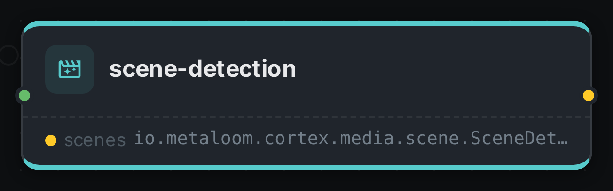

The scene detection node finds **scene boundaries** (cuts) in a video using optical-flow analysis, and
emits the resulting segments. Each run replaces the whole segment set for the asset.

++++

++++

[cols="1,3"]
|===
| Kind | `scene-detection`
| Applies to | Video only
| Input ports | `media`
| Output ports | `scenes` — a **single** timeline covering the clip, not one element per scene. The segments live inside it
| Requirements | OpenCV / video4j **native runtime** (optical-flow analysis). CPU-bound; decoding long videos is heavy.
| Persists to | `asset_segment_comp` (whole-set replace) + `asset_node_result` ledger
|===

The detector is `OpticalFlowSceneDetector`. Because segments are a whole-set replace, a shorter re-run
deletes the surplus rows.

== Configuration

.The node's settings in the pipeline editor

No custom options beyond the common node flags.

== Seeing it run

Turn on link:../../pipeline/#debug-mode[Debug Mode] and every node keeps what it produced, on the
card itself. Below is a real run of this node over `pexels-jack-sparrow-5977265.mp4`.

The strip on the card lists what each output port carried — `scenes`.

== Use Cases

* **Chaptering** — split a video into navigable scenes.
* **Keyframe / per-scene thumbnails** — generate a preview per scene.
* **Targeted analysis** — run heavier nodes (faces, captioning) once per scene instead of per frame.
