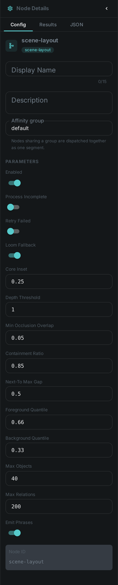
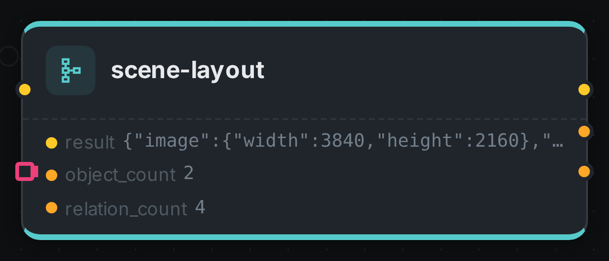

Detection tells you *what* is in a picture and where its box sits. Scene layout tells you **how
those things relate to each other** — which is in front, which is behind, which one is hiding part
of another, and which are standing side by side.

The difference matters more than it sounds. Two boxes that overlap in a photograph might be a person
standing in front of a car, or a person visible through the car's window. Nothing in a flat 2D box
can tell those apart, because the difference is depth. This node joins your detections to a
link:../depthmap/[depth map] and reads the answer off both together.

It runs no model of its own — it is arithmetic over boxes and depth, so it is fast, it costs no GPU
time, and every conclusion it reaches comes with the numbers behind it.

++++

++++

[cols="1,3"]
|===
| Kind | `scene-layout`
| Applies to | Images that have both a depth map and at least two detections
| Input ports | `depth` — connect the `meta` port of link:../depthmap/[Depth Map]; `detections` (**many**) — connect the `detections` port of link:../facedetect/[Face Detection] or any other detector
| Output ports | `result` (the layout structure), `object_count`, `relation_count` (Integer)
| Requirements | None of its own — no model, no sidecar, no GPU
| Persists to | `asset_json_comp` — one layout per asset
|===

== What it produces

For every detected object: where it sits in depth, and which **band** of the scene it belongs to —
foreground, midground or background. Between every pair: the relations that hold, each with a
confidence and the measurements behind it.

[source,json]
----
{
  "objects": [
    { "id": "face-0", "label": "face",
      "bbox": { "x": 40, "y": 40, "w": 80, "h": 80 },
      "depth": { "near": 0.82, "spread": 0.06, "band": "FOREGROUND" } },
    { "id": "face-1", "label": "face",
      "bbox": { "x": 280, "y": 40, "w": 80, "h": 80 },
      "depth": { "near": 0.14, "spread": 0.08, "band": "BACKGROUND" } }
  ],
  "relations": [
    { "subject": "face-0", "predicate": "IN_FRONT_OF", "object": "face-1",
      "confidence": 0.91, "evidence": { "deltaNear": 0.68, "z": 9.7 } },
    { "subject": "face-0", "predicate": "LEFT_OF", "object": "face-1",
      "confidence": 0.74, "evidence": { "gapRatio": 1.5 } }
  ],
  "phrases": [
    "face-0 is in the foreground",
    "face-1 is in the background",
    "face-0 is in front of face-1"
  ]
}
----

The `phrases` list is the same information written as plain English. It is there so you can drop it
straight into a caption prompt or a search index without teaching either one to read the structured
form.

=== The relations it can assert

[options="header",cols="1,2"]
|===
| Relation | Means
| `IN_FRONT_OF` / `BEHIND` | One is measurably nearer the camera than the other
| `SAME_DEPTH` | The difference is within the measurement's own margin of error
| `OCCLUDES` / `OCCLUDED_BY` | They overlap in the frame **and** differ in depth, so one hides part of the other
| `CONTAINS` / `INSIDE` | One box sits almost entirely within the other
| `LEFT_OF` / `RIGHT_OF` / `ABOVE` / `BELOW` | Placement in the frame, only where they are genuinely separated on that axis
| `NEXT_TO` | Close together and at the same depth
|===

=== Why it says "same depth" more often than you might expect

Depth estimated from a single photograph is an estimate, and how trustworthy it is varies across a
picture — flat walls, glass, motion blur and sky are all unreliable. So the node measures how
*consistent* each object's depth is, and only claims an ordering when the gap between two objects is
larger than that uncertainty.

The practical effect is that it declines to guess. Two people standing at roughly the same distance
come back as `SAME_DEPTH` rather than being confidently put in an order the picture does not
actually support. You can make it bolder or more cautious with `depthZThreshold`.

== Configuration

.The node's settings in the pipeline editor

`SceneLayoutNodeOptions`:

[options="header",cols="1,2"]
|===
| Option | Meaning
| `allowLoomFallback` | Read detections back from the server when nothing is wired into the `detections` port. On by default
| `depthZThreshold` | How much clearer than the noise a depth gap must be before an ordering is asserted. Default 1.0; lower is bolder
| `coreInset` | How much of each box's edge to ignore when measuring its depth. Default 0.25, i.e. measure the middle half
| `foregroundQuantile` / `backgroundQuantile` | Where the band boundaries sit within the scene's own depth range. Defaults 0.66 and 0.33
| `occlusionMinOverlap` | How much overlap is needed before occlusion is reported. Default 0.05
| `containmentRatio` | How much of a box must lie inside another to call it contained. Default 0.85
| `nextToMaxGap` | How close two same-depth objects must be to count as adjacent. Default 0.5
| `maxObjects` / `maxRelations` | Upper bounds, default 40 and 200. Anything dropped is reported in the result
| `emitPhrases` | Whether to include the plain-English sentences. On by default
|===

== Seeing it run

Turn on link:../../pipeline/#debug-mode[Debug Mode] and every node keeps what it produced, on the
card itself. Below is a real run over a single frame of a café conversation, with a real depth map
from link:../depthmap/[Depthmap] on one port and real boxes from link:../facedetect/[Facedetect] on
the other — both measured against that same frame.

Two faces in, four relations out. The `result` port carries them in full: the man is nearer the
camera than the woman, so the solver reports `IN_FRONT_OF` and `BEHIND` from the depth difference and
`LEFT_OF` / `RIGHT_OF` from the boxes. `object_count` and `relation_count` are the same answer as
numbers, for a downstream node that only needs to know whether there was anything to relate.

== Use Cases

* **Captions that get prepositions right** — "a woman standing in front of a red car" instead of a
  model guessing from a flat image.
* **Searchable spatial facts** — find every photo with a person in the foreground, or two subjects
  side by side.
* **Editorial selection** — pick the frame where the subject is genuinely in front, not merely
  overlapping.
* **Review and compliance** — flag pictures where a face is in the background or behind glass, when
  only the foreground subject is the one you care about.

== What you need first

This node works on what other nodes produce, so both have to be in your pipeline ahead of it and
wired into its two input ports:

. link:../depthmap/[Depth Map] — required. Connect its `meta` port to `depth`, and put it in the
  **same affinity group** as this node so both run on the same machine.
. A detector — link:../facedetect/[Face Detection] today. Connect its `detections` port to
  `detections`. At present that means the node relates faces to faces; once object detection is
  available it will relate people to cars and everything else without any change here, because the
  port accepts any detection type and the node never asks which node produced a box.
