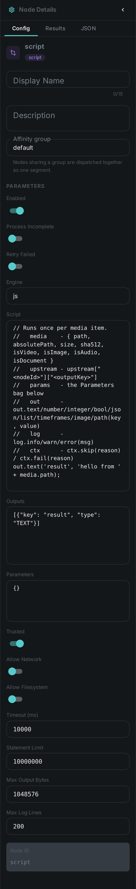
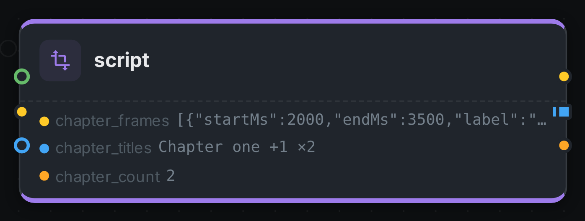

The script node runs **a small piece of code you write** as a step in your pipeline. It reads the
media item and the outputs of any nodes upstream of it, and produces whatever outputs you declare —
a text, a number, a list of texts, a block of JSON, a set of timeframes, or images.

It exists for the gap between "one of the built-in nodes already does this" and "we need a new node
built and released". Turning a transcript into chapter marks, thresholding a quality metric into a
tag, reshaping a language model's answer into structured fields — each is a few lines of code, and
each would otherwise be a development project.

++++

++++

[cols="1,3"]
|===
| Kind | `script`
| Applies to | Any asset
| Input ports | `media`, plus `data` for structured input and `text` for text from upstream
| Output ports | Whatever you declare — see <<outputs>>. A list type becomes a **many** port
| Languages | JavaScript
| Requirements | None. The script runs inside the Cortex worker; no external service is involved
| Persists to | `asset_json_comp` (one row per script node), and `asset_segment_comp` for timeframe outputs
|===

[#writing]
== Writing a script

The script runs once per media item. Six values are available to it:

[options="header",cols="1,3"]
|===
| Name | What it gives you
| `media` | The current item: `path`, `absolutePath`, `size`, `sha512`, `isVideo`, `isImage`, `isAudio`, `isDocument`
| `data` | What arrived on the connected inputs. The `data` port's JSON is unpacked into it field by field, and whatever you connect to the `text` port appears as `data.text`
| `params` | The constants you set in the node's *Parameters* field, so one script can be reused with different settings
| `out` | How you produce results — `out.text`, `out.number`, `out.integer`, `out.bool`, `out.json`, `out.list`, `out.timeframes`, `out.image`, `out.path`
| `log` | `log.info`, `log.warn`, `log.error` — written to the worker log, prefixed with the node's name
| `ctx` | `ctx.skip('reason')` to record the item as skipped, `ctx.fail('reason')` to record it as failed
|===

A complete example — turning a transcript into chapter marks. Connect the whisper node's
`transcript` output to this node's `text` input, and it arrives as `data.text`:

[source,javascript]
----
const re = new RegExp(params.pattern, 'i');
const transcript = JSON.parse(data.text);

const frames = transcript.segments
  .filter(s => re.test(s.text))
  .map(s => ({ startMs: Math.round(s.start * 1000),
               endMs:   Math.round(s.end   * 1000),
               label:   s.text.trim() }));

if (frames.length === 0) {
  ctx.skip('no chapter markers in transcript');
}

out.timeframes('chapter_frames', frames);
out.list('chapter_titles', frames.map(f => f.label));
out.integer('chapter_count', frames.length);
----

[#outputs]
== Declaring outputs

Outputs are declared in the node's *Outputs* field, not discovered from the script. This is what lets
the pipeline editor draw the node's output ports — with their types and their cardinality — so you
can wire the next node to them before the script has ever run.

[source,json]
----
[
  { "key": "chapter_frames", "type": "TIMEFRAMES" },
  { "key": "chapter_titles", "type": "TEXT_LIST" },
  { "key": "chapter_count",  "type": "INTEGER" }
]
----

[options="header",cols="1,2,2"]
|===
| Type | The script provides | Stored as
| `STRING`, `TEXT` | a string | a field in the node's JSON result
| `INTEGER`, `NUMBER` | a number | a field in the node's JSON result
| `BOOLEAN` | `true` / `false` | a field in the node's JSON result
| `JSON` | an object | a field in the node's JSON result
| `TEXT_LIST` | an array of strings | a field in the node's JSON result. The port is **many** — one element per string
| `TIMEFRAMES` | an array of `{ startMs, endMs, label }` | a real timeline on the asset. The port is **one**: the timeline is a single value, however many segments it holds
| `IMAGE` | image bytes, base64, or a path | an image file in the worker's cache
| `IMAGE_LIST` | an array of those | one image file each. The port is **many** — one element per image
| `PATH` | a file path | a field in the node's JSON result
|===

The list types are the pipeline's fan-out: a **many** port hands the next node one element at a time,
so a script that emits ten titles runs whatever you connect ten times, without you writing a loop.
Every other type is a single value, `TIMEFRAMES` included — a timeline is one thing, not a sequence
of segments.

A single item can produce several multi-valued outputs at once — that is how one transcript becomes a
whole timeline of chapter marks plus a list of titles plus a count, in one pass.

Writing to a key you have not declared stops the node with an error naming the key. That is
deliberate: a typo that was silently dropped would leave your pipeline claiming a connection carries
data that never arrives.

*Timeframes* are stored as a real timeline against the asset, so they can be queried and displayed
rather than sitting in an opaque blob. Each timeframe output is filed under a **segment type** —
`CHAPTER` (the default), `SCENE`, `SILENCE` or `SHOT`. Set it with `"segmentType": "SCENE"` alongside
the key and type. If one node declares two timeframe outputs, give them different segment types.

*Images* are written to the worker that ran the script, and the port carries them as artifacts, which
is what lets you connect them straight to link:../s3-sink/[S3 Sink]. Because the files are local to
that worker, keep the nodes that consume them in the same affinity group.

== Configuration

.The node's settings in the pipeline editor

[options="header",cols="1,2"]
|===
| Option | Meaning
| `Engine` | The script language. `js` (JavaScript) is currently the only one
| `Script` | The script body, run once per media item
| `Outputs` | The declared outputs — see <<outputs>>
| `Parameters` | Constants handed to the script as `params`
| `Required Inputs` | Connected inputs that must all carry a value, or the item is skipped rather than failed
| `Trusted` | Whether the script runs with the worker's full privileges (default) — see <<safety>>
| `Allow Network` / `Allow Filesystem` | Extra capabilities, off by default
| `Timeout (ms)` | How long one item may take before the script is stopped (default 10 s)
| `Statement Limit` | A second guard against a script that loops forever
| `Max Output Bytes` | Cap on the size of a single item's results (default 1 MB)
| `Max Log Lines` | Cap on `log.*` calls per item (default 200)
|===

`Required Inputs` is what makes a script safe to hang off an optional branch: if an OCR node only
runs for images, a script downstream of it skips videos quietly instead of reporting a failure for
every one.

[#safety]
== Safety and performance

**Anyone who can edit a pipeline can run code on a worker.** A script node is not a sandboxed
plugin by default — treat permission to edit pipelines as equivalent to permission to run code, and
grant it accordingly.

Three controls are available:

* **Trusted off.** Turning off *Trusted* denies the script access to the host system: no Java
  classes, no files, no network, no threads. Use it for scripts that only need to reshape data.
* **Limits.** The timeout and statement limit always apply, in both modes. A script that loops
  forever is stopped and the item recorded as failed; it cannot occupy a worker indefinitely.
* **Turning the node off entirely.** Adding `script` to a worker's node blacklist means that worker
  will refuse script work. If no worker accepts it, pipelines containing a script node are rejected
  when you try to run them, with a clear message — see
  link:../../cortex/configuration/[Cortex Configuration].

On performance: scripts are interpreted, which is ample for shaping data and wrong for heavy
per-pixel or per-frame computation. If you find yourself writing a tight loop over image data, that
is the signal to build a proper node instead.

== Use cases

* **Derive a timeline** — turn a transcript, a caption set or a detection list into chapter marks.
* **Classify on a threshold** — convert a quality metric or a sentiment score into a simple label.
* **Reshape model output** — pull structured fields out of a language model's free-text answer.
* **Bridge two nodes** — rename, filter or combine upstream outputs so the next node gets what it
  expects.
* **Prototype** — try out a processing idea in a live pipeline before committing to building a node
  for it.

== Seeing it run

Turn on link:../../pipeline/#debug-mode[Debug Mode] and every node keeps what it produced, on the
card itself. Below is a real run of this node over `pexels-jack-sparrow-5977265.mp4`.

The strip on the card lists what each output port carried — `chapter_frames`, `chapter_titles`, `chapter_count`.
