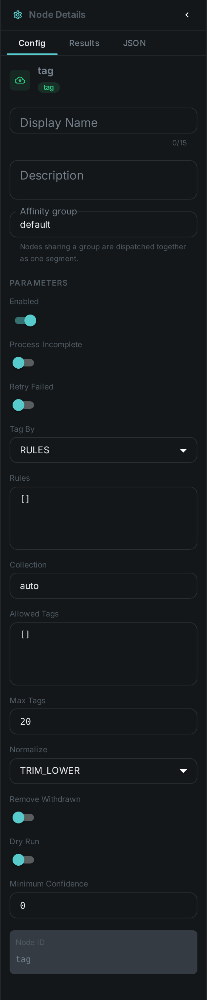
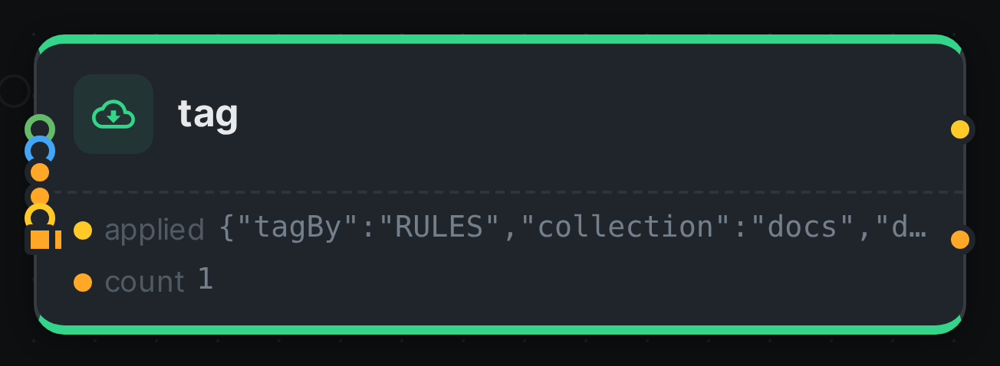

The Tag node writes **tags** onto your assets from rules you configure. It is the step that turns
something a pipeline worked out — this photo is blurry, this clip is in German, this picture is
mostly amber — into something you can *search for*.

That is the point of it. Most analysis nodes attach their answer to the asset as a structured result,
which is fine to read on the asset page and impossible to find by. A tag is different: the moment it
is written it becomes part of the asset's search document, so `blurry` in the search box brings back
every blurry picture in the library.

++++

++++

[cols="1,3"]
|===
| Kind | `tag`
| Applies to | Any
| Input ports | `media` — the item being tagged. `text`, `number`, `flag`, `struct`, `labels` — the values your rules read; all optional
| Output ports | `applied` — what this node did to the item. `count` — how many tags were attached
| Requirements | None. No model, no sidecar, no native library
| Persists to | Tags on the asset, plus a record of what this node applied
|===

== How a rule works

A rule reads: *when this holds, attach this tag*. Each rule is a row with a name and one or more
conditions, and every rule is checked independently — an item can pick up several tags in one pass.

A condition names one of the node's **input ports**, a comparison, and a value:

[options="header",cols="1,3"]
|===
| Field | Meaning
| Input | Which port to read: `text`, `number`, `flag`, `struct` or `labels`
| Path | For `struct` only: which value inside the result to look at, written with dots — `blurriness`, `image.width`, `colors.0.name`
| Operator | `EQ`, `NEQ`, `GT`, `GTE`, `LT`, `LTE`, `CONTAINS`, `STARTS_WITH`, `MATCHES` (a regular expression), `IN` (a list), `EXISTS`, `NOT_BLANK`
| Value | What to compare against. Not needed for `EXISTS` and `NOT_BLANK`
|===

A rule with several conditions fires when **all** of them hold. Set *Match* to `ANY` for a rule that
fires when at least one does.

Where the values come from is the connection you draw, not something you type into the rule. Wire
link:../quality/[Quality] into `struct` and your rules can threshold on blurriness; wire
link:../whisper/[Whisper] into `text` and they can match on what was said.

**A port nobody connected simply makes its conditions false.** The node does not refuse to run and
does not fail the item — it records the rule as skipped, so you can see on the asset that a rule
never fired because a connection is missing rather than because nothing matched.

== Tagging a list

Some nodes produce a *list* of words rather than one value: the colour names from
link:../dominant-color/[Dominant Colour], for instance. Connect that to the `labels` port and set
**Tag by** to `Labels`, and every entry in the list becomes a tag.

The same list can also drive a rule. Set *For each* to `labels` and use `${value}` in the tag name to
build one tag per entry — `lang:${value}` turns a list of detected languages into `lang:de`,
`lang:en` and so on.

== Keeping the tag list clean

Tags are shared across your whole library: two assets tagged `blurry` carry the *same* tag, and
renaming it renames it everywhere. That is what makes tags useful for searching, and it is also why
a node writing them automatically needs guard rails. There are four, and they are worth setting:

**Collection**:: Which collection the tags go into. Keep machine-written tags in their own collection
— it is what lets you tell them apart from the ones people typed.

**Allowed tags**:: A list of the only names this node may write. Anything else is dropped and
recorded as rejected. Use it whenever the names come from a list rather than from you: one unexpected
word otherwise becomes a permanent entry in a list everyone shares.

**Max tags**:: A ceiling on how many tags one item can pick up. A rule that builds names from a list
has no natural limit.

**Normalize**:: How a name is tidied before it is written. The default trims spaces and lowercases,
so `Amber` and `amber ` cannot become two separate tags.

== Trying rules out first

Turn on **Dry run** and the node works out exactly what it would tag and records it on the asset,
without attaching anything. That is the safe way to try a rule set against a real library: run it,
look at what it decided, then turn it off.

== Removing tags again

By default the node only ever adds. Turn on **Remove withdrawn** and it will also take back tags it
applied on an earlier run that its rules no longer support — so fixing a threshold cleans up after
itself instead of leaving the old verdict behind.

It will only ever remove a tag it can prove it wrote: one that is in its own record from a previous
run *and* in the collection it writes into. A tag you added by hand, or one a different Tag node
applied, is never touched — and the server enforces the same rule from its side, because every tag on
an asset records who put it there.

Adding and removing happen together in a single write, so an asset is never left carrying the new
verdict alongside the old one. The flip side is that a worker which is allowed to tag but not to
untag cannot do half the job: with **Remove withdrawn** on it will report the item as failed rather
than quietly adding without removing.

== Telling machine tags from your own

Every tag on an asset carries the name of whatever attached it — a node, or `manual` when a person
did — along with the confidence and the time. Tags you typed and tags a pipeline worked out sit side
by side and stay distinguishable, so a view can show them differently, or hide the machine ones, or
let you confirm them one at a time.

The same asset can also carry one tag several times, each in its own place: two faces in a photo, one
person at three points in a video. Each of those placements can be removed on its own without
disturbing the others.

== Configuration

.The node's settings in the pipeline editor

== Seeing it run

Turn on link:../../pipeline/#debug-mode[Debug Mode] and every node keeps what it produced, on the
card itself. Below is a real run of this node over `pexels-photo-2379005.jpeg`.

The strip on the card lists what each output port carried — `applied`, `count`.

== Use Cases

* **Quality triage** — connect link:../quality/[Quality] and tag `blurry`, `low-resolution` or
  `print-ready`, then find them from the search box.
* **Colour facets** — connect link:../dominant-color/[Dominant Colour] to `labels` and get a colour
  vocabulary across the library, with an allowed list so only the colours you want appear.
* **Editorial review** — connect a transcript to `text` and a tone score to `number`, and tag
  `needs-review` when a recording is both negative and mentions a complaint.
* **Findable metadata** — connect link:../metadata/[Asset Metadata] and tag what the files already
  say about themselves: `geotagged` when a photo carries coordinates, `licensed` when it carries a
  licence.

== Notes

* The node remembers its answer per item for the lifetime of the worker, so re-running a pipeline
  does not redo the same work. Changing the rules counts as a different question and is worked out
  afresh.
* Two Tag nodes can sit in one pipeline — one for quality, one for colour — and each keeps its own
  record of what it applied, so neither can undo the other's work.
* Attaching a tag needs the worker's Loom token to be allowed to tag assets, and **Remove withdrawn**
  additionally needs it to be allowed to untag them. Without the permission the item fails rather than
  quietly tagging nothing.
* All the tags for one item are written in one go, however many rules fired — tagging a large library
  costs one write per asset, not one per tag.
