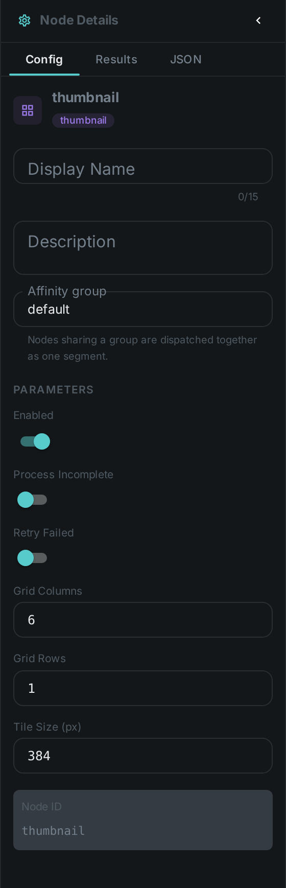
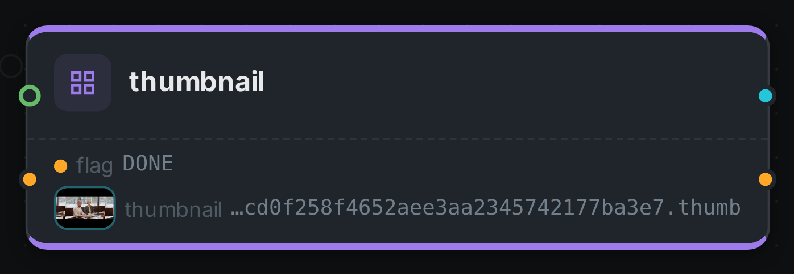
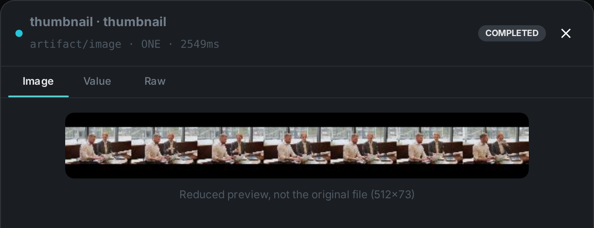

The thumbnail node generates a **contact-sheet preview** (a tiled grid of frames) for a video, giving
the UI a fast visual summary of the content.

++++

++++

[cols="1,3"]
|===
| Kind | `thumbnail`
| Applies to | Video only
| Input ports | `media`, plus an optional `is_complete` — connect link:../consistency/[Consistency]'s `is_complete` port to skip incomplete videos
| Output ports | `thumbnail` (the contact sheet, the file link:../s3-sink/[S3 Sink] uploads), `flag` (String)
| Requirements | OpenCV / video4j **native runtime** (frame extraction). CPU-bound. **Storage**: the generated image is written to the worker's local thumbnail cache (a durable `.thumb` file); only a ledger entry goes to Loom.
| Persists to | `asset_node_result` ledger (image bytes stay in the local cache)
|===

== Configuration

.The node's settings in the pipeline editor

These settings control the contact-sheet layout. Set them in the panel above, or in the
node's `options` block in a pipeline definition:

[options="header",cols="1,2"]
|===
| Option | Meaning
| `tileSize` | Pixel size of each frame tile
| `cols` | Number of columns in the grid
| `rows` | Number of rows in the grid
|===

== Seeing it run

Turn on link:../../pipeline/#debug-mode[Debug Mode] and every node keeps what it produced, on the
card itself. Below is a real run of this node over `pexels-jack-sparrow-5977265.mp4`.

The strip on the card lists what each output port carried — `flag`, `thumbnail`.

Selecting one of them opens it full size.

== Use Cases

* **Fast browsing** — show a visual overview of a video without opening it.
* **Preview generation** — produce a poster/scrubbing sheet for the asset detail view.
