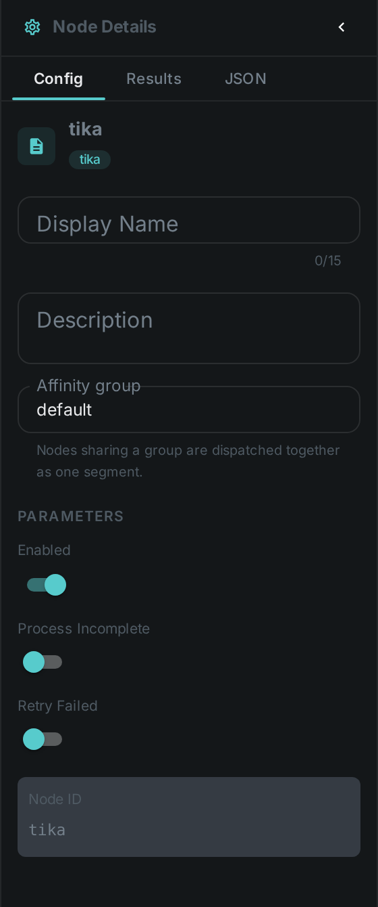
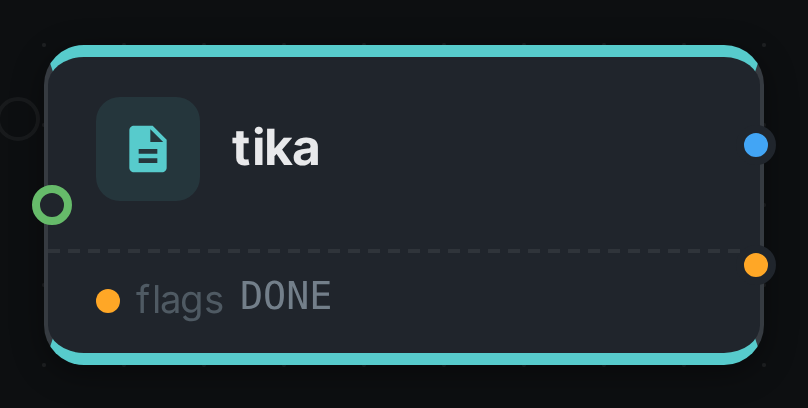

The Tika node extracts **format metadata and embedded text** from virtually any file type using Apache
Tika — images (EXIF), audio/video containers, PDFs and Office documents.

++++

++++

[cols="1,3"]
|===
| Kind | `tika`
| Applies to | Image, Audio, Video, Document
| Input ports | `media`
| Output ports | `content` (the extracted text — connect it to link:../sentiment/[Sentiment Analysis] or link:../llm/[LLM Enrichment]), `flags` (String)
| Requirements | CPU only — Apache Tika is pure JVM, no native dependency or external service.
| Persists to | `asset_json_comp` + `asset_node_result` ledger
|===

== Configuration

.The node's settings in the pipeline editor

No custom options beyond the common node flags — Tika auto-detects the format and applies the
appropriate parser.

== Seeing it run

Turn on link:../../pipeline/#debug-mode[Debug Mode] and every node keeps what it produced, on the
card itself. Below is a real run of this node over `sample.docx`.

The strip on the card lists what each output port carried — `flags`.

== Use Cases

* **Universal metadata extraction** — pull EXIF, codec, author, page-count and similar fields across
  many formats in one node.
* **Embedded text indexing** — extract text from PDFs and Office documents for search.
* **Format triage** — a cheap first-pass over heterogeneous ingest.
