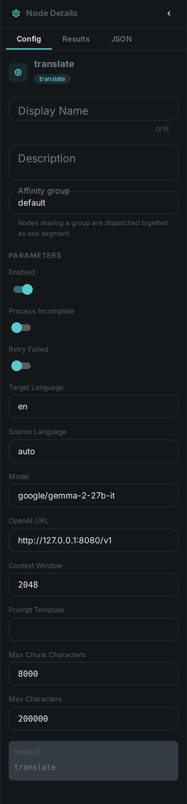
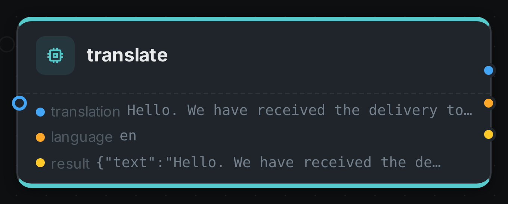

The translate node **turns text your pipeline has already produced into another language**. Like
link:../sentiment/[sentiment] it never looks at the media itself: it has a single `text` input port
that accepts any text type, so a link:../whisper/[Whisper] transcript, link:../tika/[Tika] document
content, an link:../ocr/[OCR] result or a link:../vlm/[VLM] answer can all be connected to it. What
comes out is plain prose on a `translation` port, ready to be wired into link:../tts/[TTS] for
narration or stored alongside the original.

Translation runs on a language model you already operate — any OpenAI-compatible endpoint —
so the node stays a pure client with no model runtime of its own.

++++

++++

[cols="1,3"]
|===
| Kind | `translate`
| Applies to | Any asset (the text comes from an upstream node, not from the media)
| Input ports | `text` — accepts any text type, so a transcript, a document body, an OCR result or a caption can all be wired into it
| Output ports | `translation` (Text), `language` (String), `result` (the structure below)
| Languages | Whatever the configured model speaks; the target is named in plain words or as a language tag
| Requirements | An **OpenAI-compatible endpoint** serving the configured model
| Persists to | `asset_json_comp` — one row per target language
|===

== What it produces

[source,json]
----
{
  "text": "The customer service was a disaster.",
  "targetLanguage": "en",
  "sourceLanguage": "auto",
  "model": "google/gemma-2-27b-it",
  "chunkCount": 3,
  "sourceChars": 18422,
  "translatedChars": 17980
}
----

== One node, one language

A translate node translates into exactly one language. For several languages, put several translate
nodes in the pipeline and connect the same upstream text to each.

That is not a limitation to work around — it is how the translations stay separately addressable.
Each row is stored under its target language, so an asset can carry its English, German and French
translations side by side and you can ask for the one you want:

[source,bash]
----
curl -s -H "Authorization: Bearer $TOKEN" \
  "$LOOM/api/v1/assets/$ASSET/json-comps" \
  | jq '.data[] | select(.schemaType == "translation" and .variant == "en") | .data.text'
----

Each node also runs independently, so a French model that is slow or unavailable does not hold up the
English translation.

== Long documents

A feature-length transcript does not fit in a model's context window, so the node splits it before
sending it. The split is made at **paragraph boundaries first, then sentence boundaries** — never
mid-sentence — and the answers are joined back together in order.

This matters more than it may sound. A model handed half a sentence with no subject answers with half
a sentence, and two such halves rejoined do not make a sentence in the target language. Splitting
where a human translator would split is what keeps the output readable. `maxChunkChars` sets the
budget per request; each chunk is one call to the model, so a longer document costs proportionally
more.

== Configuration

.The node's settings in the pipeline editor

Set these in the panel above, or in the node's `options` block in a pipeline definition:

[options="header",cols="1,2"]
|===
| Option | Meaning
| `targetLanguage` | The language to translate into (default `en`). Also the key the result is stored under
| `sourceLanguage` | The language of the input, or `auto` to let the model work it out (default `auto`)
| `model` | The model asked to translate (default `google/gemma-2-27b-it`). Recorded with every result
| `openaiUrl` | Base URL of the OpenAI-compatible backend (default `\http://127.0.0.1:8080/v1`)
| `contextWindow` | Tokens the model is told it may use for one call (default `2048`)
| `promptTemplate` | The instruction sent with each chunk. Must contain `${text}`; `${targetLanguage}` and `${sourceLanguage}` are also filled in
| `maxChunkChars` | Longer input is split into chunks of this size (default `8000`)
| `maxChars` | Upper bound on the total input text (default `200000`)
|===

There is no option naming where the text comes from: the `text` port accepts any text type, so you
draw a connection instead.

Naming `sourceLanguage` when you know it is worth doing. `auto` is reliable on a paragraph of prose
and much less so on a caption of six words, where a model can mistake one language for a closely
related one.

== Dubbing: translate, then speak

`translation` carries plain prose, and link:../tts/[TTS] accepts any text on its `text` port, so the
two connect directly:

[source,json]
----
{
  "nodes": [
    { "id": "source",    "type": "filesystem-source", "name": "Video library",
      "options": { "path": "/media/video" } },
    { "id": "speech",    "type": "whisper",   "name": "Transcribe", "timeoutMs": 3600000 },
    { "id": "translate", "type": "translate", "name": "Translate to English",
      "options": { "targetLanguage": "en" } },
    { "id": "narrate",   "type": "tts",       "name": "Speak the translation" }
  ],
  "edges": [
    { "id": "e1", "source": "source",    "sourcePort": "media",
      "target": "speech",    "targetPort": "video" },
    { "id": "e2", "source": "speech",    "sourcePort": "transcript",
      "target": "translate", "targetPort": "text" },
    { "id": "e3", "source": "translate", "sourcePort": "translation",
      "target": "narrate",   "targetPort": "text" }
  ]
}
----

Set the TTS node's own `language` to match the target language, or it will read English words with a
German voice.

== Seeing it run

Turn on link:../../pipeline/#debug-mode[Debug Mode] and every node keeps what it produced, on the
card itself. Below is a real run of this node over `pexels-jack-sparrow-5977265.mp4`.

The strip on the card lists what each output port carried — `translation`, `language`, `result`.

== Use Cases

* **Subtitling and dubbing** — translate a transcript, then speak it with link:../tts/[TTS].
* **Multilingual search** — translate every document into one common language so a single query
  reaches the whole library.
* **Cross-border archives** — keep the original text and its translations on the same asset.
* **Accessibility** — pair with link:../whisper/[Whisper] to give a foreign-language recording both a
  transcript and a translation.

== Notes

* **Translate prose, not JSON.** An link:../llm/[LLM] prompt that returns a JSON document is typed
  `text/plain` just like a transcript is, so nothing stops you connecting it — but the model will
  translate the field names along with the values. Connect a prose port.
* **The model is recorded with every result**, so a library translated across a model upgrade can
  still be told apart.
* Translation quality is the model's, not the node's. A larger model is usually the answer to
  disappointing output, ahead of rewriting the prompt.
