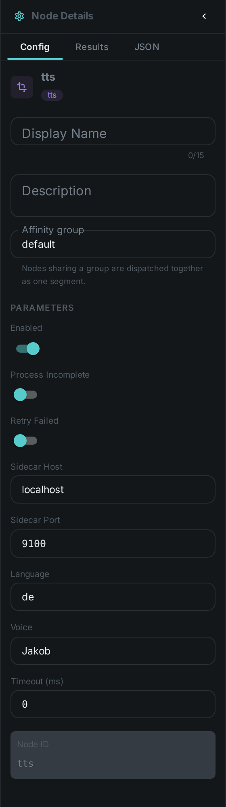
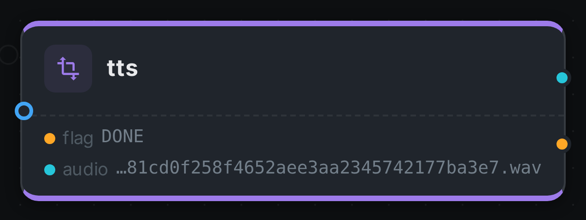

The TTS node **generates narration audio from text**. Unlike the analysis nodes, which describe a
property of the media itself, TTS has a single `text` input port that accepts any text type — connect
an link:../llm/[LLM] summary, a link:../captioning/[caption], or a translated
link:../whisper/[transcript] to it — and synthesizes speech, attaching the audio to the asset.

German is synthesized with **Orpheus-3B / Kartoffel** and English with **Kokoro**. Both run behind a
small HTTP sidecar, so the node stays a pure client and needs no model runtime of its own.

++++

++++

[cols="1,3"]
|===
| Kind | `tts`
| Applies to | Any asset (the audio is generated from upstream text, not from the media)
| Input ports | `text` — accepts any text type, so an LLM answer, a caption or a transcript can be wired straight into it
| Output ports | `audio` (the generated WAV, ready for link:../s3-sink/[S3 Sink]), `flag` (String)
| Requirements | A running **TTS sidecar** (`/v1/tts`). German uses Orpheus/Kartoffel (GPU recommended); English uses Kokoro (CPU).
| Persists to | `asset_node_result` ledger only — the generated WAV stays in the worker's local `tts_bin` cache (as with thumbnails)
|===

== Configuration

.The node's settings in the pipeline editor

`TtsNodeOptions`:

[options="header",cols="1,2"]
|===
| Option | Meaning
| `ttsHost` / `ttsPort` | Address of the TTS sidecar (default `localhost:9100`)
| `language` | `de` → Orpheus/Kartoffel, `en` → Kokoro (default `de`)
| `voice` | Voice id for the selected engine (default `Jakob`; English e.g. `af_heart`)
|===

Nothing configures where the words come from — connect a port to `text` and the node speaks whatever
arrives on it.

== Seeing it run

Turn on link:../../pipeline/#debug-mode[Debug Mode] and every node keeps what it produced, on the
card itself. Below is a real run at the shipped `language: de` / `voice: Jakob`, speaking the German
transcript that link:../translate/[Translate] and link:../sentiment/[Sentiment] also work on.

`audio` carries the path of the WAV in the worker's local cache and `flag` records how the node
finished. The audio itself is not uploaded anywhere yet — the bytes live beside the worker, exactly
as link:../thumbnail/[Thumbnail] leaves its contact sheet.

== Use Cases

* **Audio descriptions** — speak an link:../llm/[LLM]-generated description or
  link:../captioning/[caption] for accessibility.
* **Dubbing / narration** — voice a translated link:../whisper/[transcript] back onto the asset.
* **Bilingual output** — German via Orpheus/Kartoffel, English via Kokoro, chosen per pipeline.

The sidecar is a small FastAPI service; see the `server/` directory next to the node for how to run
it (including the production path where Orpheus runs on vLLM / llama.cpp).
