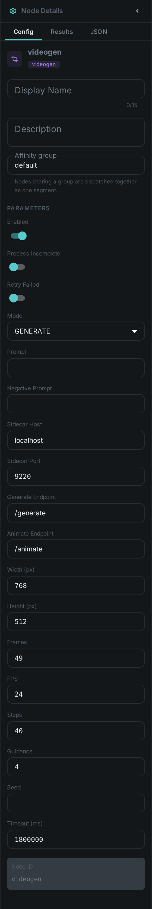
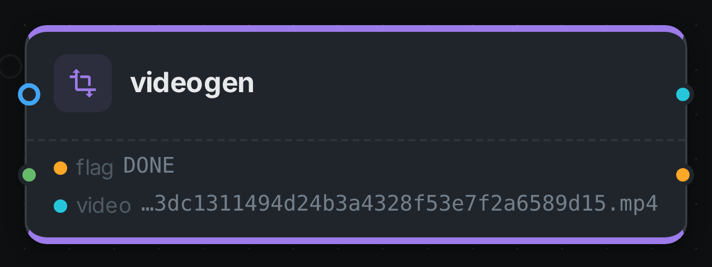

The video-generation node **generates a short video clip with a diffusion model**. Like the
image-generation node — and unlike the analysis nodes, which describe a property of the media itself
— `videogen` produces fresh media: a small MP4 clip, either from a text prompt (`GENERATE`) or by
animating the asset's own still image as the opening frame (`ANIMATE`), and attaches it to the asset.
The clip carries a **synchronised audio track**.

The diffusion model runs behind a small HTTP sidecar, so the node stays a pure client and needs no
model runtime of its own. The shipped sidecar serves **LTX-2**, which fits a single 24 GB GPU.

++++

++++

[cols="1,3"]
|===
| Kind | `videogen`
| Applies to | Image assets
| Input ports | A generation `prompt` from the node configuration; in `ANIMATE` mode also `media`, the asset's own image
| Output ports | `video` (the generated MP4, ready for link:../s3-sink/[S3 Sink]), `flag` (String)
| Requirements | A running **video sidecar** (`/generate`, `/animate`). A GPU with at least 24 GB is required.
| Persists to | `asset_node_result` ledger only — the generated MP4 stays in the worker's local `videogen_bin` cache (as with generated images)
|===

== Configuration

.The node's settings in the pipeline editor

Set these in the panel above, or in the node's `options` block in a pipeline definition:

[options="header",cols="1,2"]
|===
| Option | Meaning
| `mode` | `GENERATE` (text-to-video) or `ANIMATE` (image-to-video) (default `GENERATE`)
| `prompt` | The generation prompt (required)
| `negativePrompt` | What to steer away from (optional; the sidecar applies its own default when empty)
| `host` / `port` | Address of the video sidecar (default `localhost:9220`)
| `width` / `height` | Output size (default `768` × `512`; snapped to a multiple of 32 by the sidecar)
| `numFrames` | Number of frames (default `49`; snapped to `k*8+1` by the sidecar)
| `fps` | Frame rate of the produced clip (default `24`)
| `steps` | Number of inference steps (default `40`)
| `guidance` | Prompt guidance scale (default `4.0`)
| `seed` | Optional RNG seed for reproducible output
|===

== Seeing it run

Turn on link:../../pipeline/#debug-mode[Debug Mode] and every node keeps what it produced, on the
card itself. Below is a real run in `ANIMATE` mode over `pexels-photo-2379005.jpeg`, prompted for
_"the man turns his head slowly towards the camera and smiles"_ — 49 frames at 768×512, the shipped
defaults, at 20 steps.

Two ports: `video` carries the path of the MP4 in the worker's local cache and `flag` records how the
node finished. Unlike link:../imagegen/[Imagegen], the card shows the path rather than the result —
the debugging view previews images, and a video artifact has no still to show.

NOTE: The clip has **sound**. LTX-2 returns synchronised audio from the same forward pass and the
sidecar muxes both into the MP4, so what lands on the `video` port is a 49-frame H.264 stream with an
AAC track beside it — not a silent animation.

`ANIMATE` is the mode worth photographing: `GENERATE`, the shipped default, never reads the incoming
media and answers from the prompt alone.

== Running the sidecar

The sidecar is a small FastAPI service:

[source,bash]
----
cd sidecars/ltx2-sidecar
./setup.sh                       # venv; installs torch (cu128) then requirements.txt
./run.sh                         # serves on :9220 (first call loads the model)
# smoke test
curl -s -X POST localhost:9220/generate \
  -H 'content-type: application/json' \
  -d '{"prompt":"a dark, elegant cinemagraph of glowing teal threads","num_frames":33}' -o out.mp4
----

The first request downloads and quantizes the model, which takes a while; everything after is warm.
LTX-2 is a large system — it fits a single 24 GB card only because the sidecar quantizes it to
4-bit. Set `steps` and `numFrames` modestly for interactive latency and raise them once you have the
GPU time budget.

== Use Cases

* **Motion hero clips** — turn a catalogue prompt into a short looping clip for a listing.
* **Animating a still** — bring an existing asset's image to life as the opening frame of a clip.
* **Previews & variations** — produce derived motion visuals for review workflows.

The generated MP4 is written to the worker's local `videogen_bin` cache and a node-result ledger row
records that the node ran for the asset. Wire the `video` port into an link:../s3-sink/[S3 Sink] to
keep the clip and register it as its own asset.
