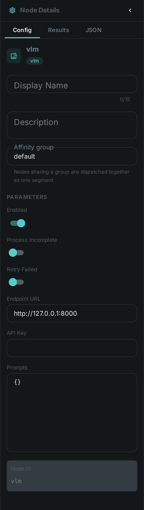

The VLM node reads an image with a **vision-language model** served over an OpenAI-compatible
endpoint. It ships an **olmOCR** preset that transcribes a document page — scans, receipts,
screenshots, forms — into clean markdown, with tables converted to HTML and equations to LaTeX.

Unlike the link:../ocr/[OCR] node, which recognises glyphs with Tesseract, this node hands the whole
page to a model that also understands its layout. It is the better choice for multi-column pages,
tables, forms and handwriting, at the cost of needing a GPU-backed model service. Both nodes can run
in the same pipeline.

++++

++++

[cols="1,3"]
|===
| Kind | `vlm`
| Applies to | Image
| Input ports | `media`
| Output ports | `result_{promptId}` — **one port per configured prompt**. Configured with no prompts the node falls back to the olmOCR preset and exposes a single `result` port
| Requirements | An OpenAI-compatible vision endpoint (for example vLLM serving olmOCR). GPU-bound; no native library on the worker.
| Persists to | `asset_json_comp` + `asset_node_result` ledger
|===

== Configuration

.The node's settings in the pipeline editor

`VlmNodeOptions`:

[options="header",cols="1,2"]
|===
| Option | Meaning
| `endpointUrl` | Base URL of the vision endpoint, e.g. `\http://127.0.0.1:8000`
| `apiKey` | Bearer token for the endpoint; usually unset for a local service
| `prompts` | Named tasks to run against the image, keyed by prompt id. Each one adds a `result_{promptId}` output port, which appears on the node in the editor as soon as the prompt is defined
|===

Each entry under `prompts` configures one task:

[options="header",cols="1,2"]
|===
| Option | Meaning
| `model` | Model id to select on the endpoint
| `prompt` | Instruction sent alongside the image
| `responseFormat` | `TEXT`, `JSON` or `OLMOCR` — how the answer is read back
| `maxImageDim` | Longest image side in pixels sent to the model; `0` disables scaling
| `maxTokens` | Output token budget; a full document page needs a few thousand
| `temperature` | Sampling temperature
| `retryOnRotation` | For `OLMOCR`: when the model reports the page is sideways, rotate it and ask again
|===

Configured with no prompts the node falls back to the olmOCR preset, so pointing `endpointUrl` at a
running olmOCR server is enough to get document transcription.

== Running olmOCR

The preset targets `allenai/olmOCR-2-7B-1025-FP8`. Serve it with vLLM:

[source,bash]
----
vllm serve allenai/olmOCR-2-7B-1025-FP8 \
    --host 0.0.0.0 --port 8000 \
    --max-num-seqs 1 \
    --max-model-len 16384 \
    --limit-mm-per-prompt.image 1 \
    --gpu-memory-utilization 0.85 \
    --kv-cache-dtype fp8 \
    --override-generation-config '{"max_new_tokens":4096}'
----

Give the context window room: at the preset's 1288-pixel page size the image alone takes well over a
thousand tokens before the model writes a single word, and a dense page can run to several thousand
more. A context or token limit set too low silently truncates the transcription part-way through the
page.

== Results

For the olmOCR preset the stored component carries the transcribed page plus what the model observed
about it:

[options="header",cols="1,2"]
|===
| Field | Meaning
| `natural_text` | The transcribed page as markdown
| `primary_language` | Language the model detected
| `is_rotation_valid` / `rotation_correction` | Whether the page was upright, and the turn needed if not
| `is_table` / `is_diagram` | Whether the page is mostly a table or a diagram
| `truncated` | Set when the model ran out of output tokens mid-page
|===

== Use Cases

* **Searchable document archives** — transcribe scanned reports, contracts and correspondence.
* **Structured pages** — recover tables and forms that plain OCR flattens into unusable text.
* **Mixed-language material** — the model reports the language it detected per page.
* **Beyond OCR** — point a prompt at any vision model to caption images or pull specific fields out
  of them.
