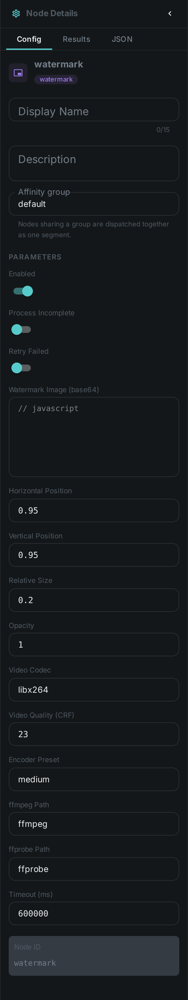
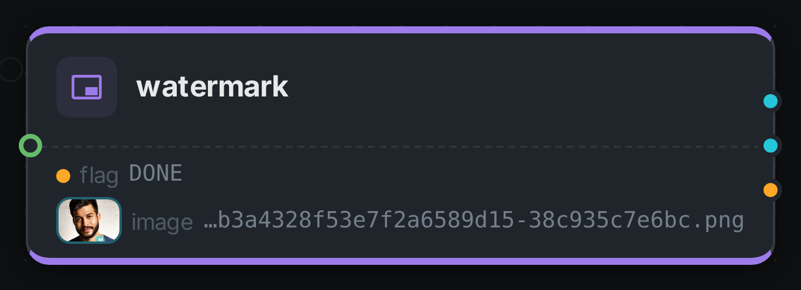
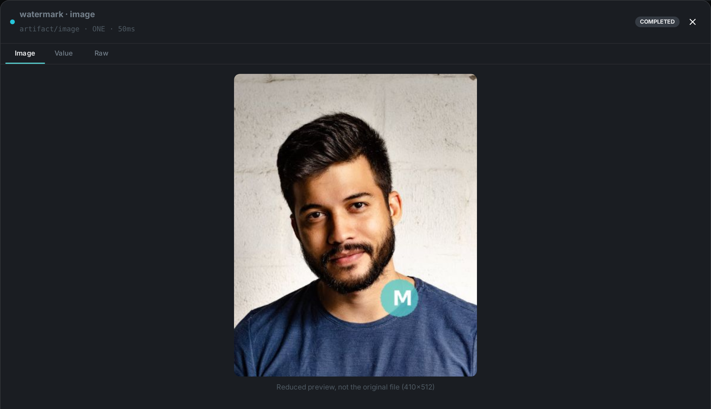

The watermark node **stamps your own image onto an asset** — a logo, a copyright mark, a "preview"
badge, a rating overlay. Unlike the analysis nodes, which describe a property of the media, and
unlike link:../imagegen/[Image Generation], which invents new pixels, `watermark` marks the media it
was given: it composites the overlay you configure onto the asset's own frames and hands the result
downstream.

It handles **both stills and video**. A picture is redrawn in-process, and a clip is passed through
the `ffmpeg` overlay filter — the picture is re-encoded, because burning in an overlay changes
pixels, but **the audio track is copied through untouched** rather than transcoded a second time.

**The original file is never modified.** The marked copy is written to the worker's local cache, so a
watermark node can be added to an existing pipeline without any risk to the archive.

++++

++++

[cols="1,3"]
|===
| Kind | `watermark`
| Applies to | Image and video assets. Audio and documents are skipped
| Input ports | `media` — the asset to mark
| Output ports | `image` (for image items) or `video` (for video items), plus `flag` (String). Exactly one artifact port is filled per asset, so an image branch and a video branch can be wired separately
| Requirements | Images: nothing. **Video: `ffmpeg` and `ffprobe` on the worker's `PATH`**
| Persists to | `asset_node_result` ledger only — the marked file stays in the worker's local `watermark_bin` cache (as with link:../thumbnail/[thumbnails])
|===

[IMPORTANT]
====
The marked file lives on the worker that produced it. Wire the artifact output into
link:../s3-sink/[S3 Sink] to upload it and register it as its own asset — otherwise it is only
reachable on that one machine.
====

== Placement

Position is given as two **relative factors** rather than pixel coordinates, so one configuration
works across a library of mixed resolutions.

[options="header",cols="1,1,2"]
|===
| `relX` | `relY` | Where the mark lands
| `0.0` | `0.0` | top-left corner
| `1.0` | `0.0` | top-right corner
| `0.5` | `0.5` | dead centre
| `0.95` | `0.95` | bottom-right with a small margin (**the default**)
|===

The factors measure how far the overlay slides within the frame, not where its left edge goes. That
is what makes `0.5` centre the mark itself and `1.0` sit it flush against the far edge — **the
overlay never ends up partly outside the picture**, whatever you set.

`scale` sizes the mark as a fraction of the *asset's* width, keeping its aspect ratio, so the same
logo is proportionally the same size on a 720p clip and a 4K one. Setting `scale` to `0` keeps the
overlay's own pixel dimensions instead, which will look different on every resolution.

== Configuration

.The node's settings in the pipeline editor

Set these in the panel above, or in the node's `options` block in a pipeline definition:

[options="header",cols="1,2"]
|===
| Option | Meaning
| `watermarkBase64` | **The overlay image, base64-encoded** (required). A full `data:image/png;base64,...` URI is accepted too. Transparency is respected. Carrying the image in the configuration rather than as a file path means the pipeline runs on any worker without shared storage
| `relX` / `relY` | Relative position, `0.0`–`1.0` (default `0.95` / `0.95` — bottom right)
| `scale` | Overlay width as a fraction of the asset width (default `0.20`); `0` keeps its native size
| `opacity` | Scales the overlay's own transparency, `(0, 1]` (default `1.0`)
| `videoCodec` | Encoder for the video path (default `libx264`)
| `videoCrf` | Video quality, `0`–`51`; lower is better and larger (default `23`)
| `videoPreset` | Encoder speed/size trade-off, e.g. `ultrafast`, `medium`, `slow` (default `medium`)
| `ffmpegPath` / `ffprobePath` | Executable locations (default `ffmpeg` / `ffprobe`, resolved on `PATH`)
| `timeoutMs` | Wall-clock budget per asset (default `600000` — a CPU video re-encode is far slower than an image composite)
|===

A misconfigured watermark — an empty or corrupt base64 blob, an out-of-range position — is reported
when the pipeline starts, not once per asset.

== Video

Video is the expensive path. An overlay has to be burned into the picture, so the video stream is
re-encoded; `videoCrf` and `videoPreset` control that trade-off, and `ultrafast` is a reasonable
choice when the marked copy is a preview rather than a master. The audio stream is copied verbatim,
and a silent clip is handled without error. The output keeps the source container, so an `.mkv` in
stays an `.mkv` out.

If `ffmpeg` is not installed the node **fails loudly** rather than skipping the asset. Skipping would
read as "this clip needed no watermark" and quietly ship unmarked video, which is the opposite of
what a watermark is for.

Because video re-encoding saturates a machine on its own, the node defaults to a concurrency of `1`.

== Seeing it run

Turn on link:../../pipeline/#debug-mode[Debug Mode] and every node keeps what it produced, on the
card itself. Below is a real run of this node over `pexels-photo-2379005.jpeg`.

The strip on the card lists what each output port carried — `flag`, `image`.

Selecting one of them opens it full size.

== Use Cases

* **Copyright and ownership marks** — stamp a logo onto everything leaving the archive.
* **Preview and screener copies** — mark a low-quality derivative as a preview so it cannot be
  mistaken for the master, while the original stays untouched.
* **Provenance badges** — combine with an analysis node's verdict to visibly flag AI-generated or
  low-quality material.
* **Client branding** — one pipeline per customer, each with its own overlay in its own node
  configuration.

A typical graph is `source → watermark → link:../s3-sink/[s3-sink]`: mark the asset, then publish the
marked copy as a new asset with its own storage location.
