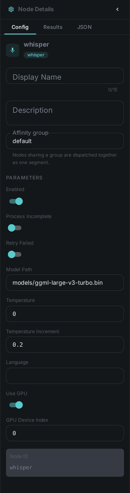

The Whisper node transcribes the audio track of a media file into text using a **Whisper**
speech-to-text model. The transcript is stored as a first-class component so it can be searched and
summarized.

++++

++++

[cols="1,3"]
|===
| Kind | `whisper`
| Applies to | Video, Audio
| Input ports | `audio` or `video` — exactly one of the two is wired
| Output ports | `transcript` — the utterances with their timings, ready to connect to link:../llm/[LLM Enrichment], link:../sentiment/[Sentiment Analysis] or link:../tts/[Text-to-Speech]
| Requirements | A Whisper runtime (whisper.cpp or compatible) and a model file. CPU works; a **GPU** accelerates transcription and is enabled via options. Storage for the model file.
| Persists to | `asset_transcript_comp` + `asset_node_result` ledger
|===

== Configuration

.The node's settings in the pipeline editor

`WhisperOptions`:

[options="header",cols="1,2"]
|===
| Option | Meaning
| `modelPath` | Path to the Whisper model file
| `language` | Source language (or auto-detect)
| `useGpu` / `gpuDevice` | Enable GPU acceleration and select the device
| `temperature` / `temperatureInc` | Decoding temperature and fallback increment
|===

== Seeing it run

Turn on link:../../pipeline/#debug-mode[Debug Mode] and every node keeps what it produced, on the
card itself — for this node, the transcript and the segments it was cut into.

NOTE: There is no screenshot of that here yet. MetaLoom ships no model weights, and
no Whisper model is present on the machine that builds these pictures, so this is the one
node page whose debug view is taken from a real run of nothing. Every other picture on these pages
comes from an actual run, and we would rather leave a gap than draw one.

== Use Cases

* **Subtitles & captions** — generate transcripts for video and audio assets.
* **Transcript search** — power the chat's `search_transcript` tool and the
  link:../../loom/chat/[transcript-summarizer skill].
* **Downstream enrichment** — connect `transcript` to link:../llm/[LLM] classification or
  summarization.
