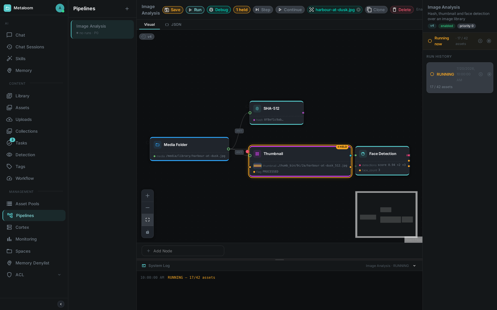
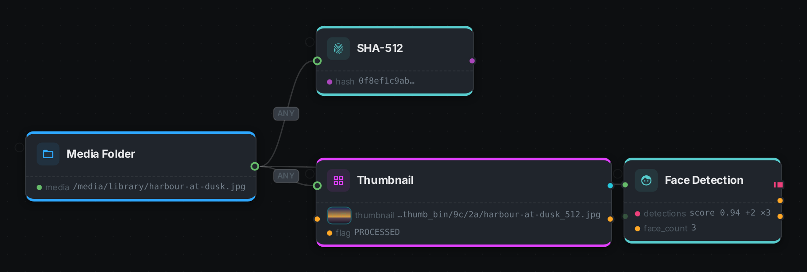
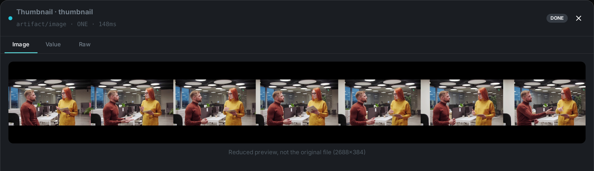
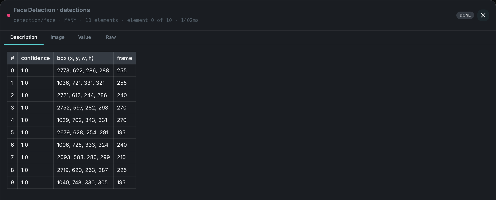
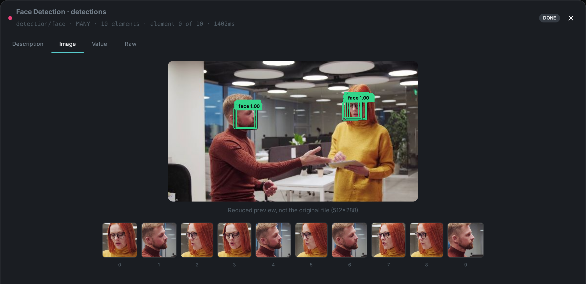
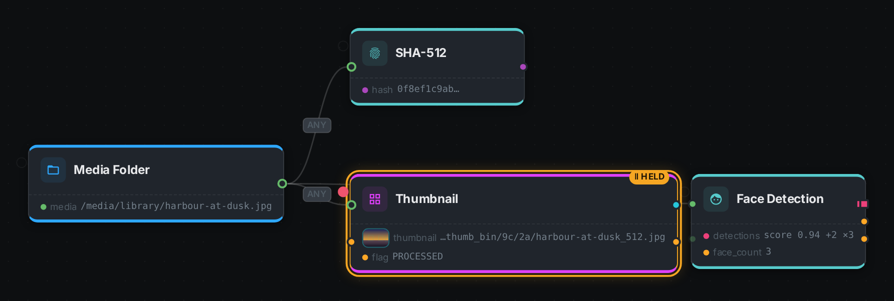

A *pipeline* is a directed acyclic graph (DAG) of processing nodes applied to media assets.
Pipelines are **authored in the Loom UI**, **stored on Loom** (versioned in the database), and
**executed by Loom's pipeline engine**, which delegates the individual node tasks to registered
link:../cortex/[Cortex] workers.

TIP: There is an link:../../pipeline-editor/[interactive pipeline editor] on this site. It runs
entirely in your browser with no server and no account — drag out a graph from the real node
catalogue, wire typed ports, and press *Play* to watch data move through it. It is the fastest way
to get a feel for everything on this page, including link:#debug-mode[halting a run at one node].

== Execution Model: Loom Owns the Graph

Earlier versions of MetaLoom pushed a whole pipeline definition to Cortex and let Cortex execute the
graph. That is no longer the case. Today:

. **Loom owns the DAG.** When a run starts, Loom parses the stored definition into an executable graph
  and drives it with its own pipeline run engine.
. **Loom selects a worker.** It picks a registered, online Cortex instance whose advertised node kinds
  accept the pipeline's *source* kind, and sends it a **source task** to enumerate media items.
. **Loom dispatches node tasks.** For each discovered item, Loom walks the DAG and dispatches one
  **node task** per node to a suitable worker; affinity-grouped work goes out as **segment tasks**.
  Cortex only ever sees one node (or segment) at a time and replies with a result.
. **Loom tracks the run.** Run state (status, counters, durations) is persisted on Loom, so a run
  survives the process that started it and is reported back to the UI live.

```
  Loom UI ──POST /run──▶ Loom pipeline engine ──SOURCE_TASK──▶ Cortex worker
                              │  owns the DAG      ◀─SOURCE_ITEMS─┘
                              ├──NODE_TASK────────▶ Cortex worker ─NODE_TASK_RESULT─▶
                              └──SEGMENT_TASK─────▶ Cortex worker ─SEGMENT_TASK_RESULT─▶
```

This is what makes processing **horizontally scalable**: add Cortex workers to add capacity, and pin
heavy node kinds to specific hardware — Loom routes each task to a worker that accepts its kind.

== Pipeline Structure

A pipeline version has the following properties:

[options="header",cols="1,1,3"]
|===
| Field | Type | Description
| `name` | String | Human-readable pipeline name.
| `description` | String | Human-readable description.
| `priority` | int | When multiple pipelines are candidates, higher priority wins.
| `enabled` | boolean | Whether this pipeline is active.
| `dryRun` | boolean | When `true`, nodes run but do not persist results.
| `definition` | JSON | The node graph — `nodes[]` and `edges[]`.
|===

Pipelines are **versioned**: every save creates a new immutable `pipeline_version`; older versions can
be viewed and restored. See link:../loom/rest-api/[REST API] for the endpoints.

[#node-graph]
== Node Graph

The definition is a graph of `nodes[]` connected by `edges[]`:

[source,json]
----
{
  "version": 1,
  "nodes": [
    { "id": "pn1", "type": "filesystem-source", "name": "File Source" },
    { "id": "pn2", "type": "filter",   "name": "Language Filter" },
    { "id": "pn3", "type": "sha256",            "name": "SHA-256 Hash" }
  ],
  "edges": [
    { "id": "pe1", "source": "pn1", "sourcePort": "media",
      "target": "pn2", "targetPort": "media" },
    { "id": "pe2", "source": "pn2", "sourcePort": "passed",
      "target": "pn3", "targetPort": "media", "branch": "PASS" }
  ]
}
----

* `version` names the **definition format** the graph is written in. Loom sets it for you when you
  save, so you never have to write it by hand. A definition without one is read as version 1, and a
  definition from a newer Loom than the one you are running is refused with a message naming both
  versions rather than being partially understood.
* Each node carries a graph `id` and a `type` — the **node kind** that Loom uses to route the task to
  a worker that can run it.
* Each edge names a **port at both ends**: `sourcePort` on the producing node, `targetPort` on the
  consuming one. Both are mandatory — an edge that only names two nodes does not say which value
  flows, and is rejected.
* A pipeline has exactly one **source** node (e.g. `filesystem-source`) that enumerates media.
* **Filter** nodes (`filter`) grow one output port per configured bucket and route each item down
  exactly one of them — so a German branch never receives English. The port *is* the branch:
  anything wired to a port that carried nothing is skipped for that item.
* Node kinds map to the built-in link:../nodes/[Nodes] (or your own custom nodes).

[#ports]
== Ports

A node declares named, typed **input and output ports**, and the edges say which output port feeds
which input port. Nothing addresses another node by its graph id, so renaming a node in the editor
cannot quietly starve its consumer.

A port carries three things:

[cols="1,3"]
|===
| Property | Meaning

| Id
| A name local to its node — `media`, `transcript`, `detections`. The same id on two different nodes
means nothing; only the edge connects them.

| Content type
| Always `family/subtype`. The eight families are `media`, `text`, `detection`, `hash`, `scalar`,
`artifact`, `struct` and `control`, and `family/*` accepts (or produces) the whole family.
Assignability never crosses families.

| Cardinality
| `ONE` element or `MANY`. A `MANY` output **fans out** — a downstream node whose input takes one
element runs once per element — and a `MANY` input **gathers** that branch back into a single task
per asset. Both are automatic; there is no merge node.
|===

The full port list of every built-in kind is on its page under link:../nodes/[Nodes], and
`GET /api/v1/pipeline/node-descriptors` returns the same thing for the kinds your server knows.

**Wiring is checked when the pipeline is saved, not when it runs.** An edge naming a port that does
not exist, two ports whose content types do not agree, a required input with nothing connected, or two
edges into an input that takes a single element — each is rejected with a message naming the offending
nodes and ports, and no run is created.

Node results with sync enabled are written back to Loom as asset metadata; see
link:../cortex/examples/[Cortex Examples] for the persistence path.

[#running-a-pipeline]
== Running a Pipeline

Trigger a run over REST (or from the UI's Run button):

[source,text]
----
POST /api/v1/pipelines/:uuid/run     # body: { mediaUuids, path, pathGlobs, dryRun }
GET  /api/v1/pipelines/:uuid/runs    # run history with status + counters
----

The response reports whether the run was dispatched, the assigned worker, and the `runUuid`. If no
suitable online worker exists the run is rejected (`503`) rather than silently queued.

=== Choosing what to process

The run request narrows what the pipeline's source enumerates. The most specific selector wins:
`mediaUuids`, then `pathGlobs`, then `path`.

[cols="1,3"]
|===
| Field | Behaviour

| `path`
| A single folder or file. The source compares it against its index and processes only media
that is new, modified or moved — so re-running over a large library is cheap.

| `pathGlobs`
| One or more glob patterns. Always walks the filesystem in full, so use it when you want a
complete re-scan or need pattern matching.

| `mediaUuids`
| Specific assets, resolved to their stored files.
|===

From the command line these are `--dir`, `--glob` and `--asset` respectively:

[source,bash]
----
metaloom pipeline run my-pipeline --dir /media/library
----

=== Pausing and resuming a run

A run in progress can be suspended and later resumed, or stopped for good:

[source,text]
----
POST /api/v1/pipelines/:uuid/runs/:runUuid/pause
POST /api/v1/pipelines/:uuid/runs/:runUuid/resume
POST /api/v1/pipelines/:uuid/runs/:runUuid/cancel
----

A paused run keeps everything it has done. No further work is handed to workers, and the source
scan stops as well, so a pause genuinely halts the pipeline rather than merely hiding it. Work
already handed to a worker finishes normally. The run's status becomes `PAUSED`, and its counters
are preserved.

Cancelling is final: a cancelled run cannot be resumed.

A paused run continues to occupy a worker, so it should be resumed or cancelled rather than left
indefinitely.

In the pipeline editor, a run that is currently executing offers a *Pause* control on the run
banner and on its row in the run history; a paused run offers *Resume* in its place. Because a
pause is reversible, *Cancel* stays available in both states. The controls also follow the run
itself: if a run is paused from the command line or from another browser window, every open editor
updates on its own.

NOTE: Resuming requires the run to still be live on the server. A run whose server was restarted
while it was paused is restored in the paused state and can be resumed as normal; one that was
lost entirely must be started again.

From the command line:

[source,bash]
----
metaloom run pause  <run-uuid>
metaloom run resume <run-uuid>
metaloom run cancel <run-uuid>
----

== Dry-Run Mode

When `dryRun = true`, nodes execute but do not persist results — useful for validating a pipeline
against real media without side effects. It is a property of the pipeline definition (or the run
request).

== Live Progress (WebSocket)

While a run executes, the engine emits structured tracking events which the UI consumes live:

[source,text]
----
ws://<loom-host>:8092/api/v1/pipelines/events/ws     # optional ?pipeline=<name> and ?run=<uuid> filters
----

Each event identifies the pipeline, node, media item, status (`STARTED`, `COMPLETED`, `SKIPPED`,
`FAILED`) and duration. The Loom UI subscribes to this stream to display live processing progress and
per-node statistics.

Two optional filters narrow the stream: `?pipeline=<name>` restricts it to one pipeline, and
`?run=<uuid>` to a single run. Both may be combined. The stream carries no history — it delivers
only what happens after the connection opens.

The command line consumes the same stream:

[source,bash]
----
metaloom run follow <run-uuid>
metaloom pipeline run my-pipeline --dir /media --follow
----

[#debug-mode]
== Debug Mode

It is often unclear what a given node is actually doing to your media. The pipeline editor has a
*Debug* toggle for exactly this: with it switched on, each node shows live counters while a run is
in flight — how many items it is working on right now, how many are queued behind it, and how many
it has completed, failed or skipped in total.



The toggle is remembered between sessions and changes nothing about how a pipeline runs. With it
off, the editor looks and behaves exactly as it does while you are designing a graph, so the extra
detail never gets in the way of drawing one.

Counters update roughly once per second. That is deliberate: a run over a hundred thousand files
across a ten-node graph produces around a million individual node results, and reporting each one
separately would flood the browser without telling you anything a running total does not.

=== Seeing what a node produced

Counters tell you how much a node did, not what it did. For that, open a run from the run
history and pick one of the files it processed. The editor then shows, on each node, the values
that node emitted for *that file* — one line per output, labelled with the output's name.



Above, one video clip has been carried through the graph. The source reports the file it found, the
hash node its digest, the thumbnail node the contact sheet it wrote and a `DONE` flag, and face
detection ten faces with the first of them summarised. That is four nodes' worth of "what did you
actually do", on the graph, for one specific file.

Results are always tied to one file. "What did the transcription node produce" has no answer
until you say for which piece of media, which is why choosing an item is the first step. The
chosen file stays named in the toolbar and the results stay on the graph when you close the run
panel, so you can study the pipeline with them in place. Clear them with the × on that chip.

Selecting a node opens its *Results* tab, which adds what the compact view leaves out: how long
the node took, how many attempts it needed, whether it was given up on after repeated failures,
and the error if it failed. Outputs are kept even for a failed or skipped run of a node — they
are usually what explains why it did not finish.

A node that processes several things from one file — one entry per detected face, say — is
listed once per entry, so you can tell which one failed rather than only that something did.

=== Previews of produced media

Media that a node *creates* — a thumbnail, a cropped face, a generated image — is written to the
machine that produced it, not to Loom. To let you actually look at it, a run started with *Debug*
on asks each worker to send back a small picture of what it made, which then appears inline next
to that output.

Previews are small on purpose: at most 512 pixels on the longest edge, and dropped entirely if
they would still be too large. When that happens the output says so rather than appearing empty —
"too large to preview" and "this output produced nothing" are very different answers, and the
editor never confuses them.



They are also generated only for runs you started with Debug on, and are discarded together with
the run they belong to. A preview is a debugging aid, not a copy of your media: it is deliberately
lossy, and it is not a way to store or serve what a pipeline produces.

Audio and video outputs are still shown as file references — only images are previewed today, which
is why the clip itself appears as a path while everything made from it appears as a picture.

=== Looking at one result closely

Clicking any output on a node opens it full size. What you get depends on what the output actually
holds, not on what it is nominally typed as:

* an *image*, when the node produced one;
* a *description*, when the node wrote one for itself — several nodes explain their own output far
  better than a generic rendering can, and face detection is one of them;
* a *table*, when the output is a list — one row per detected face, per transcript segment, per
  chunk;
* the *value*, formatted and syntax-coloured;
* and *Raw*, which is always available and shows exactly what was recorded, whatever else applies.



The most informative view opens first, so you rarely have to choose. Use *Raw* when you want to see
precisely what a downstream node will receive, with nothing interpreted for you.

The table above is not a generic rendering of the detection list: face detection wrote it, which is
why it has a confidence column and a box column rather than a row of unlabelled numbers. Any node
can describe its own output this way, and when one does, its description is what opens first.

==== Detections as pictures

For a node that finds things *in* an image, a table still leaves the two most obvious questions
unanswered — where in the picture, and what does it look like. The *Image* view answers both: the
frame the boxes were measured against, with each box drawn on it, and one thumbnail per detection
underneath.



Those thumbnails are cut from the source at full resolution rather than from the reduced frame
above, which matters more than it sounds: in 4K footage a face occupies a few percent of the
picture, so a crop taken from a 512-pixel preview would be barely thirty pixels across.

The caption under the picture is worth reading on a video. Detection runs on *sampled frames*, so
the ten thumbnails below the picture are ten detections spread across several moments, while the
boxes drawn on the picture are only the ones measured against *this* frame. `face_count` therefore
counts detections, not distinct people — two people can easily account for all ten.

[#detections-over-time]
==== Watching detection happen

Ten detections and two people is the kind of arithmetic that only makes sense once you have seen the
clip. Below is the same node's output over the same footage, painted in as the video plays.

++++
<div class="ml-detplayer" data-track-url="facedetect-detections.json" data-video-url="facedetect-demo.mp4" data-recent="10">
  <video controls muted loop playsinline preload="metadata" poster="facedetect-demo-poster.jpg" src="facedetect-demo.mp4"></video>
</div>
++++

Two things are worth watching for.

*Boxes appear and then dissolve.* Nothing is tracking anyone. The node samples every fifth frame, so
between two samples there is simply no new answer, and a box that fades out is saying "this is the
most recent thing reported here" rather than following a face across the picture.

*Long stretches have nothing at all.* The node keeps only the sharpest faces it finds, so a clip
where two people are mostly turned away from the camera yields a handful of detections at the
moments they were most legible — not a box on every frame. That is the same behaviour the numbers
above describe, seen from the other side.

The strip underneath is the ten most recent detections, newest first, each one the crop the node
actually cut. Selecting one jumps the clip to the frame it came from.

NOTE: The clip is a six-second excerpt of the source, and both the excerpt and every box come from a
real run of the face detection node — the frame numbers shown are the source's own.

[#halting]
=== Halting at a node

Pausing stops the whole run. Often what you want is narrower: let everything run normally, but stop
*here*, at this one node, and show me what it produced before anything downstream touches it.

In Debug Mode every node grows a small dot in its left margin. Click it to halt there. The dot is a
setting on the run in front of you — it is never saved into the pipeline, so nobody else's runs are
affected and the next person to open the pipeline sees it exactly as you left it.

When a file reaches a halted node, the node *still runs*. That is the point: stopping before it ran
would leave you with nothing to look at. What stops is everything after it. The node is ringed in
amber, its results open automatically, and the run waits.



Two controls appear once something is waiting:

*Step* lets a single file through. Whatever it unblocks runs immediately, and if the next node is
also halted, the run stops again there. This is how you walk one file through the graph a node at a
time and watch what each one does to it.

*Continue* releases everything waiting. The halt stays set, so the next file to arrive stops here
too — that is what makes it a halt rather than a one-off. To stop halting altogether, click the dot
again.

While a run is halted it also stops looking for new files, so a halt on a folder of 100 000 images
does not enumerate all of them while you read the first result.

TIP: A halt anywhere in the graph makes the nodes around it run one at a time instead of being
grouped together for speed. That is deliberate — grouped nodes hand their intermediate results
straight to each other without reporting them, which is exactly what you stopped to see. Expect a
debugged run to be slower than the same run without a halt.

[#re-executing]
=== Changing a setting and trying again

Stopping at a node answers _what did it produce_. The question that follows is almost always _and
what would it produce if I changed this_ — and answering it by editing the pipeline and starting a
new run means waiting for everything before that node to happen all over again.

So while a node is waiting, its settings can be changed and the node run again over the same file.
Select the halted node and its settings panel says it is waiting, with *Re-execute* underneath.
Change a value, press it, and the node runs a second time over exactly the inputs it had the first
time.

The face detector is the clearest example. It ignores faces turned further away from the camera than
*Max Face Angle*, which defaults to 30°. On footage of two people talking to each other, that finds
nothing at all — and "no faces here" and "faces I was told to ignore" look identical from the
outside. Raise the angle to 90°, press Re-execute, and the same frame comes back with both faces
found.

Each attempt is kept. Once a node has been run more than once an *Attempt* selector appears, and
switching between attempts switches what the canvas and the results panel show — which is the whole
point, since a value is only good or bad compared with the one before it.

IMPORTANT: Settings changed here apply to *this run only*. They are not saved into the pipeline, so
you can try five values without anyone else's runs changing and without leaving a half-finished
experiment behind. When a value turns out to be the right one, *Save to pipeline* writes it into the
pipeline as a new version — that is the only button in this panel that changes anything permanent.

A setting is checked before the node runs, against the range that node declares: asking a thumbnail
node for 99 columns is refused immediately rather than becoming a failure to find in a log.

Only a node that is currently *waiting* can be re-executed. Once you press Step or Continue its
result has gone downstream, and re-running it would mean unpicking everything that already used it.

== Custom Nodes

Any node kind can be added by a custom Cortex worker that advertises it. See
link:../cortex/examples/[Cortex Examples] for authoring a node in Java, assembling a custom daemon, or
implementing a worker in Python.
